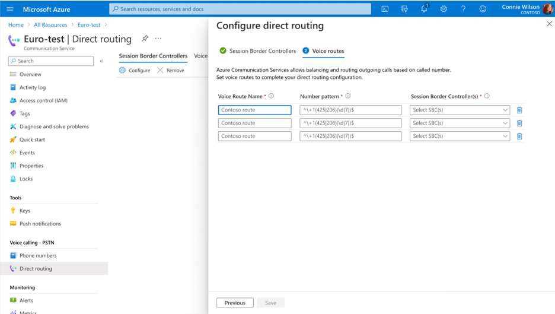

## Prerequisites

- An Azure account with an active subscription. [Create an account for free](https://azure.microsoft.com/free/?WT.mc_id=A261C142F).
- An active Communication Services resource. [Create a Communication Services resource](../../../quickstarts/create-communication-resource.md).
- The fully qualified domain name (FQDN) and port number of a session border controller (SBC) in an operational telephony system.
- The [verified domain name](../../../how-tos/telephony/domain-validation.md) of the SBC FQDN.

> [!NOTE]
> You can find more usage examples for `SipRoutingClient` on [GitHub](https://github.com/Azure/azure-sdk-for-net/blob/main/sdk/communication/Azure.Communication.PhoneNumbers/README.md#siproutingclient).

## Add a session border controller

1. On the left pane, under **Voice Calling - PSTN**, select **Direct routing**. On the **Session Border Controller** tab, select **Configure**.

2. Enter an FQDN and signaling port for the SBC. Requirements for the SBC FQDN include:
    - The domain part of the FQDN must be verified before you can add it to your direct routing configuration, as mentioned earlier in the [prerequisites](#prerequisites).
    - The SBC certificate must match the name. Wildcard certificates are supported.
    - You can't use the `*.onmicrosoft.com` and `*.azure.com` domains for the FQDN.

    For the full list of requirements, see [Azure direct routing infrastructure requirements](../../../concepts/telephony/direct-routing-infrastructure.md).

   :::image type="content" source="../media/voice-routing/add-session-border-controller.png" alt-text="Screenshot of adding a session border controller on the panel for configuring direct routing.":::

3. Select **Next**.
    If everything is set up correctly, you should see the status of SBC as *Active* in Azure portal. 

   

> [!IMPORTANT]
> Before placing or receiving calls, make sure that SBC status is *Online*

## Create voice routing rules

Give your voice route a name, specify the number pattern by using regular expressions, and select the SBC for that pattern. Here are some examples of basic regular expressions:

- `^\+\d+$`: Matches a telephone number with one or more digits that start with a plus.
- `^\+1(\d{10})$`: Matches a telephone number with 10 digits after `+1`.
- `^\+1(425|206)(\d{7})$`: Matches a telephone number that starts with `+1425` or with `+1206`, followed by seven digits.
- `^\+0?1234$`: Matches both `+01234` and `+1234` telephone numbers.

For more information about regular expressions, see [.NET regular expressions overview](/dotnet/standard/base-types/regular-expressions).

You can select multiple SBCs for a single pattern. In such a case, the routing algorithm chooses them in random order. You can also specify the exact number pattern more than once. The higher row has higher priority. If all SBCs associated with that row aren't available, the next row is selected. This way, you create complex routing scenarios.

## Remove a direct routing configuration

To delete a voice route:

1. On the left pane, under **Voice Calling - PSTN**, go to **Direct routing**.
1. On the **Voice Routes** tab, select the checkboxes for the route (or routes) that you want to delete.
1. Select **Remove**.

To delete an SBC:

1. On the left pane, under **Voice Calling - PSTN**, go to **Direct routing**.
1. On the **Session Border Controllers** tab, select **Configure**.
1. Clear the FQDN and port fields for the SBC that you want to remove, and then select **Next**.
1. On the **Voice Routes** tab, review the voice routing configuration. Make changes if needed, and then select **Save**.

When you remove an SBC that's associated with a voice route, you can choose a different SBC for the route on the **Voice Routes** tab. The voice route without an SBC will be deleted.
