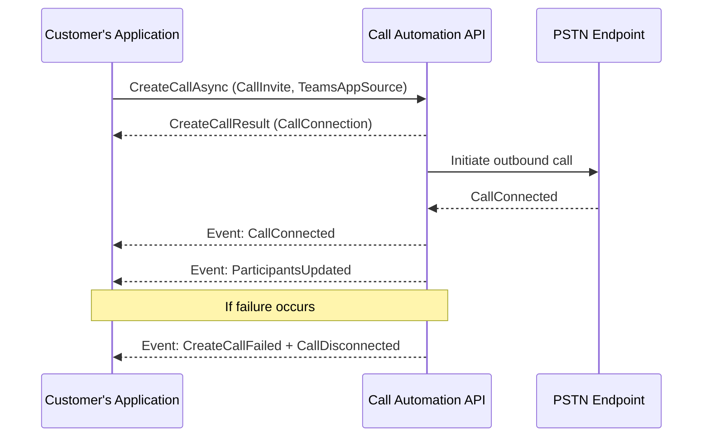

# Place server-initiated outbound calls with Teams Phone Extensibility

Teams Phone extensibility (TPE) lets a server application place outbound calls from a Teams resource account by using Azure Communication Services Call Automation. This pattern supports proactive customer outreach, callbacks, and contact center workflows while using the resource account's Teams Phone number and PSTN connectivity.

This article shows how to place an outbound PSTN call with the .NET Call Automation SDK. For other supported targets and operations, see [Microsoft Teams Phone capabilities in Calling and Call Automation SDKs](../../concepts/interop/tpe/teams-phone-extensibility-capabilities.md).

## Prerequisites

Before you begin, ensure the following:

- An Azure account with an active subscription and an [Azure Communication Services resource](../create-communication-resource.md).
- **Azure.Communication.CallAutomation** version **1.5.0‑beta.1** or later. Use a stable version that supports `CreateCallOptions.TeamsAppSource`.
- A Teams resource account that:
  -is provisioned for Teams Phone extensibility and associated with your Azure Communication Services resource;
  - has a Microsoft Teams Phone Resource Account license;
  - has a service phone number and outbound-capable PSTN connectivity; and
  - is authorized for server-side calling through the Teams Phone access assignment API.
- The Microsoft Entra object ID of the Teams resource account. Retrieve it by using `Get-CsOnlineApplicationInstance`.
- A public HTTPS callback URI that can receive Call Automation webhook events.
- A destination phone number in E.164 format, such as `+14123456789`.
- Review:
  - [Call Automation concepts](/azure/communication-services/concepts/call-automation/call-automation)
  - [Action–event model](/azure/communication-services/concepts/call-automation/call-automation#action-event-model)
  - [User identifier types](/azure/communication-services/concepts/identifiers), including `TeamsExtensionUser` and `PhoneNumberIdentifier`.
> [!IMPORTANT]
> Don't hardcode Azure Communication Services credentials in application code. For production deployments, use Microsoft Entra authentication where possible, or store connection strings in a secure secret store and rotate them regularly.

## Licensing requirements

Starting **November 1, 2025**, Calling Plan licenses assigned to Teams Resource Accounts will no longer support On-Behalf-Of PSTN outbound calls or server-initiated outbound calls. A **[Pay-As-You-Go Calling Plan](/microsoftteams/calling-plans-for-office-365#pay-as-you-go-calling-plan)** is required for these scenarios.
For the current licensing and funding requirements, see [Outbound calling prerequisites](../../concepts/interop/tpe/teams-phone-extensibility-connectivity-cost.md#outbound-calling-prerequisites).

> **Note:** Direct Routing numbers aren’t affected by these licensing changes.

### Calling Plan customers

Assign a Pay-As-You-Go Calling Plan license to any Teams Resource Account that uses a Calling Plan number for outbound PSTN calls. Outbound calls will fail after November 1, 2025, if licenses aren’t assigned. You can follow the below steps to make sure you get the proper licenses:
1. Log in to the [Admin portal](https://admin.microsoft.com)
2. Verify agreement type and funding source
   - For **MCA agreements**:
     - Confirm postpaid payment method is active.
     - Navigate to **Marketplace → All Products**.
     - Search for **Microsoft Teams Calling Plan (Pay-As-You-Go)**.
     - Select the appropriate **Pay-As-You-Go Calling Plan Zone (Zone 1 or Zone 2)** based on your location.
     - Add the plan under **Add-ons**.
   - For **older agreements**:
     - Navigate to **Marketplace → All Products** and purchase Communications Credits.
     - Add funds to ensure a positive balance.
     - Enable **Auto-Recharge** under **Billing → Your Products → Communications Credits**.

### Operator Connect customers

Starting November 1, 2025, On-Behalf-Of PSTN outbound calls and server-initiated outbound calls may change depending on your carrier. Work with your Operator Connect carrier to ensure uninterrupted service. Without carrier adjustments, outbound calls through Teams Phone Extensibility may fail.

**Learn more**

- [Pay-As-You-Go Calling Plan](/microsoftteams/calling-plans-for-office-365#pay-as-you-go-calling-plan)
- [Set up Communications Credits](/microsoftteams/set-up-communications-credits-for-your-organization)
- [How to buy Calling Plans](/microsoftteams/calling-plans-for-office-365)
- [Enable pay-as-you-go services](/microsoft-365/commerce/subscriptions/manage-pay-as-you-go-services)
- [Assign Teams add-on licenses](/microsoftteams/teams-add-on-licensing/assign-teams-add-on-licenses)

## Place an outbound PSTN call

1. Create a **CallInvite** by using a target phone number or Teams identity.
2. Set **TeamsAppSource** to the Resource Account OID.
3. Call `CreateCallAsync` on the `CallAutomationClient`.

You’ll receive the following events:

- **CallConnected** – the call was established.
- **ParticipantsUpdated** – provides the current participant list.

If the call fails, you’ll receive:

- **CreateCallFailed**
- **CallDisconnected**

## Code example (C#)

```csharp
public async Task PlaceOutboundCallAsync(string targetPhoneNumber, Uri baseUri)
{
    // Initialize CallAutomationClient with your connection string
    var client = new CallAutomationClient("<resource_connection_string>");

    // Convert target phone number to EL64 format if required
    PhoneNumberIdentifier callee = new PhoneNumberIdentifier(
        Helper.convertToEl64(targetPhoneNumber));

    // Create the CallInvite
    CallInvite callInvite = new CallInvite(callee, null);

    // Configure call options with TeamsAppSource (Resource Account OID)
    var options = new CreateCallOptions(callInvite, baseUri)
    {
        TeamsAppSource = new MicrosoftTeamsAppIdentifier("00000000-0000-0000-0000-000000000000") // Replace with Resource Account OID
    };

    // Place the call
    CreateCallResult result = await client.CreateCallAsync(options);

    // Use result.CallConnection for further actions (play audio, transfer, etc.)
}

```



## Optimize participant-move latency for Proactive Outbound

Some Proactive Outbound contact center flows call the customer first and then use the Call Automation Move participant operation to connect the answered customer to a customer service representative. Move participant is a separate mid-call operation; `CreateCallAsync` doesn't perform it automatically.

For these flows, the availability of the participant-move latency optimization depends on the PSTN connectivity assigned to the Teams resource account.

| PSTN connectivity | Optimization behavior | Customer action |
| --- | --- | --- |
| Calling Plan | The optimization is applied automatically. | No action is required. |
| Operator Connect | A carrier configuration change is required for the optimization to apply. | Ask your Operator Connect provider to configure the trunk so that SIP `INVITE` requests with a `Replaces` header are treated as unsupported for this scenario. |
| Direct Routing | At publication, this specific optimization isn't applied to Direct Routing. | Check the current Teams Phone extensibility and Direct Routing documentation when designing or updating the flow. |

> [!NOTE]
> These differences apply only to the Proactive Outbound participant-move latency optimization. Calling Plan, Operator Connect, and Direct Routing remain supported PSTN connectivity options for Teams Phone extensibility.

> [!IMPORTANT]
> The absence of this optimization doesn't mean that the outbound call or participant-move operation will fail. End-to-end latency and reliability can also be affected by application orchestration, call state, destination readiness, network conditions, and carrier or session border controller behavior. Use correlated application and platform telemetry to investigate a specific result.

For the .NET API, see [`CallConnection.MoveParticipantsAsync`](/dotnet/api/azure.communication.callautomation.callconnection.moveparticipantsasync) and [`MoveParticipantsOptions`](/dotnet/api/azure.communication.callautomation.moveparticipantsoptions).

## Production considerations

- Validate target phone numbers and store them in E.164 format.
- Treat `ServerCallId` and other service-generated identifiers as opaque values. Don't parse them or store them in fixed-width fields.
- Use operation context and call correlation identifiers in application logs.
- Handle `RequestFailedException` from SDK calls and the corresponding failure callback events. Don't assume that an accepted API request results in a connected call.
- Use [Azure Monitor logs](../../concepts/analytics/logs/voice-and-video-logs.md) and [Call Diagnostics](../../concepts/voice-video-calling/call-diagnostics.md) to investigate call setup and media issues.
- Apply retry logic only to documented transient failures. Don't retry calls blindly because doing so can create duplicate outbound calls.


## Next steps

- [Microsoft Teams Phone overview](/microsoftteams/what-is-phone-system-in-office-365)
- [Set up Microsoft Teams Phone in your organization](/microsoftteams/setting-up-your-phone-system)
- [Access a user's Teams Phone separate from their Teams client](/azure/communication-services/quickstarts/tpe/teams-phone-extensibility-access-teams-phone)
- [Answer Teams Phone calls from Call Automation](/azure/communication-services/quickstarts/tpe/teams-phone-extensibility-answer-teams-calls)

## Related articles

- [Teams Phone extensibility overview](/azure/communication-services/concepts/interop/tpe/teams-phone-extensibility-overview)
- [Teams Phone extensibility FAQ](/azure/communication-services/concepts/interop/tpe/teams-phone-extensibility-faq)
