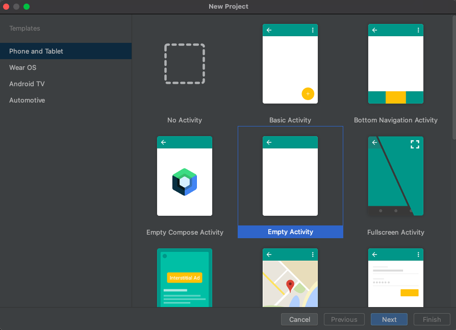
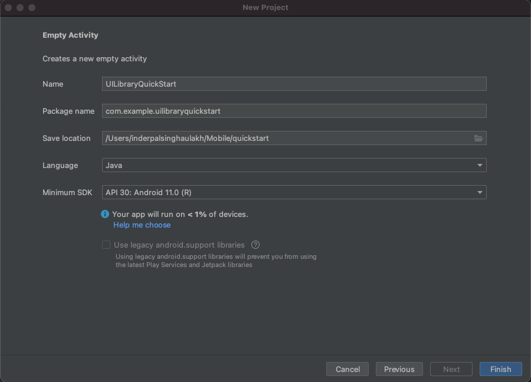
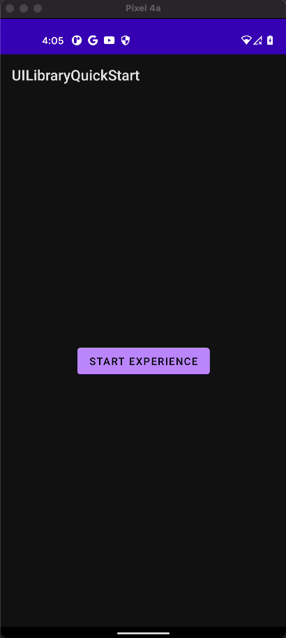

[!INCLUDE [Public Preview Notice](../../../../includes/public-preview-include.md)]

Azure Communication UI [open source library](https://github.com/Azure/communication-ui-library-android) for Android and the sample application code can be found [here](https://github.com/Azure-Samples/communication-services-android-quickstarts/tree/main/ui-library-quick-start)


## Prerequisites

- An Azure account with an active subscription. [Create an account for free](https://azure.microsoft.com/free/?WT.mc_id=A261C142F).
- An OS running [Android Studio](https://developer.android.com/studio).
- A deployed Communication Services resource. [Create a Communication Services resource](../../../create-communication-resource.md).
- Azure Communication Services Token. See [example](../../../identity/quick-create-identity.md) 


## Setting up

### Creating an Android app with an empty activity

In Android Studio, create a new project and select the `Empty Activity`.



Click the `Next` button and name the project `UILibraryQuickStart`, set language to `Java/Kotlin` and select Minimum SDK `API 21: Android 5.0 (Lollipop)` or greater.



Click `Finish`.

## Install the packages

In your app level (**app folder**) `UILibraryQuickStart/app/build.gradle`, add the following lines to the android and dependencies sections.

```groovy
android {
    ...
    packagingOptions {
        pickFirst  'META-INF/*'
    }
    ...
}
```

```groovy
dependencies {
    ...
    implementation 'com.azure.android:azure-communication-ui-calling:+'
    ...
}
```

In your project gradle scripts add following lines to `repositories`.  
For `Android Studio (2020.*)` the `repositories` are in `settings.gradle` `dependencyResolutionManagement(Gradle version 6.8 or greater)`.  
If you are using old versions of `Android Studio (4.*)` then the `repositories` will be in project level `build.gradle` `allprojects{}`.  

```groovy
repositories {
    ...
    mavenCentral()
    maven {
        url "https://pkgs.dev.azure.com/MicrosoftDeviceSDK/DuoSDK-Public/_packaging/Duo-SDK-Feed/maven/v1"
    }
    ...
}
```
Sync project with gradle files. (Android Studio -> File -> Sync Project With Gradle Files)

## Add a button to the activity_main

Go to the layout file (`app/src/main/res/layout/activity_main.xml`). Here we'll drop the following code to create a button to start composite.

```xml
<?xml version="1.0" encoding="utf-8"?>
<androidx.constraintlayout.widget.ConstraintLayout xmlns:android="http://schemas.android.com/apk/res/android"
    xmlns:app="http://schemas.android.com/apk/res-auto"
    xmlns:tools="http://schemas.android.com/tools"
    android:layout_width="match_parent"
    android:layout_height="match_parent"
    tools:context=".MainActivity">

    <Button
        android:id="@+id/startButton"
        android:layout_width="wrap_content"
        android:layout_height="wrap_content"
        android:text="Launch"
        app:layout_constraintBottom_toBottomOf="parent"
        app:layout_constraintLeft_toLeftOf="parent"
        app:layout_constraintRight_toRightOf="parent"
        app:layout_constraintTop_toTopOf="parent" />

</androidx.constraintlayout.widget.ConstraintLayout>
```

## Initialize composite 

Go to `MainActivity`. Here we'll drop the following code to initialize our Composite Components for Calling. Replace `"GROUP_CALL_ID"` with your group ID for your call, `"DISPLAY_NAME"` with your name, and  `"<USER_ACCESS_TOKEN>"` with your token.

#### [Kotlin](#tab/kotlin)

```kotlin
package com.example.uilibraryquickstart

import androidx.appcompat.app.AppCompatActivity
import android.os.Bundle
import android.widget.Button
import com.azure.android.communication.common.CommunicationTokenCredential
import com.azure.android.communication.common.CommunicationTokenRefreshOptions
import com.azure.android.communication.ui.calling.CallCompositeBuilder
import com.azure.android.communication.ui.calling.CallComposite
import com.azure.android.communication.ui.calling.models.GroupCallOptions
import java.util.UUID

class MainActivity : AppCompatActivity() {
    override fun onCreate(savedInstanceState: Bundle?) {
        super.onCreate(savedInstanceState)
        setContentView(R.layout.activity_main)
        
        val startButton: Button = findViewById(R.id.startButton)
        startButton.setOnClickListener { l -> startCallComposite() }
    }

    private fun startCallComposite() {
        val communicationTokenRefreshOptions = CommunicationTokenRefreshOptions({ fetchToken() }, true)
        val communicationTokenCredential = CommunicationTokenCredential(communicationTokenRefreshOptions)

        val options = GroupCallOptions(
            communicationTokenCredential,
            UUID.fromString("GROUP_CALL_ID"),
            "DISPLAY_NAME",
        )

        val callComposite: CallComposite = CallCompositeBuilder().build()
        callComposite.launch(this, options)
    }

    private fun fetchToken(): String? {
        return "USER_ACCESS_TOKEN"
    }
}
```

#### [Java](#tab/java)

```java
package com.example.uilibraryquickstart;

import androidx.appcompat.app.AppCompatActivity;
import android.os.Bundle;
import android.widget.Button;
import com.azure.android.communication.common.CommunicationTokenCredential;
import com.azure.android.communication.common.CommunicationTokenRefreshOptions;
import com.azure.android.communication.ui.calling.CallCompositeBuilder;
import com.azure.android.communication.ui.calling.CallComposite;
import com.azure.android.communication.ui.calling.models.GroupCallOptions;
import java.util.UUID;

public class MainActivity extends AppCompatActivity {

    @Override
    protected void onCreate(Bundle savedInstanceState) {
        super.onCreate(savedInstanceState);
        setContentView(R.layout.activity_main);

        Button startButton = findViewById(R.id.startButton);

        startButton.setOnClickListener(l -> {
            startCallComposite();
        });
    }

    private void startCallComposite() {
        CommunicationTokenRefreshOptions communicationTokenRefreshOptions =
                new CommunicationTokenRefreshOptions(this::fetchToken, true);

        CommunicationTokenCredential communicationTokenCredential = 
                new CommunicationTokenCredential(communicationTokenRefreshOptions);

        GroupCallOptions options = new GroupCallOptions(
                communicationTokenCredential,
                UUID.fromString("GROUP_CALL_ID"),
                "DISPLAY_NAME");

        CallComposite callComposite = new CallCompositeBuilder().build();
        callComposite.launch(this, options);
    }

    private String fetchToken() {
        return "USER_ACCESS_TOKEN";
    }
}
```

-----
## Run the code

Build and start application from Android Studio.

- Click `Launch`.
- Accept audio permissions and select device, mic, and video settings.
- Click `Join Call`.



## Object Model

The following classes and interfaces handle some of the major features of the Azure Communication Services Android UI:

| Name                                                               | Description                                                                                  |
| ------------------------------------------------------------------ | -------------------------------------------------------------------------------------------- |
| [CallComposite](#create-call-composite)                            | Composite component that renders a call experience with participant gallery and controls.    |
| [CallCompositeBuilder](#create-call-composite)                     | Builder to build CallComposite with options.                                                 |
| [GroupCallOptions](#group-call)                                    | Passed in CallComposite launch to start group call.                                          |
| [TeamsMeetingOptions](#teams-meeting)                              | Passed to CallComposite launch to join Teams meeting meeting.                                |
| [ThemeConfiguration](#apply-theme-configuration)                   | Injected as optional in CallCompositeBuilder to change primary color of composite.           |
| [LocalizationConfiguration](#apply-localization-configuration)     | Injected as optional in CallCompositeBuilder to set language of composite.       |

## UI Library functionality

### Create Call Composite

Initialize a `CallCompositeBuilder` instance and a `CallComposite` instance inside the `startCallComposite` function.

#### [Kotlin](#tab/kotlin)

```kotlin
val callComposite: CallComposite = CallCompositeBuilder().build()
```
#### [Java](#tab/java)

```java
CallComposite callComposite = new CallCompositeBuilder().build();
```

-----
### Setup authentication

Initialize a `CommunicationTokenCredential` instance inside the `startCallComposite` function. Replace `"<USER_ACCESS_TOKEN>"` with your token.

#### [Kotlin](#tab/kotlin)

```kotlin
val callComposite: CallComposite = CallCompositeBuilder().build()

val communicationTokenRefreshOptions = CommunicationTokenRefreshOptions(this::fetchToken, true)

val communicationTokenCredential = CommunicationTokenCredential(communicationTokenRefreshOptions)
```

#### [Java](#tab/java)

```java
CallComposite callComposite = new CallCompositeBuilder().build();

CommunicationTokenRefreshOptions communicationTokenRefreshOptions =
        new CommunicationTokenRefreshOptions(this::fetchToken, true);

CommunicationTokenCredential communicationTokenCredential = 
        new CommunicationTokenCredential(communicationTokenRefreshOptions);

```

Refer to the [user access token](../../../identity/quick-create-identity.md) documentation if you don't already have a token available.

-----
### Setup Group Call or Teams Meeting Options

Depending on what type of Call/Meeting you would like to set up, use the appropriate options object.

### Group Call

Initialize a `GroupCallOptions` instance inside the `startCallComposite` function.
Replace `"GROUP_CALL_ID"` with your group ID for your call.
Replace `"DISPLAY_NAME"` with your name.

#### [Kotlin](#tab/kotlin)

```kotlin
val options = GroupCallOptions(
            communicationTokenCredential,
            UUID.fromString("GROUP_CALL_ID"),
            "DISPLAY_NAME",
        )
```

#### [Java](#tab/java)

```java
GroupCallOptions options = new GroupCallOptions(
    communicationTokenCredential,
    UUID.fromString("GROUP_CALL_ID"),
    "DISPLAY_NAME"
);
```
-----
### Teams Meeting

Initialize a `TeamsMeetingOptions` instance inside the `startCallComposite` function.
Replace `"TEAMS_MEETING_LINK"` with teams meeting url for your call.
Replace `"DISPLAY_NAME"` with your name.

#### [Kotlin](#tab/kotlin)

```kotlin
val options = TeamsMeetingOptions(
            communicationTokenCredential,
            "TEAMS_MEETING_LINK",
            "DISPLAY_NAME",
        )
```

#### [Java](#tab/java)

```java
TeamsMeetingOptions options = new TeamsMeetingOptions(
    communicationTokenCredential,
    "TEAMS_MEETING_LINK",
    "DISPLAY_NAME"
);
```

-----
### Get a Microsoft Teams meeting link

A Microsoft Teams meeting link can be retrieved using Graph APIs. This process is detailed in [Graph documentation](/graph/api/onlinemeeting-createorget?preserve-view=true&tabs=http&view=graph-rest-beta).

The Communication Services Call SDK accepts a full Microsoft Teams meeting link. This link is returned as part of the `onlineMeeting` resource, accessible under the [`joinWebUrl` property](/graph/api/resources/onlinemeeting?preserve-view=true&view=graph-rest-beta)
You can also get the required meeting information from the **Join Meeting** URL in the Teams meeting invite itself.

### Launch

Call `launch` on the `CallComposite` instance inside the `startCallComposite` function

#### [Kotlin](#tab/kotlin)

```kotlin
callComposite.launch(context, options)
```

#### [Java](#tab/java)

```java
callComposite.launch(context, options);
```

-----
### Subscribe to error events from `CallComposite`

To receive error events, inject a handler to the `CallCompositeBuilder`.

#### [Kotlin](#tab/kotlin)

```kotlin
val callComposite: CallComposite = CallCompositeBuilder().build()
callComposite.setOnErrorHandler { communicationUIErrorEvent ->
    println(communicationUIErrorEvent.errorCode)
}
```

#### [Java](#tab/java)

```java
CallComposite callComposite = new CallCompositeBuilder().build();
callComposite.setOnErrorHandler(communicationUIErrorEvent -> {
    System.out.println(communicationUIErrorEvent.getErrorCode());
});
```

-----
### Apply theme configuration

To change the primary color of composite, create a new theme style in `src/main/res/values/themes.xml` and `src/main/res/values-night/themes.xml` by considering `AzureCommunicationUICalling.Theme` as parent theme. To apply theme, inject the theme ID in `CallCompositeBuilder`.

```xml
<style name="MyCompany.CallComposite" parent="AzureCommunicationUICalling.Theme">
    <item name="azure_communication_ui_calling_primary_color">#27AC22</item>
    <item name="azure_communication_ui_calling_primary_color_tint10">#5EC65A</item>
    <item name="azure_communication_ui_calling_primary_color_tint20">#A7E3A5</item>
    <item name="azure_communication_ui_calling_primary_color_tint30">#CEF0CD</item>
</style>
```

#### [Kotlin](#tab/kotlin)

```kotlin
import ccom.azure.android.communication.ui.calling.models.ThemeConfiguration

val callComposite: CallComposite =
        CallCompositeBuilder()
            .theme(ThemeConfiguration(R.style.MyCompany_CallComposite))
            .build()
```

#### [Java](#tab/java)

```java
import com.azure.android.communication.ui.calling.models.ThemeConfiguration;

CallComposite callComposite = 
    new CallCompositeBuilder()
        .theme(new ThemeConfiguration(R.style.MyCompany_CallComposite))
        .build();
```

-----
### Apply localization configuration

To change the language of composite, create a `LocalizationConfiguration` with `Locale` from `CommunicationUISupportedLocale`. To apply language, inject the localization configuration in `CallCompositeBuilder`. By default, all text labels use English (`en`) strings. If desired, `LocalizationConfiguration` can be used to set a different `language`. Out of the box, the UI library includes a set of `language` usable with the UI components. `CommunicationUISupportedLocale` provides the supported Locales. For example, to access English Locale, `CommunicationUISupportedLocale.EN` can be used. `CommunicationUISupportedLocale.getSupportedLocales()` provides list of supported language's Locale objects.

#### [Kotlin](#tab/kotlin)

```kotlin
import com.azure.android.communication.ui.calling.models.LocalizationConfiguration

// LanguageCode.values() provides list of supported languages
val callComposite: CallComposite =
            CallCompositeBuilder().localization(
                LocalizationConfiguration(Locale(CommunicationUISupportedLocale.EN))
            ).build()
```

#### [Java](#tab/java)

```java
import com.azure.android.communication.ui.calling.models.LocalizationConfiguration;

// LanguageCode.values() provides list of supported languages
CallComposite callComposite = 
    new CallCompositeBuilder()
        .localization(new LocalizationConfiguration(new Locale(CommunicationUISupportedLocale.EN)))
        .build();
```

-----
### Add notifications into your mobile app

The push notifications allow you to send information from your application to users' mobile devices. You can use push notifications to show a dialog, play a sound, or display incoming call UI. Azure Communication Services provides integrations with [Azure Event Grid](../../../../../event-grid/overview.md) and [Azure Notification Hubs](../../../../../notification-hubs/notification-hubs-push-notification-overview.md) that enable you to add push notifications to your apps [follow the link.](../../../../concepts/notifications.md)
