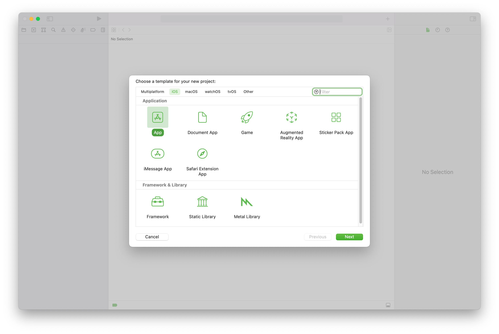
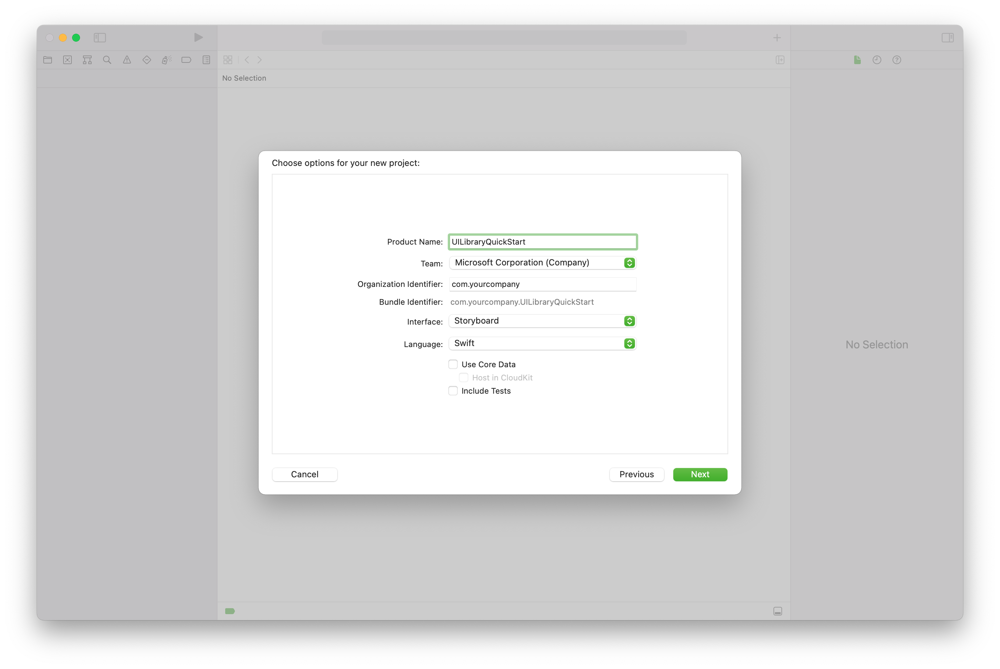
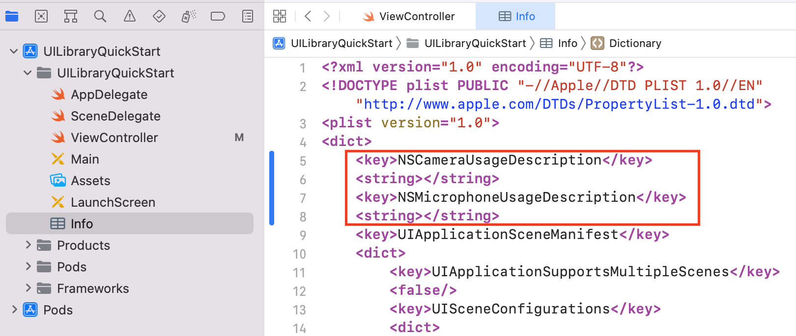
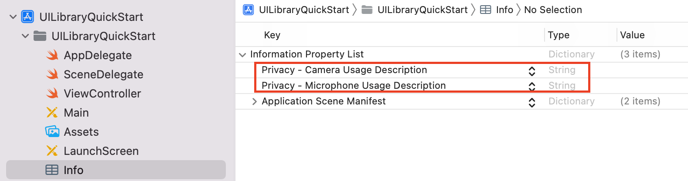
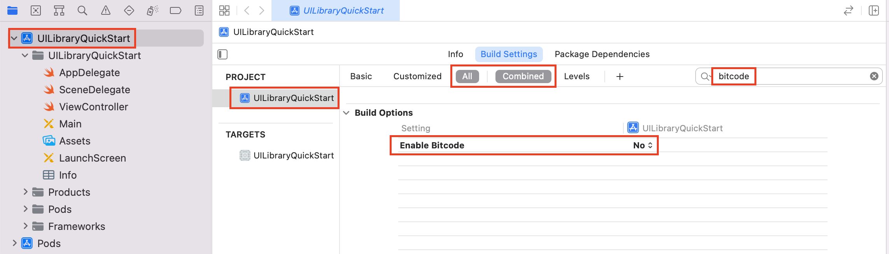
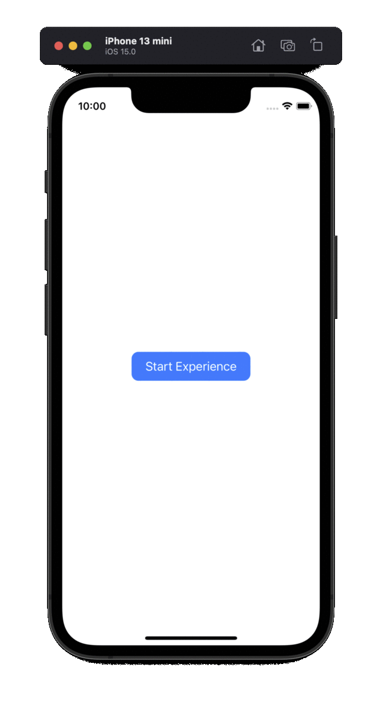

>[!VIDEO https://www.youtube.com/embed/Aq5VTLfXU_4]

Azure Communication UI [open source library](https://github.com/Azure/communication-ui-library-ios) for Android and the sample application code can be found [here](https://github.com/Azure-Samples/communication-services-ios-quickstarts/tree/main/ui-library-quick-start)

## Prerequisites

- An Azure account with an active subscription. [Create an account for free](https://azure.microsoft.com/free/?WT.mc_id=A261C142F).
- A Mac running [Xcode](https://go.microsoft.com/fwLink/p/?LinkID=266532) 13+, along with a valid developer certificate installed into your Keychain. [CocoaPods](https://cocoapods.org/) must also be installed to fetch dependencies.
- A deployed Communication Services resource. [Create a Communication Services resource](../../../create-communication-resource.md).
- Azure Communication Services Token. [See example.](../../../identity/quick-create-identity.md)

## Setting up

### Creating the Xcode project

In Xcode, create a new **iOS** project and select the **App** template. We'll be using UIKit storyboards. You're not going to create tests during this quickstart. Feel free to uncheck **Include Tests**.



Name the project `UILibraryQuickStart` and select `Storyboard` under the `Interface` dropdown.



### Install the package and dependencies with CocoaPods

1. (Optional) For MacBook with M1, install and enable [Rosetta](https://support.apple.com/en-us/HT211861) in Xcode.
2. Create a Podfile in your project root directory by running `pod init`.
    - If encounter error, update [CocoaPods](https://guides.cocoapods.org/using/getting-started.html) to latest version
3. Add the following to your Podfile:
    - Replace `UILibraryQuickStart` with your project name
```
platform :ios, '14.0'

target 'UILibraryQuickStart' do
    use_frameworks!
    pod 'AzureCommunicationUICalling', '1.0.0'
end
```

4. Run `pod install --repo-update`.
5. Open the generated `.xcworkspace` with Xcode.


### Request access to the microphone, camera, etc.

To access the device's hardware, update your app's Information Property List. Set the associated value to a `string` that will be included in the dialog the system uses to request access from the user.

Right-click the `Info.plist` entry of the project tree and select **Open As** > **Source Code**. Add the following lines the top level `<dict>` section, and then save the file.

```xml
<key>NSCameraUsageDescription</key>
<string></string>
<key>NSMicrophoneUsageDescription</key>
<string></string>
```



To verify requesting the permission is added correctly, view the `Info.plist` as **Open As** > **Property List** and should expect to see the following:



### Turn off `Bitcode`
Set `Enable Bitcode` option to `No` in the project `Build Settings`. To find the setting, you have to change the filter from `Basic` to `All`, you can also use the search bar on the right.



## Initialize composite

Go to 'ViewController'. Here we'll drop the following code to initialize our Composite Components for Call. Replace `<GROUP_CALL_ID>` with either your call group ID or `UUID()` to generate one. Also replace `<DISPLAY_NAME>` with your name, and `<USER_ACCESS_TOKEN>` with your token. The limit for string length of `<DISPLAY_NAME>` is 256.

```swift
import UIKit
import AzureCommunicationCalling
import AzureCommunicationUICalling

class ViewController: UIViewController {

    private var callComposite: CallComposite?

    override func viewDidLoad() {
        super.viewDidLoad()

        let button = UIButton(frame: CGRect(x: 100, y: 100, width: 200, height: 50))
        button.contentEdgeInsets = UIEdgeInsets(top: 10.0, left: 20.0, bottom: 10.0, right: 20.0)
        button.layer.cornerRadius = 10
        button.backgroundColor = .systemBlue
        button.setTitle("Start Experience", for: .normal)
        button.addTarget(self, action: #selector(startCallComposite), for: .touchUpInside)

        button.translatesAutoresizingMaskIntoConstraints = false
        self.view.addSubview(button)
        button.centerXAnchor.constraint(equalTo: view.centerXAnchor).isActive = true
        button.centerYAnchor.constraint(equalTo: view.centerYAnchor).isActive = true
    }

    @objc private func startCallComposite() {
        let callCompositeOptions = CallCompositeOptions()

        callComposite = CallComposite(withOptions: callCompositeOptions)

        let communicationTokenCredential = try! CommunicationTokenCredential(token: "<USER_ACCESS_TOKEN>")

        let remoteOptions = RemoteOptions(for: .groupCall(groupId: UUID(uuidString: "<GROUP_CALL_ID>")!),
                                          credential: communicationTokenCredential,
                                          displayName: "<DISPLAY_NAME>")
        callComposite?.launch(remoteOptions: remoteOptions)
    }
}
```

## Run the code

You can build and run your app on iOS simulator by selecting **Product** > **Run** or by using the (&#8984;-R) keyboard shortcut.

1) Tap `Start Experience`.
2) Accept audio permissions and select device, mic, and video settings.
3) Tap `Start Call`.



## Object Model

The following classes and interfaces handle some of the major features of the Azure Communication Services UI client library:

| Name                                                                        | Description                                                                                  |
| --------------------------------------------------------------------------- | -------------------------------------------------------------------------------------------- |
| [CallComposite](#create-call-composite) | The composite renders a call experience with participant gallery and controls. |
| [CallCompositeOptions](#create-call-composite) | Includes options such as the theme options and the events handler. |
| [RemoteOptions](#setup-group-call-or-teams-meeting-options) | The remote options send to AzureCommunicationService for joining a [group call](#group-call) or [Team's meeting](#teams-meeting). |
| [ThemeOptions](#apply-theme-options) | Allows you to customize the theme. |
| [LocalizationOptions](#apply-localization-options) | Allows you to set the language for the composite. |

## UI Library functionality

### Create call composite

Initialize a `CallCompositeOptions` instance and a `CallComposite` instance inside the `startCallComposite` function.

```swift
@objc private func startCallComposite() {
    let callCompositeOptions = CallCompositeOptions()

    callComposite = CallComposite(withOptions: callCompositeOptions)
}
```

### Setup authentication

Initialize a `CommunicationTokenCredential` instance inside the `startCallComposite` function. Replace `<USER_ACCESS_TOKEN>` with your token.

```swift
let communicationTokenCredential = try! CommunicationTokenCredential(token: "<USER_ACCESS_TOKEN>")
```

Refer to the [user access token](../../../identity/quick-create-identity.md) documentation if you don't already have a token available.

### Setup group call or Teams meeting options

Depending on what type of Call/Meeting you would like to set up, use the appropriate options object.

#### Group call

Initialize a `RemoteOptions` instance for `.groupCall` locator inside the `startCallComposite` function. Replace `<GROUP_CALL_ID>` with your group ID for your call and `<DISPLAY_NAME>` with your name.

Learn more about group call [here](../../../../how-tos/calling-sdk/manage-calls.md).

```swift
// let uuid = UUID() to create a new call
let uuid = UUID(uuidString: "<GROUP_CALL_ID>")!
let remoteOptions = RemoteOptions(for: .groupCall(groupId: uuid),
                                  credential: communicationTokenCredential,
                                  displayName: "<DISPLAY_NAME>")
```

#### Teams meeting

Initialize a `RemoteOptions` instance for `.teamsMeeting` locator inside the `startCallComposite` function. Replace `<TEAMS_MEETING_LINK>` with your Teams meeting link for your call and `<DISPLAY_NAME>` with your name.

```swift
let remoteOptions = RemoteOptions(for: .teamsMeeting(teamsLink: "<TEAMS_MEETING_LINK>"),
                                  credential: communicationTokenCredential,
                                  displayName: "<DISPLAY_NAME>")
```

#### Get a Microsoft Teams meeting link

A Microsoft Teams meeting link can be retrieved using Graph APIs. This process is detailed in [Graph documentation](/graph/api/onlinemeeting-createorget?tabs=http&view=graph-rest-beta&preserve-view=true).
The Communication Services Calling SDK accepts a full Microsoft Teams meeting link. This link is returned as part of the `onlineMeeting` resource, accessible under the [`joinWebUrl` property](/graph/api/resources/onlinemeeting?view=graph-rest-beta&preserve-view=true)
You can also get the required meeting information from the **Join Meeting** URL in the Teams meeting invite itself.

### Launch

Call `launch` on the `CallComposite` instance inside the `startCallComposite` function

```swift
callComposite?.launch(remoteOptions: remoteOptions)
```

### Subscribe to events

You can implement the closures to act on the events. An event for when the composite ended with an error is an example.

```swift
callComposite?.events.onError = { error in
    print("CallComposite failed with error:\(error)")
}
```

### Apply theme options

You can customize the theme by creating custom theme options that implement the ThemeOptions protocol. You then include an instance of that new class in your CallCompositeOptions.

```swift
class CustomThemeOptions: ThemeOptions {
   var primaryColor: UIColor {
       return UIColor.red
   }
}
```

```swift
let callCompositeOptions = CallCompositeOptions(theme: CustomThemeOptions())
```

For more on how theming works, check out the [Theming guide](../../../../how-tos/ui-library-sdk/theming.md).

### Apply localization options

You can change the language by creating custom localization options and include it to your `CallCompositeOptions`.  By default, all text labels use our English (`SupportedLocale.en`) strings. If desired, `LocalizationOptions` can be used to set a different `locale`. Out of the box, the UI library includes a set of `locale` usable with the UI components. `SupportedLocale.values` provides a list of all supported languages. 

For the example below, the composite will be localized to French (`fr`). 

```swift
// Option1: Use intellisense to get supported locales by the UI Library
let localizationOptions = LocalizationOptions(locale: SupportedLocale.frFR)

// Option2: Swift Locale struct, if locale not supported by UI Library, will default to English
let localizationOptions = LocalizationOptions(locale: Locale(identifier: "fr-FR"))

let callCompositeOptions = CallCompositeOptions(localization: localizationOptions) 
```

For more on localization and list of supported languages, check out the [Localization guide](../../../../how-tos/ui-library-sdk/localization.md).

## Add notifications into your mobile app

The push notifications allow you to send information from your application to users' mobile devices. You can use push notifications to show a dialog, play a sound, or display incoming call UI. Azure Communication Services provides integrations with [Azure Event Grid](../../../../../event-grid/overview.md) and [Azure Notification Hubs](../../../../../notification-hubs/notification-hubs-push-notification-overview.md) that enable you to add push notifications to your apps [follow the link.](../../../../concepts/notifications.md)

