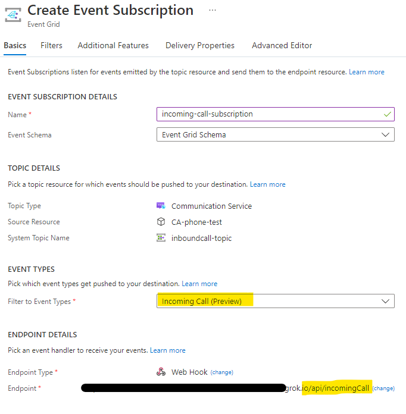

# Build a customer interaction workflow using Call Automation

> [!IMPORTANT]
> Functionality described on this document is currently in private preview. Private preview includes access to SDKs and documentation for testing purposes that are not yet available publicly. Apply to become an early adopter by filling out the form for [preview access to Azure Communication Services](https://aka.ms/ACS-EarlyAdopter).

In this quickstart, you'll learn how to build an application that uses the Azure Communication Services Call Automation SDK to handle the following scenario:
- handling the `IncomingCall` event from Event Grid
- answering a call
- playing an audio file and recognizing input(DTMF) from caller
- adding a communication user to the call such as a customer service agent who uses a web application built using Calling SDKs to connect to Azure Communication Services

::: zone pivot="programming-language-csharp"
[!INCLUDE [Call flows for customer interactions with .NET](./includes/call-automation/Callflow-for-customer-interactions-csharp.md)]
::: zone-end

::: zone pivot="programming-language-java"
[!INCLUDE [Call flows for customer interactions with Java](./includes/call-automation/Callflow-for-customer-interactions-java.md)]
::: zone-end

## Subscribe to IncomingCall event

IncomingCall is an Azure Event Grid event for notifying incoming calls to your Communication Services resource. To learn more about it, see [this guide](../../concepts/voice-video-calling/incoming-call-notification.md). 
1. Navigate to your resource on Azure portal and select `Events` from the left side menu.
1. Select `+ Event Subscription` to create a new subscription. 
1. Filter for Incoming Call event. 
1. Choose endpoint type as web hook and provide the public url generated for your application by ngrok. Make sure to provide the exact api route that you programmed to receive the event previously. In this case, it would be <ngrok_url>/api/incomingCall. 

1. Select create to start the creation of subscription and validation of your endpoint as mentioned previously. The subscription is ready when the provisioning status is marked as succeeded. 

This subscription currently has no filters and hence all incoming calls will be sent to your application. To filter for specific phone number or a communication user, use the Filters tab.

## Testing the application

1. Place a call to the number you acquired in the Azure portal.
2. Your Event Grid subscription to the `IncomingCall` should execute and call your application that will request to answer the call. 
3. When the call is connected, a `CallConnected` event will be sent to your application's callback url. At this point, the application will request audio to be played and to receive input from the caller.
4. From your phone, press any three number keys, or press one number key and then # key. 
5. When the input has been received and recognized, the application will make a request to add a participant to the call.
6. Once the added user answers, you can talk to them. 

## Clean up resources

If you want to clean up and remove a Communication Services subscription, you can delete the resource or resource group. Deleting the resource group also deletes any other resources associated with it. Learn more about [cleaning up resources](../create-communication-resource.md#clean-up-resources).

## Next steps
- Learn more about [Call Automation](../../concepts/voice-video-calling/call-automation.md) and its features. 
- Learn how to [redirect inbound telephony calls](../../how-tos/call-automation-sdk/redirect-inbound-telephony-calls.md) with Call Automation.
- Learn more about [Play action](../../concepts/voice-video-calling/play-action.md).
- Learn more about [Recognize action](../../concepts/voice-video-calling/recognize-action.md).
