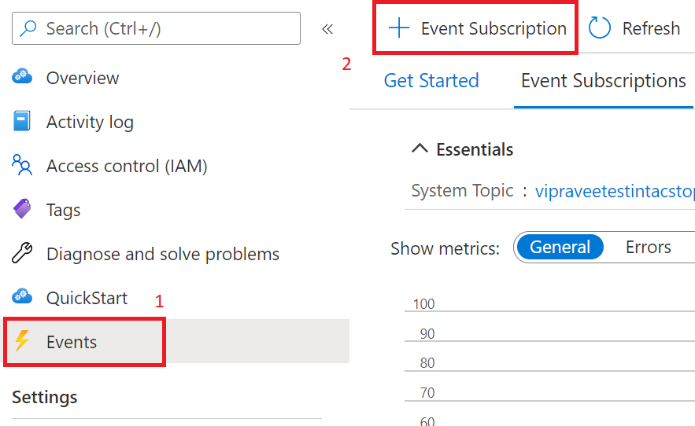
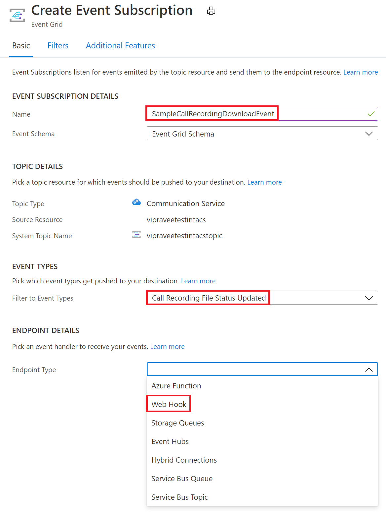
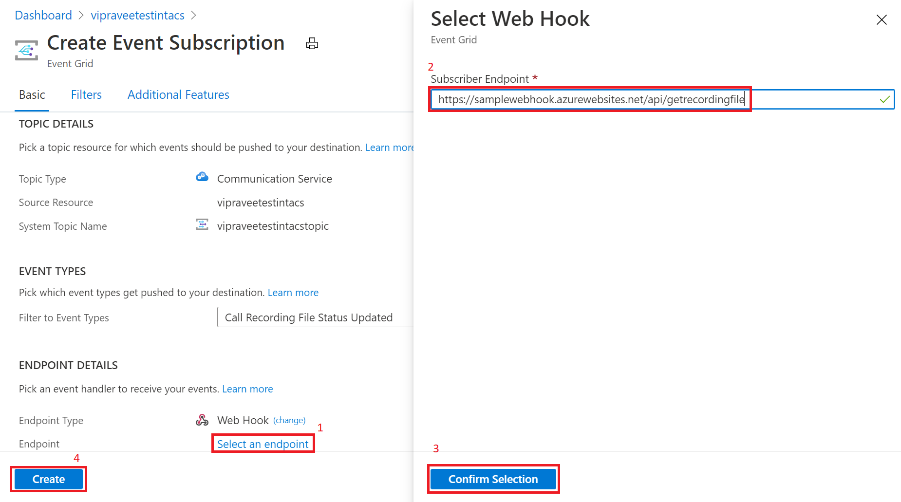

# Record and download calls with Event Grid

[!INCLUDE [Private Preview Notice](../../includes/private-preview-include.md)]

Get started with Azure Communication Services by recording your Communication Services calls using Azure Event Grid.

## Prerequisites
- An Azure account with an active subscription. [Create an account for free](https://azure.microsoft.com/free/?WT.mc_id=A261C142F).
- An active Communication Services resource. [Create a Communication Services resource](../create-communication-resource.md?pivots=platform-azp&tabs=windows).
- The [`Microsoft.Azure.EventGrid`](https://www.nuget.org/packages/Microsoft.Azure.EventGrid/) NuGet package.

## Create a webhook and subscribe to the recording events
We'll use *webhooks* and *events* to facilitate call recording and media file downloads. 

First, we'll create a webhook. Your Communication Services resource will use Event Grid to notify this webhook when the `recording` event is triggered, and then again when recorded media is ready to be downloaded.

You can write your own custom webhook to receive these event notifications. It's important for this webhook to respond to inbound messages with the validation code to successfully subscribe the webhook to the event service.

```
[HttpPost]
public async Task<ActionResult> PostAsync([FromBody] object request)
  {
   //Deserializing the request 
    var eventGridEvent = JsonConvert.DeserializeObject<EventGridEvent[]>(request.ToString())
        .FirstOrDefault();
    var data = eventGridEvent.Data as JObject;

    // Validate whether EventType is of "Microsoft.EventGrid.SubscriptionValidationEvent"
    if (string.Equals(eventGridEvent.EventType, EventTypes.EventGridSubscriptionValidationEvent, StringComparison.OrdinalIgnoreCase))
   {
        var eventData = data.ToObject<SubscriptionValidationEventData>();
        var responseData = new SubscriptionValidationResponseData
        {
            ValidationResponse = eventData.ValidationCode
        };
        if (responseData.ValidationResponse != null)
        {
            return Ok(responseData);
        }
    }

    // Implement your logic here.
    ...
    ...
  }
```


The above code depends on the `Microsoft.Azure.EventGrid` NuGet package. To learn more about Event Grid endpoint validation, visit the [endpoint validation documentation](https://docs.microsoft.com/azure/event-grid/receive-events#endpoint-validation)

We'll then subscribe this webhook to the `recording` event:

1. Select the `Events` blade from your Azure Communication Services resource.
2. Select `Event Subscription` as shown below.

3. Configure the event subscription and select `Call Recording File Status Update` as the `Event Type`. Select `Webhook` as the `Endpoint type`.

4. Input your webhook's URL into `Subscriber Endpoint`.


Your webhook will now be notified whenever your Communication Services resource is used to record a call.

## Notification schema
When the recording is available to download, your Communication Services resource will emit a notification with the following event schema. The document IDs for the recording can be fetched from the `documentId` fields of each `recordingChunk`.

```
{
    "id": string, // Unique guid for event
    "topic": string, // Azure Communication Services resource id
    "subject": string, // /recording/call/{call-id}
    "data": {
        "recordingStorageInfo": {
            "recordingChunks": [
                {
                    "documentId": string, // Document id for retrieving from AMS storage
                    "index": int, // Index providing ordering for this chunk in the entire recording
                    "endReason": string, // Reason for chunk ending: "SessionEnded", "ChunkMaximumSizeExceeded”, etc.
                }
            ]
        },
        "recordingStartTime": string, // ISO 8601 date time for the start of the recording
        "recordingDurationMs": int, // Duration of recording in milliseconds
        "sessionEndReason": string // Reason for call ending: "CallEnded", "InitiatorLeft”, etc.
    },
    "eventType": string, // "Microsoft.Communication.RecordingFileStatusUpdated"
    "dataVersion": string, // "1.0"
    "metadataVersion": string, // "1"
    "eventTime": string // ISO 8601 date time for when the event was created
}

```

## Download the recorded media files

Once we get the document ID for the file we want to download, we'll call the below Azure Communication Services APIs to download the recorded media and metadata using HMAC authentication.

The maximum recording file size is 1.5GB. When this file size is exceeded, the recorder will automatically split recorded media into multiple files.

The client should be able to download all media files with a single request. If there's an issue, the client can retry with a range header to avoid redownloading segments that have already been downloaded.

To download recorded media: 
- Method: `GET` 
- URL: https://contoso.communication.azure.com/recording/download/{documentId}?api-version=2021-04-15-preview1

To download recorded media metadata: 
- Method: `GET` 
- URL: https://contoso.communication.azure.com/recording/download/{documentId}/metadata?api-version=2021-04-15-preview1


### Authentication
To download recorded media and metadata, use HMAC authentication to authenticate the request against Azure Communication Services APIs.

Create an `HttpClient` and add the necessary headers using the `HmacAuthenticationUtils` provided below:

```
  var client = new HttpClient();

  // Set Http Method
  var method = HttpMethod.Get;
  StringContent content = null;

  // Build request
  var request = new HttpRequestMessage
  {
      Method = method, // Http GET method
      RequestUri = new Uri(<Download_Recording_Url>), // Download recording Url
      Content = content // content if required for POST methods
  };

  // Question: Why do we need to pass String.Empty to CreateContentHash() method?
  // Answer: In HMAC authentication, the hash of the content is one of the parameters used to generate the HMAC token.
  // In our case our recording download APIs are GET methods and do not have any content/body to be passed in the request. 
  // However in this case we still need the SHA256 hash for the empty content and hence we pass an empty string. 


  string serializedPayload = string.Empty;

  // Hash the content of the request.
  var contentHashed = HmacAuthenticationUtils.CreateContentHash(serializedPayload);

  // Add HAMC headers.
  HmacAuthenticationUtils.AddHmacHeaders(request, contentHashed, accessKey, method);

  // Make a request to the Azure Communication Services APIs mentioned above
  var response = await client.SendAsync(request).ConfigureAwait(false);
```

#### HmacAuthenticationUtils 
The below utilities can be used to manage your HMAC workflow.

**Create content hash**

```
public static string CreateContentHash(string content)
{
    var alg = SHA256.Create();

    using (var memoryStream = new MemoryStream())
    using (var contentHashStream = new CryptoStream(memoryStream, alg, CryptoStreamMode.Write))
    {
        using (var swEncrypt = new StreamWriter(contentHashStream))
        {
            if (content != null)
            {
                swEncrypt.Write(content);
            }
        }
    }

    return Convert.ToBase64String(alg.Hash);
}
```

**Add HMAC headers**

```
public static void AddHmacHeaders(HttpRequestMessage requestMessage, string contentHash, string accessKey)
{
    var utcNowString = DateTimeOffset.UtcNow.ToString("r", CultureInfo.InvariantCulture);
    var uri = requestMessage.RequestUri;
    var host = uri.Authority;
    var pathAndQuery = uri.PathAndQuery;

    var stringToSign = $"{requestMessage.Method}\n{pathAndQuery}\n{utcNowString};{host};{contentHash}";
    var hmac = new HMACSHA256(Convert.FromBase64String(accessKey));
    var hash = hmac.ComputeHash(Encoding.ASCII.GetBytes(stringToSign));
    var signature = Convert.ToBase64String(hash);
    var authorization = $"HMAC-SHA256 SignedHeaders=date;host;x-ms-content-sha256&Signature={signature}";

    requestMessage.Headers.Add("x-ms-content-sha256", contentHash);
    requestMessage.Headers.Add("Date", utcNowString);
    requestMessage.Headers.Add("Authorization", authorization);
}
```

## Clean up resources
If you want to clean up and remove a Communication Services subscription, you can delete the resource or resource group. Deleting the resource group also deletes any other resources associated with it. Learn more about [cleaning up resources](../create-communication-resource.md?pivots=platform-azp&tabs=windows#clean-up-resources).


## Next steps
For more information, see the following articles:

- Check out our [web calling sample](https://docs.microsoft.com/azure/communication-services/samples/web-calling-sample)
- Learn about [Calling SDK capabilities](https://docs.microsoft.com/azure/communication-services/quickstarts/voice-video-calling/calling-client-samples?pivots=platform-web)
- Learn more about [how calling works](https://docs.microsoft.com/azure/communication-services/concepts/voice-video-calling/about-call-types)
