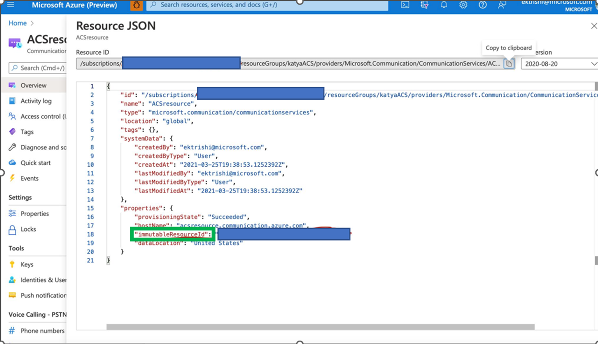

# How to get your Azure Resource ID

In order to get your Resource ID allowlisted, send your Immutable Azure Resource ID to the Call Recording Team. For reference, see the image below.

## See Also

For more information, see the following articles:

- Check out our [web calling sample](../../samples/web-calling-sample.md)
- Learn about [Calling SDK capabilities](./getting-started-with-calling.md?pivots=platform-web)
- Learn more about [how calling works](../../concepts/voice-video-calling/about-call-types.md)
