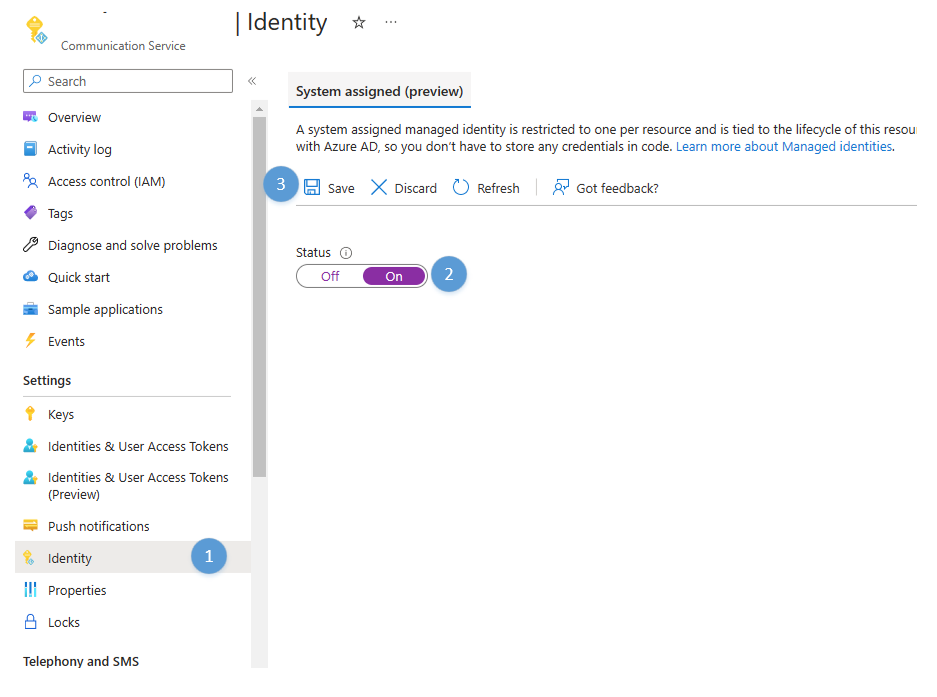
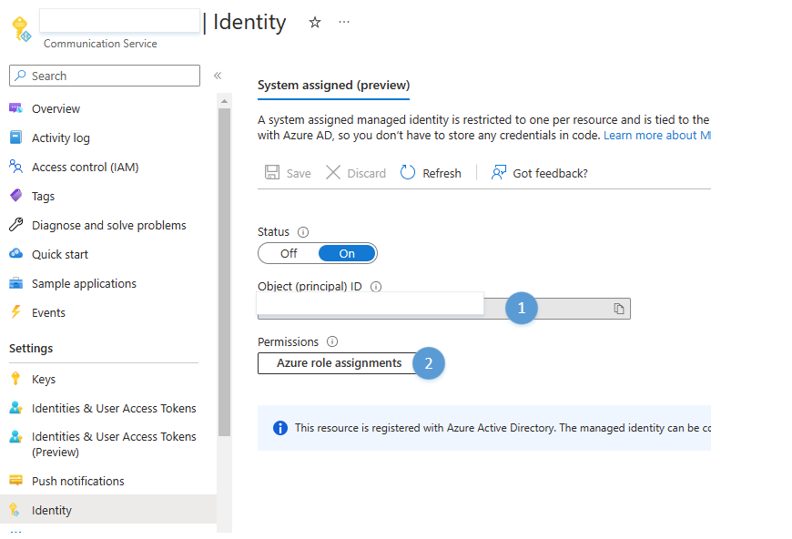
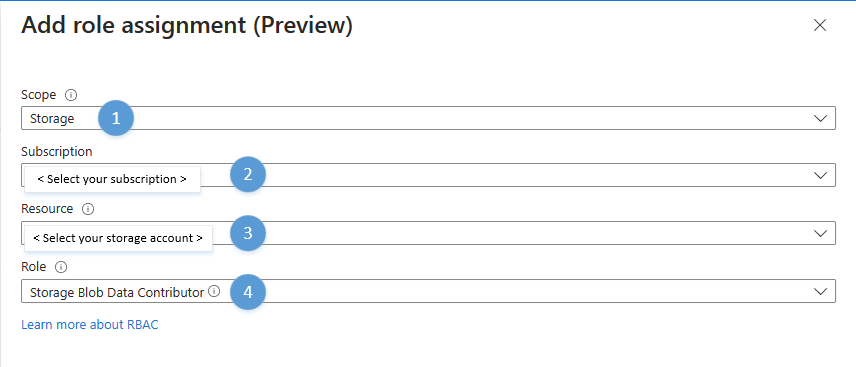
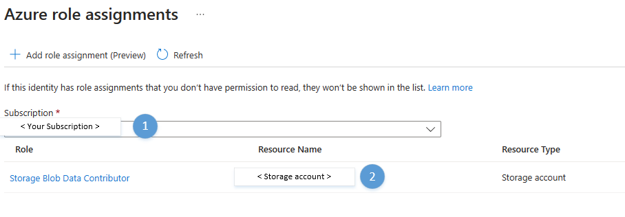

# Call Recording Quickstart

[!INCLUDE [Public Preview](../../includes/public-preview-include-document.md)]

This quickstart gets you started with Call Recording for voice and video calls. To start using the Call Recording APIs, you must have a call in place. Make sure you're familiar with [Calling client SDK](get-started-with-video-calling.md) and/or [Call Automation](../call-automation/callflows-for-customer-interactions.md#build-a-customer-interaction-workflow-using-call-automation) to build the end-user calling experience. 

::: zone pivot="programming-language-csharp"
[!INCLUDE [Test Call Recording with C#](./includes/call-recording-samples/call-recording-csharp.md)]
::: zone-end

::: zone pivot="programming-language-java"
[!INCLUDE [Test Call Recording with Java](./includes/call-recording-samples/call-recording-java.md)]
::: zone-end

## Call Recording: Bring your own storage

[!INCLUDE [Public Preview](../../includes/private-preview-include-section.md)]

### Pre-requisite: Setting up Managed Identity and RBAC Role Assignments

#### 1.1 Enable System Assigned Managed Identity for Azure Communication Services

1. Open your Azure Communication Services resource. Navigate to *Identity* on the left.
2. System Assigned Managed Identity is disabled by default. Enable it and click of *Save*
3. Once completed, you'll be able to see the Object principal ID of the newly created identity (shown below)

4. Now that identity has been successfully created, click on *Azure role assignments* to start adding role assignments.

#### 1.2 Add Role Assignment

1. Click on *"Add role assignment"*

2. On the *"Add role assignment"* panel, select the following values
    1. Scope: **Storage**
    2. Subscription: **Choose your subscription**
    3. Resource: **Choose your storage account**
    4. Role: **Azure Communication Services needs *"Storage Blob Data Contributor"* to be able to write to your storage account.**

3. Click on *"Save"*.
4. Once completed, you will see the newly added role assignment in the *"Azure role assignment"* window (shown below).

::: zone pivot="programming-language-csharp"
[!INCLUDE [Test Call Recording BYOS with C#](./includes/call-recording-samples/private-preview-call-recording-byos-csharp.md)]
::: zone-end

::: zone pivot="programming-language-java"
[!INCLUDE [Test Call Recording BYOS with Java](./includes/call-recording-samples/private-preview-call-recording-byos-java.md)]
::: zone-end

## Clean up resources

If you want to clean up and remove a Communication Services subscription, you can delete the resource or resource group. Deleting the resource group also deletes any other resources associated with it. Learn more about [cleaning up resources](../create-communication-resource.md#clean-up-resources).

## Next steps

For more information, see the following articles:

- Download our [Java](https://github.com/Azure-Samples/communication-services-java-quickstarts/tree/main/ServerRecording) and [.NET](https://github.com/Azure-Samples/communication-services-dotnet-quickstarts/tree/main/ServerRecording) call recording sample apps 
- Learn more about [Call Recording](../../concepts/voice-video-calling/call-recording.md)
- Learn more about [Call Automation](../../concepts/call-automation/call-automation.md)

