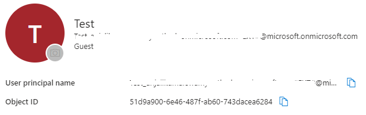

# Quickstart: How to make a call between your application and Teams user

In this quickstart, you're going to learn how to start a call from Azure Communication Services user to Teams user. You're going to achieve it with the following steps:

1. Enable federation of Azure Communication Services resource with Teams Tenant.
2. Find Teams user ID.
3. Start a call with Azure Communication Services Calling SDK.

## Get the Teams user Object ID

All Teams information could be found in [Microsoft Graph Explorer](https://developer.microsoft.com/en-us/graph/graph-explorer) using  email in the search.

```console
https://graph.microsoft.com/v1.0/users/user-email@contoso.com
```

In results, we be able to find "ID" field

```json
    "userPrincipalName": "user-email@contoso.com",
    "id": "31a011c2-2672-4dd0-b6f9-9334ef4999db"
```

Or the same ID could be found in [Azure portal](https://aka.ms/portal) in Users tab:


::: zone pivot="platform-web"
[!INCLUDE [Calling with JavaScript](./includes/teams-user/teams-user-javascript.md)]
::: zone-end

::: zone pivot="platform-windows"
[!INCLUDE [Calling with Windows](./includes/teams-user/teams-user-windows.md)]
::: zone-end

::: zone pivot="platform-android"
[!INCLUDE [Calling with Android](./includes/teams-user/teams-user-android.md)]
::: zone-end

::: zone pivot="platform-ios"
[!INCLUDE [Calling with iOS](./includes/teams-user/teams-user-ios.md)]
::: zone-end


## Clean up resources

If you want to clean up and remove a Communication Services subscription, you can delete the resource or resource group. Deleting the resource group also deletes any other resources associated with it. Learn more about [cleaning up resources](../create-communication-resource.md#clean-up-resources).

## Next steps

For more information, see the following articles:

- Check out our [calling hero sample](../../samples/calling-hero-sample.md)
- Get started with the [UI Library](../ui-library/get-started-composites.md)
- Learn about [Calling SDK capabilities](./getting-started-with-calling.md)
- Learn more about [how calling works](../../concepts/voice-video-calling/about-call-types.md)
