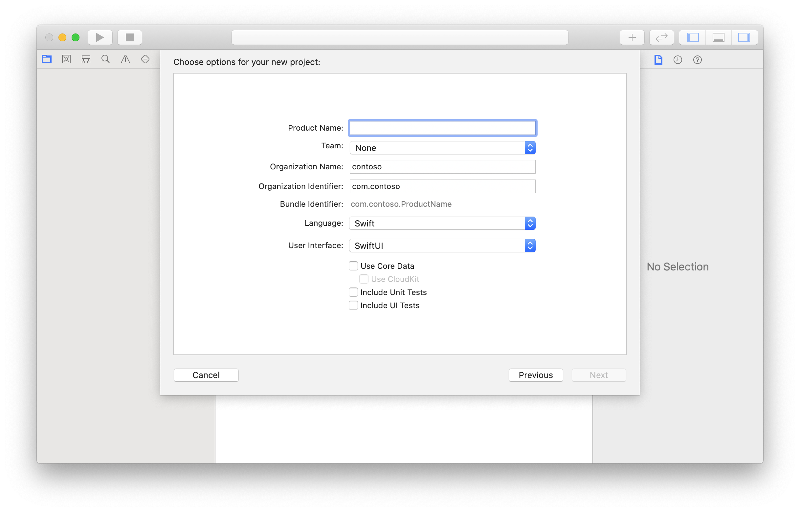
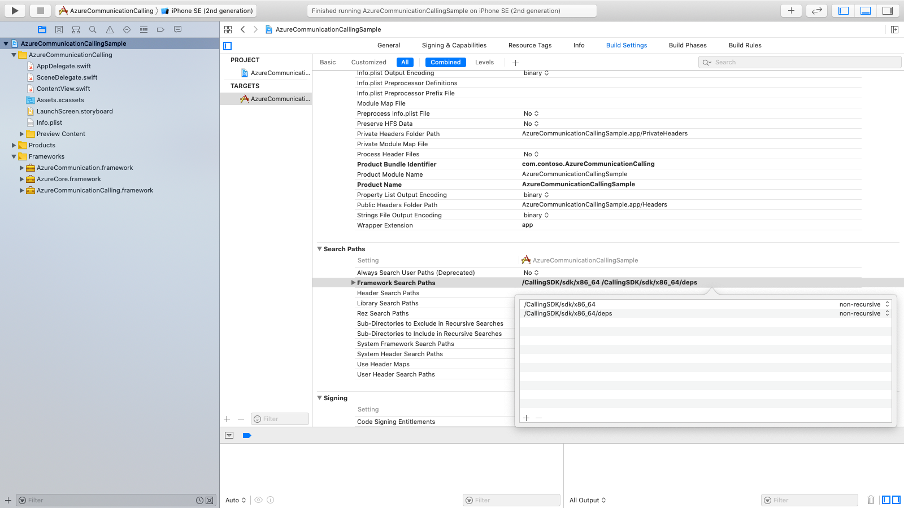

**TODO: Remove references to Spool - add instructions to add client library**

## Prerequisites

- An Azure account with an active subscription. [Create an account for free](https://azure.microsoft.com/free/?WT.mc_id=A261C142F). 
- A deployed Communication Services resource. [Create a Communication Services resource](../../create-communication-resource.md).
- A `User Access Token` to enable the call client. For more information on [how to get a `User Access Token`](../../user-access-tokens.md)
- Optional: Complete the quickstart for [getting started with adding calling to your application](../getting-started-with-calling.md)

## Setting up

### Add the client library to your app

In Xcode, create a new iOS project and select the **Single View Application** template. This tutorial uses the SwiftUI framework, so you should set the the **Language** to **Swift** and the **User Interface** to **SwiftUI**



Add the request for microphone access. Right-click the `Info.plist` entry of the project tree, and select **Open As** > **Source Code**. Add the following lines into the `<dict>` section, and then save the file.

```xml
<key>NSMicrophoneUsageDescription</key>
<string>Need microphone access for VOIP calling.</string>
```

Add the Azure Communication Services Calling client library to your project. 

- In Xcode, click on your project file to and select the build target to open the project settings editor.
- Under the **General** tab, scroll to the **Frameworks, Libraries, and Embedded Content** section and click the **"+"** icon.
- In the bottom left of the dialog, chose **Add Files**, navigate to the **SpoolCallingSDK.framework** directory of the client library package.

>[!NOTE]
Currently the client library includes multiple binaries, each targeting different architectures. To build an app that runs on the simulator you should select the **SpoolCallingSDK.framework**  included under the **x86_64** directory

Open the **Build Settings** tab of the project settings editor and scroll to the **Search Paths** section. Add a new **Framework Search Paths** entry for the directory containing the **SpoolCallingSDK.framework**



## Object model

The following classes and interfaces handle some of the major features of the Azure Communication Services Calling client library for JavaScript.

| Name                                              | Description                                                                                                                                      |
| ------------------------------------------------- | ------------------------------------------------------------------------------------------------------------------------------------------------ |
| [CallingFactory](../../../references/overview.md) | This class is needed for all calling functionality. You instantiate it with your subscription information, and use it to start and manage calls. |

## Initialize the CallClient

To create a `CallClient` you have to use `CallClientFactory.create` method that asynchronously returns a `CallClient` object once it's initialized

To create call client you have to pass a `CommunicationUserCredential` object.

```swift

let userToken = "<user token>";
let callClientInstance: CallClient? = nil;
CallClientFactory.create(userToken, completionHandler: { (callClient, error) -> Void in
    if(error != nil)
    {
        // handle error
        return;
    }
    
    callClientInstance = callClient;
}));

```

## Place an outgoing call

To create and start a call you need to call one of the APIs on `CallClient` and provide the Communication Services Identity of a user that you've provisioned using the Communication Services Management client library.

Call creation and start is synchronous. You'll receive call instance that allows you to subscribe to all events on the call.

### Place a 1:1 call to a user or a 1:n call with users and PSTN

```swift

let placeCallOptions = ACSPlaceCallOptions();
let oneToOneCall = self.CallingApp.adHocCallClient.callWithParticipants(participants: ['acsUserId'], options: placeCallOptions);

```

### Place a 1:n call with users and PSTN
To place the call to PSTN you have to specify phone number acquired with Communication Services
```swift

let callerId = PhoneNumber('+1999999999');
let placeCallOptions = ACSPlaceCallOptions(alternateCallerId: callerId);
let groupCall = self.CallingApp.adHocCallClient.callWithParticipants(participants: ['acsUserId', '+1234567890'], options: placeCallOptions);

```

### Place a 1:1 call with with video

```swift

let placeCallOptions = ACSPlaceCallOptions();
let videoOptions = ACSVideoOptions()
let cameras = callClient.deviceManager.getCameraList();
videoOptions.camera = (cameras.first ?? nil)!;
placeCallOptions.videoOptions = videoOptions
let call = callClient.callWithParticipants(participants: [names], options: placeCallOptions);

```

## Handle incoming push notification

```swift

call.handlePushNotificationWithCompletionHandler(jsonPayload, 
    completionHandler: (call: ACSCall, error: Error?) -> Void) { 
    if (error != nil)
    {
        print("Failed to handle the incoming call notification")
    }
    else
    {
        self.call = call
        self.call.delegate = self; // To get notified about call state changes
    }
});

```

## Mid-call operations

You can perform various operations during a call to manage settings related to video and audio.

### Mute and unmute

To mute or unmute the local endpoint you can use the `mute` and `unmute` asynchronous APIs:

```swift

//mute local device 
call.mute(completionHandler: nil);

//unmute local device 
call.unmute(completionHandler: nil);

```

### Start and stop sending local video

To start sending local video to other participants in the call, use `startVideo` api and pass `videoDevice` from `deviceManager.getCameraList()` API enumeration call:

```swift

call.startVideo(device: ACSVideoDeviceInfo(),
                completionHandler: ((error: Error?) -> Void) { 
    if(error == nil)
    {
        print("Video was started successfully.");
    }
    else
    {
        print("Video failed to start.");
    }   
});

```

Once you start sending video, the `LocalVideoStream` instance is added the `localVideoStreams` collection on a call instance:

```swift

call.localVideoStreams[0]

```

[Asynchronous] To stop local video, pass the `localVideoStream` returned from the invocation of `call.startVideo()`:

```swift

call.stopVideo(completionHandler: ((error: Error?) -> Void) { 
    if(error == nil)
    {
        print("Video was stopped successfully.");
    }
    else
    {
        print("Video failed to stop.");
    }   
});

```

## Remote participants management

All remote participants are represented by the `RemoteParticipant` type and are available through the `remoteParticipants` collection on a call instance:

### List participants in a call

```swift

call.remoteParticipants

```

### Remote participant properties

```swift

// [String] userId - same as the one used to provision token for another user
var userId = remoteParticipant.identity;

// ACSParticipantStateIdle = 0, ACSParticipantStateEarlyMedia = 1, ACSParticipantStateConnecting = 2, ACSParticipantStateConnected = 3, ACSParticipantStateOnHold = 4, ACSParticipantStateInLobby = 5, ACSParticipantStateDisconnected = 6
var state = remoteParticipant.state;

// [AcsEndReason] callEndReason - reason why participant left the call, contains code/subcode/message
var callEndReason = remoteParticipant.callEndReason

// [Bool] isMuted - indicating if participant is muted
var isMuted = remoteParticipant.isMuted;

// [Bool] isSpeaking - indicating if participant is currently speaking
var isSpeaking = remoteParticipant.isSpeaking;

// ACSRemoteVideoStream[] - collection of video streams this participants has
var videoStreams = remoteParticipant.videoStreams; // [ACSRemoteVideoStream, ACSRemoteVideoStream, ...]

// ACSRemoteVideoStream[] - collection of screen sharing streams this participants has
var screenSharingStreams = remoteParticipant.screenSharingStreams; // [ACSRemoteVideoStream, Communication ServicesRemoteVideoStream, ...]

```

### Add a participant to a call

To add a participant to a call (either a user or a phone number) you can invoke `addParticipant`. 
This will synchronously return a remote participant instance.

```swift

ACSRemoteParticipant* remoteParticipant = self.call.addParticipant("userId");

```

### Remove a participant from a call
To remove a participant from a call (either a user or a phone number) you can invoke the  `removeParticipant` API. This will resolve asynchronously.

```swift

call.removeParticipant(participant: remoteParticipant,
                       completionHandler: ((error: Error?) -> Void))

```

## Render remote participant video streams

Remote participants may initiate video or screen sharing during a call.

### Handle remote participant video/screen sharing streams

To list the streams of remote participants, inspect the `videoStreams` or `screenSharingStreams` collections:

```swift
var remoteParticipantStream = call.remoteParticipants[0].videoStreams[0];
var remoteParticipantStream = call.remoteParticipants[0].screenSharingStreams[0];
```

### Remote video stream properties

```swift
// [ACSMediaStreamType] type one of 'Video' | 'ScreenSharing';
var type = remoteParticipantStream.type;

// [Bool] if remote stream is available
var isAvailable = remoteParticipantStream.isAvailable;

// RemoteVideoRenderer[] collection of active renderers rendering given stream
var activeRenders = remoteParticipantStream.activeRenderers;
```

You can subscribe to `availabilityChanged` and `activeRenderersChanged` events 

### Render remote participant stream

To start rendering remote participant streams:

```swift
let renderer: ASARemoteVideoRenderer = remoteVideoStream.render(ScalingMode.Stretch);
let targetSurface: UIView = renderer.target;
```

Where:

* target - an HTMLNode that should be used as a placeholder for stream to render in
* scalingMode - one of the following strings: 'Stretch' | 'Crop' | 'Fit'

As a result of this call, `remoteVideoRenderer` is added to the `activeRenderers` collection:

```swift

remoteParticipantStream.activeRenderers[0] == remoteVideoRenderer

```

### Remote video renderer methods and properties

```swift
// [Bool] isRendering - indicating if stream is being rendered
remoteVideoRenderer.isRendering; 
// [ACSScalingMode] ACSScalingModeStretch = 0, ACSScalingModeCrop = 1, ACSScalingModeFit = 2
remoteVideoRenderer.scalingMode
// [UIView] target an HTML node that should be used as a placeholder for stream to render in
remoteVideoRenderer.target
```

The `RemoteVideoRenderer` instance has following methods:

```swift
// [ScalingMode] ASAScalingModeStretch = 0, ASAScalingModeCrop = 1, ASAScalingModeFit = 2
remoteVideoRenderer.scalingMode
await remoteVideoRenderer.pauseWithCompletionHandler(completionHandler: nil); // pause rendering
await remoteVideoRenderer.resumeWithCompletionHandler(completionHandler: nil); // resume rendering
```

## Device management

`DeviceManager` lets you enumerate local devices that can be used in a call to transmit audio/video streams. It also allows you to request permission from a user to access microphone/camera using native browser APIs. You can access `deviceManager` on the `callClient` object:

```swift
var deviceManager = callClient.deviceManager;
```

### Enumerate local devices

To access local devices, you can use enumeration methods on the Device Manager. Enumeration is a synchronous action.

```swift
// enumerate local cameras
var localCameras = deviceManager.getCameraList(); // [ACSVideoDeviceInfo, ACSVideoDeviceInfo...]
// enumerate local cameras
var localMicrophones = deviceManager.getMicrophoneList(); // [ACSAudioDeviceInfo, ACSAudioDeviceInfo...]
// enumerate local cameras
var localSpeakers = deviceManager.getSpeakerList(); // [ACSAudioDeviceInfo, ACSAudioDeviceInfo...]
``` 

### Set default microphone/speaker

Device manager allows you to set a default device that will be used when starting a call. If stack defaults are not set, Communication Services will fall back to OS defaults.

```swift
// [Synchronous] set default camera
var deviceManager.setCamera(VideoDeviceInfo);
// get default microphone
var defaultMicrophone = deviceManager.getMicrophone();
// [Synchronous] set default microphone
defaultMicrophone.setDefaultMicrophone(AudioDeviceInfo);
// get default speaker
var defaultSpeaker = deviceManager.getSpeaker();
// [Synchronous] set default speaker
deviceManager.setDefaultSpeakers(AudioDeviceInfo);
```

### Local camera preview

You can use `deviceManager` to begin rendering a stream from your local camera. This stream won't be send to other participants; it's a local preview feed. This is an asynchronous action.

```swift
var previewRenderer = deviceManager.renderPreviewVideoWithCameraDevice(defaultCamera, target, remoteVideoRenderer.scalingMode);
previewRenderer.start();
```

### Local camera preview properties

The preview renderer has set of properties and methods that allow you to control the rendering:

```swift
// [Bool] isRendering
previewRenderer.isRendering
// [UIView] target
previewRenderer.target
// [ACSScalingMode] scalingMode
previewRenderer.scalingMode
// [ACSVideoDeviceInfo] videoDeviceInfo
previewRenderer.videoDeviceInfo
// [Synchronous] start
previewRenderer.start();
// [Synchronous] stop
previewRenderer.stop();
// [Synchronous] switchDevice
previewRenderer.switchDevice(ACSVideoDeviceInfo);
// setScalingMode
previewRenderer.setScalingMode(ACSScalingMode);
```
--- 

## Eventing model

You can subscribe to most of the properties and collections to be notified when values change.

### Properties
To subscribe to `property changed` events:

```swift
self.adHocCallClient.delegate = self
    // Get the property of the call state by doing get on the call's state member
    public func onCallStateChanged(_ call: ACSCall!,
                            _ args: ACSPropertyChangedEventArgs!)
    {
        print("Callback from client library when the call state changes, current state: " + call.state.rawValue);
    }
 // to unsubscribe
 self.adHocCallClient.delegate = nil

```

### Collections
To subscribe to `collection updated` events:

```swift
self.adHocCallClient.delegate = self
    // Collection contains the streams that were added or removed only
    public func onLocalVideoStreamsChanged(_ call: ACSCall!,
                                    _ args: ACSLocalVideoStreamsUpdatedEventArgs!)
    {
        print(args.addedStreams.count);
        print(args.removeStreams.count);
    }
     // to unsubscribe
 self.adHocCallClient.delegate = nil
```
