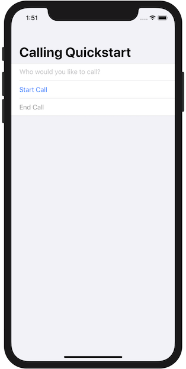

[!INCLUDE [Emergency Calling Notice](../../../includes/emergency-calling-notice-include.md)]
## Prerequisites

- An Azure account with an active subscription. [Create an account for free](https://azure.microsoft.com/free/?WT.mc_id=A261C142F). 
- A deployed Communication Services resource. [Create a Communication Services resource](../../create-communication-resource.md).
- A phone number acquired in Communication Services resource. [how to get a phone number](../../telephony-sms/get-phone-number.md).
- A `User Access Token` to enable the call client. For more information on [how to get a `User Access Token`](../../access-tokens.md)
- Complete the quickstart for [getting started with adding calling to your application](../getting-started-with-calling.md)

### Prerequisite check

- To view the phone numbers associated with your Communication Services resource, sign in to the [Azure portal](https://portal.azure.com/), locate your Communication Services resource and open the **phone numbers** tab from the left navigation pane.
- You can build and run your app with Azure Communication Services Calling SDK for iOS:

## Setting up

## Start a call to phone

Specify phone number you acquired in Communication Services resource, that will be used to start the call:
> [!WARNING]
> Note that phone numbers shold be provided in E.164 international standard format. (e.g.: +12223334444)

Modify `startCall` event handler that will be performed when the *Start Call* button is tapped:

```swift
func startCall() {
    // Ask permissions
    AVAudioSession.sharedInstance().requestRecordPermission { (granted) in
        if granted {
            let startCallOptions = ACSStartCallOptions()
            startCallOptions!.alternateCallerID = PhoneNumber(phoneNumber: "+12223334444")
            self.call = self.callAgent!.startCall([PhoneNumber(phoneNumber: self.callee)], options: startCallOptions)
            self.callDelegate = CallDelegate(self)
            self.call!.delegate = self.callDelegate
        }
    }
}
```

## Run the code

You can build and run your app on iOS simulator by selecting **Product** > **Run** or by using the (&#8984;-R) keyboard shortcut.



You can make an call to phone by providing a phone number in the added text field and clicking the **Start Call** button.
> [!WARNING]
> Note that phone numbers shold be provided in E.164 international standard format. (e.g.: +12223334444)

> [!NOTE]
> The first time you make a call, the system will prompt you for access to the microphone. In a production application, you should use the `AVAudioSession` API [check the permission status](https://developer.apple.com/documentation/uikit/protecting_the_user_s_privacy/requesting_access_to_protected_resources) and gracefully update your application's behavior when permission is not granted.
