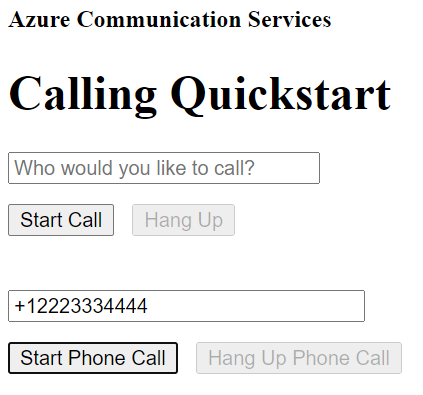

[!INCLUDE [Emergency Calling Notice](../../../includes/emergency-calling-notice-include.md)]
## Prerequisites

- An Azure account with an active subscription. [Create an account for free](https://azure.microsoft.com/free/?WT.mc_id=A261C142F). 
- A deployed Communication Services resource. [Create a Communication Services resource](../../create-communication-resource.md).
- A phone number acquired in Communication Services resource. [how to get a phone number](../../telephony-sms/get-phone-number.md).
- A `User Access Token` to enable the call client. For more information on [how to get a `User Access Token`](../../access-tokens.md)
- Complete the quickstart for [getting started with adding calling to your application](../getting-started-with-calling.md)

### Prerequisite check

- To view the phone numbers associated with your Communication Services resource, sign in to the [Azure portal](https://portal.azure.com/), locate your Communication Services resource and open the **phone numbers** tab from the left navigation pane.
- You can build and run your app with Azure Communication Services Calling client library for JavaScript:

```console
npx webpack-dev-server --entry ./client.js --output bundle.js
```

## Setting up

### Add PSTN functionality to your app

Extend your layout with phone dialing controls.

Place this code to the end of `<body />` section of **index.html**, before `<script />` tags:

```html
<input 
  id="callee-phone-input"
  type="text"
  placeholder="Phone number you would like to dial"
  style="margin-bottom:1em; width: 230px;"
/>
<div>
  <button id="call-phone-button" type="button">
    Start Phone Call
  </button>
  &nbsp;
  <button id="hang-up-phone-button" type="button" disabled="true">
    Hang Up Phone Call
  </button>
</div>
```

Extend your application logic with telephony functionality.

Add this code to **client.js**:

```javascript
const calleePhoneInput = document.getElementById("callee-phone-input");
const callPhoneButton = document.getElementById("call-phone-button");
const hangUpPhoneButton = document.getElementById("hang-up-phone-button");
```

## Start a call to phone

Specify phone number you acquired in Communication Services resource, that will be used to start the call:
> [!WARNING]
> Note that phone numbers shold be provided in E.164 international standard format. (e.g.: +12223334444)

Add an event handler to initiate a call to the phone number you provided when the `callPhoneButton` is clicked:


```javascript
callPhoneButton.addEventListener("click", () => {
  // start a call to phone
  const phoneToCall = calleePhoneInput.value;
  call = callAgent.call(
    [{phoneNumber: phoneToCall}], { alternateCallerId: {phoneNumber: '+18336528005'}
  });

  // toggle button states
  hangUpPhoneButton.disabled = false;
  callPhoneButton.disabled = true;
});
```

## End a call to phone

Add an event listener to end the current call when the `hangUpPhoneButton` is clicked:

```javascript
hangUpPhoneButton.addEventListener("click", () => {
  // end the current call
  call.hangUp({
    forEveryone: true
  });

  // toggle button states
  hangUpPhoneButton.disabled = true;
  callPhoneButton.disabled = false;
});
```

The `forEveryone` property ends the call for all call participants.

## Run the code

Use the `webpack-dev-server` to build and run your app. Run the following command to bundle the application host on a local webserver:


```console
npx webpack-dev-server --entry ./client.js --output bundle.js
```

Open your browser and navigate to `http://localhost:8080/`. You should see the following:




You can place a call to a real phone number by providing a phone number in the added text field and clicking the **Start Phone Call** button.

> [!WARNING]
> Note that phone numbers shold be provided in E.164 international standard format. (e.g.: +12223334444)
