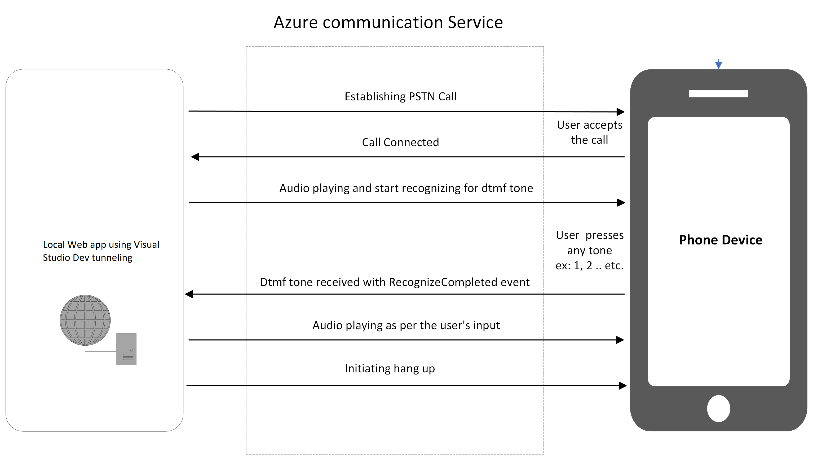

# Call Automation - Appointment Reminder

[!INCLUDE [Public Preview Notice](../includes/public-preview-include.md)]

This Azure Communication Services Call Automation - Appointment Reminder sample demonstrates how your application can use the Call Automation SDK to build automated workflows that create outbound calls to proactively reach out to your customers. 

> This sample is available **on GitHub** for [C#](https://github.com/Azure-Samples/communication-services-dotnet-quickstarts/tree/main/CallAutomation_AppointmentReminder) and [Java](https://github.com/Azure-Samples/communication-services-java-quickstarts/tree/main/CallAutomation_AppointmentReminder)

## Overview

This sample application makes an outbound call to a phone number then performs dtmf recognition and then plays the next audio file based on the key pressed by the callee. This sample application accepts tone 1 (tone1) and 2 (tone2). If the callee presses any key other than what it's expecting, an invalid audio tone will be played and then the call will be disconnected.

This sample application is also capable of making multiple concurrent outbound calls.

## Design

::: zone pivot="programming-language-csharp"
[!INCLUDE [CA csharp sample](./includes/ca-appointment-reminder-csharp.md)]
::: zone-end

::: zone pivot="programming-language-java"
[!INCLUDE [CA java sample](./includes/ca-appointment-reminder-java.md)]
::: zone-end

## Clean up resources

If you want to clean up and remove a Communication Services subscription, you can delete the resource or resource group. Deleting the resource group also deletes any other resources associated with it. Learn more about [cleaning up resources](../quickstarts/create-communication-resource.md#clean-up-resources).

## Next steps

- Learn about [Call Automation](../concepts/call-automation/call-automation.md) and its features.
- Learn about [Play action](../concepts/call-automation/play-action.md) to play audio in call.
- Learn about [Recognize action](../concepts/call-automation/recognize-action.md) to gather user input.

