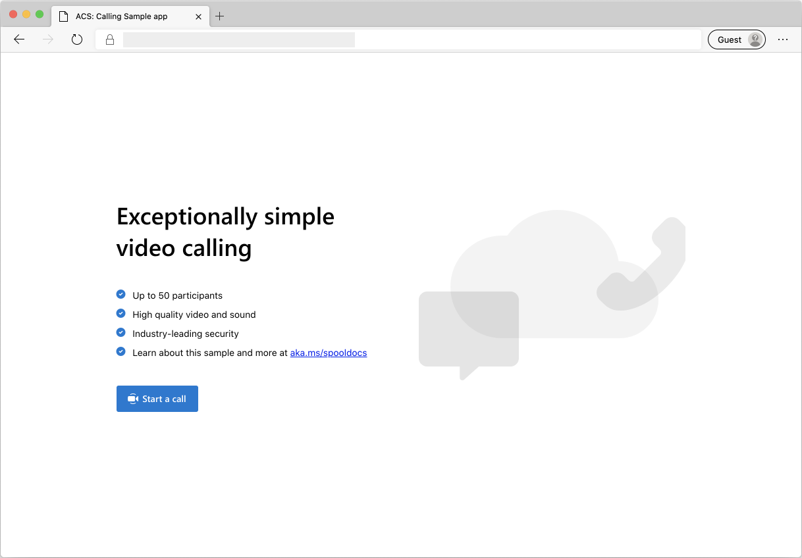
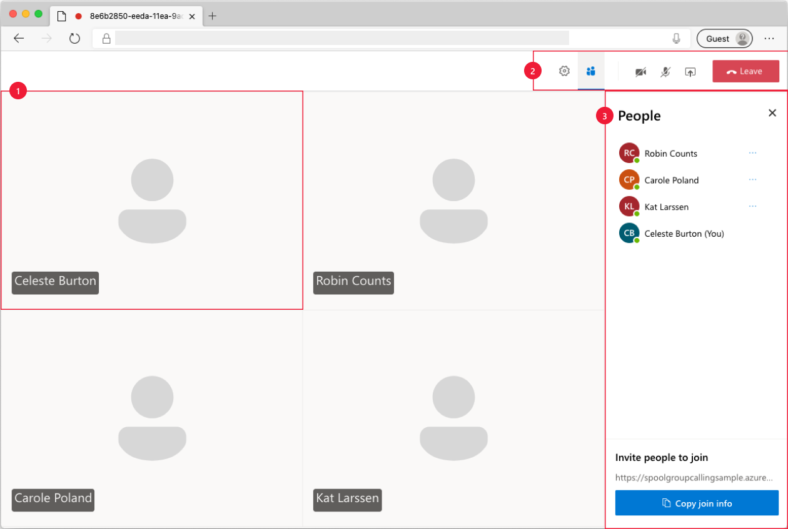

# Get started with the group calling hero sample

[!INCLUDE [Public Preview Notice](../includes/public-preview-include.md)]

> [!WARNING]
> The two links to our Hero Sample repo need to be updated when the sample is publicly available.


The Azure Communication Services **Group Calling Hero Sample** demonstrates how the Communication Services Calling Web client library can be used to build a group calling experience.

In this Sample quickstart, we'll learn how the sample works before we run the sample on your local machine. We'll then deploy the sample to Azure using your own Azure Communication Services resources. Finally, we'll update the sample's functionality.

## Overview

The sample has both a client-side application and a server-side application. The **client-side application** is a React/Redux web application that uses Microsoft's Fluent UI framework. This application sends requests to an ASP.NET Core **server-side application** that helps the client-side application connect to Azure. 

Here's what the sample looks like:



When you press the "Start a call" button, the web application fetches a user access token from the server-side application. This token is then used to connect the client app to Azure Communication Services. Once the token is retrieved, you'll be prompted to specify the camera and microphone that you want to use. You'll be able to disable/enable your devices with toggle controls:


Once your configure your display name and devices, you can join the call session. Now you will see the main call canvas where the core calling experience lives.



Components of the main calling screen:

1. **Media Gallery**: The main stage where participants are shown. If a participant has their camera enabled, their video feed is shown here. Each participant has an individual tile which shows their display name and video stream (when there is one)
2. **Header**: This is where the primary call controls are located to toggle settings and participant side bar, turn video and mix on/off, share screen and leave the call.
3.  **Side Bar**: This is where participants and setting information are shown when toggled using the controls on the header. The component can be dismissed using the 'X' on the top right corner. Participants side bar will show a list of participants and a link to invite more users to chat. Settings side bar allows you to configure microphone and camera settings.

Below you'll find more information on prerequisites, steps to set up the sample, and step-by-step tutorials to help familiarize yourself with its various components.

## Prerequisites

1. Create an Azure account with an active subscription. For details, see [Create an account for free](https://azure.microsoft.com/free/?WT.mc_id=A261C142F).
2. [Node.js (8.11.2 and above)](https://nodejs.org/en/download/)
3. [Visual Studio (2017 and above)](https://visualstudio.microsoft.com/vs/)
4. [.NET Core 2.2](https://dotnet.microsoft.com/download/dotnet-core/2.2) (Make sure to install version that corresponds with your visual studio instance, 32 vs 64 bit)
5. Create an Azure Communication Services resource. For details, see [Create an Azure Communication Resource](../quickstarts/create-communication-resource.md). You'll need to record your resource **connection string** for this quickstart.

## Locally deploy the service & client applications

The group calling sample is essentially two applications: the ClientApp and the Service.NET app.

When we want to deploy locally we need to start up both applications. When the server app is visited from the browser, it will use the locally deployed ClientApp for the user experience.

You can test the sample locally by opening multiple browser sessions with the URL of your call to simulate a multi-user call.

### Before running the sample for the first time

1. Open an instance of PowerShell, Windows Terminal, Command Prompt or equivalent and navigate to the directory that you'd like to clone the sample to.
2. `git clone`
3. Go to **ClientApp Folder** and run `npm run setup-vsts-auth`
   1. If you see an error 1, look above in the output for a URL where you'll need to go to to authorize your client. (URL will look like this: `app.vssps.visualstudio.com/oauth2/authorize?clientid=...`)Once you visit the URL in a browser, copy the command from the browser window and run it.
   2. Run command `npm run setup-vsts-auth` again once you complete the previous step.
4. Go to the ClientApp folder and run `npm install`.
5. Get the `Connection String` from the Azure portal. For more information on connection strings, see [Create an Azure Communication Resources](../quickstarts/create-communication-resource.md)
6. Once you get the Connection String, Add the connection string to the **appsetting.json** file found under the Service .NET folder. Input your connection string in the variable: `ResourceConnectionString`.

### Local Run

First, we'll launch the client-side application:

1. Go to the ClientApp folder.
2. `npm run start`

Next, we'll launch the server-side application:

4. Go to the Service.NET folder.
5. Open the `SpoolCPaaSSamples.sln` solution in Visual Studio.
6. Run the `ServiceSampleDotNet` project by hitting the play button in the visual studio UI. 

The browser will open at `localhost:5000`, where Node.js is deploying the client app. You should now be able to proceed with starting a group call that uses your Communication Services resources.

#### Troubleshooting

1. The solution doesn't build; it throws errors during NPM installation/build.

Try to clean/rebuild the projects.

2. The sample page returns a 500 error in the browser.

Make sure you're running the ClientApp. Run 'npm run start' from ClientApp folder.

## Publish the sample to Azure

1. Right click on the `ServiceSampleDotNet` project and select Publish.
2. Create a new publish profile and select your Azure subscription.
3. Before publishing, add your connection string with `Edit App Service Settings`, and fill in `ResourceConnectionString` as the key and provide your connection string (copied from appsettings.json) as the value.

## Modify the sample

If you'd like to dive deeper into the sample, here are a couple of short walk-through that you can follow to learn more about Communication Services capabilities:

### Change the Media Gallery

You can modify the media gallery component to change the way that participants are displayed. To do this, navigate to the components folder within the `ClientApp/src` directory and look for `MediaGallery.tsx`.

First, Let's change **the number of columns** that are used to display the participants. Identify the variable called `calculateNumberOfColumns` in line 48. 

We can modify this variable from its current logic as follows: 

```javascript

	const calculateNumberOfColumns = React.useCallback(
		(participants) =>
		participants && participants.length > 0
			? Math.ceil(Math.sqrt(participants.length + 1))
			: 1,
		[]
	);

```

A similar change can be made to the `calculateNumberOfRows` variable on line 44.

Next, let's change **the way that local users are displayed** in the Media Gallery.

By default, the local user is displayed within the first (top-left) tile. The default media gallery logic iterates over all participants and then places the local user at the beginning of the array.

Take a look at the `getMediaGalleryTilesForParticipants` function on line 55. This is where the default logic is located. Inside this function, you'll see logic that maps the participant's information to `<div>` elements that are then rendered.

At the end of the function, you'll see the local user represented by the `localParticipantMediaGalleryItem` object on line 85. You can see how it's being added to `remoteParticipantsMediaGalleryItems` before being returned on line 100. Modify this logic to instead append it to the end of the array:
 
```javascript

	remoteParticipantsMediaGalleryItems.push(
		localParticipantMediaGalleryItem
	);

```

Next, let's modify **the stream card** for static users (no video stream) by modifying `StaticMedia.tsx` found in the same components folder we referenced above. 

Here you can see items like the source of the static image shown, the displayed text, and other parameters. (Use any sample image source for this example)For example, the default image is determined by the following logic on line 15:

```javascript

	const imageProps = {
		src: 'SAMPLE_IMAGE_URL',
		imageFit: ImageFit.contain,
		maximizeFrame: true,
		style: {
			maxHeight: 168, 
			maxWidth: 160
		}
	};

```

Finally, let's go back to `MediaGallery.tsx` to reorganize participants on the gallery **according to whether or not they have a video stream**.

The media gallery maps participants to `<div>` objects inside the function `getMediaGalleryTilesForParticipants` on line 55. It first runs participants through a mapping function to join participant information with stream information on line 60. This is when `remoteParticipantsStreamInfo` is hydrated with data.

The `remoteParticipantsStreamInfo` property is then used to render **remoteParticipantsMediaGalleryItems** as `<div>` elements in lines 72-84.

To reorganize participants by whether or not they have a video stream, we need to track video state within `remoteParticipantsStreamInfo`. We can then use a sort function to reorganize the participant list by inspecting the state. We then modify line 71:

```javascript

	const remoteParticipantsMediaGalleryItems = remoteParticipantsStreamInfo
	.sort( (participant:ParticipantStream) => (
		participant.stream === undefined ? 1 : -1))

```

More advanced sorting logic could be implemented within this function.

### Modify the header component 

Let's add some functionality to the header component and modify the header buttons. Start by going to the `src/component` folder in the `ClientApp` and finding the **Header.tsx** file.

First, let's **add a new button** to the header. Inside the `Header.tsx` file, we see `MediaControls` being added on line 98. This component takes care of the camera, mute, share screen and leave buttons. We'll add a new button to this component.

Let's go to the `MediaControls.tsx` file inside the components folder. Within the media controls component you'll find a **stack** full of **command buttons** in lines 40 to 75. To add a new button, we'll add a new `CommandButton` item. Be sure to add the *controlButtonStyle* class to maintain style like such:

```javascript

	<CommandButton className={ controlButtonStyle }></CommandButton>

```

Using the included Fluent UI library (More info [here](https://developer.microsoft.com/fluentui)]), we can then import an icon to use for our new button. For example, *EyeIcon*.

```javascript

	import { EyeIcon } from '@fluentui/react-icons-northstar';

	<CommandButton onClick={micOnClick} disabled={micDisabled} className={ controlButtonStyle }>
		<div className={fullWidth}>
			<EyeIcon size="medium">
		</div>
	</CommandButton>

```

Now that your new button is available and rendered, let's add functionality to it. For this example we'll make the button **remove everyone from the call**. 

Let's add an `onclick` function to the button component. In this case we'll need the function to be part of our `MediaControlProps` in order to surface it:

```javascript

	export interface MediaControlsProps {
			onEyeClick():void;
	} 

	<CommandButton onClick={onEyeClick} className={ controlButtonStyle }>
		<div className={fullWidth}>
			<EyeIcon size="medium">
		</div>
	</CommandButton>

```

We need to then surface this functionality within **HeaderProps** in order to act on the request to remove all participants. So we will go back to the `Header.tsx` file and add the property to the `HeaderProps`.

```javascript

	export interface HeaderProps {
			removeAll():void;
	} 

```

Inside the `Header.tsx` file, we will also assign the removeAll method to the `MediaControlsProps` we defined above.

```javascript

	<MediaControls
	onEyeClick={props.removeAll}
	/>

```

Once exposed in the **HeaderProps**, we'll map the click function to the action function. To do this we'll go to the **Header.ts** file found inside `ClientApp/src/containers`, and add the property to `mapStateToProps` on line 8. We'll then need to map the action function to the property. This action function will be implemented in the next step.

```javascript

import {removeAll} from from '../core/sideEffects'; // We will implement this function in the next step.

const mapStateToProps = (state: State, props: HeaderProps) => ({
	removeAll:() => {
		state.calls.call && removeAll(state.calls.call);
	}
});

```

To create the action function, we need to modify the **sideEffects.ts** file found inside `ClientApp/src/core` and add a function to remove participants. This is the function we defined above. We'll reuse the existing `removeParticipant` function in line 318 to help us, as well as the `call` object which contains the list of participants. The function we need to add will look something like this:

```javascript

//Function can be added anywhere on the file.
export const removeAll = async (call: Call) => {
	call.remoteParticipants.forEach((p) => {
		removeParticipant(call,p.userId);
	});
}

```

Now the button should remove all participants from the call. You can  play around with this concept by adding more logic or creating a button that removes a random participant.

The `sideEffects.ts` file is where you'll find a lot of the client library functionality as well as the `Utils.ts` file. 

## Next steps

For more information, see the following articles:

- Familiarize yourself with [using the calling client library](../quickstarts/voice-video-calling/calling-client-samples.md)
- Learn about calling client library capabilities [here](../quickstarts/voice-video-calling/calling-client-samples.md)
- Learn more about how calling works [here](../concepts/voice-video-calling/about-call-types.md)

## Additional Reading

- [Azure Communication Preview](https://github.com/Azure/communication-preview) - To learn more about the calling web sdk
- [Redux](https://redux.js.org/) - Client-side state management
- [FluentUI](https://developer.microsoft.com/fluentui#/) - Microsoft powered UI library
- [React](https://reactjs.org/) - Library for building user interfaces
- [ASP.NET Core](https://docs.microsoft.com/aspnet/core/introduction-to-aspnet-core?view=aspnetcore-3.1) - Framework for building web applications
