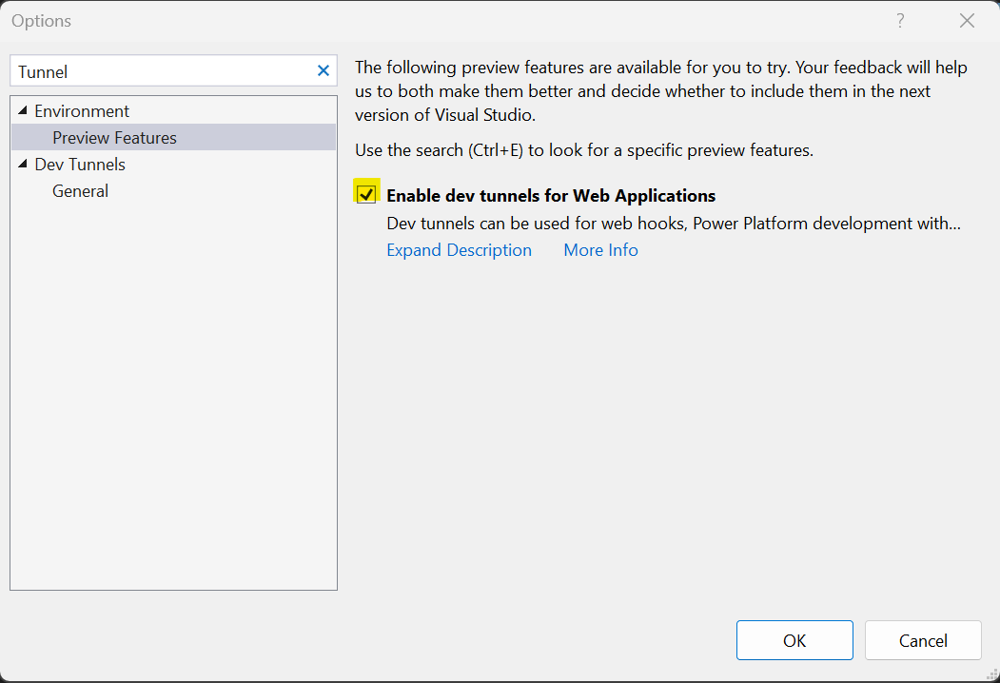
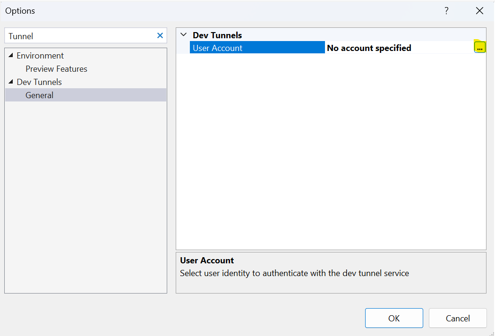

## Prerequisites
> Note: 
> This application is a web-based application built on .NET 6.

- Create an Azure account with an active subscription. For details, see [Create an account for free](https://azure.microsoft.com/free/)
- [Visual Studio (2022 v17.4.0 and above)](https://visualstudio.microsoft.com/vs/)
- [.NET6 Framework](https://dotnet.microsoft.com/download/dotnet/6.0) (Make sure to install version that corresponds with your visual studio instance, 32 vs 64 bit)
- Create an Azure Communication Services resource. For details, see [Create an Azure Communication Resource](../../quickstarts/create-communication-resource.md). You'll need to record your resource **connection string** for this sample.
- Get a phone number for your new Azure Communication Services resource. For details, see [Get a phone number](../../quickstarts/telephony/get-phone-number.md?tabs=windows&pivots=programming-language-csharp)
- Enable Visual studio dev tunneling for local development. For details, see [Enable dev tunnel](/connectors/custom-connectors/port-tunneling)
	- To enable dev tunneling, Click `Tools` -> `Options` in Visual Studio 2022
	- In the search bar type tunnel, Click the checkbox under `Environment` -> `Preview Features` called `Enable dev tunnels for Web Application`
	 
	- Login into your account under `Dev Tunnels` -> `General`
   
  
## Before running the sample for the first time 

1. Open an instance of PowerShell, Windows Terminal, Command Prompt or equivalent and navigate to the directory that you would like to clone the sample to.
2. git clone `https://github.com/Azure-Samples/Communication-Services-dotnet-quickstarts.git`.
3. Navigate to `CallAutomation_AppointmentReminder` folder and open `CallAutomation_AppointmentReminder.sln` file.

### Configuring application

Open the appsetting.json file to configure the following settings

1. `ConnectionString`: Azure Communication Service resource's connection string.
2. `SourcePhone`: Phone number associated with the Azure Communication Service resource. For example, "+1425XXXAAAA"
3. `TargetPhoneNumber`: Target phone number to add in the call. For example, "+1425XXXAAAA"
4. `AppBaseUri`: Base url of the app. (For local development replace the dev tunnel url)

### Run app locally

1. Run the `CallAutomation_AppointmentReminder` project in debug mode
2. Browser should pop up with swagger UI. If you're using Visual Studio dev tunnels note the app base url and update it in the appsetting.json file `(AppBaseUri)`
3. To initiate the call, from the swagger ui execute the `/api/call` endpoint or make an Http post request to `https://<AppBaseUri>/api/call`

### Publish the Call Automation Appointment Reminder to Azure WebApp

1. Right click the CallAutomation_AppointmentReminder project and select Publish
2. Create a new publish profile and select your app name, Azure subscription, resource group etc. (choose any unique name, as this URL needed for `AppBaseUri` configuration settings)
3. After publishing, add the following configurations on Azure portal (under app service's configuration section)
	1. `ConnectionString`: Azure Communication Service resource's connection string.
	2. `SourcePhone`: Phone number associated with the Azure Communication Service resource. For example, "+1425XXXAAAA"
	3. `TargetPhoneNumber`: Target phone number to add in the call. For example, "+1425XXXAAAA"
    4. `AppBaseUri`:  URI of the deployed app service.
4. Detailed instructions on publishing the app to Azure are available at [Publish a Web app](/visualstudio/deployment/quickstart-deploy-aspnet-web-app?view=vs-2019&tabs=azure&preserve-view=true)
