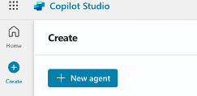
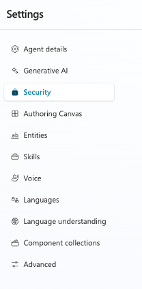
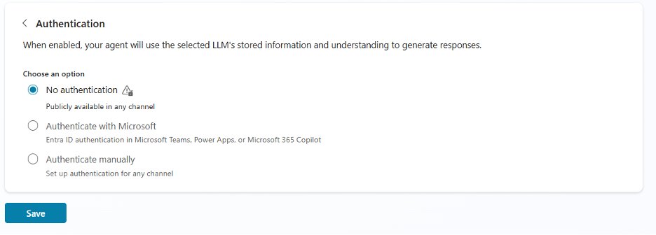

# Supercharge Your Voice Interactions: Integrating Azure Communication Services with Microsoft Copilot Studio Agents

This document provides step-by-step instructions on how to create and integrate a Copilot Studio agent with Azure Communication Services. This guide will allow you to create voice-enabled agents that your users can call into.

## Download the sample
Find the project for this sample on [GitHub](https://github.com/Azure-Samples/communication-services-dotnet-quickstarts/tree/main/CallAutomation_MCS_Sample). You can download this code and run it locally to try it for yourself. 

## Prerequisites
Before you begin, ensure you have:
- Azure account with an active subscription, for details see [Create an account for free](https://azure.microsoft.com/free/).
- Azure Communication Services resource, see [create a new Azure Communication Services resource](../quickstarts/create-communication-resource.md?tabs=windows&pivots=platform-azp). You need to record your resource **connection string** for this sample.
- Create a new web service application using Call automation SDK.
- An Azure AI Multiservice resource and a custom domain.
- [Connect Azure Communication Services and Azure AI](../concepts/call-automation/azure-communication-services-azure-cognitive-services-integration.md).
- A Copilot Studio License so that you can create and publish an agent.

## 1. Create your Agent in Copilot Studio
After logging in or signing up for Copilot Studio, you land on the Home page. Select **Create** in the left navigation.



On the Create page, select **New agent**.
Use the chat to describe your agent, using the provided questions for guidance.  
Once you provided all the requested information, click **Create**.


For more details on creating and customizing your agent, you can see the [Copilot Studio quickstart](/microsoft-copilot-studio/fundamentals-get-started).

## 2. Disable Authentication
Once you’ve created your agent, you need to make some updates so that you can integrate it with Azure Communication Service.

- Navigate to the **Settings** tab.


- Click on **Security** on the left pane.



- Select **Authentication**, select **No Authentication**, and click **Save**.



## 3. Get the Webchannel Security Key
Navigating back to the **Security** section select **Web Channel Security**. Copy and save this key somewhere. You need this when you’re deploying your application.

## 4. Publish Agent
Now that you’ve got your agents settings updated and saved your agent key, you can publish your agent.

## 5. Setting up Code
Now that you created your agent, make sure to download the [sample](https://github.com/Azure-Samples/communication-services-dotnet-quickstarts/tree/main/CallAutomation_MCS_Sample). After downloading the sample, you will need to update some of the properties. 

- Your connection string: You can get your Connection string from your Azure Communication Services resource.
- Microsoft Copilot Studio Direct Line key: Which you saved in step 3, your webchannel security key.
- Azure AI Services custom endpoint: You can get this endpoint from your Azure AI Services resource.
- You need to have a port running to receive event notifications from Azure Communication Services. You can use tools like [DevTunnels](/azure/developer/dev-tunnels/overview) to help set one up.

## 6. Overview of the Code 
There a few basic concepts you must be familiar with that the sample uses to build out this workflow.

### Incoming call
Register an [incoming call event](../concepts/call-automation/incoming-call-notification.md), so that your application knows when a call is coming in and needs to answer.

### Answer call with real-time transcription
When answering the call you also enable streaming of real-time transcription, which sends the Speech-to-Text converted content the caller is saying in near real-time.

``` csharp
app.MapPost("/api/incomingCall", async (
    [FromBody] EventGridEvent[] eventGridEvents,
    ILogger<Program> logger) =>
{
    foreach (var eventGridEvent in eventGridEvents)
    {
        logger.LogInformation($"Incoming Call event received : {JsonConvert.SerializeObject(eventGridEvent)}");
        // Handle system events
        if (eventGridEvent.TryGetSystemEventData(out object eventData))
        {
            // Handle the subscription validation event.
            if (eventData is SubscriptionValidationEventData subscriptionValidationEventData)
            {
                var responseData = new SubscriptionValidationResponse
                {
                    ValidationResponse = subscriptionValidationEventData.ValidationCode
                };
                return Results.Ok(responseData);
            }
        }
        var jsonObject = JsonNode.Parse(eventGridEvent.Data).AsObject();
        var incomingCallContext = (string)jsonObject["incomingCallContext"];
        var callbackUri = new Uri(baseUri + $"/api/calls/{Guid.NewGuid()}");
        
        var answerCallOptions = new AnswerCallOptions(incomingCallContext, callbackUri)
        {
            CallIntelligenceOptions = new CallIntelligenceOptions()
            {
                CognitiveServicesEndpoint = new Uri(cognitiveServicesEndpoint)
            },
            TranscriptionOptions = new TranscriptionOptions(new Uri($"wss://{baseWssUri}/ws"), "en-US", true, TranscriptionTransport.Websocket)
            {
                EnableIntermediateResults = true
            }
        };

        try
        {
            AnswerCallResult answerCallResult = await client.AnswerCallAsync(answerCallOptions);

            var correlationId = answerCallResult?.CallConnectionProperties.CorrelationId;
            logger.LogInformation($"Correlation Id: {correlationId}");

            if (correlationId != null)
            {
                CallStore[correlationId] = new CallContext()
                {
                    CorrelationId = correlationId
                };
            }
        }
        catch (Exception ex)
        {
            logger.LogError($"Answer call exception : {ex.StackTrace}");
        }
    }
    return Results.Ok();
});
```
### Establish a copilot connection
Once call is connected, the application needs to establish a connection to the AI agent you built using Direct Line APIs with websockets.

### Start conversation
``` csharp
var response = await httpClient.PostAsync("https://directline.botframework.com/v3/directline/conversations", null);
response.EnsureSuccessStatusCode();
var content = await response.Content.ReadAsStringAsync();
return JsonConvert.DeserializeObject(content);
```
### Listen to webscket
```csharp
await webSocket.ConnectAsync(new Uri(streamUrl), cancellationToken);

var buffer = new byte[4096]; // Set the buffer size to 4096 bytes
var messageBuilder = new StringBuilder();

while (webSocket.State == WebSocketState.Open && !cancellationToken.IsCancellationRequested)
{
    messageBuilder.Clear(); // Reset buffer for each new message
    WebSocketReceiveResult result;
    do
    {
        result = await webSocket.ReceiveAsync(new ArraySegment<byte>(buffer), cancellationToken);
        messageBuilder.Append(Encoding.UTF8.GetString(buffer, 0, result.Count));
    }
    while (!result.EndOfMessage); // Continue until we've received the full message
}
```

### Built in barge-in logic: 
The application uses intermediate results received from real-time transcription to detect barge-in from the caller and [cancels the play operation](../how-tos/call-automation/play-action.md).

``` csharp
if (data.Contains("Intermediate"))
{
    Console.WriteLine("\nCanceling prompt");
    if (callMedia != null)
    {
        await callMedia.CancelAllMediaOperationsAsync();
    }
}
```
- When the AI agent provides responses, the application uses [Play API](../how-tos/call-automation/play-action.md) to convert that text to audio the Text-to-Speech service.

```csharp
var ssmlPlaySource = new SsmlSource($"{message}");

var playOptions = new PlayToAllOptions(ssmlPlaySource)
{
    OperationContext = "Testing"
};

await callConnectionMedia.PlayToAllAsync(playOptions);
```
- Escalate call when caller asks for a representative: When the user asks to speak to a representative, the AI agent transfers the call to a human agent.

```csharp
if (botActivity.Type == "handoff")
{
    var transferOptions = new TransferToParticipantOptions(agentPhoneIdentity)
    {
        SourceCallerIdNumber = acsPhoneIdentity
    };

    await Task.Delay(6000);
    await callConnection.TransferCallToParticipantAsync(transferOptions);
}
``` 

## 7. Run
You should now be able to make a call and talk to your agent.

## Tips
### Topics
To optimize for voice, we would recommend you update topics where you’re using the "Message" type of Text to Speech, as it optimizes the agents responses for Speech scenarios.

### How to Handle System Topics
Your agent has System Topics built in by default. You can choose to disable these topics, but if you wish to continue using them, your application should build logic to handle these topics. Such as:
- **Escalate**: You need to build agent transfer into your application to escalate the call from this copilot agent to a human representative.

