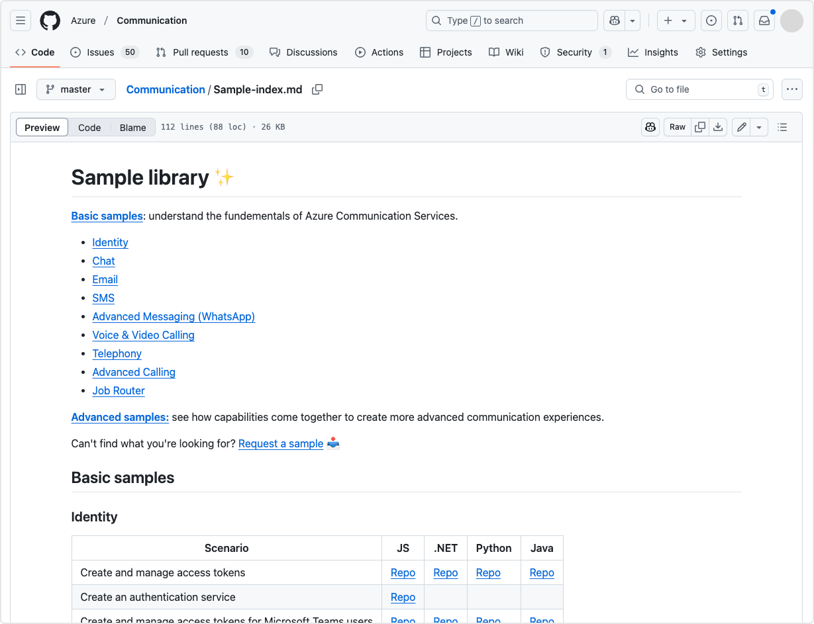

# Sample library

The Azure Communication Services [**sample library**](https://aka.ms/acssamples) (GitHub) includes basic and advanced code examples demonstrating common communication use cases. 

[**Basic samples**](https://github.com/Azure/Communication/blob/master/Sample-index.md#basic-samples): understand the fundamentals of Azure Communication Services.

[**Advanced samples**](https://github.com/Azure/Communication/blob/master/Sample-index.md#advanced-samples): see how capabilities come together to create more advanced communication experiences.

Have an idea for a helpful sample? [Request a sample 📥](https://feedback.azure.com/d365community/forum/81ff6d2b-0c25-ec11-b6e6-000d3a4f0858)
