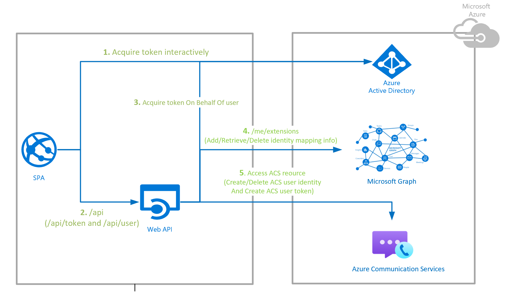

# Get started with the trusted authentication service hero sample

> [!IMPORTANT]
> This sample is available **on GitHub** for [node.JS](https://github.com/Azure-Samples/communication-services-authentication-hero-nodejs) and [C#](https://github.com/Azure-Samples/communication-services-authentication-hero-csharp).

## Overview

In order to properly implement a secure Azure Communication Services solutions, developers must start by putting in place the correct infrastructure to properly generate user and access token credentials for Azure Communication Services. Azure Communication Services is identity-agnostic, to learn more check out our [conceptual documentation](../concepts/identity-model.md).

This repository provides a sample of a server implementation of an authentication service for Azure Communication Services. It uses best practices to build a trusted backend service that issues Azure Communication Services credentials and maps them to Azure Active Directory identities. 

This sample can help you in the following scenarios:
1. As a developer, you need to enable an authentication flow for joining native Azure Communication Services and/or Teams Interop calling/chat which is done by mapping an Azure Communication Services identity to an Azure Active Directory identity and using this same Azure Communication Services identity for the user to fetch an Azure Communication Services token in every session.
2. As a developer, you need to enable an authentication flow for Custom Teams Endpoint which is done by using an M365 Azure Active Directory identity of a Teams' user to fetch an Azure Communication Services token to be able to join Teams calling/chat.

> [!NOTE]
>If you are looking to get started with Azure Communication Services, but are still in learning / prototyping phases, check out our [quickstarts for getting started with Azure communication services users and access tokens](../quickstarts/access-tokens.md?pivots=programming-language-csharp).

Since this sample only focuses on the server APIs, the client application is not part of it. If you want to add the client application to login user using Azure Active Directory, then please follow the MSAL samples [here](https://github.com/AzureAD/microsoft-authentication-library-for-js).

## Prerequisites

To be able to run this sample, you will need to:

- Register a Client and Server (Web API) applications in Azure Active Directory as part of [On Behalf Of workflow](https://docs.microsoft.com/azure/active-directory/develop/v2-oauth2-on-behalf-of-flow). Follow instructions on [registrations set up guideline](https://github.com/Azure-Samples/communication-services-authentication-hero-csharp/blob/main/docs/deployment-guides/set-up-app-registrations.md)
- Create an Azure Communication Services resource through [Azure Portal](../quickstarts/create-communication-resource.md?tabs=linux&pivots=platform-azp). Follow [Quickstart: Create and manage Communication Services resources](../quickstarts/create-communication-resource.md?tabs=windows&pivots=platform-azp) to create an ACS resource using Azure Portal.
- Update the Server (Web API) application with information from the app registrations.

::: zone pivot="programming-language-javascript"
[!INCLUDE [NodeJS Auth Hero](./includes/node-auth-hero.md)]
::: zone-end

::: zone pivot="programming-language-csharp"
[!INCLUDE [C# Auth hero](./includes/csharp-auth-hero.md)]
::: zone-end
