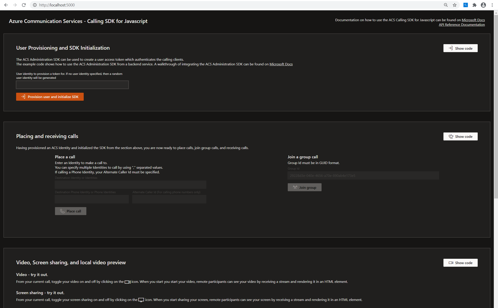
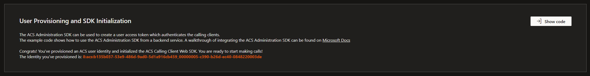
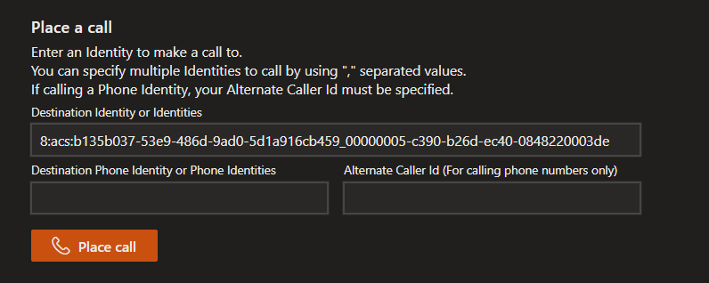
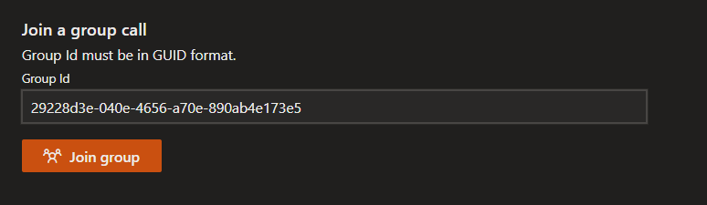

# Get started with the web calling sample

[!INCLUDE [Public Preview Notice](../includes/public-preview-include.md)]

> [!IMPORTANT]
> [This sample is available on Github.](https://github.com/Azure-Samples/communication-services-web-calling-tutorial/).

The Azure Communication Services **web calling sample** demonstrates how the Communication Services calling client library can be used to build a calling experience with JavaScript.

In this Sample quickstart, we'll learn how the sample works before we run the sample on your local machine. We'll then deploy the sample to Azure using your own Azure Communication Services resources.

## Overview

The web calling sample is a web application that serves as a step-by-step walkthrough of the various capabilities provided by the Communication Services web calling client library. 

This sample was built for developers and makes it very easy for you to get started with Communication Services. Its user interface is divided into multiple sections, each featuring a "Show code" button that allows you to copy code directly from your browser into your own Communication Services application.

When the [web calling sample](https://github.com/Azure-Samples/communication-services-web-calling-tutorial) is running on your machine, you'll see the following landing page:

## User provisioning and SDK initialization 

To begin using the demo, enter the connection string from your [Communication Services resource](../quickstarts/create-communication-resource.md) into `config.json`. This will be used to provision a [user access token](../concepts/authentication.md) so that your calling SDK can be initialized.

Enter your own personal identifier in the User Identity input. If nothing is provided here, then a random user identity will be generated. 

Click on the "Provisioning user and initialize SDK" to initialize your SDK using a token provisioned by the backend token provisioning service. This backend service is in `/project/webpack.config.js`.

Click on the "Show code" button to see the sample code that you can use in your own solution.

You should see the following once your SDK is initialized:

You're now ready to begin placing calls using your Communication Services resource!

## Placing and receiving calls

The Communication Services web calling SDK allows for **1:1**, **1:N**, and **group** calling.

For 1:1 or 1:N outgoing calls, you can specify multiple Communication Services User Identities to call using comma-separated values. You can can also specify traditional (PSTN) phone numbers to call using comma-separated values. 

When calling PSTN phone numbers, specify your alternate caller ID. Click on the "Place call" button to place an outgoing call:

To join a group call, enter the GUID that identifies the call and click on the "Join group" button:

Click on the "Show code" button to see the sample code for placing calls, receiving calls, and joining group calls.

An active call looks like this:

This sample also provides code snippets for the following capabilities:

  - Clicking on the video icon to turn your video camera on/off
  - Clicking on the microphone icon to turn your microphone on/off
  - Clicking on the play icon to hold/unhold the call
  - Clicking on the screen icon to start/stop share your screen
  - Clicking on person icon to add a participant to the call
  - Clicking on "Remove participant" in the participant roster to remove a specific participant from the call

## Next steps

>[!div class="nextstepaction"] 
>[Download the sample from GitHub](https://github.com/Azure-Samples/communication-services-web-calling-tutorial/)

For more information, see the following articles:

- Familiarize yourself with [using the calling client library](../quickstarts/voice-video-calling/calling-client-samples.md)
- Learn more about [how calling works](../concepts/voice-video-calling/about-call-types.md)
- Review the [API Reference docs](https://docs.microsoft.com/javascript/api/azure-communication-services/@azure/communication-calling/?view=azure-communication-services-js)

## Additional reading

- [Azure Communication GitHub](https://github.com/Azure/communication) - Find more examples and information on the official GitHub page
- [Redux](https://redux.js.org/) - Client-side state management
- [FluentUI](https://aka.ms/fluent-ui) - Microsoft powered UI library
- [React](https://reactjs.org/) - Library for building user interfaces
- [ASP.NET Core](https://docs.microsoft.com/aspnet/core/introduction-to-aspnet-core?view=aspnetcore-3.1&preserve-view=true) - Framework for building web applications
