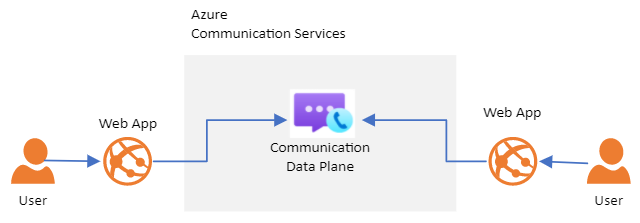
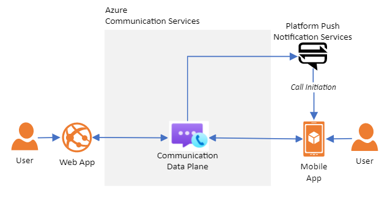
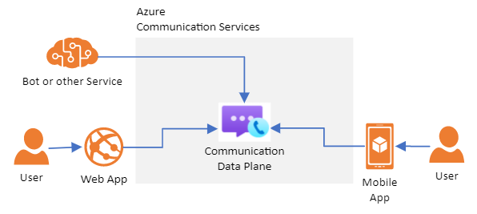

# Communication Services scenarios

[!INCLUDE [Public Preview Notice](./includes/public-preview-include.md)]

> [!WARNING]
> This document is under construction and needs the following items to be addressed:
> - We need consistent, clear graphics
> - The scenario and architecture presentations need to be simplified
> - Needs to be staged into the public preview branch

## Scenarios 

Azure Communication Services allows you to add real-time communications capabilities across a variety of scenarios.

### Browser-to-browser communication

The Communication Services JavaScript client libraries let you add rich text, voice, and video interactions to your web applications.

A typical Communication Services web application uses the Communication Services **User Management Service** to manage user accounts. This service allows you to create user access tokens that are then used by your endpoint devices to securely access your Communication Services resources.

#### Resources

- **Concept:** [Identity model](./concepts/identity-model.md)
- **Quickstart:** [User access tokens (UAT)](./quickstarts/user-access-tokens.md)
- **Quickstart:** [Implement browser voice chat](./quickstarts/voice-video-calling/getting-started-with-calling.md)
- **Concept:** [Calling client samples](./quickstarts/voice-video-calling/calling-client-samples.md)

### Native application communication

Azure Communication Services supports both browser-to-app and app-to-app communication. When building a native application experience, push notifications can be used to ensure that your users receive calls even when your application isn't running. Communication Services makes this easy with integrated push notifications to Google Firebase, Apple Push Notification Service and Windows Push Notifications.

#### Resources

- **Concept:** [Integrating push notifications](./concepts/telephony-sms/push-notifications-overview.md)

### Voice and SMS over the public switched telephony network (PSTN)

Communicating over the traditional telephone system can dramatically increase the reach of your application. To support PSTN voice and SMS scenarios, Communication Services lets you acquire phone numbers quickly across a variety of geographies directly from the Azure portal or using REST APIs and client libraries.

#### Resources

- **Quickstart:** [Search and acquire a phone number](./quickstarts/telephony-sms/get-phone-number.md)
- **Quickstart:** [Send an SMS message](./quickstarts/telephony-sms/send.md)
- **Quickstart:** [Place an outgoing telephone call](./quickstarts/voice-video-calling/add-pstn-calling.md)
- **Quickstart:** [Assigning a phone number to a bot](./tutorials/telephony-sms/assign-a-telephone-number-to-an-acs-bot.md)

### Networking 

You may want to exchange arbitrary data between users, for example to synchronize a shared mixed reality or gaming experience. There are two ways to achieve this with the Communication Services client libraries:

- **Calling client library** - Devices in a call can send and receive data over the call channel. This is the easiest way to add data transmission to an existing application.
- **STUN/TURN** - Communication Services makes standards-compliant STUN and TURN services available to you. This allows you to build a heavily customized transport layer on top of these technologies. You can author your own standards-compliant client or use open-source libraries such as [WinRTC](https://github.com/microsoft/winrtc) to achieve this.

### Automation and webhooks

You may want to configure automated workflows based on Communication Services activity. For example, you may want to send an email to an end-user when they miss a phone call. Communication Services generates Azure Event Grid events that you can use to support these scenarios. You can configure subscriptions to these events and use those subscriptions to fire customized webhooks and drive other automation capabilities.

- [Concept: React to Communication Services Events using Event Grid](./concepts/event-handling.md)

### Bot communications

Communication Services lets you integrate bots into your real-time communications solutions. For example, you can have a bot answer incoming phone calls, participate in SMS conversations, or chat with users from within your web app.

### Monitoring

Azure Communication Services is integrated with Azure Monitor. Azure Monitor can be used to inspect and visualize your application health, and allows you to access logging data through Azure Data Explorer. 

- [Concept: Azure Monitor Logs](./concepts/logging-diagnostics.md)

## Next Steps

- TODO