# Enable Push Notifications in your chat app

This tutorial will guide you to enable Push Notification in your IOS App by using Azure Communication Chat SDK.  
Push notifications alert clients of incoming messages in a chat thread in situations where the mobile app isn't running in the foreground. Azure Communication Services supports two versions of push notifications. 

- `Basic Version` : The user will be able to see a badge number of 1 on the app’s icon, receive a notification sound and see a pop-up alert banner. 
- `Advanced Version`: Except for the features supported in basic version, the Contoso will be able to customize the title & message preview section in alert banner. 

    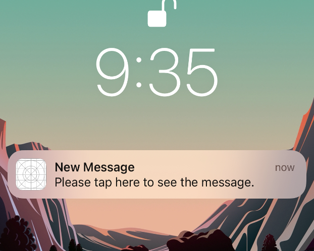  

    [Basic Version]

    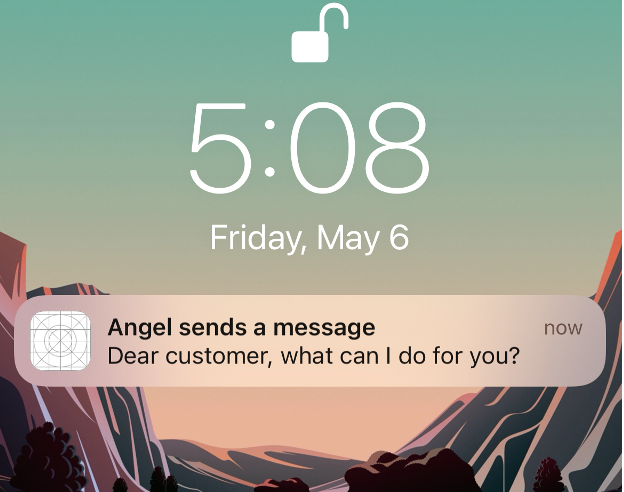 

    [Advanced Version]

## Download code

Access the sample code for this tutorial on [GitHub](https://github.com/Azure-Samples/communication-services-ios-quickstarts/tree/main/add-chat-push-notifications).

## Prerequisites

1. Finish all the prerequisite steps in [Chat Quickstart](../quickstarts/chat/get-started.md?pivots=programming-language-swift)

2. ANH Setup  
Create an Azure Notification Hub within the same subscription as your Communication Services resource and link the Notification Hub to your Communication Services resource. See [Notification Hub provisioning](../concepts/notifications.md#notification-hub-provisioning).

3. APNS Cert Configuration  
Here we recommend creating a .p12 APNS cert and set it in Notification Hub.  

   `If you are not a Microsoft internal client`, please follow step 1 to step 9.   
   `If you are a Microsoft internal client`, please submit a ticket [here](https://aka.ms/mapsupport) and provide the bundle ID of your app to get a .p12 cert. Once you get a valid certificate issued, please execute the step 9.       

* Step 1: Log in to the Apple Developer Portal. Navigate to `Certificates, IDs & Profiles > Identifiers > App IDs` and click the App ID associated with your app.

  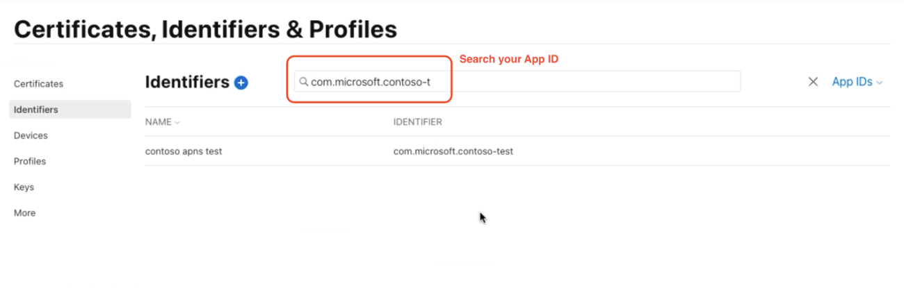  

* Step 2: On the screen for your App ID, check  `Capabilities > Push Notifications`. Click Save and respond “Confirm” to the Modify App Capabilities dialog box that appears. 

  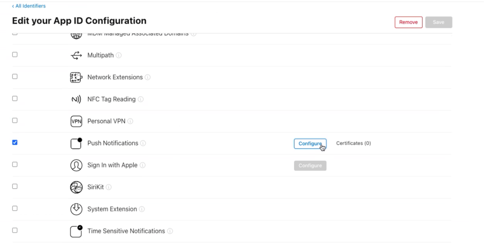  

  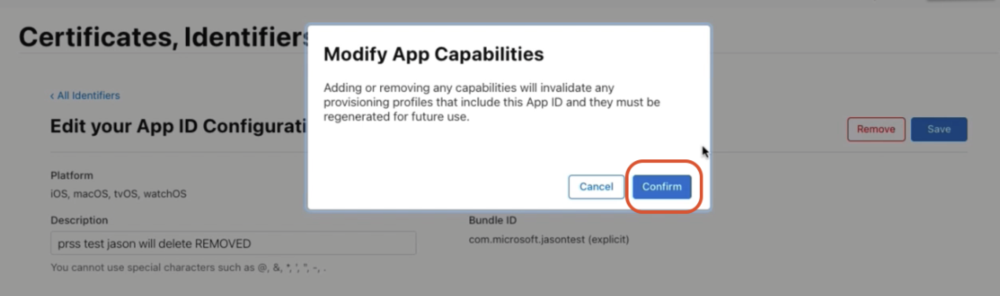  

* Step 3: In the same page, click `Capabilities > Push Notifications > Configure`. Click one of the following buttons:   
   * Development SSL Certificate > Create Certificate (for testing push notifications while developing an iOS app)  
   * Production SSL Certificate > Create Certificate (for sending push notifications in production)    

  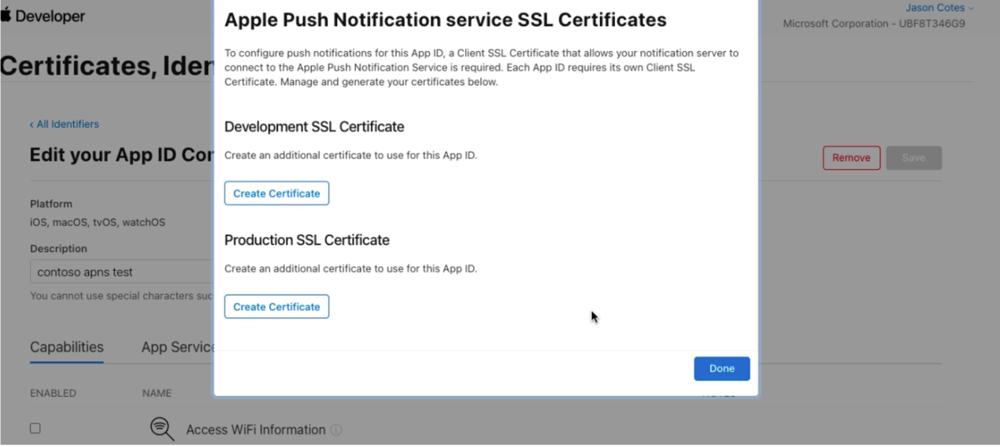 

* Step 4: Then you're navigated to the below page. Here, you'll upload a Certificate Signing Request (CSR). Follow the next step to create a CSR.

  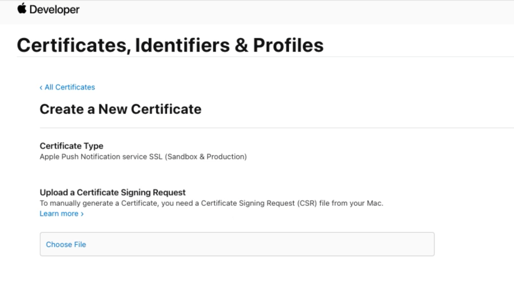 

* Step 5: In a new browser tab, follow this [help page](https://help.apple.com/developer-account/#/devbfa00fef7) to create a CSR and save the file as “App name.cer”.

  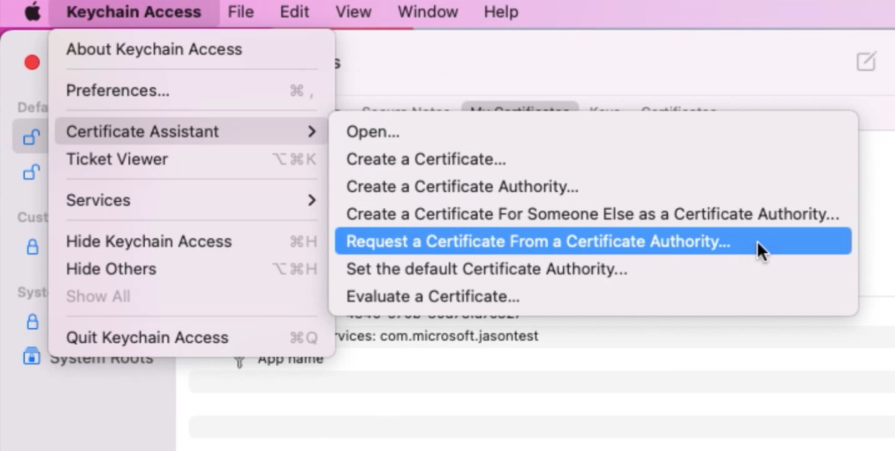 
  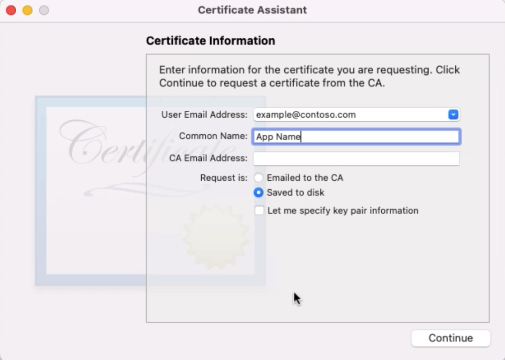 

* Step 6: Drag the .cer file to “Choose File” area. Then hit “continue” on the right top corner. 

  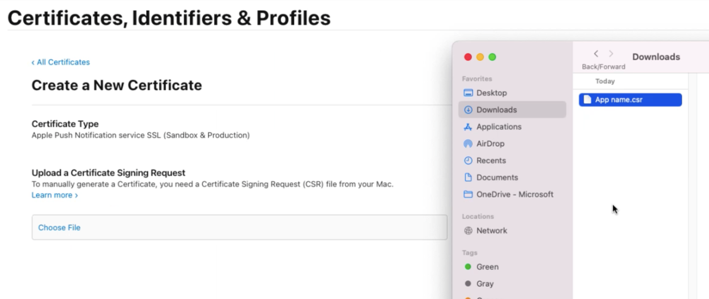 

* Step 7: Click “Download” and save the file to local disk.

  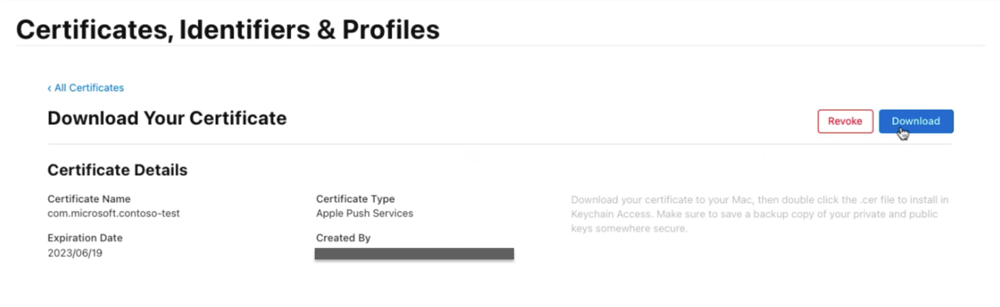 

* Step 8: Open the .cer file you downloaded; it will open Keychain Access. Select your certificate, right-click, and export your certificate in .p12 format. 

  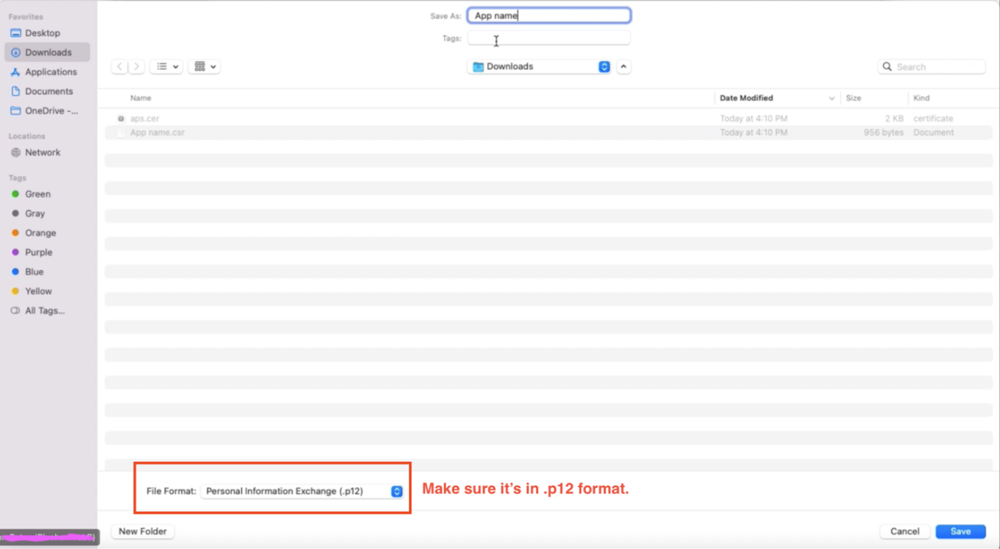 

* Step 9: Go to your notification hub, click “Apple (APNS)” under Settings and select “Certificate” under Authentication Mode. Also select the Application Mode based on your need. Then upload the .p12 file you just created. 

  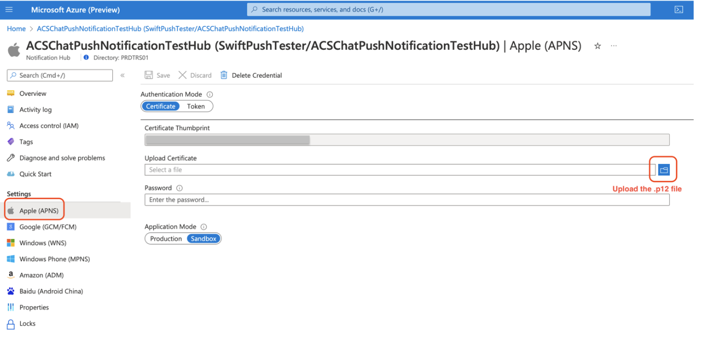 

4. XCode Configuration  
* In XCode, go to  `Signing & Capabilities`. Add a capability by selecting "+ Capability", and then select “Push Notifications”.  

* Add another capability by selecting “+ Capability”, and then select “Background Modes”. Also select “Remote Notifications” under Background Modes. 

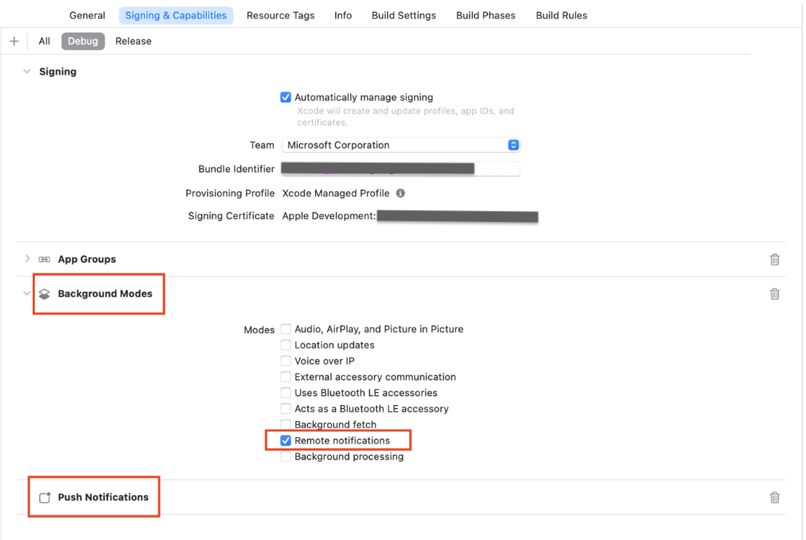  

## Implementation

### 1 - Basic Version
If you want to implement a basic version of Push Notification, you need to register for remote notifications with APNS (Apple Push Notification Service). Refer to [sample code](https://github.com/Azure-Samples/communication-services-ios-quickstarts/blob/main/add-chat-push-notifications/SwiftPushTest/AppDelegate.swift) to see the related implementation in `AppDelegate.swift`.  

### 2 - Advanced Version
If you want to implement an advanced version of Push Notification, you need to include the following items in your app. The reason is that we encrypt customer content (e.g. chat message content, sender display name, etc.) in push notification payload and it requires some workaround on your side.   

* Item 1: Data Storage for encryption keys  

First, you should create a persistent data storage in IOS device. This data storage should be able to share data between Main App and App Extensions (Refer to Item 2 for more information about App Extension – Notification Service Extension). 

In our sample code, we'll choose “App Group” as the data storage. Below are the suggested steps to create and use “App Group”:

Follow the steps in [Add a capability](https://developer.apple.com/documentation/xcode/adding-capabilities-to-your-app?changes=latest_minor#Add-a-capability) to add the Apps Groups capability to your app’s targets – both Main App and Notification Service Extension (Refer to Item 2 on how to create a Notification Service Extension). 

Also follow the steps in this [Apple official doc](https://developer.apple.com/documentation/xcode/configuring-app-groups?changes=latest_minor) to configure App Group. Make sure your Main App and App Extension have the same container name.  

* Item 2: Notification Service Extension 

Second, you should implement a “Notification Service Extension” bundled with main app. This is used for decrypting the push notification payload when receiving it. 

Go to this [Apple official doc](https://developer.apple.com/documentation/usernotifications/modifying_content_in_newly_delivered_notifications). Follow the step “Add a Service App Extension to your project” and “Implement Your Extension’s Handler Methods”. 

Notice that in the step “Implement Your Extension’s Handler Methods,” Apple provides the sample code to decrypt data and we'll follow the overall structure. However, since we use chat SDK for decryption, we need to replace the part starting from `“// Try to decode the encrypted message data.”` with our customized logic. Refer to the [sample code](https://github.com/Azure-Samples/communication-services-ios-quickstarts/blob/main/add-chat-push-notifications/SwiftPushTestNotificationExtension/NotificationService.swift) to see the related implementation in `NotificationService.swift`.

* Item 3: Implementation of PushNotificationKeyStorage Protocol

Third, `PushNotificationKeyStorage` is required for advanced version. As the SDK user, you could use the default `AppGroupPushNotificationKeyStorage` class provided by chat SDK. If you don’t use `App Group` as the key storage or would like to customize key storage methods, create your own class which conforms to PushNotificationKeyStorage protocol. 

For PushNotificationKeyStorage, it defines two methods: `onPersistKey(encryptionKey:expiryTime)` and `onRetrieveKeys() -> [String]`.  

The first method is used to persist the encryption key in the storage of user’s IOS device.  Chat SDK will set 45 minutes as the expiry time of the encryption key. If you want Push Notification to be effect for more than 45 minutes, you need to schedule to call `chatClient.startPushNotifications(deviceToken:)` on a comparatively frequent basis (eg. every 15 minutes) so a new encryption key could be registered before the old key expires.  

The second method is used to retrieve the valid keys previously stored. You have the flexibility to provide the customization based on the data storage (item 1) you choose. 

In protocol extension, chat SDK provides the implementation of `decryptPayload(notification:) -> PushNotificationEvent` method which you can take advantage of. Refer to the  [sample code](https://github.com/Azure-Samples/communication-services-ios-quickstarts/blob/main/add-chat-push-notifications/SwiftPushTestNotificationExtension/NotificationService.swift) to see the related implementation in  `NotificationService.swift`.

## Testing
1. Create a Chat Thread with User A and User B. 

2. Download the Sample App Repo and follow the above steps in the prerequisites and implementation section. 

3. Put User A’s <ACESS_TOEKN> and <ACS_RESOURCE_ENDPOINT> into `AppSettings.plist`. 

4. Set “Enable Bitcode” to “No” for two Pods targets – AzureCommunicationChat and Trouter. 

5. Plug the IOS device into your mac, run the program and click “allow” when asked to authorize push notification on device. 

6. As User B, send a chat message. You (User A) should be able to receive a push notification in your IOS device.