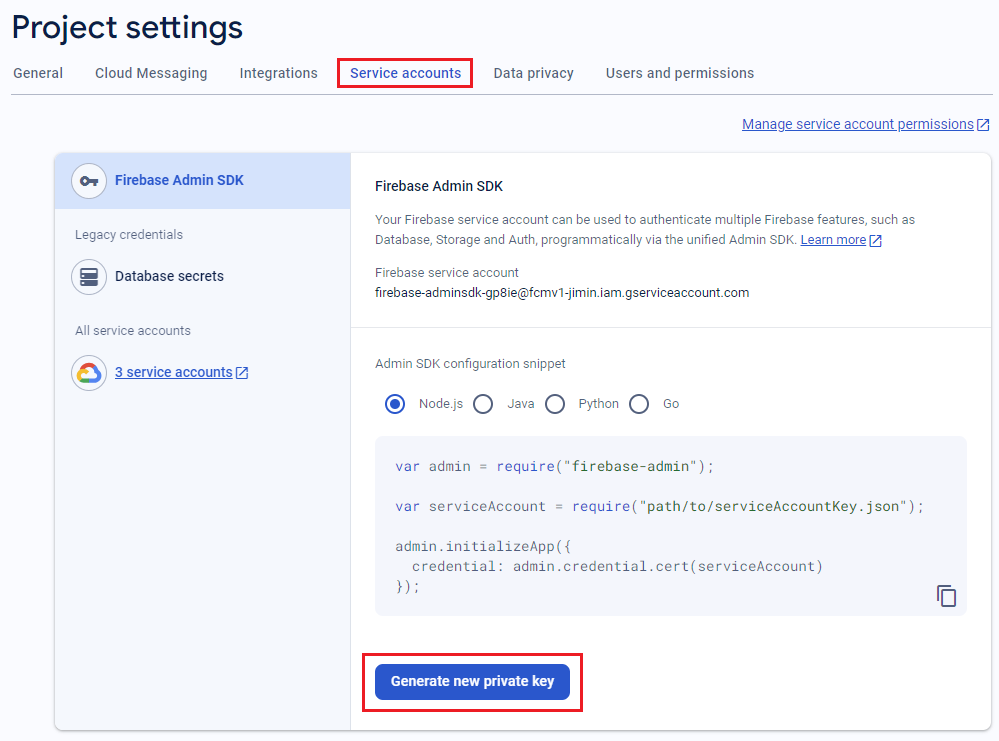
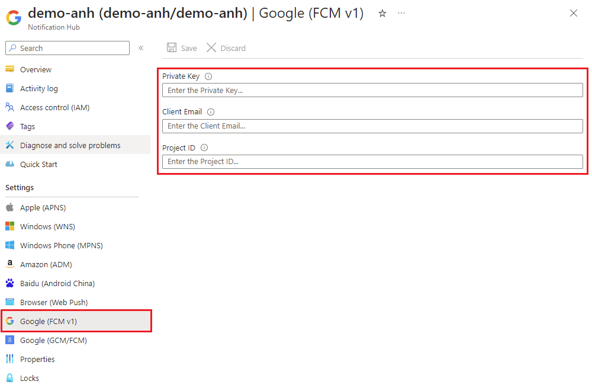
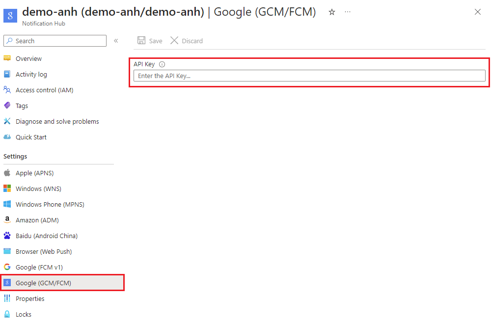

# Migrate Android SDK push notifications to Firebase Cloud Messaging HTTP v1 

This article applies to call and chat applications using Android SDK with Firebase Cloud Messaging (FCM) push notification. FCM was previously known as Google Cloud Messaging (GCM/FCM).

On June 20, 2023, Google announced that it [deprecated sending messages using the FCM legacy APIs](https://firebase.google.com/docs/cloud-messaging). Google is removing the legacy FCM from service in June 2024. Google recommends [migrating from legacy FCM APIs to FCM HTTP v1](https://firebase.google.com/docs/cloud-messaging/migrate-v1).

If you have a new Android application or never used Google FCM, see the [Register for Android SDK push notifications using FCM v1](./call-chat-register-android-push-fcm-v1.md) article.

If your Android application uses the push notification feature, complete the following steps to migrate your push notification to FCM HTTP v1.

## 1. Generate a private key in Firebase console

1. Open your project in [Firebase console](https://console.firebase.google.com/).

2. Open **Project settings** > **Service accounts**.

3. Select any programming language.

4. Click **Generate new private key** to download a JSON file containing your new private key.

    

5. Find and open the downloaded JSON file. You need values from this file for the next step.

## 2. Provide the private key credentials for Google (FCM v1)

1. Open your Azure Communication Services Notification Hub in the [Azure portal](https://portal.azure.com).

2. Open **Settings** > **Google (FCM v1)**.

3. Enter the values from your downloaded JSON file in the text boxes for **Private Key**, **Client Email**, and **Project ID**.
    
    

4. Click **Save**.

## 3. Remove legacy credentials for Google (GCM/FCM)

1. Open your Azure Communication Services Notification Hub in the [Azure portal](https://portal.azure.com).

2. Open **Settings** > **Google (GCM/FCM)**.

3. Clear the **API Key** text box.
    
    

4. Click **Save**.

## 4. Verify that your application receives push notifications

1. Wait a few minutes for the changes you made at the Notification Hub to take effect.
Your application might experience duplicate push notifications or missed notifications during this time.

2. Make sure your application receives push notifications without error.

## Troubleshooting

If your application can’t receive push notifications, make sure your new FCM v1 credentials are correct. Repeat the steps in this document as needed to [Generate a private key in Firebase console](#1-generate-a-private-key-in-firebase-console) or [Provide the private key credentials for Google (FCM v1)](#2-provide-the-private-key-credentials-for-google-fcm-v1).  

If  your application still can’t receive push notifications, contact Azure Communication Services at [Microsoft Azure Help+ support](https://ms.portal.azure.com/#view/Microsoft_Azure_Support/HelpAndSupportBlade/~/overview).

## Related articles

[Enable push notifications in your Android chat app](./chat-android-push-notification.md)
[Enable push notifications for calls](../how-tos/calling-sdk/push-notifications.md)
