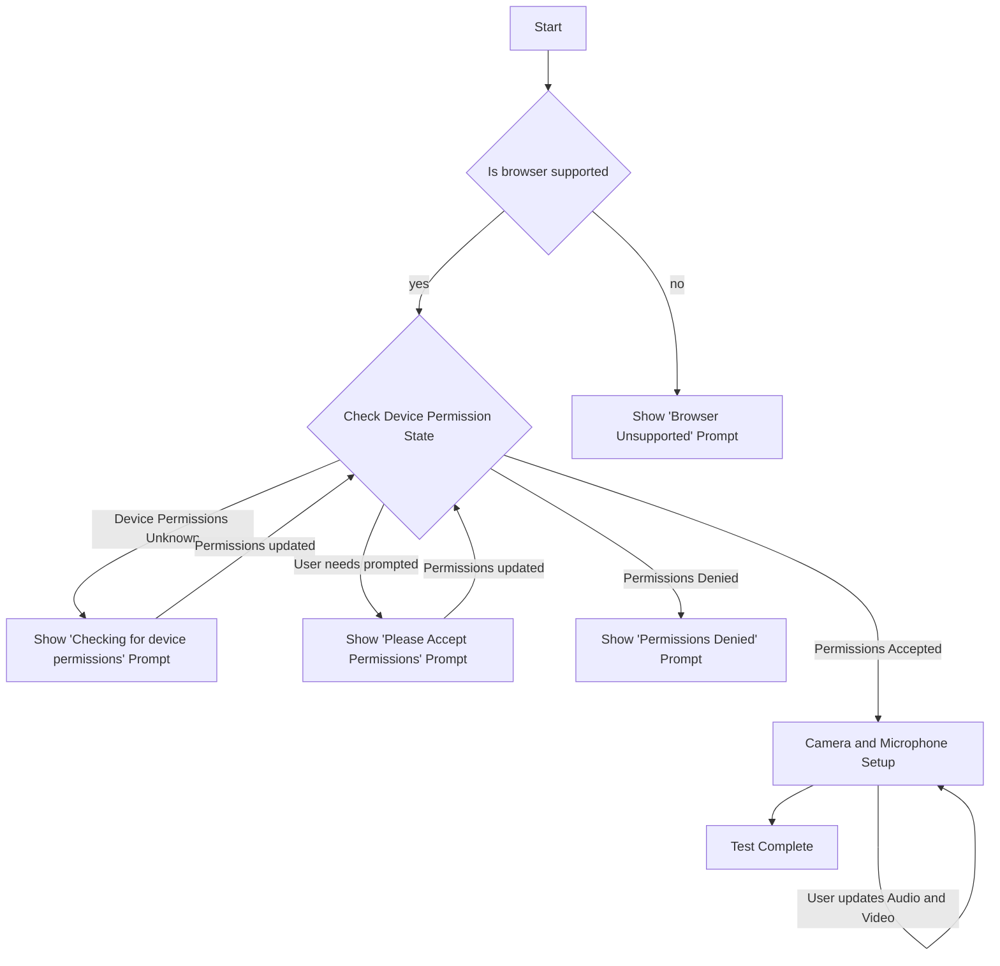
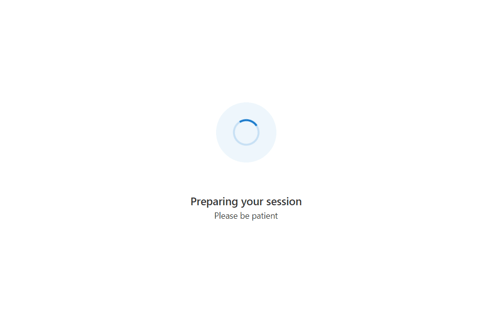
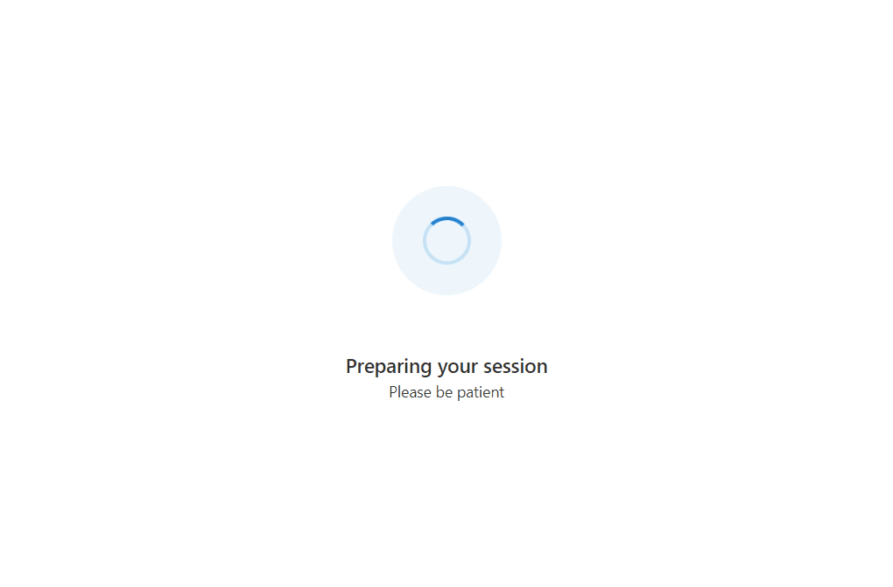

# Creating a Call Readiness Experience using Azure Communication Services

[!INCLUDE [Public Preview Notice](../includes/public-preview-include.md)]

In this tutorial, we'll be leveraging Azure Communication Services with the UI Library to create an experience that gets users ready to join a call. The UI Library provides a set of rich components and UI controls that can be leveraged to produce a Call Readiness experience, whilst the Azure Communication Calling JavaScript SDK provides a rich set of APIs to understand the user state.

## Download code

Access the full code for this tutorial on [GitHub](https://github.com/Azure-Samples/communication-services-javascript-quickstarts/tree/main/ui-library-call-readiness).

## Prerequisites

- [Visual Studio Code](https://code.visualstudio.com/) on one of the [supported platforms](https://code.visualstudio.com/docs/supporting/requirements#_platforms).
- [Node.js](https://nodejs.org/), Active LTS and Maintenance LTS versions (10.14.1 recommended). Use the `node --version` command to check your version.

## Overview

Users have several hurdles to cross when joining a call from browser support to selecting the correct camera.
This tutorial creates a _call readiness checker_ application that guides the user through browser support, camera and microphone permissions and finally device setup.

The diagram below shows the flow the call readiness checker performs:



The tutorial will be split into 4 parts:

1. Setting up the [React](https://reactjs.org/) App
2. Checking for [browser support](https://learn.microsoft.com/en-us/azure/communication-services/concepts/voice-video-calling/calling-sdk-features#javascript-calling-sdk-support-by-os-and-browser)
3. Requesting access to the camera and microphone
4. Letting the user choose their camera, microphone and speaker

## Part 1. Setting up the React App

We'll use the create-react-app template for this quickstart. For more information, see: [Get Started with React](https://reactjs.org/docs/create-a-new-react-app.html)

```bash
npx create-react-app ui-library-quickstart-composites --template typescript

cd ui-library-quickstart-composites
```

At the end of this process, you should have a full application inside of the folder `ui-library-quickstart-composites`.
For this quickstart, we'll be modifying files inside of the `src` folder.

### Install the Package

Use the `npm install` command to install the Azure Communication Services Calling SDK and UI Library for JavaScript.

```bash
npm install @azure/communication-calling@dev @azure/communication-react@dev
```

For this tutorial we will also use FluentUI for creating UI controls:

```bash
npm install @fluentui/react @fluentui/react-icons
```

### Setup App with FluentUI

Here we will replace the create-react-app default `App.tsx` content with a basic setup that registers the necessary icons we will use in this tutorial, as well as setting a theme provider that can be used to set a custom theme in the future:

`App.tsx`

```tsx
import { FluentThemeProvider, useTheme } from '@azure/communication-react';
import { initializeIcons, registerIcons, Stack, Text } from '@fluentui/react';
import {
  DEFAULT_COMPONENT_ICONS
} from '@azure/communication-react';
import { CheckmarkCircle48Filled } from '@fluentui/react-icons';

// Initializing and registering icons should only be done once per app.
initializeIcons();
registerIcons({ icons: DEFAULT_COMPONENT_ICONS });

/**
 * Entry point of a React app.
 */
const App = (): JSX.Element => {
  return (
    <FluentThemeProvider>
      <TestComplete />
    </FluentThemeProvider>
  );
}

/**
 * UI for this tutorial to display when the tests have complete.
 * Instead of this, in your calling application you would take
 * the user to the next page in your app.
 */
export const TestComplete = (): JSX.Element => {
  const theme = useTheme();
  return (
    <Stack verticalFill verticalAlign="center" horizontalAlign="center" tokens={{ childrenGap: '1rem' }}>
      <CheckmarkCircle48Filled primaryFill={theme.palette.green} />
      <Text variant='xLarge'>Test Complete</Text>
    </Stack>
  );
};

export default App;
```

You should see a green checkmark with a `Test Complete` message.

### Run Create React App

Let's test our setup by running:

```bash
npm start
```

## Part 2. Checking for Browser Support

To ensure the user gets the best experience we want to first make sure they are on a [supported browser](https://learn.microsoft.com/en-us/azure/communication-services/concepts/voice-video-calling/calling-sdk-features#javascript-calling-sdk-support-by-os-and-browser).
In this section we will create a page that displays "Preparing your session" whilst we perform a quick support check in the background on the user's browser.



### Preparing Your Session Page

Create a new file called `PreparingYourScreen.tsx` and use the code below to create a spinner to show to the user while we perform asynchronous checks in the background:

`PreparingYourScreen.tsx`

```tsx
import { useTheme } from '@azure/communication-react';
import { ISpinnerStyles, IStackStyles, ITextStyles, ITheme, Spinner, Stack, Text } from '@fluentui/react';

export const PreparingYourSession = (): JSX.Element => {
  const theme = useTheme();
  return (
    <Stack verticalFill verticalAlign="center" horizontalAlign="center" tokens={{ childrenGap: '3rem' }}>
      <Stack styles={spinnerContainerStyles(theme)}>
        <Spinner styles={spinnerStyles} />
      </Stack>
      <Stack horizontalAlign="center">
        <Stack.Item>
          <Text styles={headingStyles} variant="large">
            Preparing your session
          </Text>
        </Stack.Item>
        <Stack.Item>
          <Text variant="medium">Please be patient</Text>
        </Stack.Item>
      </Stack>
    </Stack>
  );
};

const headingStyles: ITextStyles = {
  root: {
    fontWeight: '600',
    lineHeight: '2rem'
  }
};

const spinnerStyles: ISpinnerStyles = {
  circle: {
    height: '2.75rem',
    width: '2.75rem',
    borderWidth: '0.2rem'
  }
};

const spinnerContainerStyles = (theme: ITheme): IStackStyles => ({
  root: {
    padding: '1.75rem',
    borderRadius: '50%',
    background: theme.palette?.themeLighterAlt
  }
});
```

We can then Hook up this Preparing your session screen into our App.
In the `App.tsx` and a variable `testState` to track the state of the app and while `testState` is in `runningPreCallChecks` state we will show the Preparing Your Session Screen:

`App.tsx`

```tsx
type TestingState = 'runningPreCallChecks' | 'finished';

const App = (): JSX.Element => {
  const [testState, setTestState] = useState<TestingState>('runningPreCallChecks');

  return (
    <FluentThemeProvider>
      {/* Show a Preparing your session screen while running the call readiness checks */}
      {testState === 'runningPreCallChecks' && (
        <>
          <PreparingYourSession />
        </>
      )}

      {/* After the device setup is complete, take the user to the call. For this sample we will just show a test complete page. */}
      {testState === 'finished' && <TestComplete />}
    </FluentThemeProvider>
  );
}
```

### Performing a background check

Here we will create a class for doing all our call readiness checks. First create a file called `callReadinessHelper.tsx`.
Inside this call we will add a method `checkBrowserSupport`. This class will use the [Calling Stateful Client](https://azure.github.io/communication-ui-library/?path=/docs/statefulclient-overview--page) to perform this check.
This same client can then be used to join a call once the checks have been completed.

`callReadinessHelper.tsx`

```ts
import { Features } from "@azure/communication-calling";
import { StatefulCallClient } from "@azure/communication-react";

/**
 * A helper class to perform call readiness related checks and behavior.
 */
export class CallReadinessHelper {
  private callClient: StatefulCallClient;

  /**
   * @param callClient use an existing callClient instance.
   */
  constructor(callClient: StatefulCallClient) {
    this.callClient = callClient;
  }

  /**
   * Use the callClient's getEnvironmentInfo() method to check if the browser is supported.
   */
  public checkBrowserSupport = async (): Promise<boolean> =>
    (await this.callClient.feature(Features.DebugInfo).getEnvironmentInfo()).isSupportedBrowser;
}
```

We can then create an instance of this class in the `App.tsx` to be passed around:

`App.tsx`

```tsx
// In a production application replace this with an Azure Communication Services User ID
const USER_ID = 'user1';
// Create an instance of the Calling Stateful Client
const statefulCallClient = createStatefulCallClient({
  userId: { communicationUserId: USER_ID }
});
// Create an instance of the CallReadinessHelper
const callReadinessHelper = new CallReadinessHelper(statefulCallClient);
```

### Informing the user they are on an unsupported browser

Next, we will create a prompt to tell the user they are using an unsupported browser. For this we will host the UI Library's `UnsupportedBrowser` component inside a [FluentUI Modal](https://developer.microsoft.com/en-us/fluentui#/controls/web/modal):
Create a new file called `UnsupportedBrowserPrompt.tsx` where we will create a unsupported browser prompt:

`UnsupportedBrowserPrompt.tsx`

```tsx
import { UnsupportedBrowser } from '@azure/communication-react';
import { Modal } from '@fluentui/react';

export const BrowserUnsupportedPrompt = (props: { isOpen: boolean }): JSX.Element => (
  <Modal isOpen={props.isOpen}>
    <UnsupportedBrowser
      onTroubleshootingClick={() => alert('This callback should be used to take the user to further troubleshooting')}
    />
  </Modal>
);
```

We can then show this prompt in a Pre-Call Check Component.
Create a file called `PreCallChecksComponent.tsx` that will contain the logic for showing this prompt:
This component will have a callback `onTestsSuccessful` that can take the user to the next page in the App.

`PreCallChecksComponent.tsx`

```tsx
import { useEffect, useState } from 'react';
import { BrowserUnsupportedPrompt } from './UnsupportedBrowserPrompt';
import { CallReadinessHelper } from './CallReadinessHelper';

type PreCallChecksState = 'runningChecks' | 'browserUnsupported';

/**
 * This component is a demo of how to use the CallReadinessHelper with CallReadiness Components to get a user
 * ready to join a call.
 */
export const PreCallChecksComponent = (props: {
  callReadinessHelper: CallReadinessHelper,
  /**
   * Callback triggered when the tests are complete and successful
   */
  onTestsSuccessful: () => void
}): JSX.Element => {
  const { callReadinessHelper } = props;
  const [currentCheckState, setCurrentCheckState] = useState<PreCallChecksState>('runningChecks');

  // Run call readiness checks when component mounts
  useEffect(() => {
    const runCallReadinessChecks = async (): Promise<void> => {

      // First we'll begin with a browser support check.
      const browserSupport = await callReadinessHelper.checkBrowserSupport();
      if (!browserSupport) {
        setCurrentCheckState('browserUnsupported');
        // If browser support fails, we'll stop here and display a modal to the user.
        return;
      }

      props.onTestsSuccessful();
    };

    runCallReadinessChecks();
  // eslint-disable-next-line react-hooks/exhaustive-deps
  }, []);

  return (
    <>
      {/* We show this when the browser is unsupported */}
      <BrowserUnsupportedPrompt isOpen={currentCheckState === 'browserUnsupported'} />
    </>
  );
}
```

We can then add this to the `App.tsx` and move the user to the _Test Complete_ stage once the test is successful using the `onTestsSuccessful` callback:

`App.tsx`

```tsx
...

import { PreCallChecksComponent } from './call-readiness/PreCallChecksComponent';

...

const App = (): JSX.Element => {
  const [testState, setTestState] = useState<TestingState>('runningPreCallChecks');

  return (
    <FluentThemeProvider>
      {/* Show a Preparing your session screen while running the call readiness checks */}
      {testState === 'runningPreCallChecks' && (
        <>
          <PreparingYourSession />
          <PreCallChecksComponent
            callReadinessHelper={callReadinessHelper}
            onTestsSuccessful={() => setTestState('finished')}
          />
        </>
      )}

      {/* After the device setup is complete, take the user to the call. For this sample we will just show a test complete page. */}
      {testState === 'finished' && <TestComplete />}
    </FluentThemeProvider>
  );
}

export default App;
```

You can now run the app, if you are in an unsupported browser you will see the prompt:

Gif:




## Part 3. Requesting access to the camera and microphone

For calling applications it is often vital a user has given permission to use the microphone and camera.
This is especially true for applications that require the user to be seen by others.
In this section we will create a series of components that will encourage the user to grant access to the camera and microphone
and display a prompt to the user if access is not granted.

### Creating prompts for camera and microphone access

we will first create a series of device permissions prompts to get users into a state where they have accepted the microphone and camera permissions. These will use the `CameraAndMicrophoneDomainPermissions` component
from the UI Library. Like the Unsupported Browser prompt, we will also host these inside a FluentUI `modal`.

`DevicePermissionPrompts.tsx`

```tsx
import { CameraAndMicrophoneDomainPermissions } from '@azure/communication-react';
import { Modal } from '@fluentui/react';

export const AcceptDevicePermissionRequestPrompt = (props: { isOpen: boolean }): JSX.Element => (
  <PermissionsModal isOpen={props.isOpen} type="request" />
);

export const CheckingDeviceAccessPrompt = (props: { isOpen: boolean }): JSX.Element => (
  <PermissionsModal isOpen={props.isOpen} type="check" />
)

export const PermissionsDeniedPrompt = (props: { isOpen: boolean }): JSX.Element => (
  <PermissionsModal isOpen={props.isOpen} type="denied" />
);

const PermissionsModal = (props: { isOpen: boolean, type: "denied" | "request" | "check" }): JSX.Element => (
  <Modal isOpen={props.isOpen}>
    <CameraAndMicrophoneDomainPermissions
      appName={'this site'}
      type={props.type}
      onTroubleshootingClick={() => alert('This callback should be used to take the user to further troubleshooting')}
    />
  </Modal>
);
```

### Checking for camera and microphone access

Here we will add two checks to the call readiness helper: `checkDevicePermissionsState` and `requestCameraAndMicrophonePermissions`.

`CallReadinessChecker.ts`

```ts
import { DeviceAccess } from "@azure/communication-calling";

...

export class CallReadinessChecker {

  ...

  /**
   * Check if the user needs to be prompted for camera and microphone permissions.
   * 
   * @remarks
   * The Permissions API we are using is not supported in Firefox, Android WebView or Safari < 16.
   * In those cases this will return 'unknown'.
   */
  public checkDevicePermissionsState = async (): Promise<{camera: PermissionState, microphone: PermissionState} | 'unknown'> => {
    try {
      const [micPermissions, cameraPermissions] = await Promise.all([
        navigator.permissions.query({ name: "microphone" } as any),
        navigator.permissions.query({ name: "camera" } as any)
      ]);
      return { camera: cameraPermissions.state, microphone: micPermissions.state };
    } catch (e) {
      console.info("Permissions API unsupported", e);
      return 'unknown';
    }
  }

  /**
   * Use the DeviceManager to request for permissions to access the camera and microphone.
   */
  public requestCameraAndMicrophonePermissions = async (): Promise<DeviceAccess> =>
    await (await this.callClient.getDeviceManager()).askDevicePermission({ audio: true, video: true });
}
```

### Prompting the user to grant access to the camera and microphone

Now we have the prompts and check and request logic, we will update the `PreCallChecksComponent` to prompt the user regarding device permissions.
In this component we will display different prompts to the user based on the device permission state:

- If the device permission state is unknown we will display a prompt to the user informing them we are checking for device permissions.
- If we are requesting permissions we will display a prompt to the user encouraging them to accept the permissions request.
- If the permissions are denied we will display a prompt to the user informing them that they have denied permissions and that they will need to grant permissions to continue.

`CallReadinessCheckComponent`

```tsx
import { useEffect, useState } from 'react';
import { BrowserUnsupportedPrompt } from './UnsupportedBrowserPrompt';
import { CheckingDeviceAccessPrompt, PermissionsDeniedPrompt, AcceptDevicePermissionRequestPrompt } from './DevicePermissionPrompts';
import { CallReadinessChecker } from './CallReadinessChecker';

type CallReadinessChecksState = 'runningChecks' |
  'browserUnsupported' |
  'checkingDeviceAccess' |
  'promptingForDeviceAccess' |
  'deniedDeviceAccess' |
  'finished';

/**
 * This component is a demo of how to use the CallReadinessChecker with CallReadiness Components to get a user
 * ready to join a call.
 * This component checks the browser support and if camera and microphone permissions have been granted.
 */
export const CallReadinessChecks = (props: {
  /**
   * Callback triggered when the tests are complete and successful
   */
  onTestsSuccessful: () => void
}): JSX.Element => {
  const [currentCheckState, setCurrentCheckState] = useState<CallReadinessChecksState>('runningChecks');

  // Run call readiness checks when component mounts
  useEffect(() => {
    const runCallReadinessChecks = async (): Promise<void> => {
      const callReadinessChecker = new CallReadinessChecker();

      // First we'll begin with a browser support check.
      const browserSupport = await callReadinessChecker.checkBrowserSupport();
      if (!browserSupport) {
        setCurrentCheckState('browserUnsupported');
        // If browser support fails, we'll stop here and display a modal to the user.
        return;
      }

      // Next we will check if we need to prompt the user for camera and microphone permissions.
      // The prompt check only works if the browser supports the PermissionAPI for querying camera and microphone.
      // In the event that is not supported, we show a more generic prompt to the user.
      const devicePermissionState = await callReadinessChecker.checkDevicePermissionsState();
      if (devicePermissionState === 'unknown') {
        // We don't know if we need to request camera and microphone permissions, so we'll show a generic prompt.
        setCurrentCheckState('checkingDeviceAccess');
      } else if (devicePermissionState.camera === 'prompt' || devicePermissionState.microphone === 'prompt') {
        // We know we need to request camera and microphone permissions, so we'll show the prompt.
        setCurrentCheckState('promptingForDeviceAccess');
      }

      // Now the user has an appropriate prompt, we can request camera and microphone permissions.
      const devicePermissionsState = await callReadinessChecker.requestCameraAndMicrophonePermissions();

      if (!devicePermissionsState.audio || !devicePermissionsState.video) {
        // If the user denied camera and microphone permissions, we prompt the user to take corrective action.
        setCurrentCheckState('deniedDeviceAccess');
      } else {
        setCurrentCheckState('finished');
        // Test finished successfully, trigger callback to parent component to take user to the next stage of the app.
        props.onTestsSuccessful();
      }
    };

    runCallReadinessChecks();
  // eslint-disable-next-line react-hooks/exhaustive-deps
  }, []);

  return (
    <>
      {/* We show this when the browser is unsupported */}
      <BrowserUnsupportedPrompt isOpen={currentCheckState === 'browserUnsupported'} />

      {/* We show this when we are prompting the user to accept device permissions */}
      <AcceptDevicePermissionRequestPrompt isOpen={currentCheckState === 'promptingForDeviceAccess'} />

      {/* We show this when the PermissionsAPI is not supported and we are checking what permissions the user has granted or denied */}
      <CheckingDeviceAccessPrompt isOpen={currentCheckState === 'checkingDeviceAccess'} />

      {/* We show this when the user has failed to grant camera and microphone access */}
      <PermissionsDeniedPrompt isOpen={currentCheckState === 'deniedDeviceAccess'} />
    </>
  );
}
```

The app will now present the user with prompts to guide them through device access:


## Part 4. Letting the user choose their camera, microphone and speaker

Now the user is on a supported browser, and they have given us permission to access their camera and microphone,
we can make sure they have chosen which device they want to use for their call.
We want to present the user with a rich interface to choose their camera, microphone and speaker. Our final device setup UI will look like this:


### Creating a Configuration Screen

First we will create a new file called `DeviceSetup.tsx` and add some simple setup code, with a callback that will return the users chosen devices back to the App:

`DeviceSetup.tsx`

```tsx
import { PrimaryButton, Stack } from '@fluentui/react';
import { CallReadinessHelper } from './CallReadinessHelper';

export const DeviceSetup = (props: {
  /** Callback to let the parent component know what the chosen user device settings were */
  onDeviceSetupComplete: (userChosenDeviceState: { cameraOn: boolean; microphoneOn: boolean }) => void
  callReadinessHelper: CallReadinessHelper;
}): JSX.Element => {
  return (
    <Stack tokens={{ childrenGap: '1rem' }} verticalAlign="center" verticalFill>
      <PrimaryButton text="Continue" onClick={() => props.onDeviceSetupComplete({ cameraOn: false, microphoneOn: false })} />
    </Stack>
  );
}
```

We can then add this to App. Update the App to have a new testing state `deviceSetup`:

- When the PreCallChecksComponent completes it will now forward the user to the `deviceSetup` state.
- When the user is in the `deviceSetup` state, we will render the `DeviceSetup` component.
- When the device setup is complete, we will forward the user to the `finished` state. In a production App this is typically when you would move the user to a call screen.

`App.tsx`

```tsx
...

import { DeviceSetup } from './DeviceSetup';

...

type TestingState = 'runningPreCallChecks' | 'deviceSetup' | 'finished';

const App = (): JSX.Element => {
  const [testState, setTestState] = useState<TestingState>('runningPreCallChecks');

  return (
    <FluentThemeProvider>
      {/* Show a Preparing your session screen while running the call readiness checks */}
      {testState === 'runningPreCallChecks' && (
        <>
          <PreparingYourSession />
          <PreCallChecksComponent
            callReadinessHelper={callReadinessHelper}
            onTestsSuccessful={() => setTestState('deviceSetup')}
          />
        </>
      )}

      {/* After the initial checks are complete, take the user to a device setup page call readiness checks are finished */}
      {testState === 'deviceSetup' && (
        <DeviceSetup
          callReadinessHelper={callReadinessHelper}
          onDeviceSetupComplete={(userChosenDeviceState) => {
            setTestState('finished');
          }}
        />
      )}

      {/* After the device setup is complete, take the user to the call. For this sample we will just show a test complete page. */}
      {testState === 'finished' && <TestComplete />}
    </FluentThemeProvider>
  );
}

export default App;

```

#### Creating dropdowns to choose devices

To allow the user to choose their camera, microphone and speaker, we will use the `Dropdown` component from Fluent UI React.
We will create a new components that will take a list of devices and a callback to let the parent component know when the user has chosen a device.
To house these new components we will create a file called `DeviceSelectionComponent.tsx` that will export 3 new components: `CameraSelectionDropdown`, `MicrophoneSelectionDropdown` and `SpeakerSelectionDropdown`.

`DeviceSelectionComponent.tsx`

```tsx
import { AudioDeviceInfo, VideoDeviceInfo } from '@azure/communication-calling';
import { Dropdown } from '@fluentui/react';
import { useEffect, useState } from 'react';

export const CameraSelectionDropdown = (props: {
  cameras: VideoDeviceInfo[],
  onSelectionChange: (camera: VideoDeviceInfo) => void
}): JSX.Element => {
  return (
    <DeviceSelectionDropdown
      placeholder={props.cameras.length === 0 ? 'No cameras found' : 'Select a camera'}
      label={'Camera'}
      devices={props.cameras}
      onSelectionChange={(selectedDeviceId) =>
        props.onSelectionChange(props.cameras.find((camera) => camera.id === selectedDeviceId)!)
      }
    />
  );
};

export const MicrophoneSelectionDropdown = (props: {
  microphones: AudioDeviceInfo[],
  onSelectionChange: (microphone: AudioDeviceInfo) => void
}): JSX.Element => {
  return (
    <DeviceSelectionDropdown
      placeholder={props.microphones.length === 0 ? 'No microphones found' : 'Select a microphone'}
      label={'Microphone'}
      devices={props.microphones}
      onSelectionChange={(selectedDeviceId) =>
        props.onSelectionChange(props.microphones.find((microphone) => microphone.id === selectedDeviceId)!)
      }
    />
  );
};

export const SpeakerSelectionDropdown = (props: {
  speakers: AudioDeviceInfo[],
  onSelectionChange: (speaker: AudioDeviceInfo) => void
}): JSX.Element => {
  return (
    <DeviceSelectionDropdown
      placeholder={props.speakers.length === 0 ? 'No speakers found' : 'Select a speaker'}
      label={'Speaker'}
      devices={props.speakers}
      onSelectionChange={(selectedDeviceId) =>
        props.onSelectionChange(props.speakers.find((speaker) => speaker.id === selectedDeviceId)!)
      }
    />
  );
};

export const DeviceSelectionDropdown = (props: {
  placeholder: string,
  label: string,
  devices: { id: string, name: string }[],
  onSelectionChange: (deviceId: string) => void
}): JSX.Element => {
  const [selectedDeviceId, setSelectedDeviceId] = useState<string>();

  // Improve the user selection by preselecting a device.
  // When the devices are populated, select the first one as the default selected device.
  useEffect(() => {
    if (!selectedDeviceId && props.devices.length > 0) {
      const selectedDeviceId = props.devices[0].id;
      setSelectedDeviceId(selectedDeviceId);
      props.onSelectionChange(selectedDeviceId);
    }
  }, [props, selectedDeviceId]);

  return (
    <Dropdown
      placeholder={props.placeholder}
      label={props.label}
      onChange={(_, option) => {
        if (option) {
          setSelectedDeviceId(option.key as string);
          props.onSelectionChange?.(option.key as string)
        }
      }}
      options={props.devices.map((device) => ({ key: device.id, text: device.name }))}
      selectedKey={selectedDeviceId}
    />
  );
};
```

TODO: USE CALL READINESS HELPER TO POPULATE DEVICES AND UPDATE BASED ON SELECTION

TODO: Add screenshot of dropdowns

#### Creating a local video preview

Beside the dropdowns, we will create a local video preview to allow the user to see what their camera is capturing. It will also allow the user to turn their microphone on and off.
We will create a new component called `LocalPreview.tsx` that will take a `VideoDeviceInfo` and render a `VideoStreamRenderer` with the video stream from that device.

`LocalPreview.tsx`

```tsx
import { VideoDeviceInfo } from '@azure/communication-calling';
import {
  StreamMedia,
  VideoTile,
  ControlBar,
  CameraButton,
  useTheme,
  MicrophoneButton,
  VideoStreamRendererViewState
} from '@azure/communication-react';
import { Stack, mergeStyles, Text, ITheme } from '@fluentui/react';
import { VideoOff20Filled } from '@fluentui/react-icons';
import { useEffect, useState } from 'react';
import { CallReadinessHelper } from './CallReadinessHelper';

export const LocalPreview = (props: {
  callReadinessHelper: CallReadinessHelper,
  cameraOn: boolean,
  microphoneOn: boolean,
  cameraToggled: (isCameraOn: boolean) => void,
  microphoneToggled: (isMicrophoneOn: boolean) => void
}): JSX.Element => {
  const { callReadinessHelper, cameraOn, microphoneOn, cameraToggled, microphoneToggled } = props;
  const canTurnOnCamera = callReadinessHelper.getCameras().length > 0;

  const [localPreviewView, setLocalPreviewView] = useState<VideoStreamRendererViewState | undefined>();
  useEffect(() => {
    const changeCameraSource = async (newSource: VideoDeviceInfo | undefined): Promise<void> => {
      if (newSource) {
        callReadinessHelper.stopAllLocalPreviews();
        const newLocalPreview = await callReadinessHelper.startLocalPreview();
        setLocalPreviewView(newLocalPreview);
      }
    }

    const startVideo = async () => {
      const localPreviewResult = await callReadinessHelper.startLocalPreview();
      setLocalPreviewView(localPreviewResult);
      callReadinessHelper.onCameraSelectionChanged(changeCameraSource);
    }
    const stopVideo = () => {
      callReadinessHelper.offCameraSelectionChanged(changeCameraSource);
      callReadinessHelper.stopAllLocalPreviews();
      setLocalPreviewView(undefined);
    }
    
    if (!localPreviewView && cameraOn && canTurnOnCamera) {
      startVideo();
    } else if (!cameraOn) {
      stopVideo();
    }
  }, [canTurnOnCamera, cameraOn, localPreviewView, callReadinessHelper]);

  const theme = useTheme();
  const shouldShowLocalVideo = canTurnOnCamera && cameraOn && localPreviewView;
  return (
    <Stack verticalFill verticalAlign="center">
      <Stack className={localPreviewContainerMergedStyles(theme)}>
        <VideoTile
          renderElement={shouldShowLocalVideo ? <StreamMedia videoStreamElement={localPreviewView.target} /> : undefined}
          onRenderPlaceholder={() => <CameraOffPlaceholder />}
        >
          <ControlBar layout="floatingBottom">
            <CameraButton
              checked={cameraOn}
              onClick={() => {
                cameraToggled(!cameraOn)
              }}
            />
            <MicrophoneButton
              checked={microphoneOn}
              onClick={() => {
                microphoneToggled(!microphoneOn)
              }}
            />
          </ControlBar>
        </VideoTile>
      </Stack>
    </Stack>
  );
};

const CameraOffPlaceholder = (): JSX.Element => {
  const theme = useTheme();
  return (
    <Stack style={{ width: '100%', height: '100%' }} verticalAlign="center">
      <Stack.Item align="center">
        <VideoOff20Filled primaryFill="currentColor" />
      </Stack.Item>
      <Stack.Item align="center">
        <Text className={cameraOffLabelMergedStyles(theme)}>Your camera is turned off</Text>
      </Stack.Item>
    </Stack>
  );
};

const localPreviewContainerMergedStyles = (theme: ITheme): string =>
  mergeStyles({
    minWidth: '25rem',
    maxHeight: '18.75rem',
    minHeight: '16.875rem',
    margin: '0 auto',
    background: theme.palette.neutralLighter,
    color: theme.palette.neutralTertiary
  });

const cameraOffLabelMergedStyles = (theme: ITheme): string =>
  mergeStyles({
    fontFamily: 'Segoe UI Regular',
    fontSize: '0.625rem', // 10px
    color: theme.palette.neutralTertiary
  });
```

TODO: USE CALL READINESS HELPER TO POPULATE DEVICES AND UPDATE BASED ON SELECTION

TODO: ADD GIF OF LOCAL PREVIEW

### Running the experience

Now you have created the device configuration screen, you can run the app and see the experience:


## Next steps

> [!div class="nextstepaction"]
> [Check the rest of the UI Library](https://azure.github.io/communication-ui-library/)
