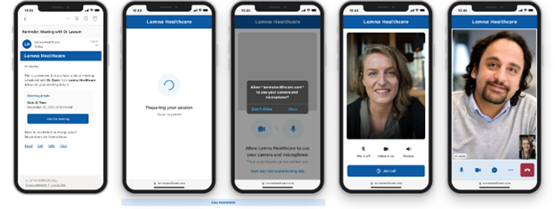
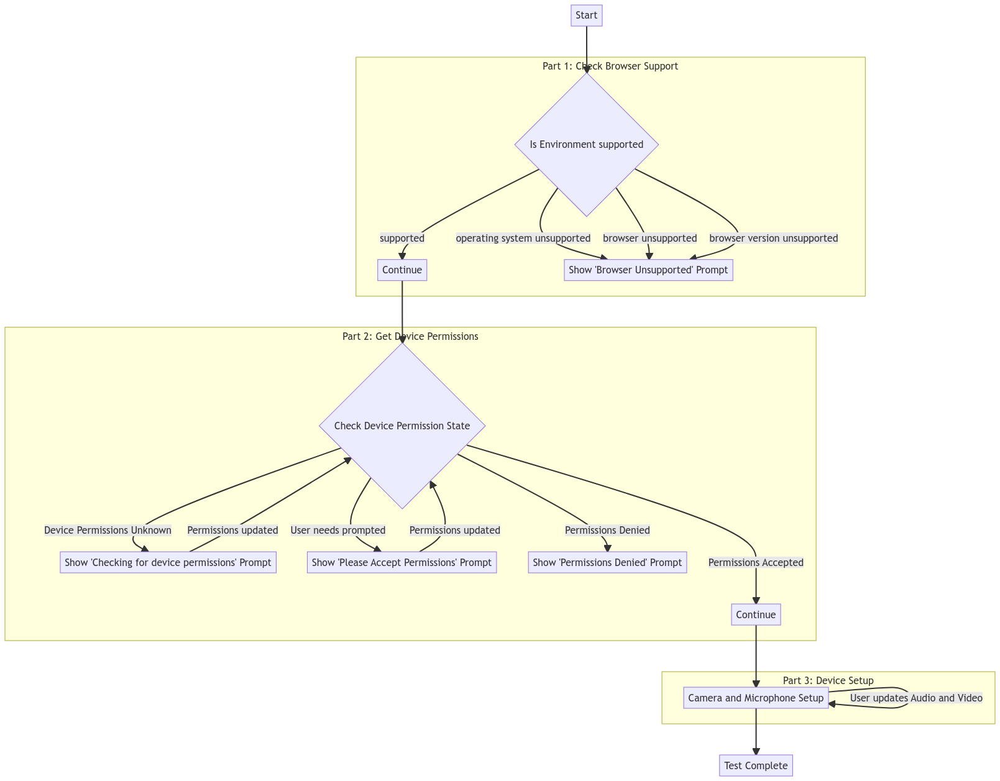
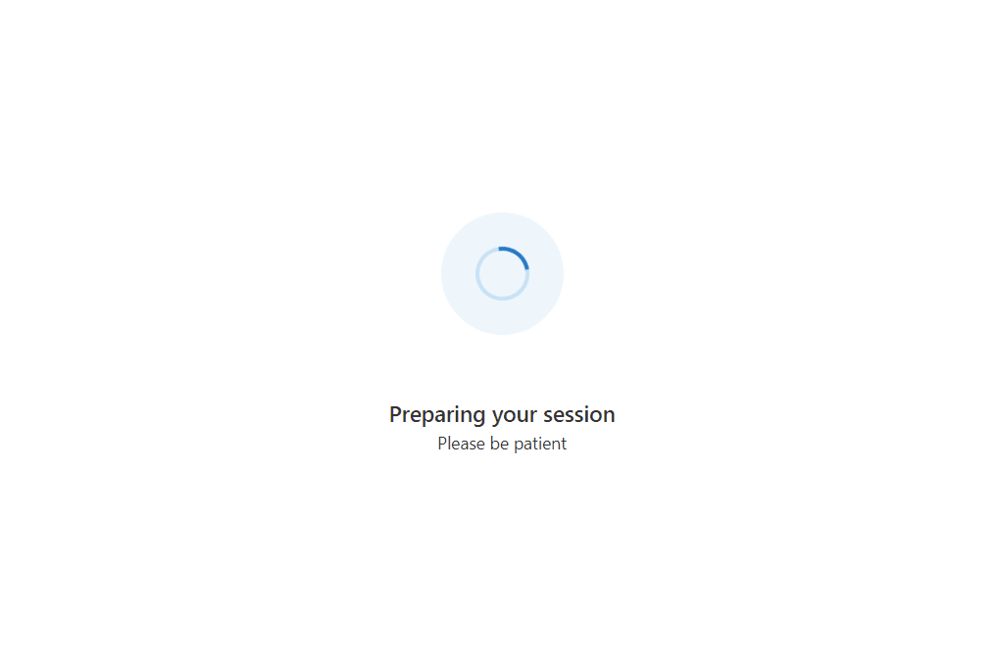

# Getting started with Call Readiness and the UI Library

[!INCLUDE [Public Preview Notice](../../includes/public-preview-include.md)]



When a user intends to join a web call, their primary focus is on the conversation they want to have with the other person(s) on the call – this persona could be a doctor, teacher, financial advisor, or friend. The conversation itself may pose enough stress, let alone navigating the process of making sure they and their device(s) are ready to be seen and/or heard. It's critical to ensure the device and client they're using is ready for the call

It may be impossible to predict every issue or combination of issues that may arise, but by applying this tutorial you can:

- Reduce the likelihood of issues affecting a user during a call
- Only expose an issue if it's going to negatively impact the experience
- Avoid making a user hunt for a resolution;  Offer guided help to resolve the issue

Related to this tutorial is the Azure Communication Services [Network Testing Diagnostic Tool](../../concepts/developer-tools/network-diagnostic.md). Users can use the Network Testing Diagnostics Tool for further troubleshooting in customer support scenarios.

## Tutorial Structure

In this tutorial, we use the Azure Communication Services UI Library to create an experience that gets the user ready to join a call. This tutorial is structured into three parts:

- Part 1: [Getting your user onto a supported browser](./call-readiness-tutorial-part-1-browser-support.md)
- Part 2: [Ensuring your App has access to the microphone and camera](./call-readiness-tutorial-part-2-requesting-device-access.md)
- Part 3: [Having your user select their desired microphone and camera](./call-readiness-tutorial-part-3-camera-microphone-setup.md)

## Prerequisites

- [Visual Studio Code](https://code.visualstudio.com/) on one of the [supported platforms](https://code.visualstudio.com/docs/supporting/requirements#_platforms).
- [Node.js](https://nodejs.org/), Active LTS and Maintenance LTS versions (10.14.1 recommended). Use the `node --version` command to check your version.

## Download code

Access the full code for this tutorial on [GitHub](https://github.com/Azure-Samples/communication-services-javascript-quickstarts/tree/main/ui-library-call-readiness).

## App Structure

Users have several hurdles to cross when joining a call from browser support to selecting the correct camera. This tutorial uses [React](https://reactjs.org/) with Azure Communication Services [UI Library](https://aka.ms/acsstorybook) to create an app that performs call readiness checks. These checks guide the user through browser support, camera and microphone permissions and finally device setup.

The user flow of the App is as follows:


<!--
This is the mermaid definition for the above graph. Use this to edit and regenerate the graph.
Note: Arrows have been split with a / to prevent this comment block from breaking.
```mermaid
flowchart TD
    Start -.-> BrowserCheck{Is Environment supported}
    subgraph S1[Part 1: Check Browser Support]
        BrowserCheck -/-> |supported| C1[Continue]
        BrowserCheck -/-> |operating system unsupported|BrowserUnsupportedPrompt[Show 'Browser Unsupported' Prompt]
        BrowserCheck -/-> |browser unsupported|BrowserUnsupportedPrompt[Show 'Browser Unsupported' Prompt]
        BrowserCheck -/-> |browser version unsupported|BrowserUnsupportedPrompt[Show 'Browser Unsupported' Prompt]
    end
    subgraph S2[Part 2: Get Device Permissions]
        C1 -.-> DeviceCheckStart{Check Device Permission State}
        DeviceCheckStart -/-> |Device Permissions Unknown|DeviceCheckerGeneric[Show 'Checking for device permissions' Prompt]
        DeviceCheckerGeneric -/->|Permissions updated| DeviceCheckStart
        DeviceCheckStart -/-> |User needs prompted|DeviceCheckerPrompt[Show 'Please Accept Permissions' Prompt]
        DeviceCheckerPrompt -/->|Permissions updated| DeviceCheckStart
        DeviceCheckStart -/-> |Permissions Denied|DeviceCheckerDenied[Show 'Permissions Denied' Prompt]
        DeviceCheckStart --/-> |Permissions Accepted|C2[Continue]
    end
    subgraph Part 3: Device Setup
        C2 -.-> DeviceSetup[Camera and Microphone Setup]
        DeviceSetup -/-> |User updates Audio and Video| DeviceSetup
    end
    DeviceSetup -.-> TestComplete[Call Readiness complete. User is ready to join their Call]
```
-->

Your final app prompts the user onto a supported browser and access for the camera and microphone, then let the user choose and preview their microphone and camera settings before joining the call:



## Set up the Project

To set up the [React](https://reactjs.org/) App, we use the create-react-app template for this quickstart. This `create-react-app` command creates an easy to run TypeScript App powered by React. The command installs the Azure Communication Services npm packages, and the [FluentUI](https://developer.microsoft.com/fluentui/) npm package for creating advanced UI. For more information on create-react-app, see: [Get Started with React](https://reactjs.org/docs/create-a-new-react-app.html).

```bash
# Create an Azure Communication Services App powered by React.
npx create-react-app ui-library-call-readiness-app --template communication-react 

# Change to the directory of the newly created App.
cd ui-library-call-readiness-app
```

At the end of this process, you should have a full application inside of the folder `ui-library-call-readiness-app`.
For this quickstart, we modify the files inside of the `src` folder.

### Install Packages

As this feature is in public preview, you must use the beta versions of the Azure Communication Services npm packages. Use the `npm install` command to install these packages:

```bash
# Install Public Preview versions of the Azure Communication Services Libraries.
npm install @azure/communication-react@1.5.1-beta.1 @azure/communication-calling@1.10.0-beta.1
```

> [!NOTE]
> If you are installing the communication packages into an existing App, `@azure/communication-react` currently does not support React v18. To downgrade to React v17 or less follow [these instructions](https://azure.github.io/communication-ui-library/?path=/docs/setup-communication-react--page).

### Initial App Setup

To get us started, we replace the create-react-app default `App.tsx` content with a basic setup that:

- Registers the necessary icons we use in this tutorial
- Sets a theme provider that can be used to set a custom theme
- Create a [`StatefulCallClient`](https://azure.github.io/communication-ui-library/?path=/docs/statefulclient-overview--page) with a provider that gives child components access to the call client

`src/App.tsx`

```ts
import { CallClientProvider, createStatefulCallClient, FluentThemeProvider, useTheme } from '@azure/communication-react';
import { initializeIcons, registerIcons, Stack, Text } from '@fluentui/react';
import { DEFAULT_COMPONENT_ICONS } from '@azure/communication-react';
import { CheckmarkCircle48Filled } from '@fluentui/react-icons';

// Initializing and registering icons should only be done once per app.
initializeIcons();
registerIcons({ icons: DEFAULT_COMPONENT_ICONS });

const USER_ID = 'user1'; // In your production app replace this with an Azure Communication Services User ID
const callClient = createStatefulCallClient({ userId: { communicationUserId: USER_ID } });

/**
 * Entry point of a React app.
 */
const App = (): JSX.Element => {
  return (
    <FluentThemeProvider>
      <CallClientProvider callClient={callClient}>
        <TestComplete />
      </CallClientProvider>
    </FluentThemeProvider>
  );
}

export default App;

/**
 * Final page to highlight the call readiness checks have completed.
 * Replace this with your own App's next stage.
 */
export const TestComplete = (): JSX.Element => {
  const theme = useTheme();
  return (
    <Stack verticalFill verticalAlign="center" horizontalAlign="center" tokens={{ childrenGap: "1rem" }}>
      <CheckmarkCircle48Filled primaryFill={theme.palette.green} />
      <Text variant="xLarge">Call Readiness Complete</Text>
      <Text variant="medium">From here you can have the user join their call using their chosen settings.</Text>
    </Stack>
  );
};
```

### Run Create React App

Let's test our setup by running:

```bash
# Run the React App
npm start
```

Once the App is running visit `http://localhost:3000` in your browser to see your running App.
You should see a green checkmark with a `Test Complete` message.

## Next steps

> [!div class="nextstepaction"]
> [Part 1: Browser Support](./call-readiness-tutorial-part-1-browser-support.md)
