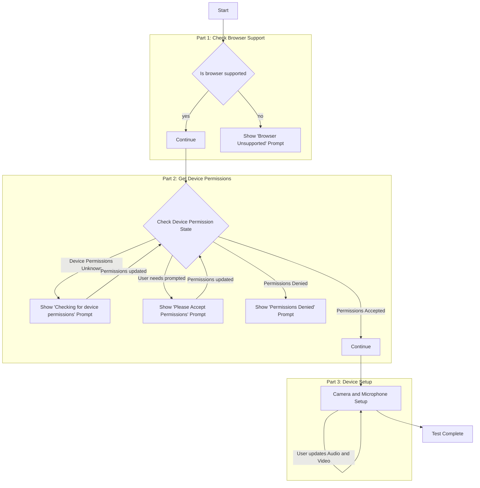

# Creating a Call Readiness Experience using Azure Communication Services

[!INCLUDE [Public Preview Notice](../includes/public-preview-include.md)]

In this tutorial, we'll be leveraging Azure Communication Services with the UI Library to create an experience that gets users ready to join a call. The UI Library provides a set of rich components and UI controls that can be leveraged to produce a Call Readiness experience, whilst the Azure Communication Calling JavaScript SDK provides a rich set of APIs to understand the user state.

## Download code

Access the full code for this tutorial on [GitHub](https://github.com/Azure-Samples/communication-services-javascript-quickstarts/tree/main/ui-library-call-readiness).

## Prerequisites

- [Visual Studio Code](https://code.visualstudio.com/) on one of the [supported platforms](https://code.visualstudio.com/docs/supporting/requirements#_platforms).
- [Node.js](https://nodejs.org/), Active LTS and Maintenance LTS versions (10.14.1 recommended). Use the `node --version` command to check your version.

## Overview

Users have several hurdles to cross when joining a call from browser support to selecting the correct camera.
This tutorial creates a _call readiness checker_ application that guides the user through browser support, camera and microphone permissions and finally device setup.

The tutorial will be split into three parts:

1. Checking for [browser support](https://learn.microsoft.com/en-us/azure/communication-services/concepts/voice-video-calling/calling-sdk-features#javascript-calling-sdk-support-by-os-and-browser)
1. Requesting access to the camera and microphone
1. Letting the user choose their camera, microphone and speaker

The diagram below shows the flow the call readiness checker performs across the three parts:



## Setting up the React App

To set up the [React](https://reactjs.org/) App. We'll use the create-react-app template for this quickstart. For more information, see: [Get Started with React](https://reactjs.org/docs/create-a-new-react-app.html).

```bash
npx create-react-app ui-library-quickstart-composites --template typescript

cd ui-library-quickstart-composites
```

At the end of this process, you should have a full application inside of the folder `ui-library-quickstart-composites`.
For this quickstart, we'll be modifying files inside of the `src` folder.

### Install the Package

Use the `npm install` command to install the Azure Communication Services Calling SDK and UI Library for JavaScript.

```bash
npm install @azure/communication-calling@dev @azure/communication-react@dev
```

For this tutorial we will also use FluentUI for creating UI controls:

```bash
npm install @fluentui/react @fluentui/react-icons
```

### Setup App

Here we will replace the create-react-app default `App.tsx` content with a basic setup that:

- Registers the necessary icons we will use in this tutorial
- Sets a theme provider that can be used to set a custom theme
- Create a [`StatefulCallClient`](https://azure.github.io/communication-ui-library/?path=/docs/statefulclient-overview--page) with a provider that gives child components access to the call client

`App.tsx`

```tsx
import { CallClientProvider, createStatefulCallClient, FluentThemeProvider, useTheme } from '@azure/communication-react';
import { initializeIcons, registerIcons, Stack, Text } from '@fluentui/react';
import {
  DEFAULT_COMPONENT_ICONS
} from '@azure/communication-react';
import { CheckmarkCircle48Filled } from '@fluentui/react-icons';

// Initializing and registering icons should only be done once per app.
initializeIcons();
registerIcons({ icons: DEFAULT_COMPONENT_ICONS });

const USER_ID = 'user1'; // In your production app replace this with an Azure Communication Services User ID
const callClient = createStatefulCallClient({ userId: { communicationUserId: USER_ID } });

/**
 * Entry point of a React app.
 */
const App = (): JSX.Element => {
  return (
    <FluentThemeProvider>
      <CallClientProvider callClient={callClient}>
        <TestComplete />
      </CallClientProvider>
    </FluentThemeProvider>
  );
}

export default App;

/**
 * UI for this tutorial to display when the tests have complete.
 * Instead of this, in your calling application you would take
 * the user to the next page in your app.
 */
const TestComplete = (): JSX.Element => {
  const theme = useTheme();
  return (
    <Stack verticalFill verticalAlign="center" horizontalAlign="center" tokens={{ childrenGap: '1rem' }}>
      <CheckmarkCircle48Filled primaryFill={theme.palette.green} />
      <Text variant='xLarge'>Test Complete</Text>
    </Stack>
  );
};
```

You should see a green checkmark with a `Test Complete` message.

### Run Create React App

Let's test our setup by running:

```bash
npm start
```

## Checking for Browser Support

To ensure the user gets the best experience we want to first make sure they are on a [supported browser](https://learn.microsoft.com/en-us/azure/communication-services/concepts/voice-video-calling/calling-sdk-features#javascript-calling-sdk-support-by-os-and-browser).
In this section we will create a page that displays "Preparing your session" whilst we perform a quick support check in the background on the user's browser.


### Preparing Your Session Page

Create a new file called `PreparingYourScreen.tsx` and use the code below to create a spinner to show to the user while we perform asynchronous checks in the background:

`PreparingYourScreen.tsx`

```tsx
import { useTheme } from '@azure/communication-react';
import { ISpinnerStyles, IStackStyles, ITextStyles, ITheme, Spinner, Stack, Text } from '@fluentui/react';

export const PreparingYourSession = (): JSX.Element => {
  const theme = useTheme();
  return (
    <Stack verticalFill verticalAlign="center" horizontalAlign="center" tokens={{ childrenGap: '3rem' }}>
      <Stack styles={spinnerContainerStyles(theme)}>
        <Spinner styles={spinnerStyles} />
      </Stack>
      <Stack horizontalAlign="center">
        <Stack.Item>
          <Text styles={headingStyles} variant="large">
            Preparing your session
          </Text>
        </Stack.Item>
        <Stack.Item>
          <Text variant="medium">Please be patient</Text>
        </Stack.Item>
      </Stack>
    </Stack>
  );
};

const headingStyles: ITextStyles = {
  root: {
    fontWeight: '600',
    lineHeight: '2rem'
  }
};

const spinnerStyles: ISpinnerStyles = {
  circle: {
    height: '2.75rem',
    width: '2.75rem',
    borderWidth: '0.2rem'
  }
};

const spinnerContainerStyles = (theme: ITheme): IStackStyles => ({
  root: {
    padding: '1.75rem',
    borderRadius: '50%',
    background: theme.palette?.themeLighterAlt
  }
});
```

We can then Hook up this Preparing your session screen into our App.
In the `App.tsx` and a variable `testState` to track the state of the app and while `testState` is in `runningPreCallChecks` state we will show the Preparing Your Session Screen:

`App.tsx`

```tsx
type TestingState = 'runningPreCallChecks' | 'finished';

const App = (): JSX.Element => {
  const [testState, setTestState] = useState<TestingState>('runningPreCallChecks');

  return (
    <FluentThemeProvider>
      <CallClientProvider callClient={callClient}>
        {/* Show a Preparing your session screen while running the call readiness checks */}
        {testState === 'runningPreCallChecks' && (
          <>
            <PreparingYourSession />
          </>
        )}

        {/* After the device setup is complete, take the user to the call. For this sample we will just show a test complete page. */}
        {testState === 'finished' && <TestComplete />}
      </CallClientProvider>
    </FluentThemeProvider>
  );
}
```

### Performing a background check

First create a utility file call `browserSupportUtils.tsx`. Inside this call we will add a method `checkBrowserSupport`. This will use the [Calling Stateful Client](https://azure.github.io/communication-ui-library/?path=/docs/statefulclient-overview--page) to perform a browser support check.

`browserSupportUtils.tsx`

```ts
import { Features } from "@azure/communication-calling";
import { StatefulCallClient } from "@azure/communication-react";

/** Use the callClient's getEnvironmentInfo() method to check if the browser is supported. */
export const checkBrowserSupport = async (callClient: StatefulCallClient): Promise<boolean> =>
  (await callClient.feature(Features.DebugInfo).getEnvironmentInfo()).isSupportedBrowser;
```

### Informing the user they are on an unsupported browser

Next, we will create a prompt to tell the user they are using an unsupported browser. For this we will host the UI Library's `UnsupportedBrowser` component inside a [FluentUI Modal](https://developer.microsoft.com/en-us/fluentui#/controls/web/modal):
Create a new file called `UnsupportedBrowserPrompt.tsx` where we will create a unsupported browser prompt:

`UnsupportedBrowserPrompt.tsx`

```tsx
import { UnsupportedBrowser } from '@azure/communication-react';
import { Modal } from '@fluentui/react';

export const BrowserUnsupportedPrompt = (props: { isOpen: boolean }): JSX.Element => (
  <Modal isOpen={props.isOpen}>
    <UnsupportedBrowser
      onTroubleshootingClick={() => alert('This callback should be used to take the user to further troubleshooting')}
    />
  </Modal>
);
```

We can then show this prompt in a Pre-Call Check Component.
Create a file called `PreCallChecksComponent.tsx` that will contain the logic for showing this prompt:
This component will have a callback `onTestsSuccessful` that can take the user to the next page in the App.

`PreCallChecksComponent.tsx`

```tsx
import { useCallClient } from '@azure/communication-react';
import { useEffect, useState } from 'react';
import { BrowserUnsupportedPrompt } from './UnsupportedBrowserPrompt';
import { checkBrowserSupport } from './browserSupportUtils';

type PreCallChecksState = 'runningChecks' | 'browserUnsupported';

/**
 * This component is a demo of how to use the StatefulCallClient with CallReadiness Components to get a user ready to join a call.
 */
export const PreCallChecksComponent = (props: {
  /**
   * Callback triggered when the tests are complete and successful
   */
  onTestsSuccessful: () => void
}): JSX.Element => {
  const [currentCheckState, setCurrentCheckState] = useState<PreCallChecksState>('runningChecks');

  // Run call readiness checks when component mounts
  const callClient = useCallClient();
  useEffect(() => {
    const runCallReadinessChecks = async (): Promise<void> => {

      // First we'll begin with a browser support check.
      const browserSupport = await checkBrowserSupport(callClient);
      if (!browserSupport) {
        setCurrentCheckState('browserUnsupported');
        // If browser support fails, we'll stop here and display a modal to the user.
        return;
      }

      props.onTestsSuccessful();
    };

    runCallReadinessChecks();
  // eslint-disable-next-line react-hooks/exhaustive-deps
  }, []);

  return (
    <>
      {/* We show this when the browser is unsupported */}
      <BrowserUnsupportedPrompt isOpen={currentCheckState === 'browserUnsupported'} />
    </>
  );
}
```

We can then add this to the `App.tsx` and move the user to the _Test Complete_ stage once the test is successful using the `onTestsSuccessful` callback:

`App.tsx`

```tsx
...

import { PreCallChecksComponent } from './PreCallChecksComponent';

...

const App = (): JSX.Element => {
  const [testState, setTestState] = useState<TestingState>('runningPreCallChecks');

  return (
    <FluentThemeProvider>
      <CallClientProvider callClient={callClient}>
        {/* Show a Preparing your session screen while running the call readiness checks */}
        {testState === 'runningPreCallChecks' && (
          <>
            <PreparingYourSession />
            <PreCallChecksComponent
              callReadinessHelper={callReadinessHelper}
              onTestsSuccessful={() => setTestState('finished')}
            />
          </>
        )}

        {/* After the device setup is complete, take the user to the call. For this sample we will just show a test complete page. */}
        {testState === 'finished' && <TestComplete />}
      </CallClientProvider>
    </FluentThemeProvider>
  );
}
```

You can now run the app, if you are in an unsupported browser you will see the prompt:

Gif:


## Next steps

> [!div class="nextstepaction"]
> [Part 2: Request camera and microphone access](./call-readiness-tutorial-part-2-requesting-device-access.md)
