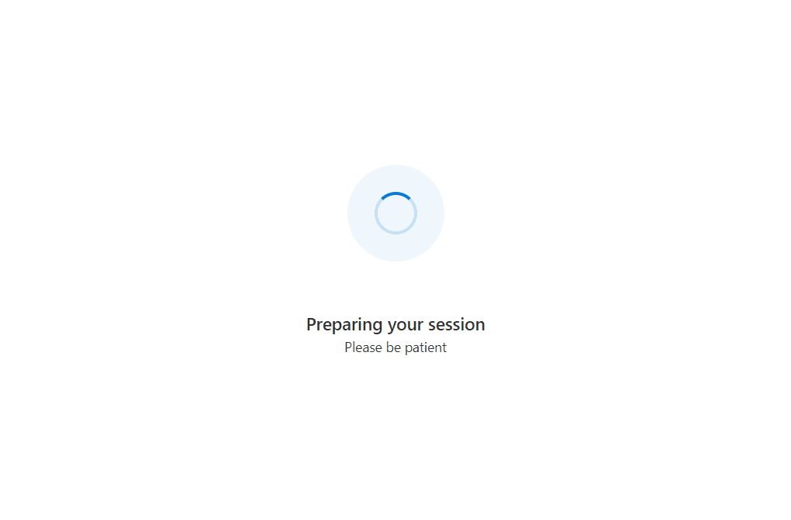

# Request camera and microphone access using Azure Communication Services UI Library

[!INCLUDE [Public Preview Notice](../../includes/public-preview-include.md)]

This tutorial is a continuation of a three part series of Call Readiness tutorials and follows on from the previous: [Ensure user is on a supported browser](./call-readiness-tutorial-part-1-browser-support.md).

## Download code

Access the full code for this tutorial on [GitHub](https://github.com/Azure-Samples/communication-services-javascript-quickstarts/tree/main/ui-library-call-readiness).

## Requesting access to the camera and microphone

For calling applications, it's often vital a user has given permission to use the microphone and camera.
In this section, we create a series of components that encourages the user to grant access to the camera and microphone.
We display prompts to the user to guide them through granting access.
We inform the user with a prompt if access isn't granted.

### Creating prompts for camera and microphone access

We first create a series of device permissions prompts to get users into a state where they've accepted the microphone and camera permissions. These prompts use the `CameraAndMicrophoneSitePermissions` component
from the UI Library. Like the Unsupported Browser prompt, we host these prompts inside a FluentUI `modal`.

`src/DevicePermissionPrompts.tsx`

```ts
import { CameraAndMicrophoneSitePermissions } from '@azure/communication-react';
import { Modal } from '@fluentui/react';

/** Modal dialog that prompt the user to accept the Browser's device permission request. */
export const AcceptDevicePermissionRequestPrompt = (props: { isOpen: boolean }): JSX.Element => (
  <PermissionsModal isOpen={props.isOpen} kind="request" />
);

/** Modal dialog that informs the user we are checking for device access. */
export const CheckingDeviceAccessPrompt = (props: { isOpen: boolean }): JSX.Element => (
  <PermissionsModal isOpen={props.isOpen} kind="check" />
)

/** Modal dialog that informs the user they denied permission to the camera or microphone with corrective steps. */
export const PermissionsDeniedPrompt = (props: { isOpen: boolean }): JSX.Element => (
  <PermissionsModal isOpen={props.isOpen} kind="denied" />
);

/** Base component utilitzed by the above prompts for better code separation. */
const PermissionsModal = (props: { isOpen: boolean, kind: "denied" | "request" | "check" }): JSX.Element => (
  <Modal isOpen={props.isOpen}>
    <CameraAndMicrophoneSitePermissions
      appName={'this site'}
      kind={props.kind}
      onTroubleshootingClick={() => alert('This callback should be used to take the user to further troubleshooting')}
    />
  </Modal>
);
```

### Checking for camera and microphone access

Here we add two new utility functions to check and request for camera and microphone access. Create a file called `devicePermissionUtils.ts` with two functions `checkDevicePermissionsState` and `requestCameraAndMicrophonePermissions`.
`checkDevicePermissionsState` uses the [PermissionAPI](https://developer.mozilla.org/docs/Web/API/Permissions_API). However, querying for camera and microphone isn't supported on Firefox and thus we ensure this method returns `unknown` in this case. Later we ensure we handle the `unknown` case when prompting the user for permissions.

`src/DevicePermissionUtils.ts`

```ts
import { DeviceAccess } from "@azure/communication-calling";
import { StatefulCallClient } from "@azure/communication-react";

/**
 * Check if the user needs to be prompted for camera and microphone permissions.
 *
 * @remarks
 * The Permissions API we are using is not supported in Firefox, Android WebView or Safari < 16.
 * In those cases this returns 'unknown'.
 */
export const checkDevicePermissionsState = async (): Promise<{camera: PermissionState, microphone: PermissionState} | 'unknown'> => {
  try {
    const [micPermissions, cameraPermissions] = await Promise.all([
      navigator.permissions.query({ name: "microphone" as PermissionName }),
      navigator.permissions.query({ name: "camera" as PermissionName })
    ]);
    console.info('PermissionAPI results', [micPermissions, cameraPermissions]); // view console logs in the browser to see what the PermissionsAPI info is returned
    return { camera: cameraPermissions.state, microphone: micPermissions.state };
  } catch (e) {
    console.warn("Permissions API unsupported", e);
    return 'unknown';
  }
}

/** Use the DeviceManager to request for permissions to access the camera and microphone. */
export const requestCameraAndMicrophonePermissions = async (callClient: StatefulCallClient): Promise<DeviceAccess> => {
  const response = await (await callClient.getDeviceManager()).askDevicePermission({ audio: true, video: true });
  console.info('AskDevicePermission response', response); // view console logs in the browser to see what device access info is returned
  return response
}
```

### Prompting the user to grant access to the camera and microphone

Now we have the prompts and check and request logic, we create a `DeviceAccessComponent` to prompt the user regarding device permissions.
In this component, we display different prompts to the user based on the device permission state:

- If the device permission state is unknown, we display a prompt to the user informing them we're checking for device permissions.
- If we're requesting permissions, we display a prompt to the user encouraging them to accept the permissions request.
- If the permissions are denied, we display a prompt to the user informing them that they've denied permissions, and that they need to grant permissions to continue.

`src/DeviceAccessChecksComponent.tsx`

```ts
import { useEffect, useState } from 'react';
import { CheckingDeviceAccessPrompt, PermissionsDeniedPrompt, AcceptDevicePermissionRequestPrompt } from './DevicePermissionPrompts';
import { useCallClient } from '@azure/communication-react';
import { checkDevicePermissionsState, requestCameraAndMicrophonePermissions } from './DevicePermissionUtils';

export type DevicesAccessChecksState = 'runningDeviceAccessChecks' |
  'checkingDeviceAccess' |
  'promptingForDeviceAccess' |
  'deniedDeviceAccess';

/**
 * This component is a demo of how to use the StatefulCallClient with CallReadiness Components to get a user
 * ready to join a call.
 * This component checks the browser support and if camera and microphone permissions have been granted.
 */
export const DeviceAccessChecksComponent = (props: {
  /**
   * Callback triggered when the tests are complete and successful
   */
  onTestsSuccessful: () => void
}): JSX.Element => {
  const [currentCheckState, setCurrentCheckState] = useState<DevicesAccessChecksState>('runningDeviceAccessChecks');
  

  // Run call readiness checks when component mounts
  const callClient = useCallClient();
  useEffect(() => {
    const runDeviceAccessChecks = async (): Promise<void> => {

      // First we check if we need to prompt the user for camera and microphone permissions.
      // The prompt check only works if the browser supports the PermissionAPI for querying camera and microphone.
      // In the event that is not supported, we show a more generic prompt to the user.
      const devicePermissionState = await checkDevicePermissionsState();
      if (devicePermissionState === 'unknown') {
        // We don't know if we need to request camera and microphone permissions, so we'll show a generic prompt.
        setCurrentCheckState('checkingDeviceAccess');
      } else if (devicePermissionState.camera === 'prompt' || devicePermissionState.microphone === 'prompt') {
        // We know we need to request camera and microphone permissions, so we'll show the prompt.
        setCurrentCheckState('promptingForDeviceAccess');
      }

      // Now the user has an appropriate prompt, we can request camera and microphone permissions.
      const devicePermissionsState = await requestCameraAndMicrophonePermissions(callClient);

      if (!devicePermissionsState.audio || !devicePermissionsState.video) {
        // If the user denied camera and microphone permissions, we prompt the user to take corrective action.
        setCurrentCheckState('deniedDeviceAccess');
      } else {
        // Test finished successfully, trigger callback to parent component to take user to the next stage of the app.
        props.onTestsSuccessful();
      }
    };

    runDeviceAccessChecks();
    // eslint-disable-next-line react-hooks/exhaustive-deps
  }, []);

  return (
    <>
      {/* We show this when we are prompting the user to accept device permissions */}
      <AcceptDevicePermissionRequestPrompt isOpen={currentCheckState === 'promptingForDeviceAccess'} />

      {/* We show this when the PermissionsAPI is not supported and we are checking what permissions the user has granted or denied */}
      <CheckingDeviceAccessPrompt isOpen={currentCheckState === 'checkingDeviceAccess'} />

      {/* We show this when the user has failed to grant camera and microphone access */}
      <PermissionsDeniedPrompt isOpen={currentCheckState === 'deniedDeviceAccess'} />
    </>
  );
}

```

After we have finished creating this component, we add it to the `App.tsx`. First, add the import:

```ts
import { DeviceAccessChecksComponent } from './DeviceAccessChecksComponent';
```

Then update the `TestingState` type to be the following value:

```ts
type TestingState = 'runningEnvironmentChecks' | 'runningDeviceAccessChecks' | 'finished';
```

Finally, update the `App` component:

```ts
/**
 * Entry point of a React app.
 *
 * This shows a PreparingYourSession component while the CallReadinessChecks are running.
 * Once the CallReadinessChecks are finished, the TestComplete component is shown.
 */
const App = (): JSX.Element => {
  const [testState, setTestState] = useState<TestingState>('runningEnvironmentChecks');

  return (
    <FluentThemeProvider>
      <CallClientProvider callClient={callClient}>
        {/* Show a Preparing your session screen while running the environment checks */}
        {testState === 'runningEnvironmentChecks' && (
          <>
            <PreparingYourSession />
            <EnvironmentChecksComponent onTestsSuccessful={() => setTestState('runningDeviceAccessChecks')} />
          </>
        )}
        
        {/* Show a Preparing your session screen while running the device access checks */}
        {testState === 'runningDeviceAccessChecks' && (
          <>
            <PreparingYourSession />
            <DeviceAccessChecksComponent onTestsSuccessful={() => setTestState('finished')} />
          </>
        )}


        {/* After the device setup is complete, take the user to the call. For this sample we show a test complete page. */}
        {testState === 'finished' && <TestComplete />}
      </CallClientProvider>
    </FluentThemeProvider>
  );
}
```

The app presents the user with prompts to guide them through device access:



> [!NOTE]
> For testing we recommend visiting your app in InPrivate/Incognito mode so that camera and microphone permissions have not been previously granted for `localhost:3000`.

## Next steps

> [!div class="nextstepaction"]
> [Part 3: Selecting a microphone and camera for the call](./call-readiness-tutorial-part-3-camera-microphone-setup.md)
