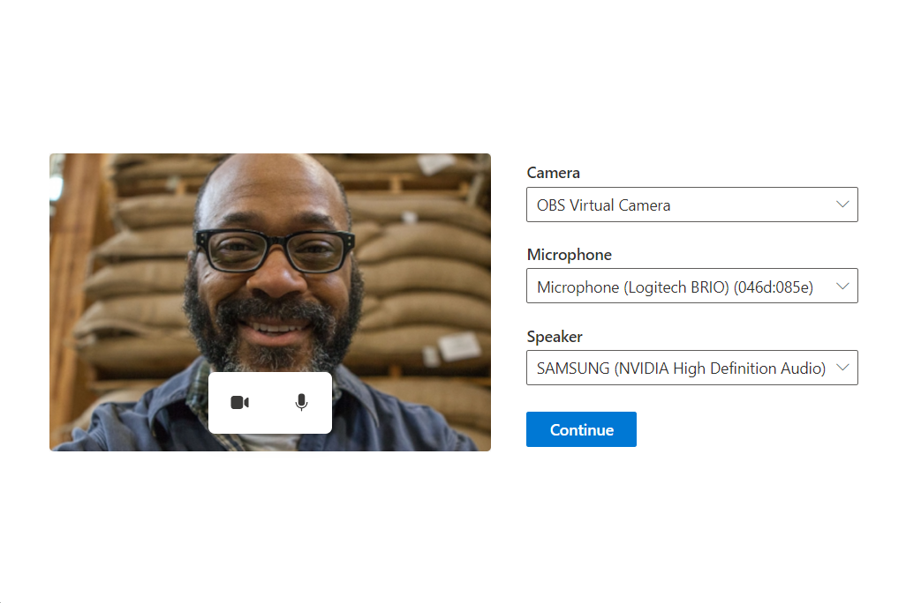

# Microphone and camera setup before a call using Azure Communication Services UI Library

[!INCLUDE [Public Preview Notice](../../includes/public-preview-include.md)]

This tutorial is a continuation of a three part series of Call Readiness tutorials and follows on from the previous two parts:

- [Ensure user is on a supported browser](./call-readiness-tutorial-part-1-browser-support.md).
- [Request camera and microphone access](./call-readiness-tutorial-part-2-requesting-device-access.md).

## Download code

Access the full code for this tutorial on [GitHub](https://github.com/Azure-Samples/communication-services-javascript-quickstarts/tree/main/ui-library-call-readiness).

## Letting the user choose their camera, microphone and speaker

From the previous two parts of the tutorial, the user is on a supported browser, and they have given us permission to access their camera and microphone. We can now make sure the user can choose the correct microphone, camera and speaker they want to use for their call.
We present the user with a rich interface to choose their camera, microphone and speaker. Our final device setup UI looks like this:



### Creating a Configuration Screen

First we create a new file called `DeviceSetup.tsx` and add some setup code, with a callback that returns the users chosen devices back to the App:

`src/DeviceSetup.tsx`

```ts
import { PrimaryButton, Stack } from '@fluentui/react';

export const DeviceSetup = (props: {
  /** Callback to let the parent component know what the chosen user device settings were */
  onDeviceSetupComplete: (userChosenDeviceState: { cameraOn: boolean; microphoneOn: boolean }) => void
}): JSX.Element => {
  return (
    <Stack tokens={{ childrenGap: '1rem' }} verticalAlign="center" verticalFill>
      <PrimaryButton text="Continue" onClick={() => props.onDeviceSetupComplete({ cameraOn: false, microphoneOn: false })} />
    </Stack>
  );
}
```

We can then add this DeviceSetup to our App.

- When the PreCallChecksComponent completes, it forwards the user to the `deviceSetup` state.
- When the user is in the `deviceSetup` state, we render the `DeviceSetup` component.
- When the device setup is complete, the user is forwarded to the `finished` state. In a production App, this forward is typically when you would move the user to a call screen.

First import the DeviceSetup component we created:

`src/App.tsx`

```ts
import { DeviceSetup } from './DeviceSetup';
```

Then update the App to have a new testing state `deviceSetup`:

```ts
type TestingState = 'runningEnvironmentChecks' | 'runningDeviceAccessChecks' | 'deviceSetup' | 'finished';
```

And finally update our `App` component to transition the App to the device setup once the device access checks complete:

```ts
/**
 * Entry point of a React app.
 *
 * This shows a PreparingYourSession component while the CallReadinessChecks are running.
 * Once the CallReadinessChecks are finished, the TestComplete component is shown.
 */
const App = (): JSX.Element => {
  const [testState, setTestState] = useState<TestingState>('runningEnvironmentChecks');

  return (
    <FluentThemeProvider>
      <CallClientProvider callClient={callClient}>
        {/* Show a Preparing your session screen while running the environment checks */}
        {testState === 'runningEnvironmentChecks' && (
          <>
            <PreparingYourSession />
            <EnvironmentChecksComponent onTestsSuccessful={() => setTestState('runningDeviceAccessChecks')} />
          </>
        )}
        
        {/* Show a Preparing your session screen while running the device access checks */}
        {testState === 'runningDeviceAccessChecks' && (
          <>
            <PreparingYourSession />
            <DeviceAccessChecksComponent onTestsSuccessful={() => setTestState('deviceSetup')} />
          </>
        )}

        {/* After the initial checks are complete, take the user to a device setup page call readiness checks are finished */}
        {testState === 'deviceSetup' && (
          <DeviceSetup
            onDeviceSetupComplete={(userChosenDeviceState) => {
              setTestState('finished');
            }}
          />
        )}

        {/* After the device setup is complete, take the user to the call. For this sample we show a test complete page. */}
        {testState === 'finished' && <TestComplete />}
      </CallClientProvider>
    </FluentThemeProvider>
  );
}
```

#### Retrieving and updating microphone, camera and speaker lists from the stateful client

To present a list of selectable cameras, microphones and speakers to the user we can use the stateful call client.
Here we create a series of React hooks. These React hooks use the call client to query for available devices.
The hooks ensure our application re-renders anytime the list changes, for example, if a new camera is plugged into the user's machine.
For these hooks, we create a file called `deviceSetupHooks.ts` and we create three hooks: `useMicrophones`, `useSpeakers` and `useCameras`.
Each of these hooks uses `useCallClientStateChange` to update their lists anytime the user plugs/unplugs a device:

`src/deviceSetupHooks.ts`

```ts
import { AudioDeviceInfo, VideoDeviceInfo } from "@azure/communication-calling";
import { CallClientState, StatefulDeviceManager, useCallClient, VideoStreamRendererViewState } from "@azure/communication-react";
import { useCallback, useEffect, useRef, useState } from "react";

/** A helper hook to get and update microphone device information */
export const useMicrophones = (): {
  microphones: AudioDeviceInfo[],
  selectedMicrophone: AudioDeviceInfo | undefined,
  setSelectedMicrophone: (microphone: AudioDeviceInfo) => Promise<void>
} => {
  const callClient = useCallClient();
  useEffect(() => {
    callClient.getDeviceManager().then(deviceManager => deviceManager.getMicrophones())
  }, [callClient]);

  const setSelectedMicrophone = async (microphone: AudioDeviceInfo) =>
    (await callClient.getDeviceManager()).selectMicrophone(microphone);

  const state = useCallClientStateChange();
  return {
    microphones: state.deviceManager.microphones,
    selectedMicrophone: state.deviceManager.selectedMicrophone,
    setSelectedMicrophone
  };
}

/** A helper hook to get and update speaker device information */
export const useSpeakers = (): {
  speakers: AudioDeviceInfo[],
  selectedSpeaker: AudioDeviceInfo | undefined,
  setSelectedSpeaker: (speaker: AudioDeviceInfo) => Promise<void>
} => {
  const callClient = useCallClient();
  useEffect(() => {
    callClient.getDeviceManager().then(deviceManager => deviceManager.getSpeakers())
  }, [callClient]);

  const setSelectedSpeaker = async (speaker: AudioDeviceInfo) =>
    (await callClient.getDeviceManager()).selectSpeaker(speaker);

  const state = useCallClientStateChange();
  return {
    speakers: state.deviceManager.speakers,
    selectedSpeaker: state.deviceManager.selectedSpeaker,
    setSelectedSpeaker
  };
}

/** A helper hook to get and update camera device information */
export const useCameras = (): {
  cameras: VideoDeviceInfo[],
  selectedCamera: VideoDeviceInfo | undefined,
  setSelectedCamera: (camera: VideoDeviceInfo) => Promise<void>
} => {
  const callClient = useCallClient();
  useEffect(() => {
    callClient.getDeviceManager().then(deviceManager => deviceManager.getCameras())
  }, [callClient]);

  const setSelectedCamera = async (camera: VideoDeviceInfo) =>
    (await callClient.getDeviceManager() as StatefulDeviceManager).selectCamera(camera);

  const state = useCallClientStateChange();
  return {
    cameras: state.deviceManager.cameras,
    selectedCamera: state.deviceManager.selectedCamera,
    setSelectedCamera
  };
}

/** A helper hook to act when changes to the stateful client occur */
const useCallClientStateChange = (): CallClientState => {
  const callClient = useCallClient();
  const [state, setState] = useState<CallClientState>(callClient.getState());
  useEffect(() => {
    const updateState = (newState: CallClientState) => {
      setState(newState);
    }
    callClient.onStateChange(updateState);
    return () => {
      callClient.offStateChange(updateState);
    };
  }, [callClient]);
  return state;
}
```

#### Creating dropdowns to choose devices

To allow the user to choose their camera, microphone and speaker, we use the `Dropdown` component from Fluent UI React.
We create new components that use the hooks we created in `deviceSetupHooks.tsx` to populate the dropdown and update
the chosen device when the user selects a different device from the dropdown.
To house these new components, we create a file called `DeviceSelectionComponents.tsx` that export three new components: `CameraSelectionDropdown`, `MicrophoneSelectionDropdown` and `SpeakerSelectionDropdown`.

`src/DeviceSelectionComponents.tsx`

```ts
import { Dropdown } from '@fluentui/react';
import { useCameras, useMicrophones, useSpeakers } from './deviceSetupHooks';

/** Dropdown that allows the user to choose their desired camera */
export const CameraSelectionDropdown = (): JSX.Element => {
  const { cameras, selectedCamera, setSelectedCamera } = useCameras();
  return (
    <DeviceSelectionDropdown
      placeholder={cameras.length === 0 ? 'No cameras found' : 'Select a camera'}
      label={'Camera'}
      devices={cameras}
      selectedDevice={selectedCamera}
      onSelectionChange={(selectedDeviceId) => {
        const newlySelectedCamera = cameras.find((camera) => camera.id === selectedDeviceId);
        if (newlySelectedCamera) {
          setSelectedCamera(newlySelectedCamera);
        }
      }}
    />
  );
};

/** Dropdown that allows the user to choose their desired microphone */
export const MicrophoneSelectionDropdown = (): JSX.Element => {
  const { microphones, selectedMicrophone, setSelectedMicrophone } = useMicrophones();
  return (
    <DeviceSelectionDropdown
      placeholder={microphones.length === 0 ? 'No microphones found' : 'Select a microphone'}
      label={'Microphone'}
      devices={microphones}
      selectedDevice={selectedMicrophone}
      onSelectionChange={(selectedDeviceId) => {
        const newlySelectedMicrophone = microphones.find((microphone) => microphone.id === selectedDeviceId);
        if (newlySelectedMicrophone) {
          setSelectedMicrophone(newlySelectedMicrophone);
        }
      }}
    />
  );
};

/** Dropdown that allows the user to choose their desired speaker */
export const SpeakerSelectionDropdown = (): JSX.Element => {
  const { speakers, selectedSpeaker, setSelectedSpeaker } = useSpeakers();
  return (
    <DeviceSelectionDropdown
      placeholder={speakers.length === 0 ? 'No speakers found' : 'Select a speaker'}
      label={'Speaker'}
      devices={speakers}
      selectedDevice={selectedSpeaker}
      onSelectionChange={(selectedDeviceId) => {
        const newlySelectedSpeaker = speakers.find((speaker) => speaker.id === selectedDeviceId);
        if (newlySelectedSpeaker) {
          setSelectedSpeaker(newlySelectedSpeaker);
        }
      }}
    />
  );
};

const DeviceSelectionDropdown = (props: {
  placeholder: string,
  label: string,
  devices: { id: string, name: string }[],
  selectedDevice: { id: string, name: string } | undefined,
  onSelectionChange: (deviceId: string | undefined) => void
}): JSX.Element => {
  return (
    <Dropdown
      placeholder={props.placeholder}
      label={props.label}
      options={props.devices.map((device) => ({ key: device.id, text: device.name }))}
      selectedKey={props.selectedDevice?.id}
      onChange={(_, option) => props.onSelectionChange?.(option?.key as string | undefined)}
    />
  );
};
```

##### Add dropdowns to the Device Setup

The camera, microphone and speaker dropdowns can then be added to the Device Setup component.

First, import the new Dropdowns:

`src/DeviceSetup.tsx`

```ts
import { CameraSelectionDropdown, MicrophoneSelectionDropdown, SpeakerSelectionDropdown } from './DeviceSelectionComponents';
```

Then create a component called `DeviceSetup` that houses these dropdowns. This component holds the local video preview we create later.

```ts
export const DeviceSetup = (props: {
  /** Callback to let the parent component know what the chosen user device settings were */
  onDeviceSetupComplete: (userChosenDeviceState: { cameraOn: boolean; microphoneOn: boolean }) => void
}): JSX.Element => {
  return (
    <Stack verticalFill verticalAlign="center" horizontalAlign="center" tokens={{ childrenGap: '1rem' }}>
      <Stack horizontal tokens={{ childrenGap: '2rem' }}>
        <Stack tokens={{ childrenGap: '1rem' }} verticalAlign="center" verticalFill>
          <CameraSelectionDropdown />
          <MicrophoneSelectionDropdown />
          <SpeakerSelectionDropdown />
          <Stack.Item styles={{ root: { paddingTop: '0.5rem' }}}>
            <PrimaryButton text="Continue" onClick={() => props.onDeviceSetupComplete({ cameraOn: false, microphoneOn: false })} />
          </Stack.Item>
        </Stack>
      </Stack>
    </Stack>
  );
};
```

#### Creating a local video preview

Beside the dropdowns, we create a local video preview to allow the user to see what their camera is capturing. It contains a small call controls bar with camera and microphone buttons to toggle camera on/off and microphone mute/unmute.

First we add a new hook to our `deviceSetupHooks.ts` called `useLocalPreview`. This hook provides our react component with a localPreview to render and functions to start and stop the local preview:

`src/deviceSetupHooks.ts`

```ts
/** A helper hook to providing functionality to create a local video preview */
export const useLocalPreview = (): {
  localPreview: VideoStreamRendererViewState | undefined,
  startLocalPreview: () => Promise<void>,
  stopLocalPreview: () => void
} => {
  const callClient = useCallClient();
  const state = useCallClientStateChange();
  const localPreview = state.deviceManager.unparentedViews[0];

  const startLocalPreview = useCallback(async () => {
    const selectedCamera = state.deviceManager.selectedCamera;
    if (!selectedCamera) {
      console.warn('no camera selected to start preview with');
      return;
    }
    callClient.createView(
      undefined,
      undefined,
      {
        source: selectedCamera,
        mediaStreamType: 'Video'
      },
      {
        scalingMode: 'Crop'
      }
    );
  }, [callClient, state.deviceManager.selectedCamera]);

  const stopLocalPreview = useCallback(() => {
    if (!localPreview) {
      console.warn('no local preview ti dispose');
      return;
    }
    callClient.disposeView(undefined, undefined, localPreview)
  }, [callClient, localPreview]);

  const selectedCameraRef = useRef(state.deviceManager.selectedCamera);
  useEffect(() => {
    if (selectedCameraRef.current !== state.deviceManager.selectedCamera) {
      stopLocalPreview();
      startLocalPreview();
      selectedCameraRef.current = state.deviceManager.selectedCamera;
    }
  }, [startLocalPreview, state.deviceManager.selectedCamera, stopLocalPreview]);

  return {
    localPreview: localPreview?.view,
    startLocalPreview,
    stopLocalPreview
  }
}
```

Then we create a new component called `LocalPreview.tsx` that uses that hook to display the local video preview to the user:

`src/LocalPreview.tsx`

```ts
import { StreamMedia, VideoTile, ControlBar, CameraButton, MicrophoneButton, useTheme } from '@azure/communication-react';
import { Stack, mergeStyles, Text, ITheme } from '@fluentui/react';
import { VideoOff20Filled } from '@fluentui/react-icons';
import { useEffect } from 'react';
import { useCameras, useLocalPreview } from './deviceSetupHooks';

/** LocalPreview component has a camera and microphone toggle buttons, along with a video preview of the local camera. */
export const LocalPreview = (props: {
  cameraOn: boolean,
  microphoneOn: boolean,
  cameraToggled: (isCameraOn: boolean) => void,
  microphoneToggled: (isMicrophoneOn: boolean) => void
}): JSX.Element => {
  const { cameraOn, microphoneOn, cameraToggled, microphoneToggled } = props;
  const { localPreview, startLocalPreview, stopLocalPreview } = useLocalPreview();
  const canTurnCameraOn = useCameras().cameras.length > 0;

  // Start and stop the local video preview based on if the user has turned the camera on or off and if the camera is available.
  useEffect(() => {
    if (!localPreview && cameraOn && canTurnCameraOn) {
      startLocalPreview();
    } else if (!cameraOn) {
      stopLocalPreview();
    }
  }, [canTurnCameraOn, cameraOn, localPreview, startLocalPreview, stopLocalPreview]);

  const theme = useTheme();
  const shouldShowLocalVideo = canTurnCameraOn && cameraOn && localPreview;
  return (
    <Stack verticalFill verticalAlign="center">
      <Stack className={localPreviewContainerMergedStyles(theme)}>
        <VideoTile
          renderElement={shouldShowLocalVideo ? <StreamMedia videoStreamElement={localPreview.target} /> : undefined}
          onRenderPlaceholder={() => <CameraOffPlaceholder />}
        >
          <ControlBar layout="floatingBottom">
            <CameraButton
              checked={cameraOn}
              onClick={() => {
                cameraToggled(!cameraOn)
              }}
            />
            <MicrophoneButton
              checked={microphoneOn}
              onClick={() => {
                microphoneToggled(!microphoneOn)
              }}
            />
          </ControlBar>
        </VideoTile>
      </Stack>
    </Stack>
  );
};

/** Placeholder shown in the local preview window when the camera is off */
const CameraOffPlaceholder = (): JSX.Element => {
  const theme = useTheme();
  return (
    <Stack style={{ width: '100%', height: '100%' }} verticalAlign="center">
      <Stack.Item align="center">
        <VideoOff20Filled primaryFill="currentColor" />
      </Stack.Item>
      <Stack.Item align="center">
        <Text variant='small' styles={{ root: { color: theme.palette.neutralTertiary }}}>Your camera is turned off</Text>
      </Stack.Item>
    </Stack>
  );
};

/** Default styles for the local preview container */
const localPreviewContainerMergedStyles = (theme: ITheme): string =>
  mergeStyles({
    minWidth: '25rem',
    maxHeight: '18.75rem',
    minHeight: '16.875rem',
    margin: '0 auto',
    background: theme.palette.neutralLighter,
    color: theme.palette.neutralTertiary
  });
```

##### Add the local preview to the device setup

The local preview component can then be added to the Device Setup:

`src/DeviceSetup.tsx`

```ts
import { LocalPreview } from './LocalPreview';
import { useState } from 'react';
```

```ts
export const DeviceSetup = (props: {
  /** Callback to let the parent component know what the chosen user device settings were */
  onDeviceSetupComplete: (userChosenDeviceState: { cameraOn: boolean; microphoneOn: boolean }) => void
}): JSX.Element => {
  const [microphoneOn, setMicrophoneOn] = useState(false);
  const [cameraOn, setCameraOn] = useState(false);

  return (
    <Stack verticalFill verticalAlign="center" horizontalAlign="center" tokens={{ childrenGap: '1rem' }}>
      <Stack horizontal tokens={{ childrenGap: '2rem' }}>
        <Stack.Item>
          <LocalPreview
            cameraOn={cameraOn}
            microphoneOn={microphoneOn}
            cameraToggled={setCameraOn}
            microphoneToggled={setMicrophoneOn}
          />
        </Stack.Item>
        <Stack tokens={{ childrenGap: '1rem' }} verticalAlign="center" verticalFill>
          <CameraSelectionDropdown />
          <MicrophoneSelectionDropdown />
          <SpeakerSelectionDropdown />
          <Stack.Item styles={{ root: { paddingTop: '0.5rem' }}}>
            <PrimaryButton text="Continue" onClick={() => props.onDeviceSetupComplete({ cameraOn, microphoneOn })} />
          </Stack.Item>
        </Stack>
      </Stack>
    </Stack>
  );
};
```

### Running the experience

Now you've created the device configuration screen, you can run the app and see the experience:


## Next steps

> [!div class="nextstepaction"]
> [Check the rest of the UI Library](https://azure.github.io/communication-ui-library/)
