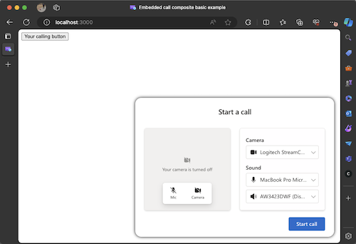

# Get started with Azure Communication Services UI library JavaScript bundles calling to Teams Call Queue and Auto Attendant

[!INCLUDE [Public Preview Notice](../../includes/public-preview-include.md)]

To facilitate better business to customer communications the [Azure Communication Services UI Library](https://azure.github.io/communication-ui-library/?path=/docs/overview--page) provides JavaScript bundles to try out cross platform solutions for using the UI Library. This tutorial is the fastest way from getting into a call using the UI library and Teams.

Following this tutorial will:

- Allow you to place a calling experience on any webpage connecting your customers to your business
- Create a calling experience in other platforms other than [React](https://react.dev/)

## Prerequisites

These steps **need** to be completed before you can complete the whole experience. Reach out to your Teams administrator if you have questions about setting up the Teams Voice Applications.

- [Visual Studio Code](https://code.visualstudio.com/) on one of the [supported platforms](https://code.visualstudio.com/docs/supporting/requirements#_platforms).
- [Node.js](https://nodejs.org/), Active LTS and Maintenance LTS versions [Node 18 LTS](https://nodejs.org/en) is recommended. Use the `node --version` command to check your version.
- An Azure Communication Services resource. [Create a Communications Resource](../../quickstarts/create-communication-resource.md)
- Complete the Teams tenant setup in [Teams Call Queues](../../quickstarts/voice-video-calling/get-started-teams-call-queue.md)
- Working with [Teams Call Queues](../../quickstarts/voice-video-calling/get-started-teams-call-queue.md) and Azure Communication Services.
- Working with [Teams Auto Attendants](../../quickstarts/voice-video-calling/get-started-teams-auto-attendant.md) and Azure Communication Services.

#### Checking for Node and VS Code

You can check that [Node](https://nodejs.org/) was installed correctly with this command.

```bash
node -v
```

The output tells you the version you have installed, it fails if Node isn't installed and added to your `PATH`. Just like with Node you can check to see if [Visual Studio Code](https://code.visualstudio.com/) is installed with this command.

```bash
code --version
```

Like with Node this command fails if there's an issue installing VS Code on your machine.

## Getting started

We create this project through **4** easy steps.
1. [Create the project](#1-creating-the-project)
2. [Get the code](#2-getting-the-code)
3. [Set up Azure Communication Services and Teams](#3-setting-up-azure-communication-services-and-teams)
4. [Run the Application](#4-running-the-application)

#### 1. Creating the project

To get started, we're going to make a new folder for the project run the following command in terminal or PowerShell.

```bash
mkdir ui-library-js-test-application && cd ui-library-js-test-application
```

This script creates a new folder and move you into it. Alternatively you can run this other script to create a `node` project in the directory you're currently in.

```bash
mkdir ui-library-js-test-application && cd ui-library-js-test-application && npm init -y
```

Next we want to make a new file called `index.html`. If you didn't make a new Node project you can make this file in the directory you are in. Otherwise create a new directory called `public` and make the `index.html` there.

#### 2. Getting the code

First you want to download the **JavaScript bundle** from [here](https://github.com/Azure/communication-ui-library/releases/download/PublicPreview%2F1.16.0-beta.1/outboundCallComposite.js). Put this bundle in the same directory as your `index.html`.

Next you want to open `index.html` in VS Code and add the following snippet.

```html
<!DOCTYPE html>

<head>
  <meta charset="utf-8" />
  <title>Embedded call composite basic example</title>
  <style>
    /* These styles are something we provide for the calling experience, please update for your needs */
    /* these apply to the calling experience you will need to style your button how your desire */
    #outbound-call-composite-container-ready {
      height: 22rem;
      width: 32rem;
      position: absolute;
      bottom: 1rem;
      right: 1rem;
      box-shadow: 0 0 0.5rem 0;
      border-radius: 1rem;
      padding: 0.5rem;
      z-index: 5;
    }
  </style>
</head>

<body>
  <div id="outbound-call-composite-container"></div>
  <button id="start-call-button">Your calling button</button>
  <!-- replace with https://github.com/Azure/communication-ui-library/releases/latest/download/outboundCallComposite.js for development and prototyping -->
  <script src="./outboundCallComposite.js"></script>
  <script type="module">
    const createCallingExperience = async () => {
      const userId = { communicationUserId: "<Add your ACS ID here>" };
      const token = "<Enter your ACS token>";
      const displayName = "Enter the DisplayName for your user";

      const callAdapter = await outboundCallComposite.loadCallComposite(
        {
          userId: userId,
          token: token,
          displayName: displayName,
          targetCallees: [
            { teamsAppId: "<Enter your TeamsApp ID here>", cloud: "public" },
          ], // Provide the identifier you want to call, can be flat as a string.
        },
        document.getElementById("outbound-call-composite-container")
      );

      window.onbeforeunload = () => {
        callAdapter.dispose();
      };
      // Update the container id to trigger the styles we set above
      const container = document.getElementById("outbound-call-composite-container");
      container.setAttribute("id", "outbound-call-composite-container-ready");
    };
    const startCallButton = document.getElementById("start-call-button");
    startCallButton.onclick = createCallingExperience;
  </script>
</body>
```
It's important here to note that this file `index.html` and the JavaScript bundle `outboundCallComposite.js` **need** to be in the same folder if you wish to not edit any of the importing in this file.

#### 3. Setting up Azure Communication Services and Teams

Next we want to create the local user's [identity](../../quickstarts/identity/access-tokens.md) so that we can use that to authenticate our local user and start the call. Once you have those values for the `id` and `token` for the user, we want to make some edits in the `index.html` file we made earlier.

```JavaScript
const userId = { communicationUserId: "<Add your ACS ID here>" };
const token = "<Enter your ACS token>";
const displayName = "Enter the DisplayName for your user";
```
We want to update this information with the `userId` and `token` you got from Azure portal or the Azure CLI. You should also as well set your `displayName`.

Next we want to make an edit to set the Teams voice app ID you got earlier when you [federated your Azure Communication services resource](../../quickstarts/voice-video-calling/get-started-teams-call-queue.md). **Contact your Teams admin if this hasn't been done.**

```JavaScript
const callAdapter = await outboundCallComposite.loadCallComposite(
    {
        userId: userId,
        token: token,
        displayName: displayName,
        targetCallees: [
        { teamsAppId: "<Enter your TeamsApp ID here>", cloud: "public" }, // <- update this teamsAppId value.
        ], // Provide the identifier you want to call, can be flat as a string.
    },
    document.getElementById("outbound-call-composite-container")
);
```

#### 4. Running the application
Now that we finished all the setup it's time to run the application.

Open a terminal or PowerShell window in that directory and run the following command.
```bash
npx http-server -p 3000
```
This script using Node starts an HTTP server and host the `index.html` file and JavaScript bundle. In a browser open http://localhost:3000. You should see a white page with a button and when you click it you should see the following screen.



Clicking the `start call` button seen in the [UI Library `CallComposite`](https://azure.github.io/communication-ui-library/?path=/docs/composites-call-basicexample--basic-example)  will initiate a call to your Teams voice app.

## Next steps

For more information about Teams voice applications, check out our documentation on Teams auto attendants and Teams call queues. Or also see our tutorial to build a more complete experience using [React](https://react.dev/).

> [!div class="nextstepaction"] 

> [Quickstart: Join your calling app to a Teams call queue](../../quickstarts/voice-video-calling/get-started-teams-call-queue.md)

> [Quickstart: Join your calling app to a Teams Auto Attendant](../../quickstarts/voice-video-calling/get-started-teams-auto-attendant.md)

> [Quickstart: Get started with Azure Communication Services UI library calling to Teams Call Queue and Auto Attendant](./calling-widget-tutorial.md)
