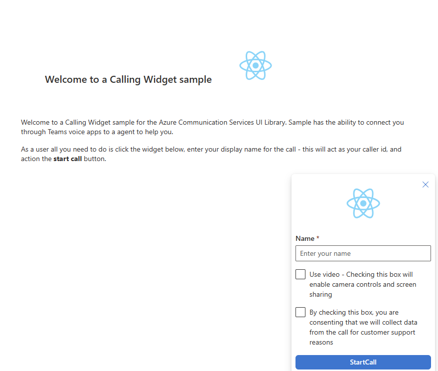

# Get started with a click to call experience using Azure Communication Services 

[!INCLUDE [Public Preview Notice](../../includes/public-preview-include.md)]



This project aims to guide developers on creating a seamless click to call experience using the Azure Communication UI Library.

As per your requirements, you may need to offer your customers an easy way to reach out to you without any complex setup.

Click to call is a simple yet effective concept that facilitates instant interaction with, customer support, financial advisor, and other customer-facing teams. The goal of this tutorial is to assist you in making interactions with your customers just a click away.

If you wish to try it out, you can download the code from [GitHub](https://github.com/Azure-Samples/communication-services-javascript-quickstarts/tree/main/ui-library-click-to-call).

Following this tutorial will:

- Allow you to control your customers audio and video experience depending on your customer scenario
- Move your customers call into a new window so they can continue browsing while on the call


This tutorial is broken down into three parts:

- Creating your widget
- using post messaging to start a calling experience in a new window
- Embed your calling experience

## Prerequisites

- [Visual Studio Code](https://code.visualstudio.com/) on one of the [supported platforms](https://code.visualstudio.com/docs/supporting/requirements#_platforms).
- [Node.js](https://nodejs.org/), Active LTS and Maintenance LTS versions (10.14.1 recommended). Use the `node --version` command to check your version.


### Set up the project

Only use this step if you are creating a new application.

To set up the react App, we use the `create-react-app` command line tool. This tool
creates an easy to run TypeScript application powered by React. This command will create a simple react application using TypeScript.

```bash
# Create an Azure Communication Services App powered by React.
npx create-react-app ui-library-click-to-call-app --template typescript

# Change to the directory of the newly created App.
cd ui-library-click-to-call-app
```

### Get your dependencies

Then you need to update the dependency array in the `package.json` to include some beta and alpha packages from Azure Communication Services for this to work:
```json
"@azure/communication-calling": "1.14.1-beta.1",
"@azure/communication-chat": "1.3.2-beta.2",
"@azure/communication-react": "1.7.0-beta.1",
"@azure/communication-calling-effects": "1.0.1",
"@fluentui/react-icons": "~2.0.203",
"@fluentui/react": "~8.98.3",
```

Once you run these commands, you’re all set to start working on your new project. In this tutorial, we are modifying the files in the `src` directory.


## Initial app setup

To get started, we replace the provided `App.tsx` content with a main page that will:

- Store all of the Azure Communication information that we need to create a CallAdapter to power our Calling experience
- Control the different pages of our application
- Register the different fluent icons we use in the UI library and some new ones for our purposes

`src/App.tsx`

```ts
// imports needed
import { CallAdapterLocator } from '@azure/communication-react';
import './App.css';
import { useEffect, useMemo, useState } from 'react';
import { CommunicationIdentifier, CommunicationUserIdentifier } from '@azure/communication-common';
import { Spinner, Stack, initializeIcons, registerIcons } from '@fluentui/react';
import { CallAdd20Regular, Dismiss20Regular } from '@fluentui/react-icons';
```

```ts
type AppPages = "calling-widget" | "new-window-call";

registerIcons({
  icons: { dismiss: <Dismiss20Regular />, callAdd: <CallAdd20Regular /> },
});
initializeIcons();
function App() {
  const [page, setPage] = useState<AppPages>("calling-widget");

  /**
   * Token for local user.
   */
  const token = "<Enter your Azure Communication Services token here>";

  /**
   * User identifier for local user.
   */
  const userId: CommunicationIdentifier = {
    communicationUserId: "<Enter your user Id>",
  };

  /**
   * This decides where the call will be going. This supports many different calling modalities in the Call Composite.
   *
   * - Teams meeting locator: {meetingLink: 'url to join link for a meeting'}
   * - Azure Communication Services group call: {groupId: 'GUID that defines the call'}
   * - Azure Communication Services Rooms call: {roomId: 'guid that represents a rooms call'}
   * - Teams adhoc, Azure communications 1:n, PSTN calls all take a participants locator: {participantIds: ['Array of participant id's to call']}
   *
   * You can call teams voice apps like a Call queue with the participants locator.
   */
  const locator: CallAdapterLocator = {
    participantIds: ["<Enter Participant Id's here>"],
  };

  /**
   * The phone number needed from your Azure Communication Services resource to start a PSTN call. Can be created under the phone numbers.
   *
   * For more information on phone numbers and Azure Communication Services go to this link: https://learn.microsoft.com/en-us/azure/communication-services/concepts/telephony/plan-solution
   *
   * This can be left alone if not making a PSTN call.
   */
  const alternateCallerId = "<Enter your alternate CallerId here>";

  switch (page) {
    case "calling-widget": {
      return (
        <Stack verticalAlign='center' style={{ height: "100%", width: "100%" }}>
          <Spinner
            label={"Getting user credentials from server"}
            ariaLive="assertive"
            labelPosition="top"
          />
        </Stack>
      );
    }
    case "new-window-call": {
      return (
        <Stack verticalAlign='center' style={{ height: "100%", width: "100%" }}>
          <Spinner
            label={"Getting user credentials from server"}
            ariaLive="assertive"
            labelPosition="top"
          />
        </Stack>
      );
    }
    default: {
      return <>Something went wrong!</>
    }
  }
}

export default App;
```
In this snippet we register two new icons `<Dismiss20Regular/>` and `<CallAdd20Regular>`. These new icons are used inside the widget component that we are creating later.

### Running the app

We can then test to see that the basic application is working by running:

```bash
# Install the newe dependencies
npm install

# run the React app
npm run start
```

Once the app is running, you can see it on `http://localhost:3000` in your browser. You should see a little spinner saying: `getting credentials from server` as
a test message.

## Next steps

> [!div class="nextstepaction"]
> [Part 1: Creating your widget](./calling-widget-tutorial-part-1-creating-your-widget.md)