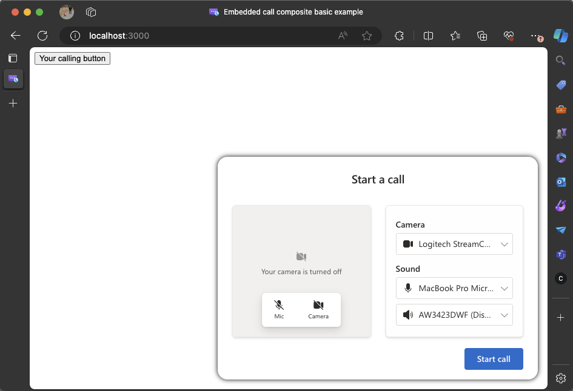

# Get started with Azure Communication Services UI library Calling to Teams Voice Applications

This project aims to guide developers to initiate a call from the Azure Communication Services Calling Web SDK to [Teams Call Queue](/microsoftteams/create-a-phone-system-call-queue?tabs=general-info) and [Auto Attendant](/microsoftteams/create-a-phone-system-auto-attendant?tabs=general-info) using the Azure Communication Services [UI Library](https://azure.github.io/communication-ui-library/?path=/docs/overview--page).

As per your requirements, you might need to offer your customers an easy way to reach out to you without any complex setup like emailing a meeting link. Calling to Teams Call Queue and Auto Attendant is a simple yet effective concept that facilitates instant interaction with customer support, financial advisors, or other customer-facing teams. By reducing the time that it takes to have your customers connect with you the faster you can address their requests.

Using the Azure Communication Services UI Library you can quickly connect your customers to you without any extra application installations. These articles are to help you create rich calling experiences to best support your customers. We provide different articles to set up your experience depending on your needs.

## Choosing your adventure

We provide three ways to experience our Calling Widget. Feel free to choose any of the three options, but we highly recommend checking out our quickstart in the run it section if you’re new to coding.

#### Run it
If you want to try out the experience without following either of the tutorials, check out the [completed quickstart](https://github.com/Azure-Samples/communication-services-javascript-quickstarts/tree/main/ui-library-click-to-call) and follow the instructions to run the experience. Choose this path if you are unfamiliar with coding and just want to see what the calling widget can do. You **need** to meet the [prerequisites](./calling-widget-tutorial.md#prerequisites) of the other two developer tutorials to complete this experience.

#### Build it - Platform: React

A complete start to finish tutorial built using [React](https://react.dev/) that teaches you to create a Calling widget using [Fluent UI](https://developer.microsoft.com/en-us/fluentui#/) and the UI Library.
- [Get started with Azure Communication Services UI library calling to Teams Call Queue and Auto Attendant](./calling-widget-tutorial.md)

]](../media/calling-widget/sample-app-splash-widget-open.png#lightbox)

#### Build it - Cross-platform: JavaScript

[!INCLUDE [Public Preview Notice](../../includes/public-preview-include.md)]

We also include JavaScript bundles that you can use to integrate our `CallComposite` Calling experiences into your application that is not built in react. This tutorial uses our precompiled JavaScript bundles to integrate the `CallComposite` into your web page.
- [Get started with Azure Communication Services UI library JavaScript bundles calling to Teams Call Queue and Auto Attendant](./calling-widget-js-tutorial.md)

[].](../media/calling-widget/js-bundle-splash.png#lightbox)

## Next steps

For more information about Teams voice applications, check out our documentation on Teams auto attendants and Teams call queues.

> [!div class="nextstepaction"] 

> [Quickstart: Join your calling app to a Teams call queue](../../quickstarts/voice-video-calling/get-started-teams-call-queue.md)

> [Quickstart: Join your calling app to a Teams Auto Attendant](../../quickstarts/voice-video-calling/get-started-teams-auto-attendant.md)

