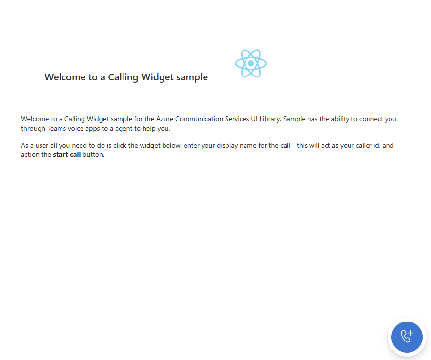

# Part 1 creating your widget

[!INCLUDE [Public Preview Notice](../../includes/public-preview-include.md)]

To begin, we're going to make a new component. This component will serve as the widget for initiating the click to call experience.

We are using our own widget setup for this tutorial but you can expand the functionality to suit your needs. For us, we have the widget perform the following actions:
- Display a custom logo. This can be replaced with another image or branding of your choosing. Feel free to download the image from the code if you would like to use our image.
- Let the user decide if they want to include video in the call.
- Obtain the user’s consent regarding the possibility of the call being recorded.

First step will be to create a new directory called `src/components`. Within this directory, we're going to create a new file named `CallingWidgetComponent.tsx`. We'll then proceed to set up the widget component with the following imports:

`CallingWidgetComponent.tsx`
```ts
// imports needed
import { IconButton, PrimaryButton, Stack, TextField, useTheme, Checkbox, Icon } from '@fluentui/react';
import React, { useEffect, useState } from 'react';
```

Now let's introduce an interface containing the props that the component uses.

`CallingWidgetComponent.tsx`
```ts
export interface clickToCallComponentProps {
  /**
   * Handler to start a new call.
   */
  onRenderStartCall: () => void;
  /**
   * Custom render function for displaying logo.
   * @returns
   */
  onRenderLogo?: () => JSX.Element;
  /**
   * Handler to set displayName for the user in the call.
   * @param displayName
   * @returns
   */
  onSetDisplayName?: (displayName: string | undefined) => void;
  /**
   * Handler to set whether to use video in the call.
   */
  onSetUseVideo?: (useVideo: boolean) => void;
}
```

Each callback controls different behaviors for the calling experience.

- `onRenderStartCall` - This callback is used to trigger any handlers in your app to do things like create a new window for your click to call experience.
- `onRenderLogo` - This is used as a rendering callback to have a custom logo or image render inside the widget when getting user information.
- `onSetDisplayName` - We use this callback to set the `displayName` of the participant when they're calling your support center.
- `onSetUseVideo` - Finally, this callback is used to control for our tutorial whether the user will have camera and screen sharing controls (more on that later).

Finally, we add the body of the component.

`src/views/CallingWidgetComponent.tsx`
```ts
/**
 * Widget for Calling Widget
 * @param props
 */
export const CallingWidgetComponent = (
  props: clickToCallComponentProps
): JSX.Element => {
  const { onRenderStartCall, onRenderLogo, onSetDisplayName, onSetUseVideo } =
    props;

  const [widgetState, setWidgetState] = useState<"new" | "setup">();
  const [displayName, setDisplayName] = useState<string>();
  const [consentToData, setConsentToData] = useState<boolean>(false);

  const theme = useTheme();

  useEffect(() => {
    if (widgetState === "new" && onSetUseVideo) {
      onSetUseVideo(false);
    }
  }, [widgetState, onSetUseVideo]);

  /** widget template for when widget is open, put any fields here for user information desired */
  if (widgetState === "setup" && onSetDisplayName && onSetUseVideo) {
    return (
      <Stack
        styles={clicktoCallSetupContainerStyles(theme)}
        tokens={{ childrenGap: "1rem" }}
      >
        <IconButton
          styles={collapseButtonStyles}
          iconProps={{ iconName: "Dismiss" }}
          onClick={() => setWidgetState("new")}
        />
        <Stack tokens={{ childrenGap: "1rem" }} styles={logoContainerStyles}>
          <Stack style={{ transform: "scale(1.8)" }}>
            {onRenderLogo && onRenderLogo()}
          </Stack>
        </Stack>
        <TextField
          label={"Name"}
          required={true}
          placeholder={"Enter your name"}
          onChange={(_, newValue) => {
            setDisplayName(newValue);
          }}
        />
        <Checkbox
          styles={checkboxStyles(theme)}
          label={
            "Use video - Checking this box will enable camera controls and screen sharing"
          }
          onChange={(_, checked?: boolean | undefined) => {
            onSetUseVideo(!!checked);
          }}
        ></Checkbox>
        <Checkbox
          required={true}
          styles={checkboxStyles(theme)}
          label={
            "By checking this box you are consenting that we collect data from the call for customer support reasons"
          }
          onChange={(_, checked?: boolean | undefined) => {
            setConsentToData(!!checked);
          }}
        ></Checkbox>
        <PrimaryButton
          styles={startCallButtonStyles(theme)}
          onClick={() => {
            if (displayName && consentToData) {
              onSetDisplayName(displayName);
              onRenderStartCall();
            }
          }}
        >
          StartCall
        </PrimaryButton>
      </Stack>
    );
  }

  /** default waiting state for the widget */
  return (
    <Stack
      horizontalAlign="center"
      verticalAlign="center"
      styles={clickToCallContainerStyles(theme)}
      onClick={() => {
        setWidgetState("setup");
      }}
    >
      <Stack
        horizontalAlign="center"
        verticalAlign="center"
        style={{
          height: "4rem",
          width: "4rem",
          borderRadius: "50%",
          background: theme.palette.themePrimary,
        }}
      >
        <Icon iconName="callAdd" styles={callIconStyles(theme)} />
      </Stack>
    </Stack>
  );
};
```

### Time for some styles

Once you have your component, you need some styles to give it a visually appealing look. For this, we'll create a new folder named `src/styles`. Within this folder we'll create a new file called `CallingWidgetComponent.styles.ts` and add the following styles.

`src/styles/CallingWidgetComponent.styles.ts`

```ts
// needed imports
import { IButtonStyles, ICheckboxStyles, IIconStyles, IStackStyles, Theme } from '@fluentui/react';
```
`CallingWidgetComponent.styles.ts`
```ts
export const checkboxStyles = (theme: Theme): ICheckboxStyles => {
  return {
    label: {
      color: theme.palette.neutralPrimary,
    },
  };
};

export const clickToCallContainerStyles = (theme: Theme): IStackStyles => {
  return {
    root: {
      width: "5rem",
      height: "5rem",
      padding: "0.5rem",
      boxShadow: theme.effects.elevation16,
      borderRadius: "50%",
      bottom: "1rem",
      right: "1rem",
      position: "absolute",
      overflow: "hidden",
      cursor: "pointer",
      ":hover": {
        boxShadow: theme.effects.elevation64,
      },
    },
  };
};

export const clicktoCallSetupContainerStyles = (theme: Theme): IStackStyles => {
  return {
    root: {
      width: "18rem",
      minHeight: "20rem",
      maxHeight: "25rem",
      padding: "0.5rem",
      boxShadow: theme.effects.elevation16,
      borderRadius: theme.effects.roundedCorner6,
      bottom: 0,
      right: "1rem",
      position: "absolute",
      overflow: "hidden",
      cursor: "pointer",
      background: theme.palette.white
    },
  };
};

export const callIconStyles = (theme: Theme): IIconStyles => {
  return {
    root: {
      paddingTop: "0.2rem",
      color: theme.palette.white,
      transform: "scale(1.6)",
    },
  };
};

export const startCallButtonStyles = (theme: Theme): IButtonStyles => {
  return {
    root: {
      background: theme.palette.themePrimary,
      borderRadius: theme.effects.roundedCorner6,
      borderColor: theme.palette.themePrimary,
    },
    textContainer: {
      color: theme.palette.white,
    },
  };
};

export const logoContainerStyles: IStackStyles = {
  root: {
    margin: "auto",
    padding: "0.2rem",
    height: "5rem",
    width: "10rem",
    zIndex: 0,
  },
};

export const collapseButtonStyles: IButtonStyles = {
  root: {
    position: "absolute",
    top: "0.2rem",
    right: "0.2rem",
    zIndex: 1,
  },
};
```

These styles should already be added to the widget as seen in the snippet earlier. If you added the snippet as is, these styles just need importing into the `CallingWidgetComponent.tsx` file.

`CallingWidgetComponent.tsx`
```ts

// add to other imports
import {
    clicktoCallSetupContainerStyles,
    checkboxStyles,
    startCallButtonStyles,
    clickToCallContainerStyles,
    callIconStyles,
    logoContainerStyles,
    collapseButtonStyles
} from '../styles/CallingWidgetComponent.styles';

```

### Adding the widget to the app

Now we create a new folder `src/views` and add a new file for one of our pages `CallingWidgetScreen.tsx`. This screen acts as our home page for the app where the user can start a new call.

We want to add the following props to the page:

`CallingWidgetScreen.tsx`

```ts
export interface CallingWidgetPageProps {
  token: string;
  userId:
    | CommunicationUserIdentifier
    | MicrosoftTeamsUserIdentifier;
  callLocator: CallAdapterLocator;
  alternateCallerId?: string;
}
```

These properties are fed by the values that we set in `App.tsx`. We'll use these props to make post messages to the app when we want to start a call in a new window (More on this later).

Next, lets add the page content:

`CallingWidgetScreen.tsx`
```ts
// imports needed
import { CommunicationUserIdentifier, MicrosoftTeamsUserIdentifier } from '@azure/communication-common';
import { Stack, Text } from '@fluentui/react';
import React, { useCallback, useEffect, useMemo, useState } from 'react';
import { CallingWidgetComponent } from '../components/CallingWidgetComponent';
import { CallAdapterLocator } from '@azure/communication-react';
// This import pulls in the place holder react logo from CRA, you can replace this with a logo or other image of your choosing
import logo from '../logo.svg';
```
```ts
export const CallingWidgetScreen = (props: CallingWidgetPageProps): JSX.Element => {
  const { token, userId, callLocator, alternateCallerId } = props;

  const [userDisplayName, setUserDisplayName] = useState<string>();
  const [useVideo, setUseVideo] = useState<boolean>(false);
  // we also want to make this memoized version of the args for the new window.
  const adapterParams = useMemo(() => {
    const args = {
      userId: userId as CommunicationUserIdentifier,
      displayName: userDisplayName ?? "",
      token,
      locator: callLocator,
      alternateCallerId,
    };
    return args;
  }, [userId, userDisplayName, token, callLocator, alternateCallerId]);

  return (
    <Stack
      style={{ height: "100%", width: "100%", padding: "3rem" }}
      tokens={{ childrenGap: "1.5rem" }}
    >
      <Stack style={{ margin: "auto" }}>
        <Stack
          style={{ padding: "3rem" }}
          horizontal
          tokens={{ childrenGap: "2rem" }}
        >
          <Text style={{ marginTop: "auto" }} variant="xLarge">
            Welcome to a Calling Widget sample
          </Text>
          
        </Stack>

        <Text>
          Welcome to a Calling Widget sample for the Azure Communication Services UI
          Library. Sample has the ability to:
        </Text>
        <ul>
          <li>
            Adhoc call teams users with a tenant set that allows for external
            calls
          </li>
          <li>Joining Teams interop meetings as a Azure Communication Services user</li>
          <li>Make a calling Widget PSTN call to a help phone line</li>
          <li>Join a Azure Communication Services group call</li>
        </ul>
        <Text>
          As a user all you need to do is click the widget below, enter your
          display name for the call - this will act as your caller id, and
          action the <b>start call</b> button.
        </Text>
      </Stack>
      <Stack
        horizontal
        tokens={{ childrenGap: "1.5rem" }}
        style={{ overflow: "hidden", margin: "auto" }}
      >
        <CallingWidgetComponent
        onRenderStartCall={() => {}}
          onRenderLogo={() => {
            return (
              
            );
          }}
          onSetDisplayName={setUserDisplayName}
          onSetUseVideo={setUseVideo}
        />
      </Stack>
    </Stack>
  );
};
```
This page provides general information on the current capabilities of our calling experiences, along with the addition of our previously created widget component. 

To integrate the widget screen, we simply update the existing `'calling-widget'` case in the root of the app `App.tsx`, by adding the new view.

`App.tsx`
```ts
// add this with the other imports

import { CallingWidgetScreen } from './views/CallingWidgetScreen';

```

```ts
    // we will replace the existing case statement with this
    case 'calling-widget': {
        if (!token || !userId || !locator) {
        return (
        <Stack verticalAlign='center' style={{height: '100%', width: '100%'}}>
            <Spinner label={'Waiting for user credentials'} ariaLive="assertive" labelPosition="top" />;
        </Stack>
        )
    }
    return <CallingWidgetScreen token={token} userId={userId} callLocator={locator} alternateCallerId={alternateCallerId}/>;
}
    
```

Once you have set the arguments defined in `App.tsx`, run the app with `npm run start` to see the changes:



Then when you action the widget button, you should see:


Yay! We have made the control surface for the widget! Next, we'll discuss what we need to add to make this widget start a call in a new window.

> [!div class="nextstepaction"]
> [Part 2: Creating a new window calling experience](./calling-widget-tutorial-part-2-creating-new-window-experience.md)