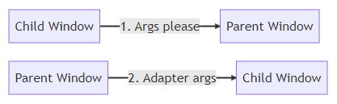
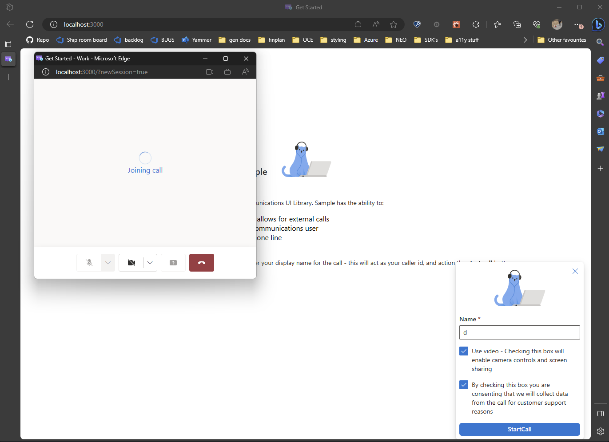

# Part 2 creating a new window calling experience

[!INCLUDE [Public Preview Notice](../../includes/public-preview-include.md)]

Now that we have a running application with our widget on the home page, we'll talk about starting the calling experience for your users with a new window. This scenario allows you to give your customer the ability to browse while still seeing your call in a new window. This can be useful in situations similar to when your users use video and screen sharing.

To begin, we'll create a new view in the `src/views` folder called `NewWindowCallScreen.tsx`. This new screen will be used by the `App.tsx` file to go into a new call with the arguments provided to it using our `CallComposite`. If desired, the `CallComposite` can be swapped with a stateful client and UI component experience if desired as well, but that won't be covered in this tutorial. For more information see our [storybook documentation](https://azure.github.io/communication-ui-library/?path=/docs/quickstarts-statefulcallclient--page) about the stateful client.

`src/views/NewWindowCallScreen.tsx`
```ts
// imports needed
import { CommunicationUserIdentifier, AzureCommunicationTokenCredential } from '@azure/communication-common';
import {
    CallAdapter,
    CallAdapterLocator,
    CallComposite,
    useAzureCommunicationCallAdapter
} from '@azure/communication-react';
import { Spinner, Stack } from '@fluentui/react';
import React, { useMemo } from 'react';
```
```ts
export const NewWindowCallScreen = (props: {
  adapterArgs: {
    userId: CommunicationUserIdentifier;
    displayName: string;
    token: string;
    locator: CallAdapterLocator;
    alternateCallerId?: string;
  };
  useVideo: boolean;
}): JSX.Element => {
  const { adapterArgs, useVideo } = props;

  const credential = useMemo(() => {
    try {
      return new AzureCommunicationTokenCredential(adapterArgs.token);
    } catch {
      console.error("Failed to construct token credential");
      return undefined;
    }
  }, [adapterArgs.token]);

  const args = useMemo(() => {
    return {
      userId: adapterArgs.userId,
      displayName: adapterArgs.displayName,
      credential,
      token: adapterArgs.token,
      locator: adapterArgs.locator,
      alternateCallerId: adapterArgs.alternateCallerId,
    };
  }, [
    adapterArgs.userId,
    adapterArgs.displayName,
    credential,
    adapterArgs.token,
    adapterArgs.locator,
    adapterArgs.alternateCallerId,
  ]);


  const afterCreate = (adapter: CallAdapter): Promise<CallAdapter> => {
    adapter.on("callEnded", () => {
      adapter.dispose();
      window.close();
    });
    adapter.joinCall(true);
    return new Promise((resolve, reject) => resolve(adapter));
  };

  const adapter = useAzureCommunicationCallAdapter(args, afterCreate);

  if (!adapter) {
    return (
      <Stack
        verticalAlign="center"
        styles={{ root: { height: "100vh", width: "100vw" } }}
      >
        <Spinner
          label={"Creating adapter"}
          ariaLive="assertive"
          labelPosition="top"
        />
      </Stack>
    );
  }
  return (
    <Stack styles={{ root: { height: "100vh", width: "100vw" } }}>
      <CallComposite
        options={{
          callControls: {
            cameraButton: useVideo,
            screenShareButton: useVideo,
            moreButton: false,
            peopleButton: false,
            displayType: "compact",
          },
          localVideoTileOptions: {
            position: !useVideo ? "hidden" : "floating",
          },
        }}
        adapter={adapter}
      />
    </Stack>
  );
};
```

To configure our `CallComposite` to fit in the Calling Widget, we need to make some changes. Depending on your use case, we have a number of customizations that can change the user experience. This sample chooses to hide the local video tile, camera, and screen sharing controls if the user opts out of video for their call. In addition to these configurations on the `CallComposite`, we use the `afterCreate` function defined in the snippet to automatically join the call. This bypasses the configuration screen and drop the user into the call with their mic live, as well auto close the window when the call ends. Just remove the call to `adapter.join(true);` from the `afterCreate` function and the configuration screen shows as normal. Next let's talk about how to get this screen the information once we have our `CallComposite` configured.

To make sure we are passing around data correctly, let's create some handlers to send post messages between the parent window and child window to signal that we want some information. See diagram:



This flow illustrates that if the child window has spawned, it needs to ask for the arguments. This behavior has to do with React and that if the parent window just sends a message right after creation, the call adapter arguments needed are lost before the application mounts. The adapter arguments are lost because in the new window the listener is not set yet until after a render pass completes. More on where these event handlers are made to come.

Now we want to update the splash screen we created earlier. First we add a reference to the new child window that we create.

`CallingWidgetScreen.tsx`

```ts
    
    const [userDisplayName, setUserDisplayName] = useState<string>();
    const newWindowRef = useRef<Window | null>(null);
    const [useVideo, setUseVideo] = useState<boolean>(false);
    
```

Next we create a handler that we pass to our widget that creates a new window that starts the process of sending the post messages.

`CallingWidgetScreen.tsx`
```ts
    
    const startNewWindow = useCallback(() => {
        const startNewSessionString = 'newSession=true';
        newWindowRef.current = window.open(
            window.origin + `/?${startNewSessionString}`,
            'call screen',
            'width=500, height=450'
        );
    }, []);
    
```

This handler starts a new window position and place a new query arg in the window URL so that the main application knows that it's time to start a new call. The path that you give the window can be a new path in your application where your calling experience exists. For us this will be the `NewWindowCallScreen.tsx` file but this can also be a React app on its own.

Next we add a `useEffect` hook that is creating an event handler listening for new post messages from the child window.

`CallingWidgetScreen.tsx`
```ts
    
    useEffect(() => {
        window.addEventListener('message', (event) => {
            if (event.origin !== window.origin) {
                return;
            }
            if (event.data === 'args please') {
                const data = {
                    userId: adapterParams.userId,
                    displayName: adapterParams.displayName,
                    token: adapterParams.token,
                    locator: adapterParams.locator,
                    alternateCallerId: adapterParams.alternateCallerId,
                    useVideo: useVideo
                };
                console.log(data);
                newWindowRef.current?.postMessage(data, window.origin);
            }
        });
    }, [adapterParams, adapterParams.locator, adapterParams.displayName, useVideo]);
    
```

This handler listens for events from the child window. (**NOTE: make sure that if the origin of the message is not from your app then return**) If the child window asks for arguments, we send it with the arguments needed to construct a `AzureCommunicationsCallAdapter`.

Finally on this screen, let's add the `startNewWindow` handler to the widget so that it knows to create the new window. We do this by adding the property to the template of the widget screen like below.

`CallingWidgetScreen.tsx`
```ts
    
    <Stack horizontal tokens={{ childrenGap: '1.5rem' }} style={{ overflow: 'hidden', margin: 'auto' }}>
        <CallingWidgetComponent
            onRenderStartCall={startNewWindow}
            onRenderLogo={() => {
                return (
                    
                );
            }}
            onSetDisplayName={setUserDisplayName}
            onSetUseVideo={setUseVideo}
        />
    </Stack>
    
```

Next, we need to make sure that our application can listen for and ask for the messages from what would be the parent window. First to start, you might recall that we added a new query parameter to the URL of the application `newSession=true`. To use this and have our app look for that in the URL, we need to create a utility function to parse out that parameter. Once we do that, we'll use it to make our application behave differently when it's received.

To do that, let's add a new folder `src/utils` and in this folder, we add the file `AppUtils.ts`. In this file let's put the following function:

`AppUtils.ts`
```ts
/**
 * get go ahead to request for adapter args from url
 * @returns
 */
export const getStartSessionFromURL = (): boolean | undefined => {
  const urlParams = new URLSearchParams(window.location.search);
  return urlParams.get("newSession") === "true";
};
```

This function will look into our application's URL and see if the parameters we're looking for are there. If desired, you can also stick some other parameters in there to extend other functionality for your application.

As well, we'll want to add a new type in here to track the different pieces needed to create a `AzureCommunicationCallAdapter`. This type can also be simplified if you are using our calling stateful client, this approach won't be covered in this tutorial though.

`AppUtils.ts`
```ts
/**
 * Properties needed to create a call screen for a  Azure Communication Services CallComposite.
 */
export type AdapterArgs = {
  token: string;
  userId: CommunicationIdentifier;
  locator: CallAdapterLocator;
  displayName?: string;
  alternateCallerId?: string;
};
```

Once we have added these two things, we can go back to the `App.tsx` file to make some more updates.

First thing we want to do is update `App.tsx` to use that new utility function that we created in `AppUtils.ts`. We want to use a `useMemo` hook for the `startSession` parameter so that it's fetched exactly once and not at every render. The fetch of `startSession` is done like so:

`App.tsx`
```ts
// you will need to add these imports
import { useMemo } from 'react';
import { AdapterArgs, getStartSessionFromURL } from './utils/AppUtils';

```

```ts

  const startSession = useMemo(() => {
    return getStartSessionFromURL();
  }, []);

```

Following this, we want to add some state to make sure that we're tracking the new arguments for the adapter. We pass these arguments to the `NewWindowCallScreen.tsx` view that we made earlier so it can construct an adapter. As well state to track whether the user wants to use video controls or not.

`App.tsx`
```ts
/**
   * Properties needed to start an Azure Communication Services CallAdapter. When these are set the app will go to the Call screen for the
   * click to call scenario. Call screen should create the credential that will be used in the call for the user.
   */
  const [adapterArgs, setAdapterArgs] = useState<AdapterArgs | undefined>();
  const [useVideo, setUseVideo] = useState<boolean>(false);
```

We now want to add an event listener to `App.tsx` to listen for post messages. Insert a `useEffect` hook with an empty dependency array so that we add the listener only once on the initial render.

`App.tsx`
```ts
import { CallAdapterLocator } from "@azure/communication-react";
import { CommunicationIdentifier } from '@azure/communication-common';
```
```ts

  useEffect(() => {
    window.addEventListener('message', (event) => {
      if (event.origin !== window.location.origin) {
        return;
      }

      if ((event.data as AdapterArgs).userId && (event.data as AdapterArgs).displayName !== '') {
        console.log(event.data);
        setAdapterArgs({
          userId: (event.data as AdapterArgs).userId as CommunicationUserIdentifier,
          displayName: (event.data as AdapterArgs).displayName,
          token: (event.data as AdapterArgs).token,
          locator: (event.data as AdapterArgs).locator,
          alternateCallerId: (event.data as AdapterArgs).alternateCallerId
        });
        setUseVideo(!!event.data.useVideo);
      }
    });
  }, []);

```
Next, we want to add two more `useEffect` hooks to `App.tsx`. These two hooks will:
- Ask the parent window of the application for arguments for the `AzureCommunicationCallAdapter`, we use the `window.opener` reference provided since this hook checks to see if it's the child window.
- Checks to see if we have the arguments appropriately set from the event listener fetching the arguments from the post message to start a call and change the app page to be the call screen.

`App.tsx`
```ts

  useEffect(() => {
    if (startSession) {
      console.log('asking for args');
      if (window.opener) {
        window.opener.postMessage('args please', window.opener.origin);
      }
    }
  }, [startSession]);

  useEffect(() => {
    if (adapterArgs) {
      console.log('starting session');
      setPage('new-window-call');
    }
  }, [adapterArgs]);

```
Finally, once we have done that, we want to add the new screen that we made earlier to the template as well. We also want to make sure that we do not show the Calling widget screen if the `startSession` parameter is found. Using this parameter this way avoids a flash for the user.

`App.tsx`
```ts
// add with other imports

import { NewWindowCallScreen } from './views/NewWindowCallScreen';

```

```ts

  switch (page) {
    case 'calling-widget': {
      if (!token || !userId || !locator || startSession !== false) {
        return (
          <Stack verticalAlign='center' style={{height: '100%', width: '100%'}}>
            <Spinner label={'Getting user credentials from server'} ariaLive="assertive" labelPosition="top" />;
          </Stack>
        )
        
      }
      return <CallingWidgetScreen token={token} userId={userId} callLocator={locator} alternateCallerId={alternateCallerId}/>;
    }
    case 'new-window-call': {
      if (!adapterArgs) {
        return (
          <Stack verticalAlign='center' style={{ height: '100%', width: '100%' }}>
            <Spinner label={'Getting user credentials from server'} ariaLive="assertive" labelPosition="top" />;
          </Stack>
        )
      }
      return (
        <NewWindowCallScreen
          adapterArgs={{
            userId: adapterArgs.userId as CommunicationUserIdentifier,
            displayName: adapterArgs.displayName ?? '',
            token: adapterArgs.token,
            locator: adapterArgs.locator,
            alternateCallerId: adapterArgs.alternateCallerId
          }}
          useVideo={useVideo}
        />
      );
    }
  }

```
Now, when the application runs in a new window, it sees that it's supposed to start a call so it will:
- Ask for the different Adapter arguments from the parent window
- Make sure that the adapter arguments are set appropriately and start a call

Now when you pass in the arguments, set your `displayName`, and click `Start Call` you should see the following screens:



With this new window experience, your users are able to:
- continue using other tabs in their browser or other applications and still be able to see your call
- resize the window to fit their viewing needs such as increasing the size to better see a screen share

This concludes the tutorial for click to call with a new window experience. Next will be an optional step to embed the calling surface into the widget itself keeping your users on their current page.

If you would like to learn more about the Azure Communication Services UI library, check out our [storybook documentation](https://azure.github.io/communication-ui-library/?path=/story/overview--page).

> [!div class="nextstepaction"]
> [Part 3: Embedding your calling experience](./calling-widget-tutorial-part-3-embedding-your-calling-experience.md)