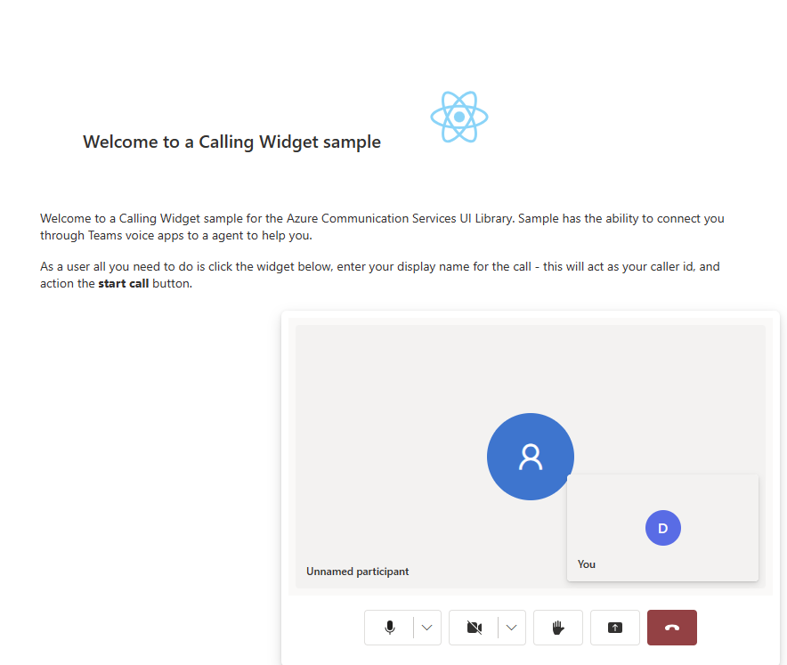

# Get started with Azure Communication Services UI library calling to Teams Voice Apps

This project aims to guide developers to initiate a call from the Azure Communication Services Calling Web SDK to Teams Call Queue and Auto Attendant using the Azure Communication UI Library.

As per your requirements, you might need to offer your customers an easy way to reach out to you without any complex setup.

Calling to Teams Call Queue and Auto Attendant is a simple yet effective concept that facilitates instant interaction with customer support, financial advisor, and other customer-facing teams. The goal of this tutorial is to assist you in initiating interactions with your customers when they click a button on the web.

If you wish to try it out, you can download the code from [GitHub](https://github.com/Azure-Samples/communication-services-javascript-quickstarts/tree/main/ui-library-click-to-call).

Following this tutorial will:

- Allow you to control your customers audio and video experience depending on your customer scenario
- Teach you how to build a widget for starting calls on your webapp using the UI library.


## Prerequisites
These steps are **needed** in order to follow this tutorial. Contact your Teams admin for the last two items to make sure you are set up appropriately.

- [Visual Studio Code](https://code.visualstudio.com/) on one of the [supported platforms](https://code.visualstudio.com/docs/supporting/requirements#_platforms).
- [Node.js](https://nodejs.org/), Active LTS (Long Term Support) and versions [Node 18](https://nodejs.org/en) is recommended. Use the `node --version` command to check your version.
- An Azure Communication Services resource. [Create a Communications Resource](../../quickstarts/create-communication-resource.md)
- Complete the Teams tenant setup in [Teams Call Queues](../../quickstarts/voice-video-calling/get-started-teams-call-queue.md)
- Working with [Teams Call Queues](../../quickstarts/voice-video-calling/get-started-teams-call-queue.md) and Azure Communication Services.
- Working with [Teams Auto Attendants](../../quickstarts/voice-video-calling/get-started-teams-auto-attendant.md) and Azure Communication Services.

### Set up the project

Only use this step if you're creating a new application.

To set up the react App, we use the `create-react-app` command line tool. This tool
creates an easy to run TypeScript application powered by React.

To make sure that you have Node installed on your machine, run this command in PowerShell or the terminal to see your Node version:

```bash
node -v
```

If you don't have `create-react-app` installed on your machine, run the following command to install it as a global command:

```bash
npm install -g create-react-app
```
After that command is installed, run this next command to create a new react application to build the sample in:

```bash
# Create an Azure Communication Services App powered by React.
npx create-react-app ui-library-calling-widget-app --template typescript

# Change to the directory of the newly created App.
cd ui-library-calling-widget-app
```

### Get your dependencies

Then, you need to update the dependency array in the `package.json` to include some packages from Azure Communication Services for the widget experience we're going to build to work:

```json
"@azure/communication-calling": "1.22.1",
"@azure/communication-chat": "1.4.0",
"@azure/communication-react": "1.13.0",
"@azure/communication-calling-effects": "1.0.1",
"@azure/communication-common": "2.3.0",
"@fluentui/react-icons": "~2.0.203",
"@fluentui/react": "~8.98.3",
```

After you add these packages to your `package.json`, you're all set to start working on your new project. In this tutorial, we are modifying the files in the `src` directory.

## Initial app setup

To get started, we replace the provided `App.tsx` content with a main page that will:

- Store all of the Azure Communication information that we need to create a CallAdapter to power our Calling experience
- Display our widget that is exposed to the end user.

Your `App.tsx` file should look like this:

`src/App.tsx`

```ts
import "./App.css";
import {
  CommunicationIdentifier,
  MicrosoftTeamsAppIdentifier,
} from "@azure/communication-common";
import {
  Spinner,
  Stack,
  initializeIcons,
  registerIcons,
  Text,
} from "@fluentui/react";
import { CallAdd20Regular, Dismiss20Regular } from "@fluentui/react-icons";
import logo from "./logo.svg";

import { CallingWidgetComponent } from "./components/CallingWidgetComponent";

registerIcons({
  icons: { dismiss: <Dismiss20Regular />, callAdd: <CallAdd20Regular /> },
});
initializeIcons();
function App() {
  /**
   * Token for local user.
   */
  const token = "<Enter your ACS Token here>";

  /**
   * User identifier for local user.
   */
  const userId: CommunicationIdentifier = {
    communicationUserId: "Enter your ACS Id here",
  };

  /**
   * Enter your Teams voice app identifier from the Teams admin center here
   */
  const teamsAppIdentifier: MicrosoftTeamsAppIdentifier = {
    teamsAppId: "<Enter your Teams Voice app id here>",
    cloud: "public",
  };

  const widgetParams = {
    userId,
    token,
    teamsAppIdentifier,
  };

  if (!token || !userId || !teamsAppIdentifier) {
    return (
      <Stack verticalAlign="center" style={{ height: "100%", width: "100%" }}>
        <Spinner
          label={"Getting user credentials from server"}
          ariaLive="assertive"
          labelPosition="top"
        />
        ;
      </Stack>
    );
  }

  return (
    <Stack
      style={{ height: "100%", width: "100%", padding: "3rem" }}
      tokens={{ childrenGap: "1.5rem" }}
    >
      <Stack tokens={{ childrenGap: "1rem" }} style={{ margin: "auto" }}>
        <Stack
          style={{ padding: "3rem" }}
          horizontal
          tokens={{ childrenGap: "2rem" }}
        >
          <Text style={{ marginTop: "auto" }} variant="xLarge">
            Welcome to a Calling Widget sample
          </Text>
          
        </Stack>

        <Text>
          Welcome to a Calling Widget sample for the Azure Communication
          Services UI Library. Sample has the ability to connect you through
          Teams voice apps to a agent to help you.
        </Text>
        <Text>
          As a user all you need to do is click the widget below, enter your
          display name for the call - this will act as your caller id, and
          action the <b>start call</b> button.
        </Text>
      </Stack>
      <Stack
        horizontal
        tokens={{ childrenGap: "1.5rem" }}
        style={{ overflow: "hidden", margin: "auto" }}
      >
        <CallingWidgetComponent
          widgetAdapterArgs={widgetParams}
          onRenderLogo={() => {
            return (
              
            );
          }}
        />
      </Stack>
    </Stack>
  );
}

export default App;

```

In this snippet, we register two new icons `<Dismiss20Regular/>` and `<CallAdd20Regular>`. These new icons are used inside the widget component that we're creating in the next section.

### Create the widget

Now we need to make a widget that can show in three different modes:
- Waiting: This widget state is how the component will be in before and after a call is made
- Setup: This state is when the widget asks for information from the user like their name.
- In a call: The widget is replaced here with the UI library Call Composite. This widget mode is when the user is calling the Voice app or talking with an agent.

Lets create a folder called `src/components`. In this folder, make a new file called `CallingWidgetComponent.tsx`. This file should look like the following snippet:

`CallingWidgetComponent.tsx`

```ts
import {
  IconButton,
  PrimaryButton,
  Stack,
  TextField,
  useTheme,
  Checkbox,
  Icon,
  Spinner,
} from "@fluentui/react";
import React, { useEffect, useRef, useState } from "react";
import {
  callingWidgetSetupContainerStyles,
  checkboxStyles,
  startCallButtonStyles,
  callingWidgetContainerStyles,
  callIconStyles,
  logoContainerStyles,
  collapseButtonStyles,
} from "../styles/CallingWidgetComponent.styles";

import {
  AzureCommunicationTokenCredential,
  CommunicationUserIdentifier,
  MicrosoftTeamsAppIdentifier,
} from "@azure/communication-common";
import {
  CallAdapter,
  CallAdapterState,
  CallComposite,
  CommonCallAdapterOptions,
  StartCallIdentifier,
  createAzureCommunicationCallAdapter,
} from "@azure/communication-react";
// lets add to our react imports as well
import { useMemo } from "react";

import { callingWidgetInCallContainerStyles } from "../styles/CallingWidgetComponent.styles";

/**
 * Properties needed for our widget to start a call.
 */
export type WidgetAdapterArgs = {
  token: string;
  userId: CommunicationUserIdentifier;
  teamsAppIdentifier: MicrosoftTeamsAppIdentifier;
};

export interface CallingWidgetComponentProps {
  /**
   *  arguments for creating an AzureCommunicationCallAdapter for your Calling experience
   */
  widgetAdapterArgs: WidgetAdapterArgs;
  /**
   * Custom render function for displaying logo.
   * @returns
   */
  onRenderLogo?: () => JSX.Element;
}

/**
 * Widget for Calling Widget
 * @param props
 */
export const CallingWidgetComponent = (
  props: CallingWidgetComponentProps
): JSX.Element => {
  const { onRenderLogo, widgetAdapterArgs } = props;

  const [widgetState, setWidgetState] = useState<"new" | "setup" | "inCall">(
    "new"
  );
  const [displayName, setDisplayName] = useState<string>();
  const [consentToData, setConsentToData] = useState<boolean>(false);
  const [useLocalVideo, setUseLocalVideo] = useState<boolean>(false);
  const [adapter, setAdapter] = useState<CallAdapter>();

  const callIdRef = useRef<string>();

  const theme = useTheme();

  // add this before the React template
  const credential = useMemo(() => {
    try {
      return new AzureCommunicationTokenCredential(widgetAdapterArgs.token);
    } catch {
      console.error("Failed to construct token credential");
      return undefined;
    }
  }, [widgetAdapterArgs.token]);

  const adapterOptions: CommonCallAdapterOptions = useMemo(
    () => ({
      callingSounds: {
        callEnded: { url: "/sounds/callEnded.mp3" },
        callRinging: { url: "/sounds/callRinging.mp3" },
        callBusy: { url: "/sounds/callBusy.mp3" },
      },
    }),
    []
  );

  const callAdapterArgs = useMemo(() => {
    return {
      userId: widgetAdapterArgs.userId,
      credential: credential,
      targetCallees: [
        widgetAdapterArgs.teamsAppIdentifier,
      ] as StartCallIdentifier[],
      displayName: displayName,
      options: adapterOptions,
    };
  }, [
    widgetAdapterArgs.userId,
    widgetAdapterArgs.teamsAppIdentifier.teamsAppId,
    credential,
    displayName,
  ]);

  useEffect(() => {
    if (adapter) {
      adapter.on("callEnded", () => {
        /**
         * We only want to reset the widget state if the call that ended is the same as the current call.
         */
        if (
          adapter.getState().acceptedTransferCallState &&
          adapter.getState().acceptedTransferCallState?.id !== callIdRef.current
        ) {
          return;
        }
        setDisplayName(undefined);
        setWidgetState("new");
        setConsentToData(false);
        setAdapter(undefined);
        adapter.dispose();
      });

      adapter.on("transferAccepted", (e) => {
        console.log("transferAccepted", e);
      });

      adapter.onStateChange((state: CallAdapterState) => {
        if (state?.call?.id && callIdRef.current !== state?.call?.id) {
          callIdRef.current = state?.call?.id;
          console.log(`Call Id: ${callIdRef.current}`);
        }
      });
    }
  }, [adapter]);

  /** widget template for when widget is open, put any fields here for user information desired */
  if (widgetState === "setup") {
    return (
      <Stack
        styles={callingWidgetSetupContainerStyles(theme)}
        tokens={{ childrenGap: "1rem" }}
      >
        <IconButton
          styles={collapseButtonStyles}
          iconProps={{ iconName: "Dismiss" }}
          onClick={() => {
            setDisplayName(undefined);
            setConsentToData(false);
            setUseLocalVideo(false);
            setWidgetState("new");
          }}
        />
        <Stack tokens={{ childrenGap: "1rem" }} styles={logoContainerStyles}>
          <Stack style={{ transform: "scale(1.8)" }}>
            {onRenderLogo && onRenderLogo()}
          </Stack>
        </Stack>
        <TextField
          label={"Name"}
          required={true}
          placeholder={"Enter your name"}
          onChange={(_, newValue) => {
            setDisplayName(newValue);
          }}
        />
        <Checkbox
          styles={checkboxStyles(theme)}
          label={
            "Use video - Checking this box will enable camera controls and screen sharing"
          }
          onChange={(_, checked?: boolean | undefined) => {
            setUseLocalVideo(!!checked);
            setUseLocalVideo(true);
          }}
        ></Checkbox>
        <Checkbox
          required={true}
          styles={checkboxStyles(theme)}
          disabled={displayName === undefined}
          label={
            "By checking this box, you are consenting that we will collect data from the call for customer support reasons"
          }
          onChange={async (_, checked?: boolean | undefined) => {
            setConsentToData(!!checked);
            if (callAdapterArgs && callAdapterArgs.credential) {
              setAdapter(
                await createAzureCommunicationCallAdapter({
                  displayName: displayName ?? "",
                  userId: callAdapterArgs.userId,
                  credential: callAdapterArgs.credential,
                  targetCallees: callAdapterArgs.targetCallees,
                  options: callAdapterArgs.options,
                })
              );
            }
          }}
        ></Checkbox>
        <PrimaryButton
          styles={startCallButtonStyles(theme)}
          onClick={() => {
            if (displayName && consentToData && adapter) {
              setWidgetState("inCall");
              adapter?.startCall(callAdapterArgs.targetCallees, {
                audioOptions: { muted: false },
              });
            }
          }}
        >
          {!consentToData && `Enter your name`}
          {consentToData && !adapter && (
            <Spinner ariaLive="assertive" labelPosition="top" />
          )}
          {consentToData && adapter && `StartCall`}
        </PrimaryButton>
      </Stack>
    );
  }

  if (widgetState === "inCall" && adapter) {
    return (
      <Stack styles={callingWidgetInCallContainerStyles(theme)}>
        <CallComposite
          adapter={adapter}
          options={{
            callControls: {
              cameraButton: useLocalVideo,
              screenShareButton: useLocalVideo,
              moreButton: false,
              peopleButton: false,
              displayType: "compact",
            },
            localVideoTile: !useLocalVideo ? false : { position: "floating" },
          }}
        />
      </Stack>
    );
  }

  return (
    <Stack
      horizontalAlign="center"
      verticalAlign="center"
      styles={callingWidgetContainerStyles(theme)}
      onClick={() => {
        setWidgetState("setup");
      }}
    >
      <Stack
        horizontalAlign="center"
        verticalAlign="center"
        style={{
          height: "4rem",
          width: "4rem",
          borderRadius: "50%",
          background: theme.palette.themePrimary,
        }}
      >
        <Icon iconName="callAdd" styles={callIconStyles(theme)} />
      </Stack>
    </Stack>
  );
};
```

#### Style the widget

We need to write some styles to make sure the widget looks appropriate and can hold our call composite. These styles should already be used in the widget if copying the snippet we added to the file `CallingWidgetComponent.tsx`.

Lets make a new folder called `src/styles` in this folder, create a file called `CallingWidgetComponent.styles.ts`. The file should look like the following snippet:

```ts
import {
  IButtonStyles,
  ICheckboxStyles,
  IIconStyles,
  IStackStyles,
  Theme,
} from "@fluentui/react";

export const checkboxStyles = (theme: Theme): ICheckboxStyles => {
  return {
    label: {
      color: theme.palette.neutralPrimary,
    },
  };
};

export const callingWidgetContainerStyles = (theme: Theme): IStackStyles => {
  return {
    root: {
      width: "5rem",
      height: "5rem",
      padding: "0.5rem",
      boxShadow: theme.effects.elevation16,
      borderRadius: "50%",
      bottom: "1rem",
      right: "1rem",
      position: "absolute",
      overflow: "hidden",
      cursor: "pointer",
      ":hover": {
        boxShadow: theme.effects.elevation64,
      },
    },
  };
};

export const callingWidgetSetupContainerStyles = (
  theme: Theme
): IStackStyles => {
  return {
    root: {
      width: "18rem",
      minHeight: "20rem",
      maxHeight: "25rem",
      padding: "0.5rem",
      boxShadow: theme.effects.elevation16,
      borderRadius: theme.effects.roundedCorner6,
      bottom: 0,
      right: "1rem",
      position: "absolute",
      overflow: "hidden",
      cursor: "pointer",
      background: theme.palette.white,
    },
  };
};

export const callIconStyles = (theme: Theme): IIconStyles => {
  return {
    root: {
      paddingTop: "0.2rem",
      color: theme.palette.white,
      transform: "scale(1.6)",
    },
  };
};

export const startCallButtonStyles = (theme: Theme): IButtonStyles => {
  return {
    root: {
      background: theme.palette.themePrimary,
      borderRadius: theme.effects.roundedCorner6,
      borderColor: theme.palette.themePrimary,
    },
    textContainer: {
      color: theme.palette.white,
    },
  };
};

export const logoContainerStyles: IStackStyles = {
  root: {
    margin: "auto",
    padding: "0.2rem",
    height: "5rem",
    width: "10rem",
    zIndex: 0,
  },
};

export const collapseButtonStyles: IButtonStyles = {
  root: {
    position: "absolute",
    top: "0.2rem",
    right: "0.2rem",
    zIndex: 1,
  },
};

export const callingWidgetInCallContainerStyles = (
  theme: Theme
): IStackStyles => {
  return {
    root: {
      width: "35rem",
      height: "25rem",
      padding: "0.5rem",
      boxShadow: theme.effects.elevation16,
      borderRadius: theme.effects.roundedCorner6,
      bottom: 0,
      right: "1rem",
      position: "absolute",
      overflow: "hidden",
      cursor: "pointer",
      background: theme.semanticColors.bodyBackground,
    },
  };
};
```

### Swap placeholders for identifiers

Before we run the app, go to `App.tsx` and replace the placeholder values there with your Azure Communication Services Identities and the identifier for your Teams Voice application. Here are input values for the `token`, `userId` and `teamsAppIdentifier`.

`./src/App.tsx`
```typescript
/**
 * Token for local user.
 */
const token = "<Enter your ACS Token here>";

/**
 * User identifier for local user.
 */
const userId: CommunicationIdentifier = {
  communicationUserId: "Enter your ACS Id here",
};

/**
 * Enter your Teams voice app identifier from the Teams admin center here
 */
const teamsAppIdentifier: MicrosoftTeamsAppIdentifier = {
  teamsAppId: "<Enter your Teams Voice app id here>",
  cloud: "public",
};
```

### Run the app

Finally we can run the application to make our calls! Run the following commands to install our dependencies and run our app.

```bash
# Install the newe dependencies
npm install

# run the React app
npm run start
```

Once the app is running, you can see it on `http://localhost:3000` in your browser. You should see the following splash screen:


Then when you action the widget button, you should see a little menu:


After you fill out your name, click start call and the call should begin. The widget should look like so after starting a call:



## Next steps

For more information about Teams voice applications, check out our documentation on Teams auto attendants and Teams call queues.

> [!div class="nextstepaction"] 

> [Quickstart: Join your calling app to a Teams call queue](../../quickstarts/voice-video-calling/get-started-teams-call-queue.md)

> [Quickstart: Join your calling app to a Teams Auto Attendant](../../quickstarts/voice-video-calling/get-started-teams-auto-attendant.md)
