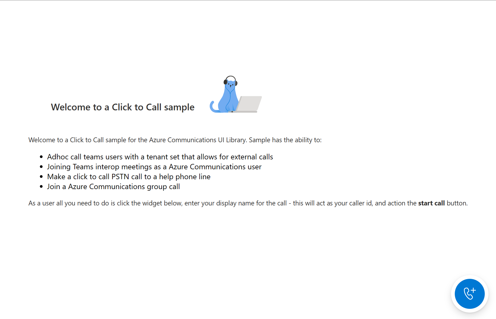

# Creating a Click to Call Experience with Azure Communication Services



This project is aimed to teach developers on how to create a Click to Call experience using the Azure Communication UI Library.

Depending on your needs, you might need to create an experience for your customers to be able to get a hold of you with minimal set up on their part.
Click to call is a concept that is meant for allowing instant interaction, whether that is reaching out to customer support, having a quick call with your financial advisor, or other customer facing teams. The goal of this tutorial is to help you make you one click away from your customers.

If you want to try it out, download the code [here](https://github.com/Azure-Samples/communication-services-javascript-quickstarts/tree/dmceachernmsft/c2c-tutorial/ui-library-click-to-call).

Following this tutorial will:

- Allow you to control your customers audio and video experience depending on your customer scenario
- Move your customers call into a new window so they can continue browsing while on the call


This tutorial will be broken down into three parts:

- Creating your widget
- using post messaging to start a calling experience in a new window
- Embed your calling experience


### Set up the project

If you are not creating a new application, you can skip this step.

To set up the react App, we'll use the create-react-app template. This `create-react-app` command
creates an easy to run TypeScript application powered by React. This command will also install the
Azure Communication Services packages that we need to run the sample as well.

```bash
# Create an Azure Communication Services App powered by React.
npx create-react-app ui-library-click-to-call-app --template communication-react

# Change to the directory of the newly created App.
cd ui-library-click-to-call-app
```

Then you need to update the dependency array in the `package.json` to include some beta and alpha packages for this to work:
```json
"@azure/communication-calling": "1.13.2-beta.1",
"@azure/communication-chat": "1.3.2-beta.2",
"@azure/communication-react": "1.5.2-beta.1",
"@azure/communication-calling-effects": "1.0.1",
"@fluentui/react-icons": "~2.0.203",
```

Once you have run these commands, you are in your new project ready to get started. For this tutorial, we are modifying the files in the
`src` directory.

## Initial App Setup

To get us started, we'll replace the provided `App.tsx` content with a main page that will:

- Store all of the Azure Communication information that we need to create a CallAdapter to power our Calling experience
- Control the different pages of our application
- Register the different fluent icons we use in the UI library and some new ones for our purposes

`src/App.tsx`

```ts
// imports needed
import { CallAdapterLocator } from '@azure/communication-react';
import './App.css';
import { useEffect, useMemo, useState } from 'react';
import { CommunicationIdentifier, CommunicationUserIdentifier } from '@azure/communication-common';
import { Spinner, Stack, initializeIcons, registerIcons } from '@fluentui/react';
import { CallAdd20Regular, Dismiss20Regular } from '@fluentui/react-icons';
```

```ts
type AppPages = "click-to-call" | "same-origin-call";

registerIcons({
  icons: { dismiss: <Dismiss20Regular />, callAdd: <CallAdd20Regular /> },
});
initializeIcons();
function App() {
  const [page, setPage] = useState<AppPages>("click-to-call");

  /**
   * Token for local user.
   */
  const token = "<Enter your Azure Communication Services token here>";

  /**
   * User identifier for local user.
   */
  const userId: CommunicationIdentifier = {
    communicationUserId: "<Enter your user Id>",
  };

  /**
   * This decides where the call will be going. This supports many different calling modalities in the Call Composite.
   *
   * - teams meeting locator: {meetingLink: 'url to join link for a meeting'}
   * - Azure communications group call: {groupId: 'GUID that defines the call'}
   * - Azure Communications Rooms call: {roomId: 'guid that represents a rooms call'}
   * - teams adhoc, Azure communications 1:n, PSTN calls all take a participants locator: {participantIds: ['Array of participant id's to call']}
   *
   * You can call teams voice apps like a Call queue with the participants locator.
   */
  const locator: CallAdapterLocator = {
    participantIds: ["<Enter Participant Id's here>"],
  };

  /**
   * Phone number needed from your Azure Communications resource to start a PSTN call. Can be created under the phone numbers
   * tab of your resource.
   *
   * For more information on phone numbers and Azure Communications go to this link: https://learn.microsoft.com/en-us/azure/communication-services/concepts/telephony/plan-solution
   *
   * This can be left alone if not making a PSTN call.
   */
  const alternateCallerId = "<Enter your alternate CallerId here>";

  switch (page) {
    case "click-to-call": {
      return (
        <Stack verticalAlign='center' style={{ height: "100%", width: "100%" }}>
          <Spinner
            label={"Getting user credentials from server"}
            ariaLive="assertive"
            labelPosition="top"
          />
        </Stack>
      );
    }
    case "same-origin-call": {
      return (
        <Stack verticalAlign='center' style={{ height: "100%", width: "100%" }}>
          <Spinner
            label={"Getting user credentials from server"}
            ariaLive="assertive"
            labelPosition="top"
          />
          ;
        </Stack>
      );
    }
    default: {
      return <>Something went wrong!</>
    }
  }
}

export default App;
```
In this snippet we register two new icons `<Dismiss20Regular/>` and `<CallAdd20Regular>` these new icons will be used inside the widget component that we are creating later.

### Running the App

We can then test to see that the basic application is working by running:

```bash
# Install the newe dependencies
npm install

# run the React app
npm run start
```

Once the app is running, you can see it on `http://localhost:3000` in your browser. You should see a little spinner saying: `getting credentials from server` as
a test message.

## Next steps

> [!div class="nextstepaction"]
> [Part 1: Creating your widget](./click-to-call-tutorial-part-1-creating-your-widget.md)