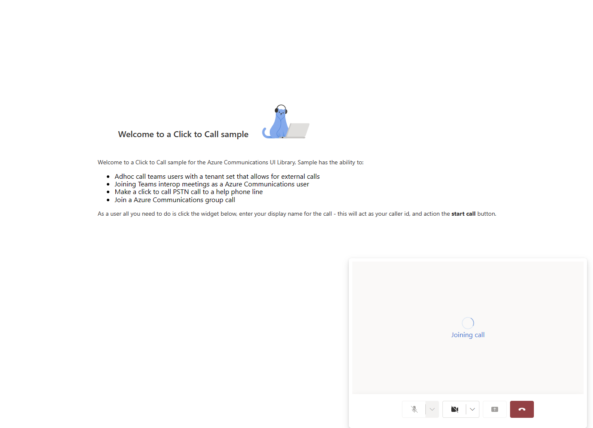

## Part 3 (Optional) Embedding Your Calling Experience

Finally in this optional section of the tutorial we will talk about making a embedded version of the Calling surface. We will continue from where we left off in the last section and make some modifications to our existing screens. 

To start lets take a look at the props for the `ClickToCallComponent.tsx` props, these will need to be updated to have the widget hold the Calling surface. We will make two changes.
- Add a new prop for the adapter arguments needed for the `AzureCommunicationCallAdapter` we will call this `adapterArgs`.
- Make `onRenderStartCall` optional, this will allow us to come back to using a new window easier in the future.

`ClickToCallComponent.tsx`

```ts
export interface ClickToCallComponentProps {
    /**
     *  arguments for creating an AzureCommunicationCallAdapter for your Calling experience
     */
    adapterArgs: AdapterArgs;
    /**
     * if provided, will be used to create a new window for call experience. if not provided
     * will use the current window.
     */
    onRenderStartCall?: () => void;
    /**
     * Custom render function for displaying logo.
     * @returns
     */
    onRenderLogo?: () => JSX.Element;
    /**
     * Handler to set displayName for the user in the call.
     * @param displayName
     * @returns
     */
    onSetDisplayName?: (displayName: string | undefined) => void;
    /**
     * Handler to set whether to use video in the call.
     */
    onSetUseVideo?: (useVideo: boolean) => void;
}
```

Now we will need to introduce some logic to use these arguments to make sure that we are starting a call appropriately. This will include adding state to create an `AzureCommunicationCallAdapter` inside the widget itself so it will look a lot like the logic in `NewWindowCallScreen.tsx` adding the adapter to the widget will look something like this:

`ClickToCallComponent.tsx`
```ts
// add this to the other imports

import { CommunicationUserIdentifier, AzureCommunicationTokenCredential } from '@azure/communication-common';
import {
    CallAdapter,
    CallAdapterLocator,
    CallComposite,
    useAzureCommunicationCallAdapter,
    AzureCommunicationCallAdapterArgs
} from '@azure/communication-react';
import { AdapterArgs } from '../utils/AppUtils';
// lets update our react imports as well
import React, { useCallback, useEffect, useMemo, useState } from 'react';

```
```ts

    const credential = useMemo(() => {
        try {
            return new AzureCommunicationTokenCredential(adapterArgs.token);
        } catch {
            console.error('Failed to construct token credential');
            return undefined;
        }
    }, [adapterArgs.token]);

    const callAdapterArgs = useMemo(() => {
        return {
            userId:adapterArgs.userId,
            credential:  credential,
            locator: adapterArgs.locator,
            displayName: displayName,
            alternateCallerId: adapterArgs.alternateCallerId
        }
    },[adapterArgs.locator, adapterArgs.userId, credential, displayName])

    const adapter = useAzureCommunicationCallAdapter(callAdapterArgs as AzureCommunicationCallAdapterArgs);

```

Lets also add a `afterCreate` function like before to do a few things with our adapter once it is constructed. Since we are now interacting with state in the widget we will want to use a react `useCallback` just to make sure we are not defining this function every time we do a render pass. In our case our function will reset the widget to the `'new'` state when the call ends and clear the user's `displayName` so they can start a new session. You can however return it to the `'setup'` state with the old displayName so that can easily call again as well.

`ClickToCallComponent.tsx`
```ts

    const afterCreate = useCallback(async (adapter: CallAdapter): Promise<CallAdapter> => {
        adapter.on('callEnded',() => {
            setDisplayName(undefined);
            setWidgetState('new');
            adapter.dispose();
        });
        return adapter;
    },[])

    const adapter = useAzureCommunicationCallAdapter(callAdapterArgs as AzureCommunicationCallAdapterArgs, afterCreate);

```

Once we again have an adapter we will need to update the template to account for a new widget state, so on that note we will also need to add to the different modes that the widget itself can hold. We will add a new `'inCall'` state like so:

`ClickToCallComponent.tsx`
```ts

const [widgetState, setWidgetState] = useState<'new' | 'setup' | 'inCall'>('new');

```

Then we will need to add a new logic to our Start Call button in the widget that will check to see which mode it will start the call, new window or embedded. That logic is as follows:

`ClickToCallComponent.tsx`
```ts

    <PrimaryButton
        styles={startCallButtonStyles(theme)}
        onClick={() => {
            if (displayName && consentToData && onRenderStartCall) {
                onSetDisplayName(displayName);
                onRenderStartCall();
            } else if (displayName && consentToData && adapter) {
                setWidgetState('inCall');
                adapter?.joinCall();
            }
        }}
    >
        StartCall
    </PrimaryButton>

```

We will also want to introduce some interal state to the widget about the local user's video controls.

`ClickToCallComponent.tsx`
```ts
const [useLocalVideo, setUseLocalVideo] = useState<boolean>(false);
```

Then lets go back to our style sheet for the wdiget. We will need to add new styles to allow the `CallComposite` to grow to its minimum size.

`ClickToCallComponent.styles.ts`
```ts
export const clickToCallInCallContainerStyles = (theme: Theme): IStackStyles => {
  return {
    root: {
      width: '35rem',
      height: '25rem',
      padding: '0.5rem',
      boxShadow: theme.effects.elevation16,
      borderRadius: theme.effects.roundedCorner6,
      bottom: 0,
      right: '1rem',
      position: 'absolute',
      overflow: 'hidden',
      cursor: 'pointer',
      background: theme.semanticColors.bodyBackground
    }
  }
}
```

Finally in the widget we will need to add a section to the template that is when the widget is in the `'inCall'` state that we added earlier. So now we should have our template looking as follows:

`ClickToCallComponent.tsx`
```ts
if (widgetState === 'setup' && onSetDisplayName && onSetUseVideo) {
        return (
            <Stack styles={clicktoCallSetupContainerStyles(theme)} tokens={{ childrenGap: '1rem' }}>
                <IconButton
                    styles={collapseButtonStyles}
                    iconProps={{ iconName: 'Dismiss' }}
                    onClick={() => setWidgetState('new')}
                />
                <Stack tokens={{ childrenGap: '1rem' }} styles={logoContainerStyles}>
                    <Stack style={{ transform: 'scale(1.8)' }}>{onRenderLogo && onRenderLogo()}</Stack>
                </Stack>
                <TextField
                    label={'Name'}
                    required={true}
                    placeholder={'Enter your name'}
                    onChange={(_, newValue) => {
                        setDisplayName(newValue);
                    }}
                />
                <Checkbox
                    styles={checkboxStyles(theme)}
                    label={'Use video - Checking this box will enable camera controls and screen sharing'}
                    onChange={(_, checked?: boolean | undefined) => {
                        onSetUseVideo(!!checked);
                        setUseLocalVideo(true);
                    }}
                ></Checkbox>
                <Checkbox
                    required={true}
                    styles={checkboxStyles(theme)}
                    label={
                        'By checking this box you are consenting that we will collect data from the call for customer support reasons'
                    }
                    onChange={(_, checked?: boolean | undefined) => {
                        setConsentToData(!!checked);
                    }}
                ></Checkbox>
                <PrimaryButton
                    styles={startCallButtonStyles(theme)}
                    onClick={() => {
                        if (displayName && consentToData && onRenderStartCall) {
                            onSetDisplayName(displayName);
                            onRenderStartCall();
                        } else if (displayName && consentToData && adapter) {
                            setWidgetState('inCall');
                            adapter?.joinCall();
                        }
                    }}
                >
                    StartCall
                </PrimaryButton>
            </Stack>
        );
    }

    if(widgetState === 'inCall' && adapter){
        return(
            <Stack styles={clickToCallInCallContainerStyles(theme)}>
                <CallComposite adapter={adapter} options={{
                    callControls: {
                        cameraButton: useLocalVideo,
                        screenShareButton: useLocalVideo,
                        moreButton: false,
                        peopleButton: false,
                        displayType: 'compact'
                    },
                    localVideoTileOptions: { position: !useLocalVideo ? 'hidden' : 'floating' }
                }}></CallComposite>
            </Stack>
        )
    }

    return (
        <Stack
            horizontalAlign="center"
            verticalAlign="center"
            styles={clickToCallContainerStyles(theme)}
            onClick={() => {
                setWidgetState('setup');
            }}
        >
            <Stack
                horizontalAlign="center"
                verticalAlign="center"
                style={{ height: '4rem', width: '4rem', borderRadius: '50%', background: theme.palette.themePrimary }}
            >
                <Icon iconName="callAdd" styles={callIconStyles(theme)} />
            </Stack>
        </Stack>
    );
```
Now that we have updated our widget to be more versitile we will want to take another look at the `ClickToCallScreen.tsx` to make some adjustments to how we are calling the widget. We will to turn on the new embedded experience do two things:
- Remove the start call handler that we provided earlier
- provide the adapter arguments to the widget that we would normally be emitting through our post messages.

That looks like this:

`ClickToCallScreen.tsx`
```ts

    <Stack horizontal tokens={{ childrenGap: '1.5rem' }} style={{ overflow: 'hidden', margin: 'auto' }}>
        <ClickToCallComponent
            adapterArgs={adapterParams}
            onRenderLogo={() => {
                return (
                    
                );
            }}
            onSetDisplayName={setUserDisplayName}
            onSetUseVideo={setUseVideo}
        />
    </Stack>

```
Now that we have made these changes we can start our app again if it is shut down with `npm run start`. If we go through the start call process like we did before we should see the following when starting the call: 



Like before this is a call starting with the video controls enabled. 

Thanks for following the different tutorials here. This concludes the quickstart for Click-to-Call in the Azure Communications UI Library.
