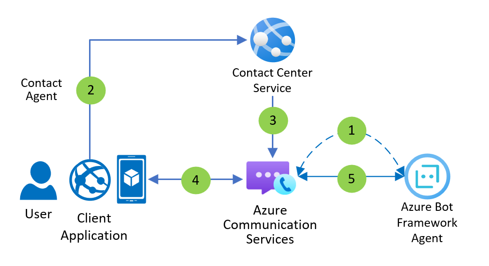
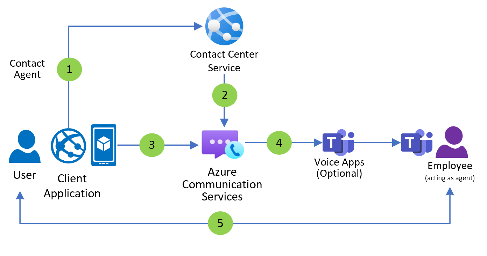
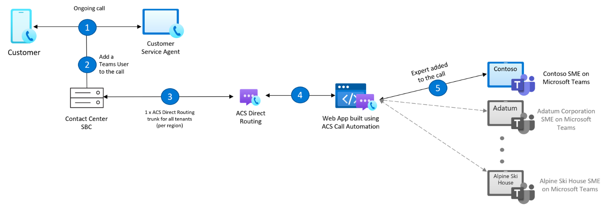

# Contact center

This tutorial describes concepts for **contact center** applications. After completing this you'll understand common use cases that a contact center application delivers, the Microsoft technologies that can help you build those uses cases and have built a sample application integrating Microsoft Teams and Azure that you can use to demo and explore further.

Contact center applications are focused on unscheduled communication between **consumers** and **agents**. The **organizational boundary** between consumers and agents, and the **unscheduled** nature of the interaction, are key attributes of contact center applications.

Azure and Teams are interoperable. This interoperability gives organizations choice in how they interact with customers using the Microsoft Cloud. Three examples include:

-   **Teams Phone** provides a zero-code suite for customer communication using [Teams Cloud Auto attendants and Call queues](/microsoftteams/plan-auto-attendant-call-queue) and [Click-to-call](https://techcommunity.microsoft.com/t5/microsoft-teams-blog/what-s-new-in-microsoft-teams-at-enterprise-connect-2023/ba-p/3774374).
-   **Teams + Azure hybrid.** Combine Teams with a custom Azure application to manage or route communication, or for a custom consumer or agent experience. This document currently focuses on these scenarios.
-   **Azure custom.** Build the entire customer engagement experience on Azure primitives – the business experience, the consumer experience, the job routing, and the intelligent insights. Azure Communication Services provides several products for custom solutions such as:
    -   [Call Automation](/azure/communication-services/concepts/call-automation/call-automation-teams-interop) – Build AI assisted programmable calling workflows
    -   [Job Router](/azure/communication-services/concepts/router/concepts) – Match jobs to the most suitable worker
    -   [UI Library](/azure/communication-services/concepts/ui-library/ui-library-overview?pivots=platform-web) – Develop custom web and mobile experiences for end users

Developers interested in scheduled business-to-consumer interactions should read our [Virtual Visits](/azure/communication-services/tutorials/virtual-visits) tutorial. This article focuses on *inbound* engagement, where the consumer initiates communication. Many businesses also have *outbound* communication needs, for which we recommend the outbound customer engagement tutorial.

The term “contact center” captures a large family of applications diverse across scale, channels, and organizational approach:

-   **Scale**. Small businesses may have a small number of employees operating as agents in a limited role, for example a restaurant offering a phone number for reservations. While an airline may have thousands of employees and vendors providing a 24/7 contact center.
-   **Channel**. Organizations can reach consumers through the phone system, apps, SMS, or consumer communication platforms such as WhatsApp.
-   **Organizational approach**. Most businesses have employees operate as agents using Teams or a licensed contact center as a service software (CCaaS). Other businesses may out-source the agent role or use specialized service providers who fully operate contact centers as a service.

## User Personas

No matter the industry, there are at least five personas involved in a contact center and certain tasks they accomplish:

-   **Designer**. The designer defines the consumer experience. What consumer questions, interactions, and needs does the contact center solve for? What channels are used? How is the consumer routed to different agent pools using bots or interactive voice response?
-   **Shift Manager**. The shift manager organizes agents. They monitor consumer satisfaction and other business outcomes.
-   **Agent**. The human being who engages consumers.
-   **Expert**. A human being to whom agents escalate
-   **Consumer**. The human being, external to the organization, that initiates communication. Some companies operate internal contact centers, for example an IT support organization that receives requests from users (consumers).

The rest of this article provides the high-level architecture and data flows for two different contact center designs:

1.  Consumers going to a website (or mobile app), talking to a chat bot, and then starting a voice call answered by a Teams-hosted agent.
2.  Consumers initializing a voice interaction by calling a phone number from an organization’s Team’s phone system.

These examples build on each other in increasing complexity. GitHub and the Azure Communication Services Sample Builder host sample code that match these simplified architectures.

## Chat on a website with a bot agent

Communication Services Chat applications can be integrated with an Azure Bot Service. The Bot Service needs to be linked to a Communication Services resource using a channel in the Azure Portal. To learn more about this scenario, see [Add a bot to your chat app - An Azure Communication Services quickstart](/azure/communication-services/quickstarts/chat/quickstart-botframework-integration).

### Dataflow

1.  An Azure Communication Services Chat channel is connected to an Azure Bot Service in Azure Portal by an administrator.
2.  A user clicks a widget in a client application to contact an agent.
3.  The Contact Center Service creates a Chat thread and adds the user ID for the bot to the thread.
4.  A user sends and receives messages to the bot using the Azure Communication Services Chat SDK.
5.  The bot sends and receives messages to the user using the Azure Communication Services Chat Channel.

## Chat on a website that escalates to a voice call answered by a Teams agent

A conversation between a user and a bot can be handed off to an agent in Teams. Optionally, a Teams Voice App such as an Auto Attendant or Call Queue can control the transition. To learn more about bot handoff integration models, see [Transition conversations from bot to human - Bot Service](/azure/bot-service/bot-service-design-pattern-handoff-human?view=azure-bot-service-4.0). To learn more about Teams Auto Attendants and Call Queues, see [Plan for Teams Auto attendants and Call queues - Microsoft Teams](/microsoftteams/plan-auto-attendant-call-queue).

### Dataflow

1.  A user clicks a widget in the client application to contact an agent.
2.  The Contact Center Service creates a Chat thread and adds an Azure Bot to the thread.
3.  The user interacts with the Azure Bot by sending and receiving Chat messages.
4.  The Contact Center Service hands the user off to a Teams Call Queue or Auto Attendant.
5.  The Teams Voice Apps hands the user off to an employee acting as an agent using Teams. The user and the employee interact using audio, video, and screenshare.

### Detailed capabilities

The following list presents the set of features that are currently available for contact centers in Azure Communication Services. For detailed capability information, see [Azure Communication Services Calling SDK overview](/azure/communication-services/concepts/voice-video-calling/calling-sdk-features). Azure Communication Services Calling to Teams, including Teams Auto Attendant and Call Queue, requires setup to be completed as described in [Teams calling and chat interoperability](/azure/communication-services/concepts/interop/calling-chat).

| Group of features          | Capability                             | Public preview | General availability |
|----------------------------|----------------------------------------|----------------|----------------------|
| DTMF Support in ACS UI SDK | Allows touch tone entry                | ❌             | ✔️                    |
| Calling Capabilities       | Audio and video                        | ✔️              | ✔️                    |
|                            | Screen sharing                         | ✔️              | ✔️                    |
|                            | Record the call                        | ✔️              | ✔️                    |
|                            | Park the call                          | ❌             | ❌                   |
|                            | Personal voicemail                     | ❌             | ✔️                    |
| Teams Auto Attendant       | Answer call                            | ✔️              | ✔️                    |
|                            | Operator routing                       | ❌             | ✔️                    |
|                            | Speech recognition of menu options     | ✔️1             | ✔️1                   |
|                            | Speech recognition of directory search | ✔️1             | ✔️1                   |
|                            | Power BI Reporting                     | ❌             | ✔️                    |
| Auto Attendant Redirects   | Disconnect                             | ✔️              | ✔️                    |
|                            | Person in org                          | ❌             | ✔️2                   |
|                            | AA or CQ                               | ✔️              | ✔️                    |
|                            | External                               | ❌             | ✔️2                   |
|                            | Shared voicemail                       | ❌             | ✔️                    |
| Teams Call Queue           | Music on hold                          | ✔️              | ✔️                    |
|                            | Answer call                            | ✔️              | ✔️                    |
|                            | Power BI Reporting                     | ❌             | ✔️                    |
| Overflow Redirects         | Disconnect                             | ✔️              | ✔️                    |
|                            | Person in org                          | ❌             | ✔️2                   |
|                            | AA or CQ                               | ❌             | ✔️                    |
|                            | External                               | ❌             | ✔️2                   |
|                            | Shared voicemail                       | ❌             | ✔️                    |
| Timeout Redirects          | Disconnect                             | ✔️              | ✔️                    |
|                            | Person in org                          | ❌             | ✔️2                   |
|                            | AA or CQ                               | ❌             | ✔️                    |
|                            | External                               | ❌             | ✔️2                   |
|                            | Shared voicemail                       | ❌             | ✔️                    |
| No Agents Redirects        | Disconnect                             | ✔️              | ✔️                    |
|                            | Person in org                          | ❌             | ✔️2                   |
|                            | AA or CQ                               | ❌             | ✔️                    |
|                            | External                               | ❌             | ✔️2                   |
|                            | Shared voicemail                       | ❌             | ✔️                    |

1.  Teams Auto Attendant must be voice enabled
2.  Licensing required

### Additional Resources

-   [Teams calling and chat interoperability - An Azure Communication Services concept document](/azure/communication-services/concepts/interop/calling-chat)
-   [Quickstart: Join your calling app to a Teams call queue](/azure/communication-services/quickstarts/voice-video-calling/get-started-teams-call-queue)
-   [Quickstart - Teams Auto Attendant on Azure Communication Services](/azure/communication-services/quickstarts/voice-video-calling/get-started-teams-auto-attendant)
-   [Get started with a click to call experience using Azure Communication Services - An Azure Communication Services tutorial](/azure/communication-services/tutorials/calling-widget/calling-widget-overview)

## Extend your contact center voice solution to Teams users

Improve the efficiency of your contact center operations by inviting subject matter experts into your customer service workflows. With Azure Communication Services Call Automation API, developers can add subject matter experts, who use Microsoft Teams, to existing customer service calls to provide expert advice and help agents improve their first call resolution rate.  
This interoperability is offered over VoIP and makes it easy for developers to implement per-region multi-tenant trunks that maximize value and reduce telephony infrastructure overhead.   
  
  
To learn more about Call Automation API and how a contact center can leverage this interoperability with Teams, see [Deliver expedient customer service by adding Microsoft Teams users in Call Automation workflows](/azure/communication-services/concepts/call-automation/call-automation-teams-interop).

