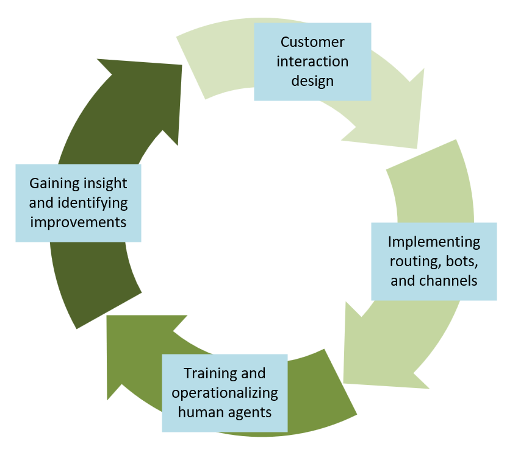
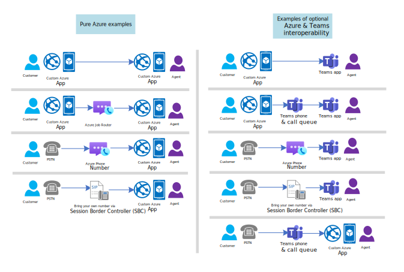

# Contact center
Developers can use Azure Communication Services messaging, voice, and video APIs to power **contact center** applications. This overview describes concepts and high-level architectural guidance for typical contact center applications.

Contact center applications focus on unscheduled communication between **customers** and **agents**. The **organizational boundary** between customers and agents, and the **unscheduled** nature of the interaction, are key attributes of contact center applications. Developers interested in *scheduled* business-to-consumer interactions should read our [virtual visits](/azure/communication-services/tutorials/virtual-visits) tutorial.

The term 'contact center' captures a large family of applications diverse across scale, channels, and organizational approaches:

-   **Scale**. Small businesses may have a few employees operating as agents in a limited role, for example a restaurant offering a phone number for reservations. While an airline may have thousands of employees and vendors providing a 24/7 contact center.
-   **Channel**. Organizations can reach consumers through the phone system, apps, SMS, or consumer communication platforms such as WhatsApp.
-   **Tenant approach**. Developers can use Azure Communication Services to built multitenant contact center software as a service  (CCaaS). Or to build a single-tenant application for their own business.
- **Agent Staffing**. Businesses can have employees operate as agents, out-source the agent role, or use specialized service providers who fully operate contact centers as a service.

## Progressing a customer across communication channels

A typical multi-channel contact center may start with the most efficient form of communication: text chat with a AI bot. AI bots can authenticate the customer, answer simple questions, solicit information about customer intent, and otherwise fully satisfy many customer engagement use cases. However, most contact centers have a pathway to progressively escalate customers to more synchronous and intensive interaction: chat with a human agent, voice with a bot, and finally voice and video with a human agent.

:::image type="content" source="media/contact-center/contact-center-progression.svg" alt-text="Screenshot that shows a data flow diagram for chat a with a bot agent.":::

Developers have the option of using Azure Communication Services for all of these phases or a select few. For example, you may implement your own text chat system and then use Azure solely for video calling. For more information, see any of the articles linked from this table:

| Enable customers to initiate messaging via:  | Enable customers to initiate voice and video calling via: | Enable agents to reply to messages and answer voice calls via:   | Integrate services and bots via:  |
|----|--|---|--|
| [Desktop & mobile friendly websites](../quickstarts/chat/get-started.md?tabs=windows&pivots=programming-language-javascript) | [Desktop & mobile friendly websites](../quickstarts/voice-video-calling/getting-started-with-calling.md?tabs=uwp&pivots=platform-web)   | [Desktop & mobile friendly websites](../quickstarts/voice-video-calling/getting-started-with-calling.md?tabs=uwp&pivots=platform-web)  | [Chat REST APIs](../quickstarts/chat/quickstart-botframework-integration.md) |
| [Native apps](../quickstarts/chat/get-started.md?tabs=windows&pivots=programming-language-android) | [Native apps](../quickstarts/voice-video-calling/getting-started-with-calling.md?tabs=uwp&pivots=platform-android) | [Native apps](../quickstarts/voice-video-calling/getting-started-with-calling.md?tabs=uwp&pivots=platform-android) | [Advanced Messaging (WhatsApp) APIs](../concepts/advanced-messaging/whatsapp/whatsapp-overview.md) |
| [SMS](../quickstarts/sms/receive-sms.md?pivots=programming-language-javascript) | [Call an Azure phone number](../quickstarts/telephony/get-phone-number.md?tabs=windows&pivots=platform-azp) | [Teams native apps and call queues](../quickstarts/voice-video-calling/get-started-teams-call-queue.md) | [Call Automation REST & Media APIs](../concepts/call-automation/call-automation.md) |
| [Meta WhatsApp](../quickstarts/advanced-messaging/whatsapp/get-started.md?tabs=visual-studio%2Cconnection-string&pivots=programming-language-javascript) | [Call your own phone number connected to Microsoft via Direct Routing](../quickstarts/telephony/voice-routing-sdk-config.md?pivots=platform-azp) |   | [Service APIs for Audio Streaming](../how-tos/call-automation/audio-streaming-quickstart.md?pivots=programming-language-java) |
| | [Call a Teams Phone number](/microsoftteams/plan-auto-attendant-call-queue) |   | [Direct integration with Azure AI Bot Service](../concepts/call-automation/azure-communication-services-azure-cognitive-services-integration.md) |

## Continuously improving customer experiences

Many contact center applications are continuously changing to improve customer experience and meet new business needs. This ongoing evolution can be modeled as a cycle of customer interaction design, implementing that design, and using data to gain insight on potential improvements:

## Teams interoperability 

You can use Azure Communication Services to implement contact center applications without Microsoft Teams integration or licenses. However, Azure and Microsoft Teams are interoperable, and this optional capability can be useful in many scenarios. Business-to-customer (B2C) contact center apps can use Azure's generic chat and VOIP SDKs to provide tailored customer experiences. Developers can connect these branded customer experiences to Microsoft Teams apps and phone system, experiences which are already familiar to many employees and citizen agents.

The following diagram shows some Azure and Teams components connected in a contact center setting.

## Architecture diagrams
The rest of this article provides the high-level architecture and data flows for some different contact center designs:

1. [Customer going to a website (or mobile app) and talking to a chat bot](#chat-on-a-website-with-a-bot-agent).
2. [Customer calling a voice channel that is routed by Teams queues to a Teams based agent](#chat-on-a-website-that-escalates-to-a-voice-call-answered-by-a-teams-agent).
3. [Customer calling a PSTN number, routed by Azure, that is connected to a Teams based agent](#connect-azure-managed-phone-calls-to-teams).

### Chat on a website with a bot agent
Azure Communication Services provides multiple patterns for connecting customers to chat bots and services. You can easily add rich text chat in a web site or native app using built-in integration with Azure AI Bot Services. You need to link the Bot Service to a Communication Services resource using a channel in the Azure portal. For more information about this scenario, see [Add a bot to your chat app - An Azure Communication Services quickstart](../quickstarts/chat/quickstart-botframework-integration.md).

:::image type="content" source="media/contact-center/data-flow-diagram-chat-bot.png" alt-text="Screenshot that shows a data flow diagram for chat a with a bot agent on a website.":::

#### Dataflow

1. An administrator connects an Azure Communication Services Chat channel to an Azure Bot Service in Azure portal.
2. The customer clicks a widget in a client application to contact an agent.
3. The Contact Center Service creates a Chat thread and adds the bot's user ID to the thread.
4. The customer sends and receives messages to the bot using the Azure Communication Services Chat SDK.
5. The bot sends and receives messages to and from the customer using the Azure Communication Services Chat Channel.

SMS, email, and Meta WhatsApp are three other channels available for text-based communication.

### Chat on a website that escalates to a voice call answered by a Teams agent
Text chat may not be sufficient to meet your customer experience objectives. A chat conversation between a user and a bot can be handed off to an agent in Microsoft Teams. To learn more about bot handoff integration models, see [Transition conversations from bot to human - Bot Service](/azure/bot-service/bot-service-design-pattern-handoff-human?view=azure-bot-service-4.0&preserve-view=true). To learn more about Teams Auto Attendants and Call Queues, see [Plan for Teams Auto attendants and Call queues - Microsoft Teams](/microsoftteams/plan-auto-attendant-call-queue).

#### Dataflow

1. The customer clicks a widget in the client application to contact to an agent.
2.  The Contact Center Service creates a Chat thread and adds an Azure Bot to the thread.
3. The customer interacts with the Azure Bot by sending and receiving Chat messages.
4. The Contact Center Service hands the customer off to a Teams Call Queue or Auto Attendant.
5. The Microsoft Teams Voice App hands the customer off to an employee acting as an agent using Teams. The customer and the employee interact using audio, video, and screen share.

#### Related articles

- [Quickstart: Join your calling app to a Teams call queue](../quickstarts/voice-video-calling/get-started-teams-call-queue.md)
- [Quickstart: Teams Auto Attendant on Azure Communication Services](../quickstarts/voice-video-calling/get-started-teams-auto-attendant.md)

### Connect Azure managed phone calls to Teams
This last data flow diagram shows a customer calling a phone number managed by Azure Communication Services. You can use Azure Communication Services Call Automation APIs to add an agent or subject matter expert to a call hosted by Teams. This interoperability works over VoIP and makes it easy for developers to implement per-region multitenant trunks, maximizing value and reducing telephony infrastructure overhead.

  

To learn more about the Call Automation API and how a contact center can use this interoperability with Teams, see [Deliver expedient customer service by adding Microsoft Teams users in Call Automation workflows](../concepts/call-automation/call-automation-teams-interop.md).

### Detailed Teams interoperability capabilities for contact center apps

The following list presents relevant Teams interoperability features available for contact centers in Azure Communication Services. For more information, see [Azure Communication Services Calling SDK overview](../concepts/voice-video-calling/calling-sdk-features.md). To use Azure Communication Services Calling to Teams interop, including Teams Auto Attendant and Call Queue, you need to set up your environment as described in [Teams Call Queue on Azure Communication Services](..//quickstarts/voice-video-calling/get-started-teams-call-queue.md).

|Group of features |Capability | Status |
|-- | -- | -- |
| DTMF Support in Azure Communication Services UI SDK | Allows touch tone entry | ✔️|
| Teams Capabilities| Audio and video| ✔️|
|   | Screen sharing| ✔️|
|   | Record the call| ✔️|
|   | Park the call | ✔️  |
|   | Personal voicemail | ✔️|
| Teams Auto Attendant  | Answer call   | ✔️|
|   | Operator routing   | ✔️|
|   | Speech recognition of menu options| ✔️1|
|   | Speech recognition of directory search | ✔️1|
|   | Power BI Reporting | ✔️|
| Auto Attendant Redirects   | Disconnect| ✔️|
|   | Person in org | ✔️2|
|   | AA or CQ | ✔️|
|   | External | ✔️2|
|   | Shared voicemail   | ✔️|
| Teams Call Queue | Music on hold | ✔️|
|   | Answer call   | ✔️|
|   | Power BI Reporting | ✔️|
| Overflow Redirects| Disconnect| ✔️|
|   | Person in org | ✔️2|
|   | AA or CQ | ✔️|
|   | External | ✔️2|
|   | Shared voicemail   | ✔️|
| Timeout Redirects| Disconnect| ✔️|
|   | Person in org | ✔️2|
|   | AA or CQ | ✔️|
|   | External | ✔️2|
|   | Shared voicemail   | ✔️|
| No Agents Redirects   | Disconnect| ✔️|
|   | Person in org | ✔️2|
|   | AA or CQ | ✔️|
|   | External | ✔️2|
|   | Shared voicemail   | ✔️|

1.  Teams Auto Attendant must be voice enabled.
2.  Licensing required.
