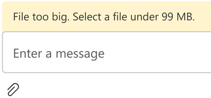
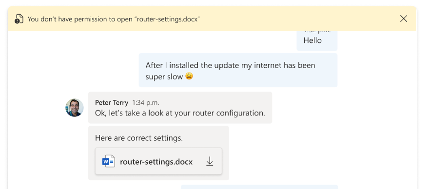

# Enable file sharing using UI Library in Azure Communication Services Chat with Azure Blob storage

[!INCLUDE [Public Preview Notice](../includes/public-preview-include.md)]

In an Azure Communication Services Chat, we can enable file sharing between communication users. Note, Azure Communication Services Chat is different from the Teams Interoperability Chat ("Interop Chat"). If you want to enable file sharing in an Interop Chat, refer to [Add file sharing with UI Library in Teams Interoperability Chat](./file-sharing-tutorial-interop-chat.md).

In this tutorial, we're configuring the Azure Communication Services UI Library Chat Composite to enable file sharing. The UI Library Chat Composite provides a set of rich components and UI controls that can be used to enable file sharing. We're using Azure Blob Storage to enable the storage of the files that are shared through the chat thread.

>[!IMPORTANT]
>Azure Communication Services doesn't provide a file storage service. You need to use your own file storage service for sharing files. For the pupose of this tutorial, we're using Azure Blob Storage.**


## Download code

Access the full code for this tutorial on [GitHub](https://github.com/Azure-Samples/communication-services-javascript-quickstarts/tree/main/ui-library-filesharing-chat-composite). If you want to use file sharing using UI Components, reference [this sample](https://github.com/Azure-Samples/communication-services-javascript-quickstarts/tree/main/ui-library-filesharing-ui-components).

## Prerequisites

- An Azure account with an active subscription. For details, see [Create an account for free](https://azure.microsoft.com/free/?WT.mc_id=A261C142F).
- [Visual Studio Code](https://code.visualstudio.com/) on one of the [supported platforms](https://code.visualstudio.com/docs/supporting/requirements#_platforms).
- [Node.js](https://nodejs.org/), Active LTS and Maintenance LTS versions (10.14.1 recommended). Use the `node --version` command to check your version.
- An active Communication Services resource and connection string. [Create a Communication Services resource](../quickstarts/create-communication-resource.md).

This tutorial assumes that you already know how to set up and run a Chat Composite. You can follow the [Chat Composite tutorial](https://azure.github.io/communication-ui-library/?path=/docs/quickstarts-composites--page) to learn how to set up and run a Chat Composite.

## Overview

The UI Library Chat Composite supports file sharing by enabling developers to pass the URL to a hosted file that is sent through the Azure Communication Services chat service. The UI Library renders the attached file and supports multiple extensions to configure the look and feel of the file sent. More specifically, it supports the following features:

1. Attach file button for picking files through the OS File Picker
2. Configure allowed file extensions. 
3. Enable/disable multiple uploads.
4. File Icons for a wide variety of file types.
5. File upload/download cards with progress indicators.
6. Ability to dynamically validate each file upload and display errors on the UI.
7. Ability to cancel an upload and remove an uploaded file before it's sent.
8. View uploaded files in MessageThread, download them. Allows asynchronous downloads.

The diagram shows a typical flow of a file sharing scenario for both upload and download. The section marked as `Client Managed` shows the building blocks where developers need to have them implemented.


## Set up file storage using Azure Blob

You can follow the tutorial [Upload file to Azure Blob Storage with an Azure Function](/azure/developer/javascript/how-to/with-web-app/azure-function-file-upload) to write the backend code required for file sharing.

Once implemented, you can call this Azure Function inside the `uploadHandler` function to upload files to Azure Blob Storage. For the remaining of the tutorial, we assume you have generated the function using the tutorial for Azure Blob Storage linked previously.

### Securing your Azure Blob storage container

This tutorial assumes that your Azure blob storage container allows public access to the files you upload. Making your Azure storage containers public isn't recommended for real world production applications.

For downloading the files, you upload to Azure blob storage, you can use shared access signatures (SAS). A shared access signature (SAS) provides secure delegated access to resources in your storage account. With a SAS, you have granular control over how a client can access your data.

The downloadable [GitHub sample](https://github.com/Azure-Samples/communication-services-javascript-quickstarts/tree/main/ui-library-filesharing-chat-composite) showcases the use of SAS for creating SAS URLs to Azure Storage contents. Additionally, you can [read more about SAS](../../storage/common/storage-sas-overview.md). 

UI Library requires a React environment to be set up. Next we do that. If you already have a React App, you can skip this section.

### Set up react app

We use the create-react-app template for this quickstart. For more information, see: [Get Started with React](https://reactjs.org/docs/create-a-new-react-app.html)

```bash

npx create-react-app ui-library-quickstart-composites --template typescript

cd ui-library-quickstart-composites

```

At the end of this process, you should have a full application inside of the folder `ui-library-quickstart-composites`.
For this quickstart, we're modifying files inside of the `src` folder.

### Install the package

Use the `npm install` command to install the beta Azure Communication Services UI Library for JavaScript.

```bash

npm install @azure/communication-react@1.5.1-beta.5

```

`@azure/communication-react` specifies core Azure Communication Services as `peerDependencies` so that
you can most consistently use the API from the core libraries in your application. You need to install those libraries as well:

```bash

npm install @azure/communication-calling@1.4.4
npm install @azure/communication-chat@1.2.0

```

### Create React app

Let's test the Create React App installation by running:

```bash

npm run start

```

## Configuring Chat Composite to enable file sharing

You need to replace the variable values for both common variable required to initialize the chat composite.

`App.tsx`

```javascript
import { FileUploadHandler, FileUploadManager } from '@azure/communication-react';
import { initializeFileTypeIcons } from '@fluentui/react-file-type-icons'; 
import {
  ChatComposite,
  fromFlatCommunicationIdentifier,
  useAzureCommunicationChatAdapter
} from '@azure/communication-react';
import React, { useMemo } from 'react';

initializeFileTypeIcons();

function App(): JSX.Element {
  // Common variables
  const endpointUrl = 'INSERT_ENDPOINT_URL';
  const userId = ' INSERT_USER_ID';
  const displayName = 'INSERT_DISPLAY_NAME';
  const token = 'INSERT_ACCESS_TOKEN';
  const threadId = 'INSERT_THREAD_ID';

  // We can't even initialize the Chat and Call adapters without a well-formed token.
  const credential = useMemo(() => {
    try {
      return new AzureCommunicationTokenCredential(token);
    } catch {
      console.error('Failed to construct token credential');
      return undefined;
    }
  }, [token]);

  // Memoize arguments to `useAzureCommunicationChatAdapter` so that
  // a new adapter is only created when an argument changes.
  const chatAdapterArgs = useMemo(
    () => ({
      endpoint: endpointUrl,
      userId: fromFlatCommunicationIdentifier(userId) as CommunicationUserIdentifier,
      displayName,
      credential,
      threadId
    }),
    [userId, displayName, credential, threadId]
  );
  const chatAdapter = useAzureCommunicationChatAdapter(chatAdapterArgs);

  if (!!chatAdapter) {
    return (
      <>
        <div style={containerStyle}>
          <ChatComposite
            adapter={chatAdapter}
            options={{
              fileSharing: {
                uploadHandler: fileUploadHandler,
                // If `fileDownloadHandler` is not provided. The file URL is opened in a new tab.
                downloadHandler: fileDownloadHandler,
                accept: 'image/png, image/jpeg, text/plain, .docx',
                multiple: true
              }
            }} />
        </div>
      </>
    );
  }
  if (credential === undefined) {
    return <h3>Failed to construct credential. Provided token is malformed.</h3>;
  }
  return <h3>Initializing...</h3>;
}

const fileUploadHandler: FileUploadHandler = async (userId, fileUploads) => {
  for (const fileUpload of fileUploads) {
    try {
      const { name, url, extension } = await uploadFileToAzureBlob(fileUpload);
      fileUpload.notifyUploadCompleted({ name, extension, url });
    } catch (error) {
      if (error instanceof Error) {
        fileUpload.notifyUploadFailed(error.message);
      }
    }
  }
}

const uploadFileToAzureBlob = async (fileUpload: FileUploadManager) => {
  // You need to handle the file upload here and upload it to Azure Blob Storage.
  // This is how you can configure the upload
  // Optionally, you can also update the file upload progress.
  fileUpload.notifyUploadProgressChanged(0.2);
  return {
    name: 'SampleFile.jpg', // File name displayed during download
    url: 'https://sample.com/sample.jpg', // Download URL of the file.
    extension: 'jpeg' // File extension used for file icon during download.
  };
  
const fileDownloadHandler: FileDownloadHandler = async (userId, fileData) => {
      return new URL(fileData.url);
    }
  };
}

```

## Configure upload method to use Azure Blob storage

To enable Azure Blob Storage upload, we modify the `uploadFileToAzureBlob` method we declared previously with the following code. You need to replace the Azure Function information to upload files.

`App.tsx`

```javascript

const uploadFileToAzureBlob = async (fileUpload: FileUploadManager) => {
  const file = fileUpload.file;
  if (!file) {
    throw new Error('fileUpload.file is undefined');
  }

  const filename = file.name;
  const fileExtension = file.name.split('.').pop();

  // Following is an example of calling an Azure Function to handle file upload
  // The https://learn.microsoft.com/azure/developer/javascript/how-to/with-web-app/azure-function-file-upload
  // tutorial uses 'username' parameter to specify the storage container name.
  // the container in the tutorial is private by default. To get default downloads working in
  // this sample, you need to change the container's access level to Public via Azure Portal.
  const username = 'ui-library';
  
  // You can get function url from the Azure Portal:
  const azFunctionBaseUri='<YOUR_AZURE_FUNCTION_URL>';
  const uri = `${azFunctionBaseUri}&username=${username}&filename=${filename}`;
  
  const formData = new FormData();
  formData.append(file.name, file);
  
  const response = await axios.request({
    method: "post",
    url: uri,
    data: formData,
    onUploadProgress: (p) => {
      // Optionally, you can update the file upload progess.
      fileUpload.notifyUploadProgressChanged(p.loaded / p.total);
    },
  });
  
  const storageBaseUrl = 'https://<YOUR_STORAGE_ACCOUNT>.blob.core.windows.net';

  return {
    name: filename,
    url: `${storageBaseUrl}/${username}/${filename}`,
    extension: fileExtension
  };
}

```

## Error handling
    
When an upload fails, the UI Library Chat Composite displays an error message. 



Here's sample code showcasing how you can fail an upload due to a size validation error by changing the `fileUploadHandler`:

`App.tsx`

```javascript
import { FileUploadHandler } from from '@azure/communication-react';

const fileUploadHandler: FileUploadHandler = async (userId, fileUploads) => {
  for (const fileUpload of fileUploads) {
    if (fileUpload.file && fileUpload.file.size > 99 * 1024 * 1024) {
      // Notify ChatComposite about upload failure. 
      // Allows you to provide a custom error message.
      fileUpload.notifyUploadFailed('File too big. Select a file under 99 MB.');
    }
  }
}
```

## File downloads - advanced usage

By default, the file `url` provided through `notifyUploadCompleted` method is used to trigger a file download. However, if you need to handle a download in a different way, you can provide a custom `downloadHandler` to ChatComposite. Next, we modify the `fileDownloadHandler` that we declared previously to check for an authorized user before allowing to download the file.

`App.tsx`

```javascript
import { FileDownloadHandler } from "communication-react";

const isUnauthorizedUser = (userId: string): boolean => {
  // You need to write your own logic here for this example.
}

const fileDownloadHandler: FileDownloadHandler = async (userId, fileData) => {
  if (isUnauthorizedUser(userId)) {
    // Error message is displayed to the user.
    return { errorMessage: 'You don’t have permission to download this file.' };
  } else {
    // If this function returns a Promise that resolves a URL string, 
    // the URL is opened in a new tab. 
    return new URL(fileData.url);
  }
}
```

Download errors are displayed to users in an error bar on top of the Chat Composite.




## Clean up resources

If you want to clean up and remove a Communication Services subscription, you can delete the resource or resource group. Deleting the resource group also deletes any other resources associated with it. You can find out more about [cleaning up Azure Communication Services resources](../quickstarts/create-communication-resource.md#clean-up-resources) and [cleaning Azure Function Resources](../../azure-functions/create-first-function-vs-code-csharp.md#clean-up-resources).

## Next steps

> [!div class="nextstepaction"]
> [Check the rest of the UI Library](https://azure.github.io/communication-ui-library/)

You may also want to:

- [Add chat to your app](../quickstarts/chat/get-started.md)
- [Creating user access tokens](../quickstarts/identity/access-tokens.md)
- [Learn about client and server architecture](../concepts/client-and-server-architecture.md)
- [Learn about authentication](../concepts/authentication.md)
- [Add file sharing with UI Library in Teams Interoperability Chat](./file-sharing-tutorial-interop-chat.md)
- [Add file sharing with UI Library in Azure Communication Services Chat](./file-sharing-tutorial-acs-chat.md)
- [Add inline image with UI Library in Teams Interoperability Chat](./inline-image-tutorial-interop-chat.md)
