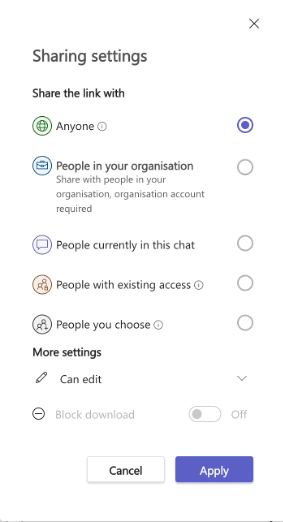
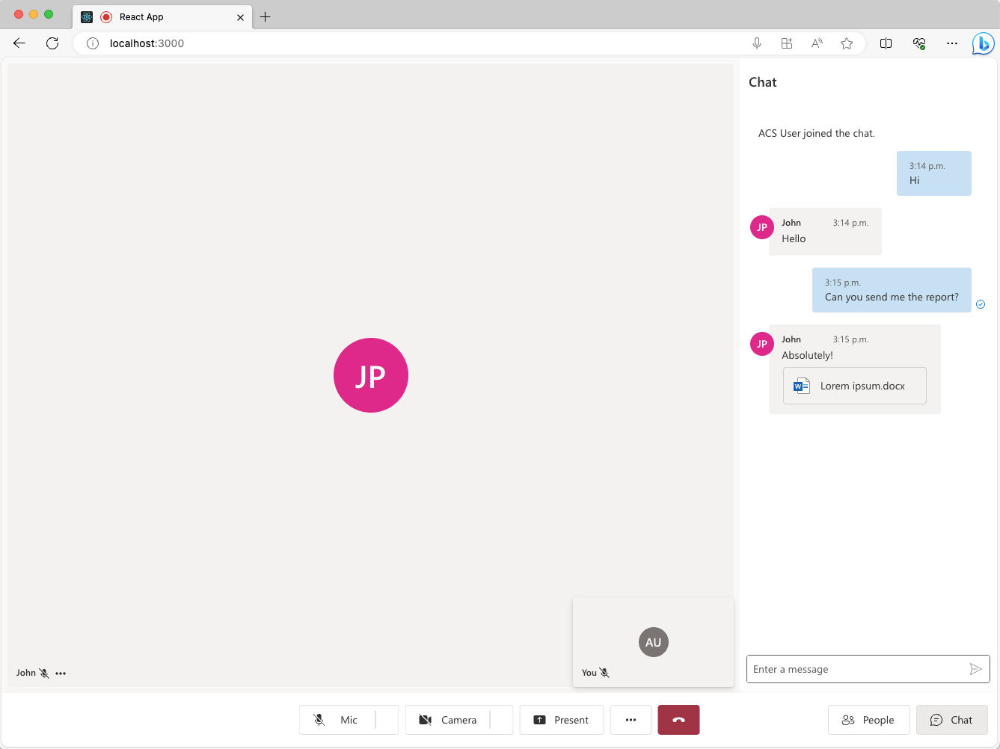
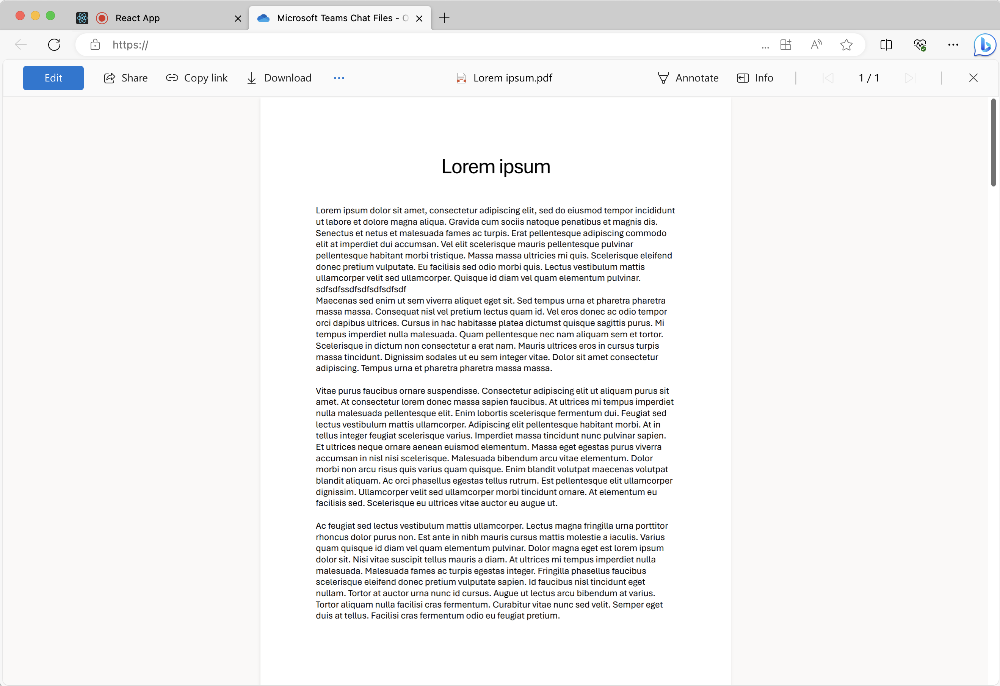

# Enable file sharing using UI Library in Teams Interoperability Chat

[!INCLUDE [Public Preview Notice](../includes/public-preview-include.md)]

In a Teams Interoperability Chat ("Interop Chat"), we can enable file sharing between communication users and Teams users. Note, Interop Chat is different from the Azure Communication Service Chat ("ACS Chat"). If you want to enable file sharing in an ACS Chat, refer to [Add file sharing with UI Library in Azure Communication Service Chat](./file-sharing-tutorial-acs-chat.md).

>[!IMPORTANT]
>
>File sharing feature comes with the CallWithChat Composite without additional setups. 
>
>Currently, the Communication user is able to only receive file attachments from the Teams user. Please refer to [UI Library Use Cases](../concepts/ui-library/ui-library-use-cases.md) to learn more.


## Download code

Access the code for this tutorial on [GitHub](https://github.com/Azure-Samples/communication-services-javascript-quickstarts/tree/main/ui-library-quickstart-teams-interop-meeting-chat).

## Prerequisites

- An Azure account with an active subscription. For details, see [Create an account for free](https://azure.microsoft.com/free/?WT.mc_id=A261C142F).
- [Visual Studio Code](https://code.visualstudio.com/) on one of the [supported platforms](https://code.visualstudio.com/docs/supporting/requirements#_platforms).
- [Node.js](https://nodejs.org/), Active LTS and Maintenance LTS versions. Use the `node --version` command to check your version.
- An active Communication Services resource and connection string. [Create a Communication Services resource](../quickstarts/create-communication-resource.md).
- Using the UI library version [1.7.0-beta.1](https://www.npmjs.com/package/@azure/communication-react/v/1.7.0-beta.1) or the latest.
- Have a Teams meeting created and the meeting link ready.
- Be familiar with how [ChatWithChat Composite](https://azure.github.io/communication-ui-library/?path=/docs/composites-call-with-chat-basicexample--basic-example) works.


## Background

First of all, we need to understand that Teams Interop Chat is part of a Teams meeting. When the Teams user creates an online meeting, a chat thread would be created and associated with the meeting. To enable the Azure Communication Service end user joining the chat and starting to send/receive messages, one meeting participant (a Teams user) will need to admit them first. Otherwise, they don't have access to the chat.
Once the Azure Communication Service end user is admitted, they would be able to start any chat related operations. 
In this tutorial, we're checking out how file sharing works in an Interop Chat.

## Overview

Similar to how we're [Adding Inline Image Support](./inline-image-tutorial-interop-chat.md) to the UI library, we need a `CallWithChat` Composite created like this:

```js
export const CallWithChatExperience = (props: CallWithChatExampleProps): JSX.Element => {
  // Construct a credential for the user with the token retrieved from your server. This credential
  // must be memoized to ensure useAzureCommunicationCallWithChatAdapter is not retriggered on every render pass.
  const credential = useMemo(() => new AzureCommunicationTokenCredential(props.token), [props.token]);

  // Create the adapter using a custom react hook provided in the @azure/communication-react package.
  // See https://aka.ms/acsstorybook?path=/docs/composite-adapters--page for more information on adapter construction and alternative constructors.
  const adapter = useAzureCommunicationCallWithChatAdapter({
    userId: props.userId,
    displayName: props.displayName,
    credential,
    locator: props.locator,
    endpoint: props.endpointUrl
  });

  // The adapter is created asynchronously by the useAzureCommunicationCallWithChatAdapter hook.
  // Here we show a spinner until the adapter has finished constructing.
  if (!adapter) {
    return <Spinner label="Initializing..." />;
  }

  return <CallWithChatComposite adapter={adapter} fluentTheme={props.fluentTheme} options={props.compositeOptions} />;
};

```

Noticing it needs `CallWithChatExampleProps`, which is defined as the following code snippet:

```js
export type CallWithChatExampleProps = {
  // Props needed for the construction of the CallWithChatAdapter
  userId: CommunicationUserIdentifier;
  token: string;
  displayName: string;
  endpointUrl: string;
  locator: TeamsMeetingLinkLocator | CallAndChatLocator;

  // Props to customize the CallWithChatComposite experience
  fluentTheme?: PartialTheme | Theme;
  compositeOptions?: CallWithChatCompositeOptions;
  callInvitationURL?: string;
};

```

To be able to start the Composite for meeting chat, we need to pass `TeamsMeetingLinkLocator`, which looks like this:

```js
{ "meetingLink": "<TEAMS_MEETING_LINK>" }
```

Note that meeting link should look something like `https://teams.microsoft.com/l/meetup-join/19%3ameeting_XXXXXXXXXXX%40thread.v2/XXXXXXXXXXX`

And this is all you need! And there's no other setup needed to enable the Communication User to receive file attachments from the Teams user. 

## Permissions

When file is shared from a Teams client, the Teams user has options to set the file permissions to be:
 - "Anyone"
 - "People in your organization"
 - "People currently in this chat"
 - "People with existing access"
 - "People you choose"

Specifically, the UI library currently only supports "Anyone" and "People you choose" (with email address) and all other permissions aren't supported. If Teams user sent a file with unsupported permissions, the Communication user might be prompted to a login page or denied access when they click on the file attachment in the chat thread.





Moreover, the Teams user's tenant admin might impose restrictions on file sharing, including disabling some file permissions or disabling file sharing all together. 

## Run the code

Let's run `npm run start` then you should be able to access our sample app via `localhost:3000` like the following screenshot: 


Simply click on the chat button located in the bottom to reveal the chat panel and now if Teams user sends some files, you should see something like the following screenshot:




And now if the user click on the file attachment card, a new tab would be opened like the following where the user can download the file:




## Next steps

> [!div class="nextstepaction"]
> [Check the rest of the UI Library](https://azure.github.io/communication-ui-library/)

You may also want to:

- [Add chat to your app](../quickstarts/chat/get-started.md)
- [Creating user access tokens](../quickstarts/identity/access-tokens.md)
- [Learn about client and server architecture](../concepts/client-and-server-architecture.md)
- [Learn about authentication](../concepts/authentication.md)
- [Add file sharing with UI Library in Azure Communication Service Chat](./file-sharing-tutorial-acs-chat.md)
- [Add inline image with UI Library in Teams Interoperability Chat](./inline-image-tutorial-interop-chat.md)
