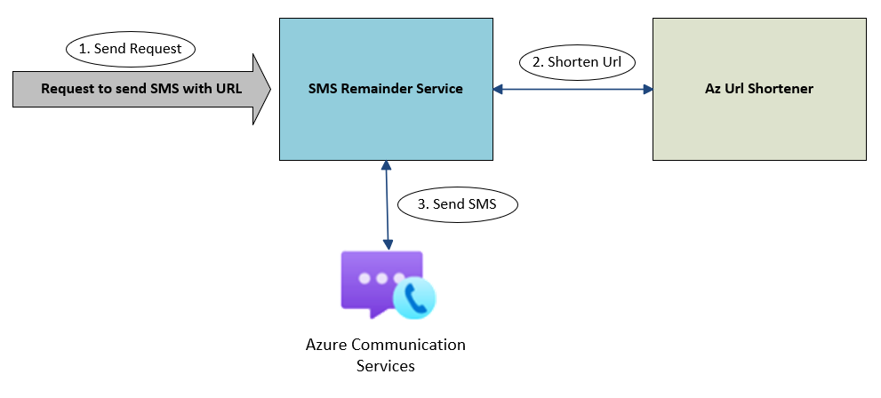

## Sample code

You can find the completed code for this tutorial on [GitHub](https://github.com/Azure-Samples/communication-services-dotnet-quickstarts/tree/main/sms-url-shortener).

## Prerequisites

-	An active Azure subscription. [Create an account for free](https://azure.microsoft.com/free/?ref=microsoft.com&utm_source=microsoft.com&utm_medium=docs&utm_campaign=visualstudio).
-	An active Azure Communication Services resource. For more information, see [Create an Azure Communication Services resource](../../quickstarts/create-communication-resource.md).
-	An Azure Communication Services phone number. [Get a phone number](../../quickstarts/telephony/get-phone-number.md). You need to [verify your phone number](../../quickstarts/sms/apply-for-toll-free-verification.md) so it can send messages with URLs. 
-	Deployed [AzUrlShortener](https://github.com/microsoft/AzUrlShortener). Click [Deploy to Azure](https://github.com/microsoft/AzUrlShortener/wiki/How-to-deploy-your-AzUrlShortener) button for quick deploy.
    -  [*Optional*] Deploy the [Admin web app](https://github.com/microsoft/AzUrlShortener/blob/main/src/Cloud5mins.ShortenerTools.TinyBlazorAdmin/README.md) to manage and monitor links in UI.
-	For this tutorial, SMS requests are routed to an Azure Function. You could always use an existing service, different framework like express or just run the tutorial as a C# console app. To follow this tutorial with an Azure Function, see instructions to set it up: [Azure Function for C#](/azure/azure-functions/create-first-function-vs-code-csharp).

## Architecture overview

In this tutorial, the focus is to set up a middleware that orchestrates requests to send SMS and the shortening of URLs through the Azure URL Shortener service. It interacts with Azure Communication Services to complete the sending of the SMS.



## Set up the Azure Function

To get started, you need to create a new Azure Function. You can create the Azure Function by following the steps in the [Azure Functions documentation](/azure/azure-functions/create-first-function-vs-code-csharp). If you aren't using an Azure Function and instead are using a different framework, skip this step and continue to the next section.

Once the Azure Function is set up, go to the `local.settings.json` file and add three more values that you need to store: the Azure Communication Services connection string, phone number (Ex. +15555555555) and URL Shortener endpoint (Ex. `https://<Azure_Function_URL>/api/UrlCreate`). These variables are all values you generated from the prerequisites at the beginning of the document.

```json

{
    "IsEncrypted": false,
    "Values": {
    "AzureWebJobsStorage": "",
    "FUNCTIONS_WORKER_RUNTIME": "dotnet",
    "ACS_CONNECTIONSTRING": "<ACS CONNECTION STRING>",
    "ACS_PHONE_NUMBER": "<ACS PHONE NUMBER>",
    "URL_SHORTENER": "<URL SHORTENER ENDPOINT>" 
    }
}

```

## Configure query parameters

Now that you've created the Azure Function, you need to configure the query parameters needed to trigger it. The function expects a phone number and a URL. The phone number is used as the recipient of the SMS message. The URL is the link that is shortened and sent to the recipient.

```csharp

namespace Company.Function
{
    public static class SendSMSUrlShortener
    {
        [FunctionName("SendSMSUrlShortener")]
        public static async Task<IActionResult> Run(
            [HttpTrigger(AuthorizationLevel.Anonymous, "get", "post", Route = null)] HttpRequest req,
            ILogger log)
        {
            log.LogInformation("C# HTTP trigger function processed a request.");

            string phoneNumberTo = req.Query["phoneNumber"]; // get phone number query parameter
            string urlToShorten = req.Query["url"]; // get url to shorten query parameter

            return new OkObjectResult(null);
        }
    }
}

```

## Shorten the URL

Now that you have the phone number and URL, you can use the Azure URL Shortener service to shorten the URL. Ensure you have [deployed](https://github.com/microsoft/AzUrlShortener/wiki/How-to-deploy-your-AzUrlShortener) this service already. The service contains several endpoints, but for this tutorial the focus is on the `UrlCreate` endpoint. Use the `PostAsync` method to place a `POST` request to the Azure URL Shortener service with the URL you want to shorten. The service returns a JSON object with the shortened URL. Store the shortened URL in a variable called `shortUrl`. In the snippet, insert the endpoint of your deployed Azure URL Shortener service. For information on how to get the endpoint, see [Validate the deployment](https://github.com/microsoft/AzUrlShortener/wiki/How-to-deploy-your-AzUrlShortener#validate-the-deployment).

```csharp
...
using System.Net.Http;
using System.Text.Json;
using System.Text;

namespace Company.Function
{
    public class ShortenedUrl
    {
        public string ShortUrl { get; set; }
    }

    public static class SendSMSUrlShortener
    {
        static string urlShortener = Environment.GetEnvironmentVariable("URL_SHORTENER", EnvironmentVariableTarget.Process);

        [FunctionName("SendSMSUrlShortener")]
        public static async Task<IActionResult> Run(
            [HttpTrigger(AuthorizationLevel.Anonymous, "get", "post", Route = null)] HttpRequest req,
            ILogger log)
        {
            log.LogInformation("C# HTTP trigger function processed a request.");

            //Parse Query Parameters
            string phoneNumberTo = req.Query["phoneNumber"]; // get phone number query parameter
            string urlToShorten = req.Query["url"]; // get url to shorten query parameter
            
            //Get short URL from Azure URL Shortener
            using var client = new HttpClient();
            var requestData = new
            {
                Url = urlToShorten //Body request for the POST call
            };
            var requestBody = JsonSerializer.Serialize(requestData);
            var httpContent = new StringContent(requestBody, Encoding.UTF8, "application/json");
            var response = await client.PostAsync(urlShortener, httpContent); // POST call to the Azure URL Shortener
            var content = await response.Content.ReadAsStringAsync();
            var data = System.Text.Json.JsonSerializer.Deserialize<ShortenedUrl>(content); // Parse content to ShortenedUrl object
            var url = data.ShortUrl;
            log.LogInformation("Shortened URL " + url);

            return new OkObjectResult(null);
        }
    }
}

```

## Send SMS

Now that the URL is shortened, you can use Azure Communication Services to send the SMS. Use the `send` method from the `SmsClient` class from the `Azure.Communication.Sms` package. 

```bash

dotnet add package Azure.Communication.Sms

```

This method sends the SMS to the phone number provided in the query parameters. The SMS contains the shortened URL. For more information on how to send SMS, see [Send SMS](/azure/communication-services/quickstarts/sms/send?pivots=programming-language-csharp).

```csharp
...
using Azure;
using Azure.Communication;
using Azure.Communication.Sms;

namespace Company.Function
{
    // Class to deserialize URL Shortener response
    public class ShortenedUrl
    {
        public string ShortUrl { get; set; }
    }

    public static class SendSMSUrlShortener
    {
        [FunctionName("SendSMSUrlShortener")]
        public static async Task<IActionResult> Run(
            [HttpTrigger(AuthorizationLevel.Anonymous, "get", "post", Route = null)] HttpRequest req,
            ILogger log)
        {
            log.LogInformation("C# HTTP trigger function processed a request.");
            
            //Parse Query Parameters
            string phoneNumberTo = req.Query["phoneNumber"]; // get phone number query parameter
            string urlToShorten = req.Query["url"]; // get url to shorten query parameter
            
            //Get short URL from Azure URL Shortener
            using var client = new HttpClient();
            var requestData = new
            {
                Url = urlToShorten //Body request for the POST call
            };
            var requestBody = JsonSerializer.Serialize(requestData);
            var httpContent = new StringContent(requestBody, Encoding.UTF8, "application/json");
            string urlShortener = Environment.GetEnvironmentVariable("URL_SHORTENER", EnvironmentVariableTarget.Process); // Ex. https://<Azure Function URL>/api/UrlCreate
            var response = await client.PostAsync(urlShortener, httpContent); // POST call to the Azure URL Shortener
            var content = await response.Content.ReadAsStringAsync();
            var data = System.Text.Json.JsonSerializer.Deserialize<ShortenedUrl>(content); // Parse content to ShortenedUrl object
            var url = data.ShortUrl;
            log.LogInformation("Shortened URL " + url);
            
            //Send SMS with Azure Communication Services
            string connectionString = Environment.GetEnvironmentVariable("ACS_CONNECTIONSTRING", EnvironmentVariableTarget.Process);
            string phoneNumberFrom = Environment.GetEnvironmentVariable("ACS_PHONE_NUMBER", EnvironmentVariableTarget.Process); // Ex. +15555555555
            SmsClient smsClient = new SmsClient(connectionString);            
            SmsSendResult sendResult = smsClient.Send(
                from: phoneNumberFrom,
                to: phoneNumberTo,
                message: "Here is your shortened URL: " + url
            ); // Send SMS message with shortened URL
            
            return new OkObjectResult(sendResult);
        }
    }
}

```

## Test locally

>[!NOTE]
> You need to [verify your phone number](../../quickstarts/sms/apply-for-toll-free-verification.md) to send SMS messages with URLs. Once your verification applications is set to pending state (1-2 days), the phone number to be enabled to send URLs. The full verification will take 5-6 weeks. For more information on toll-free number verification, see [Toll Free Veritifcation FAQ](../../concepts/sms/sms-faq.md#toll-free-verification).

You can now run your Azure Function locally by pressing `F5` in Visual Studio Code or by running the following command in the terminal:

```bash

func host start

```

Then using a tool like [Postman](https://www.postman.com/), you can test your function by making a `POST` request to the endpoint of your Azure Function. You need to provide the phone number and URL as query parameters. For example, if your Azure Function is running locally, you can make a request to `http://localhost:7071/api/<FUNCTION NAME>?phoneNumber=%2B15555555555&url=https://www.microsoft.com`. You should receive a response with the shortened URL and a status of `Success`.

## Deploy to Azure

To deploy your Azure Function, you can follow [step by step instructions](/azure/azure-functions/create-first-function-vs-code-csharp?pivots=programming-language-dotnet#sign-in-to-azure).

Once deployed, you can access the function through a similar method as you did when testing locally. You need to provide the phone number and URL as query parameters. For example, if your Azure Function is deployed to Azure, you can make a request to `https://<YOUR AZURE FUNCTION NAME>.azurewebsites.net/api/<FUNCTION NAME>?phoneNumber=%2B15555555555&url=https://www.microsoft.com`. You should receive a response with the shortened URL and a status of `Success`.
