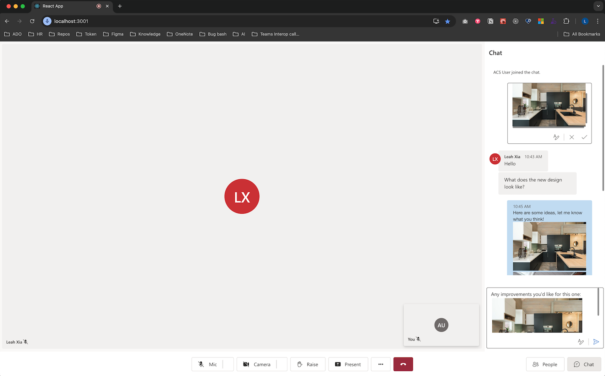
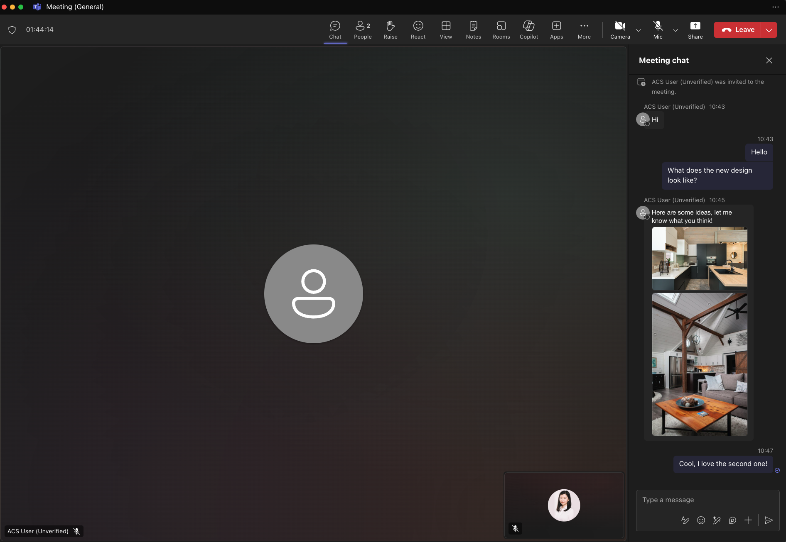

# Enable inline image by using UI Library in Teams Interoperability Chat

With Teams Interoperability Chat ("Interop Chat"), you can enable Azure Communication Services users to receive inline images sent by Teams users. When a rich text editor is enabled, Azure Communication Services users can send inline images to Teams users. To learn more, see [UI Library use cases](../concepts/ui-library/ui-library-use-cases.md).

The feature in Azure Communication Services for receiving inline images comes with the `CallWithChat` composite without extra setup. To enable the feature in Azure Communication Services for sending inline images, set `richTextEditor` to `true` under `CallWithChatCompositeOptions`.

> [!IMPORTANT]
> The feature in Azure Communication Services for sending inline images is currently in preview.
>
> Preview APIs and SDKs are provided without a service-level agreement. We recommend that you don't use them for production workloads. Some features might not be supported, or they might have constrained capabilities.
>
> For more information, review [Supplemental Terms of Use for Microsoft Azure Previews](https://azure.microsoft.com/support/legal/preview-supplemental-terms/).

## Download code

Access the code for this tutorial on [GitHub](https://github.com/Azure-Samples/communication-services-javascript-quickstarts/tree/main/ui-library-quickstart-teams-interop-meeting-chat).

## Prerequisites

- An Azure account with an active subscription. For details, see [Create an account for free](https://azure.microsoft.com/free/?WT.mc_id=A261C142F).
- [Visual Studio Code](https://code.visualstudio.com/) on one of the [supported platforms](https://code.visualstudio.com/docs/supporting/requirements#_platforms).
- [Node.js](https://nodejs.org/), Active Long-Term Support (LTS) and Maintenance LTS versions. Use the `node --version` command to check your version.
- An active Azure Communication Services resource and connection string. For more information, see [Create an Azure Communication Services resource](../quickstarts/create-communication-resource.md).
- UI Library version [1.15.0](https://www.npmjs.com/package/@azure/communication-react/v/1.15.0) or the latest version for receiving inline images. Use the UI Library version [1.19.0-beta.1](https://www.npmjs.com/package/@azure/communication-react/v/1.19.0-beta.1) or the latest beta version for sending inline images.
- A Teams meeting created and the meeting link ready.
- A familiarity with how [ChatWithChat composite](https://azure.github.io/communication-ui-library/?path=/docs/composites-call-with-chat-basicexample--basic-example) works.

## Background

First of all, Teams Interop Chat must be part of a Teams meeting currently. When the Teams user creates an online meeting, a chat thread is created and associated with the meeting. To enable the Azure Communication Services user to join the chat and start to send or receive messages, a meeting participant (a Teams user) must admit them to the call first. Otherwise, they don't have access to the chat.

After the Azure Communication Services user is admitted to the call, they can start to chat with other participants on the call. In this tutorial, you learn how the feature for sending and receiving inline images works in Interop Chat.

## Overview

Because you need to join a Teams meeting first, we need to use the `ChatWithChat` composite from UI Library.

Let's follow the basic example from the [storybook page](https://azure.github.io/communication-ui-library/?path=/docs/composites-call-with-chat-basicexample--basic-example) to create a `ChatWithChat` composite.

From the sample code, it needs `CallWithChatExampleProps`, which is defined as the following code snippet:

```js
export type CallWithChatExampleProps = {
  // Props needed for the construction of the CallWithChatAdapter
  userId: CommunicationUserIdentifier;
  token: string;
  displayName: string;
  endpointUrl: string;
  locator: TeamsMeetingLinkLocator | CallAndChatLocator;

  // Props to customize the CallWithChatComposite experience
  fluentTheme?: PartialTheme | Theme;
  compositeOptions?: CallWithChatCompositeOptions;
  callInvitationURL?: string;
};

```

No specific setup is needed to enable receiving inline images. But to send inline images, the `richTextEditor` function must be enabled through `CallWithChatExampleProps`. Here's a code snippet on how to enable it:

```js
<CallWithChatExperience
  // ...any other call with chat props
  compositeOptions={{ richTextEditor: true }}
/>

```

To start the composite for meeting chat, you need to pass `TeamsMeetingLinkLocator`, which looks like this:

```js
{ "meetingLink": "<TEAMS_MEETING_LINK>" }
```

No other setup is needed.

## Run the code

Let's run `npm run start`. Then you can access the sample app via `localhost:3000`.


Select the chat button located at the bottom of the pane to open the chat pane. Now, if a Teams user sends an image, you should see something like the following screenshot.


When the feature for sending inline images is enabled, you should see something like the following screenshot.





## Known issues

* UI Library might not support certain GIF images at this time. The user might receive a static image instead.
* The web UI Library doesn't support clips (short videos) sent by Teams users at this time.
* For certain Android devices, pasting a single image is supported only when you hold down the rich text editor and select **Paste**. Selecting from the clipboard view by using the keyboard might not be supported.

## Next step

> [!div class="nextstepaction"]
> [Check the rest of UI Library](https://azure.github.io/communication-ui-library/)

You might also want to:

- [Check UI Library use cases](../concepts/ui-library/ui-library-use-cases.md)
- [Add chat to your app](../quickstarts/chat/get-started.md)
- [Create user access tokens](../quickstarts/identity/access-tokens.md)
- [Learn about client and server architecture](../concepts/client-and-server-architecture.md)
- [Learn about authentication](../concepts/authentication.md)
- [Add file sharing with UI Library in Azure Communication Services Chat](./file-sharing-tutorial-acs-chat.md)
- [Add file sharing with UI Library in Teams Interoperability Chat](./file-sharing-tutorial-interop-chat.md)
