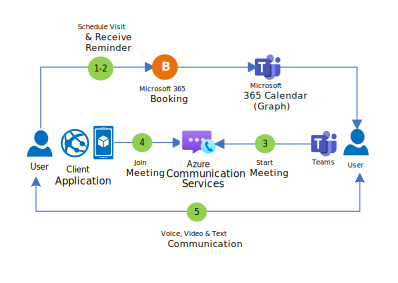
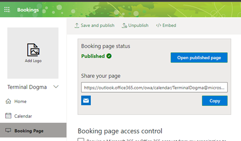
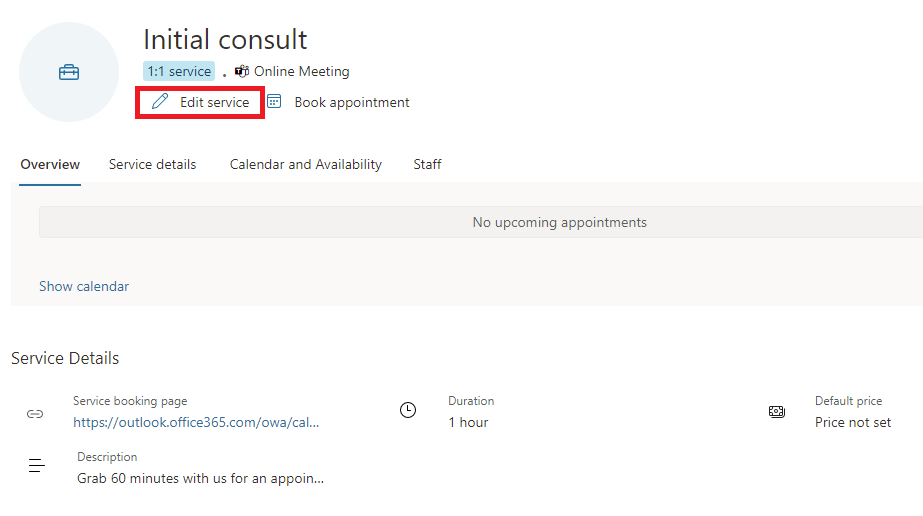
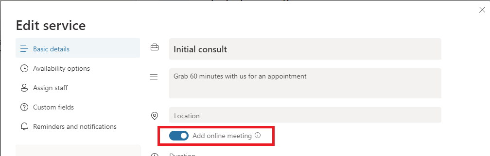
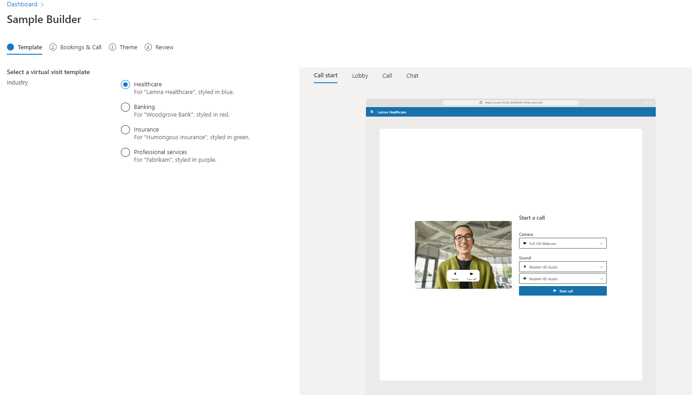
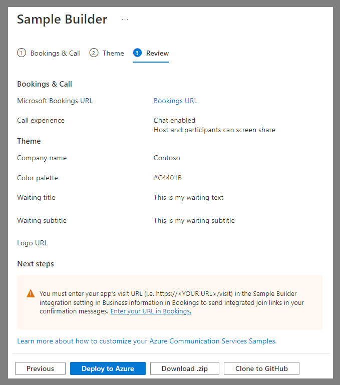
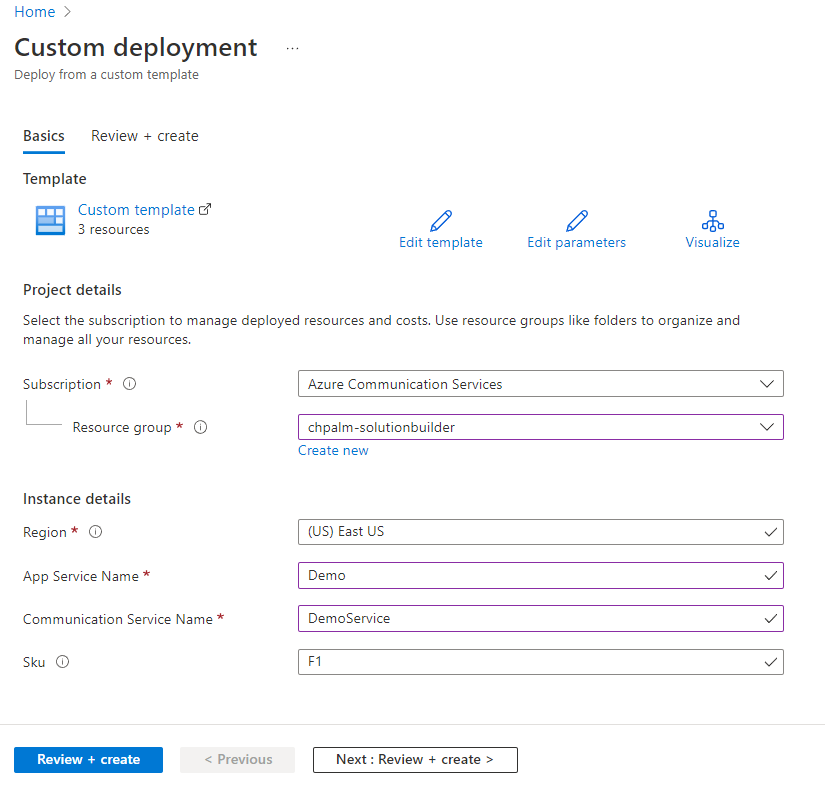
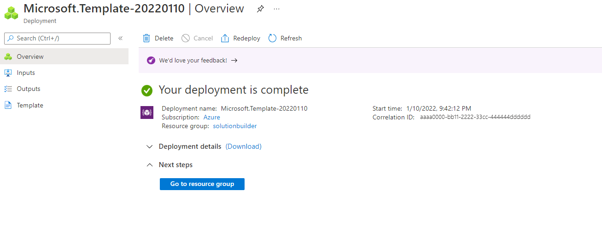
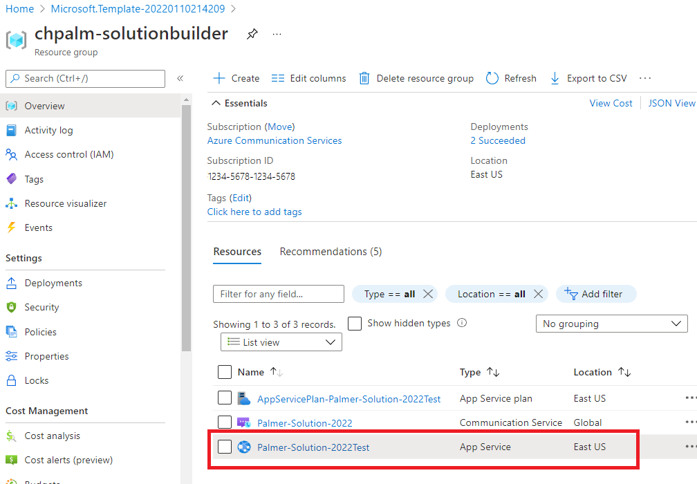
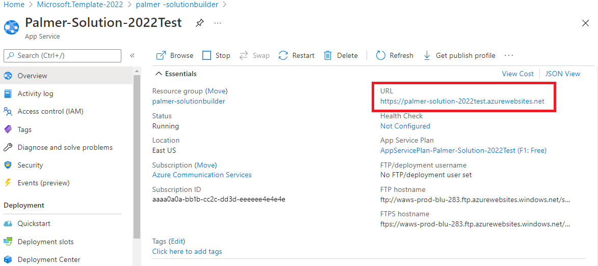

# Virtual appointments

This tutorial describes concepts for virtual appointment applications. After completing this tutorial and the associated [Sample Builder](https://aka.ms/acs-sample-builder), you'll understand common use cases that a virtual appointments application delivers, the Microsoft technologies that can help you build those uses cases, and have built a sample application integrating Microsoft 365 and Azure that you can use to demo and explore further.

Virtual appointments are a communication pattern where a **consumer** and a **business** assemble for a scheduled appointment. The **organizational boundary** between consumer and business, and **scheduled** nature of the interaction, are key attributes of most virtual appointments. Many industries operate virtual appointments: meetings with a healthcare provider, a loan officer, or a product support technician.

No matter the industry, there are at least three personas involved in a virtual appointment and certain tasks they accomplish:
- **Office Manager.** The office manager configures the business’ availability and booking rules for providers and consumers.
- **Provider.** The provider gets on the call with the consumer. They must be able to view upcoming virtual appointments and join the virtual appointment and engage in communication.
- **Consumer**. The consumer who schedules and motivates the appointment. They must schedule an appointment, enjoy reminders of the appointment, typically through SMS or email, and join the virtual appointment and engage in communication.

Azure and Teams are interoperable. This interoperability gives organizations choice in how they deliver virtual appointments using Microsoft's cloud. Three examples include:

-  **Microsoft 365** provides a zero-code suite for virtual appointments using Microsoft [Teams](https://www.microsoft.com/microsoft-teams/group-chat-software/) and [Bookings](https://www.microsoft.com/microsoft-365/business/scheduling-and-booking-app). This is the easiest option but customization is limited. [Check out this video for an introduction.](https://www.youtube.com/watch?v=zqfGrwW2lEw)
-  **Microsoft 365 + Azure hybrid.** Combine Microsoft 365 Teams and Bookings with a custom Azure application for the consumer experience. Organizations take advantage of Microsoft 365's employee familiarity but customize and embed the consumer appointment experience in their own application.
-  **Azure custom.** Build the entire solution on Azure primitives: the business experience, the consumer experience, and scheduling systems.

These three **implementation options** are columns in the table below, while each row provides a **use case** and the **enabling technologies**.

|*Persona* | **Use Case** | **Microsoft 365** | **Microsoft 365 + Azure hybrid** | **Azure Custom** |
|--------------|------------|-----------|---------------|---------------|
| *Manager* | Configure Business Availability | Bookings | Bookings | Custom |
| *Provider* | Managing upcoming appointments | Outlook & Teams | Outlook & Teams | Custom |
| *Provider* | Join the appointment | Teams | Teams | Azure Communication Services Calling & Chat |
| *Consumer* | Schedule an appointment | Bookings | Bookings | Azure Communication Services Rooms |
| *Consumer*| Be reminded of an appointment | Bookings | Bookings | Azure Communication Services SMS |
| *Consumer*| Join the appointment | Teams or virtual appointments | Azure Communication Services Calling & Chat | Azure Communication Services Calling & Chat |

There are other ways to customize and combine Microsoft tools to deliver a virtual appointments experience:
-  **Replace Bookings with a custom scheduling experience with Graph.** You can build your own consumer-facing scheduling experience that controls Microsoft 365 meetings with Graph APIs.
-  **Replace Teams’ provider experience with Azure.** You can still use Microsoft 365 and Bookings to manage meetings but have the business user launch a custom Azure application to join the Teams meeting. This might be useful where you want to split or customize virtual appointment interactions from day-to-day employee Teams activity.

## Extend Microsoft 365 with Azure
The rest of this tutorial focuses on Microsoft 365 and Azure hybrid solutions. These hybrid configurations are popular because they combine employee familiarity of Microsoft 365 with the ability to customize the consumer experience. They’re also a good launching point to understanding more complex and customized architectures. The diagram below shows user steps for a virtual appointment:

1. Consumer schedules the appointment using Microsoft 365 Bookings.
2. Consumer gets an appointment reminder through SMS and Email.
3. Provider joins the appointment using Microsoft Teams.
4. Consumer uses a link from the Bookings reminders to launch the Contoso consumer app and join the underlying Teams meeting.
5. The users communicate with each other using voice, video, and text chat in a meeting. Specifically, Teams chat interoperability enables Teams user to send inline images or file attachments directly to Azure Communication Services users seamlessly. 

## Building a virtual appointment sample
In this section, we’re going to use a Sample Builder tool to deploy a Microsoft 365 + Azure hybrid virtual appointments application to an Azure subscription. This application is a desktop and mobile friendly browser experience, with code that you can use to explore and for production.

### Step 1: Configure bookings

This sample uses takes advantage of the Microsoft 365 Bookings app to power the consumer scheduling experience and create meetings for providers. Thus the first step is creating a Bookings calendar and getting the Booking page URL from https://outlook.office.com/bookings/calendar.

Make sure online meeting is enabled in the calendar by going to https://outlook.office.com/bookings/services.

And then make sure "Add online meeting" is enabled.

### Step 2: Sample Builder
Use the Sample Builder to customize the consumer experience. You can reach the Sampler Builder using this [link](https://aka.ms/acs-sample-builder) or navigating to the page within the Azure Communication Services resource in the Azure portal. Step through the Sample Builder wizard: select Industry template, configure the call experience (Chat or Screen Sharing availability), change themes and text to match your application style and get valuable feedback through post-call survey options. You can preview your configuration live from the page in both Desktop and Mobile browser form-factors.

### Step 3: Deploy
At the end of the Sample Builder wizard, you can **Deploy to Azure** or download the code as a zip. The sample builder code is publicly available on [GitHub](https://github.com/Azure-Samples/communication-services-virtual-visits-js).

The deployment launches an Azure Resource Manager (ARM) template that deploys the themed application you configured.

After walking through the ARM template, you can **Go to resource group**.

### Step 4: Test
The Sample Builder creates three resources in the selected Azure subscriptions. The **App Service** is the consumer front end, powered by Azure Communication Services.

Opening the App Service’s URL and navigating to `https://<YOUR URL>/VISIT` allows you to try out the consumer experience and join a Teams meeting.  `https://<YOUR URL>/BOOK` embeds the Booking experience for consumer scheduling.

### Step 5: Set deployed app URL in Bookings 

Enter the application url followed by "/visit" in the "Deployed App URL" field in https://outlook.office.com/bookings/businessinformation.

## Going to production
The Sample Builder gives you the basics of a Microsoft 365 and Azure virtual appointment: consumer scheduling via Bookings, consumer joins via custom app, and the provider joins via Teams. However, there are several things to consider as you take this scenario to production.

### Launching patterns
Consumers want to jump directly to the virtual appointment from the scheduling reminders they receive from Bookings. In Bookings, you can provide a URL prefix that is used in reminders. If your prefix is `https://<YOUR URL>/VISIT`, Bookings point users to `https://<YOUR URL>/VISIT?MEETINGURL=<MEETING URL>.`

### Integrate into your existing app
The app service generated by the Sample Builder is a stand-alone artifact, designed for desktop and mobile browsers. However you may have a website or mobile application already and need to migrate these experiences to that existing codebase. The code generated by the Sample Builder should help, but you can also use:
-  **UI SDKs –** [Production Ready Web and Mobile](../concepts/ui-library/ui-library-overview.md) components to build graphical applications.
-  **Core SDKs –** The underlying [Call](../quickstarts/voice-video-calling/get-started-teams-interop.md) and [Chat](../quickstarts/chat/meeting-interop.md) services can be accessed and you can build any kind of user experience.

### Identity & security
The Sample Builder’s consumer experience doesn't authenticate the end user, but provides [Azure Communication Services user access tokens](../quickstarts/identity/access-tokens.md) to any random visitor. That isn’t realistic for most scenarios, and you want to implement an authentication scheme.

### Customizations 
Kindly be aware that the code sample presented here is intended as a foundation for your virtual appointments application. It is crucial to understand that adjustments tailored to your unique use case will be essential. We recommend reviewing the code, making the necessary modifications, and referring to the accompanying documentation for assistance.