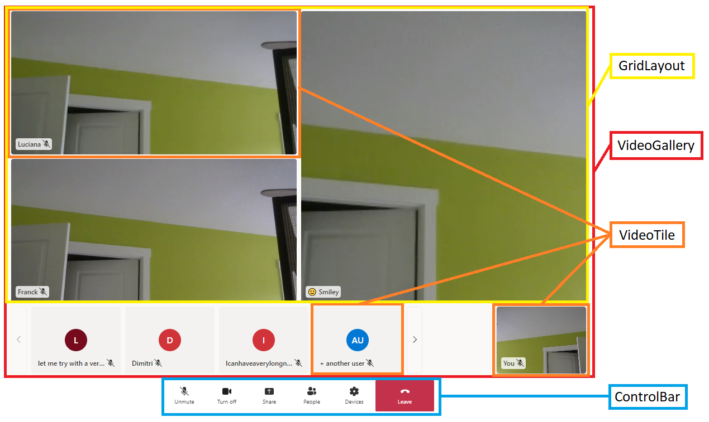
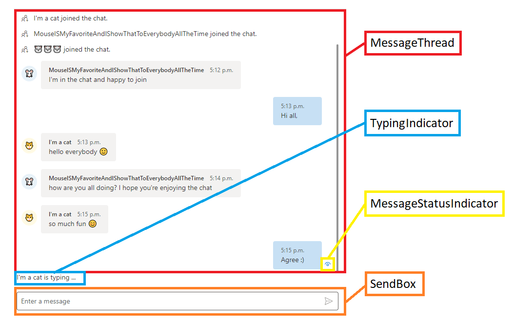

# Extend call experience
You can use out-of-the-box Virtual appointments experience created via Microsoft Teams Virtual Appointment Booking or through Microsoft Graph Virtual appointment API to allow consumers to join a Microsoft hosted Virtual appointment experience of Virtual appointment. If you have Microsoft Teams Premium, you can further customize the experience via Meeting theme that allows you to choose images, logos, and colors used throughout the experience. 
Azure Communication Services can help developers who want to self-host the solution or customize the experience. 

Azure Communication Services provides three customization options:
- Customize the user interface via ready-to-use user interface composites.
- Build your own layout using the UI Library components & composites.
- Build your own user interface with software development kits

## Prerequisites
The reader of this article is expected to have an understanding of the following topics:
-	[Azure Communication Services](/azure/communication-services/) [Chat](/azure/communication-services/concepts/chat/concepts), [Calling](/azure/communication-services/concepts/voice-video-calling/calling-sdk-features) and [user interface library](/azure/communication-services/concepts/ui-library/ui-library-overview)

## Customizable ready-to-use user interface composites
You can integrate ready-to-use meeting composites provided by the Azure Communication Service user interface library. This composite provides out-of-the-box React components that can be integrated into your Web application. You can find more details [here](https://azure.github.io/communication-ui-library/?path=/docs/use-composite-in-non-react-environment--page) about using this composite with different web frameworks.
1.	First, provide details about the application's user. To do that, create [Azure Communication Call Adapter Arguments](/javascript/api/@azure/communication-react/azurecommunicationcalladapterargs) to hold information about user ID, access token, display name, and Teams meeting URL.

```js
const callAdapterArgs = {
        userId: new CommunicationUserIdentifier(<USER_ID>'),
        displayName: “Adele Vance”,
        credential: new AzureCommunicationTokenCredential('<TOKEN>'),
        locator: { meetingLink: '<TEAMS_MEETING_URL>'},
        endpoint: '<AZURE_COMMUNICATION_SERVICE_ENDPOINT_URL>';
}
```
2.	Create a custom React hook with [useAzureCommunicationCallAdapter](/javascript/api/@azure/communication-react/#@azure-communication-react-useazurecommunicationcalladapter) to create a Call Adapter.
```js
const callAdapter = useAzureCommunicationCallAdapter(callAdapterArgs);
```

3.	Return React component [CallComposite](/javascript/api/@azure/communication-react/#@azure-communication-react-callwithchatcomposite) that provides meeting experience. 

```js
return (
  <div>
    <CallWithChatComposite
      adapter={callAdapter}
    />
  </div>
);
```

You can further [customize the user interface with your own theme for customization and branding](https://azure.github.io/communication-ui-library/?path=/docs/theming--page) or [optimize the layout for desktop or mobile](/javascript/api/@azure/communication-react/callwithchatcompositeprops#@azure-communication-react-callwithchatcompositeprops-formfactor). If you would like to customize the layout even further, you may utilize pre-existing user interface components as described in the subsequent section.

  
## Build your own layout with user interface components
Azure Communication Services user interface library gives you access to individual components to customize its user interface, and its behavior. The following image highlights the individual components that are available to use.


 
The following table details the individual components:

| Component | Description |
| --- | --- |
| [Grid Layout](https://azure.github.io/communication-ui-library/?path=/story/ui-components-gridlayout--grid-layout) | Grid component to organize Video Tiles into an NxN grid |
| [Video Tile](https://azure.github.io/communication-ui-library/?path=/story/ui-components-videotile--video-tile)  | Component that displays video stream when available and a default static component when not |
| [Control Bar](https://azure.github.io/communication-ui-library/?path=/story/ui-components-controlbar--control-bar) | Container to organize DefaultButtons to hook up to specific call actions like mute or share screen |
| [Video Gallery](https://azure.github.io/communication-ui-library/?path=/story/ui-components-videogallery--video-gallery) | Turn-key video gallery component which dynamically changes as participants are added |

You can also customize your chat experience. The following image highlights the individual components of chat.
 
 
 
The following table provides descriptions with links to individual components

| Component | Description |
|---|---|
| Message Thread | Container that renders chat messages, system messages, and custom messages |
| Send Box | Text input component with a discrete send button |
| Message Status Indicator | Multi-state message status indicator component to show status of sent message |
| Typing indicator | Text component to render the participants who are actively typing on a thread |


Let’s take a look at how you can use [Control Bar](https://azure.github.io/communication-ui-library/?path=/story/ui-components-controlbar--control-bar) component to show only camera and microphone buttons in this order, and control actions that are performed after selection of those buttons.

```js
export const AllButtonsControlBarExample: () => JSX.Element = () => {
  return (
    <FluentThemeProvider>
      <ControlBar layout={'horizontal'}>
        <CameraButton
          onClick={() => {  /*handle onClick*/ }}
        />
        <MicrophoneButton
          onClick={() => {  /*handle onClick*/ }}
        />
      </ControlBar>
    </FluentThemeProvider>
)}
```

For more customization you can add more predefined buttons and, you can change their color, icons, or order. If you have existing user interface components that you would like to use or you would like to have more control over the experience, you can use underlying software development kits (SDKs) to build your own user interface.

        
## Build your own user interface with software development kits
Azure Communication Services provides chat and calling SDKs to build Virtual appointment experiences. The experience consists of three main parts, [authentication](/azure/communication-services/quickstarts/identity/access-tokens?tabs=windows&pivots=programming-language-csharp), [calling](/azure/communication-services/quickstarts/voice-video-calling/get-started-teams-interop?pivots=platform-web) and [chat](/azure/communication-services/quickstarts/chat/meeting-interop?pivots=platform-web). We have dedicated QuickStarts and GitHub samples for each but the following code samples show how to enable the experience. 
The authentication of the user requires creating or selecting an existing Azure Communication Services user and issue a token. You can use connection string to create CommunicationIdentityClient. We encourage you to implement this logic in the backend, as sharing connectionstring with clients isn't secure.
```js
var client = new CommunicationIdentityClient(connectionString);
```

Create an Azure Communication Services user associated to your Azure Communication Services resource with method CreateUserAsync.

```js
var identityResponse = await client.CreateUserAsync();
var identity = identityResponse.Value;
```

Issue access token associated to the Azure Communication Services user with chat and calling scope.

```js
var tokenResponse = await client.GetTokenAsync(identity, scopes: new [] { CommunicationTokenScope.VoIP, CommunicationTokenScope.Chat  });
var token =  tokenResponse.Value.Token;
```

Now you have a valid Azure Communication Services user and access token assigned to this user. You can now integrate the calling experience. This part is implemented on the client side and for this example, let’s assume that the properties are being propagated to the client from the backend. The following  tutorial shows how to do it.
First create a [CallClient](/javascript/api/azure-communication-services/@azure/communication-calling/callclient) that initiates the SDK and give you access to [CallAgent](/javascript/api/azure-communication-services/@azure/communication-calling/callagent) and device manager.

```js
const callClient = new CallClient(); 
Create CallAgent from the client and define the display name of the user.
tokenCredential = new AzureCommunicationTokenCredential(token);
callAgent = await callClient.createCallAgent(tokenCredential, {displayName: 'Adele Vance'})
```

Join Microsoft Teams meeting associated with Virtual appointment based on the Teams meeting URL.

```js
var meetingLocator = new TeamsMeetingLinkLocator("<TEAMS_MEETING_URL>");
callAgent.join(meetingLocator , new JoinCallOptions());
```

Those steps allow you to join the Teams meeting. You can then extend those steps with [management of speakers, microphone, camera and individual video streams](/azure/communication-services/how-tos/calling-sdk/manage-video?pivots=platform-web). Then, optionally, you can also integrate chat in the Virtual appointment experience.

Create a [ChatClient](https://azuresdkdocs.blob.core.windows.net/$web/javascript/azure-communication-chat/1.3.2-beta.1/classes/ChatClient.html) that initiates the SDK and give you access to notifications and [ChatThreadClient](https://azuresdkdocs.blob.core.windows.net/$web/javascript/azure-communication-chat/1.3.2-beta.1/classes/ChatThreadClient.html).

```js
const chatClient = new ChatClient(
    endpointUrl,
    new AzureCommunicationTokenCredential(token)
  );
```

Subscribe to receive real-time  chat notifications for the Azure Communication Services user.

```js
await chatClient.startRealtimeNotifications();
```

Subscribe to an event when message is received.

```js
// subscribe to new message notifications
chatClient.on("chatMessageReceived", (e) => { /*Render message*/})
```

Create [ChatThreadClient](https://azuresdkdocs.blob.core.windows.net/$web/javascript/azure-communication-chat/1.3.2-beta.1/classes/ChatThreadClient.html) to initiate client for operations related to specific chat thread. 

```js
chatThreadClient = await chatClient.getChatThreadClient(threadIdInput.value);
```

Send chat message in the Teams meeting chat associated with the Virtual appointment.

```js
let sendMessageRequest = { content: 'Hello world!' };
let sendMessageOptions = { senderDisplayName : 'Adele Vance' };
let sendChatMessageResult = await chatThreadClient.sendMessage(sendMessageRequest, sendMessageOptions);
```

With all three phases, you have a user that can join Virtual appointments with audio, video, screen sharing and chat. This approach gives you full control over the user interface and the behavior of individual actions.

## Next steps
-	Learn what [extensibility options](./overview.md) do you have for Virtual appointments.
-	Learn how to customize [before and after appointment](./before-and-after-appointment.md)
-	Learn how to customize [precall experience](./precall.md)
-	Learn how to customize [call experience](./call.md)
