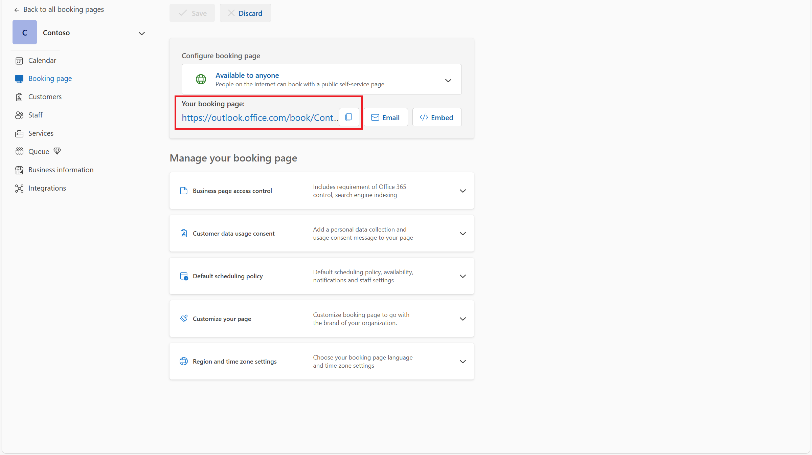
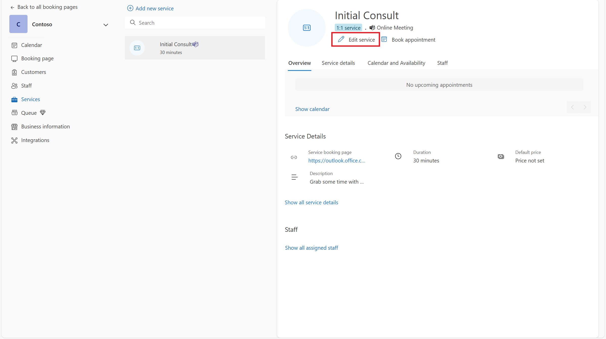
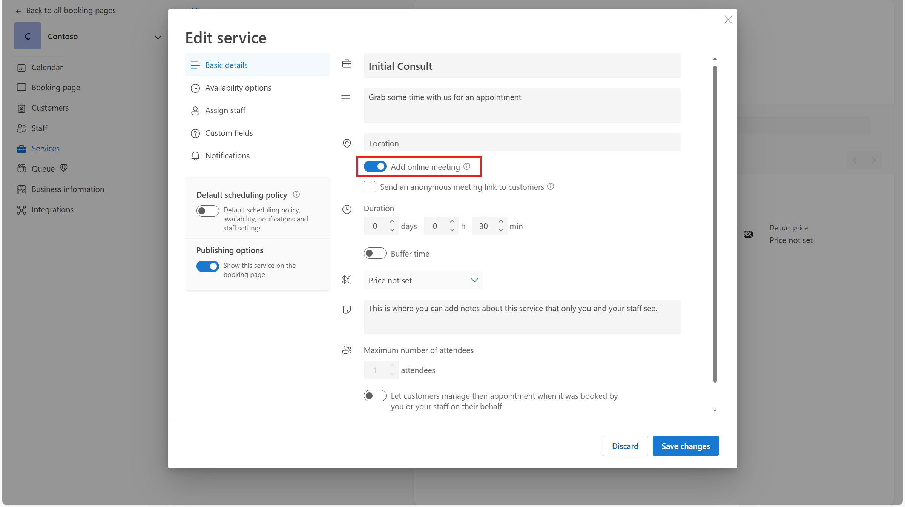
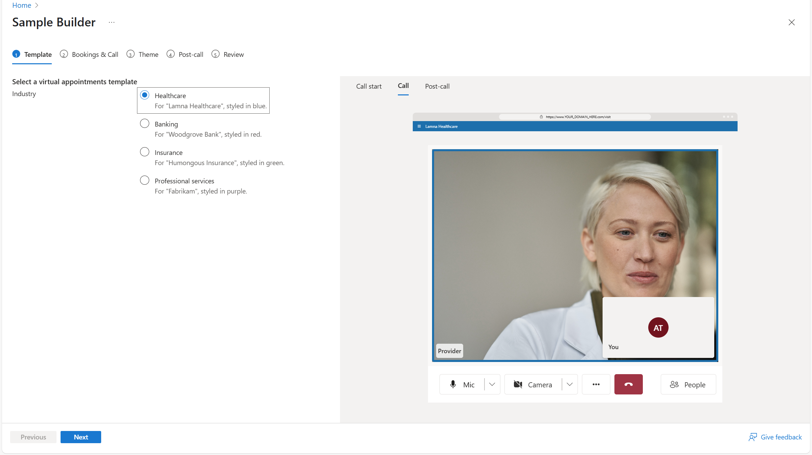
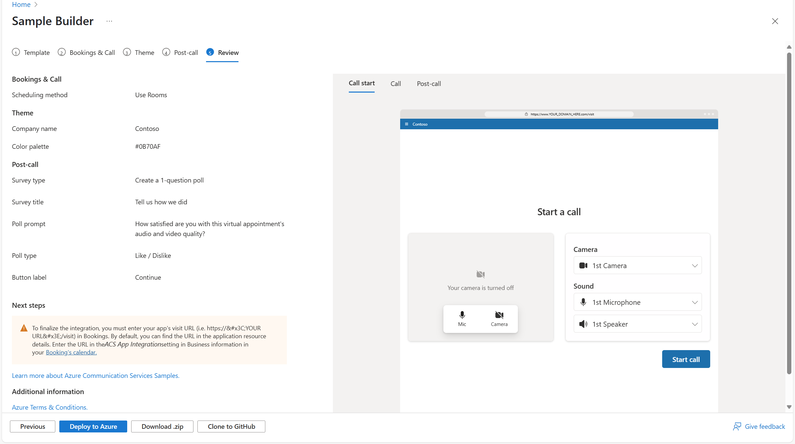
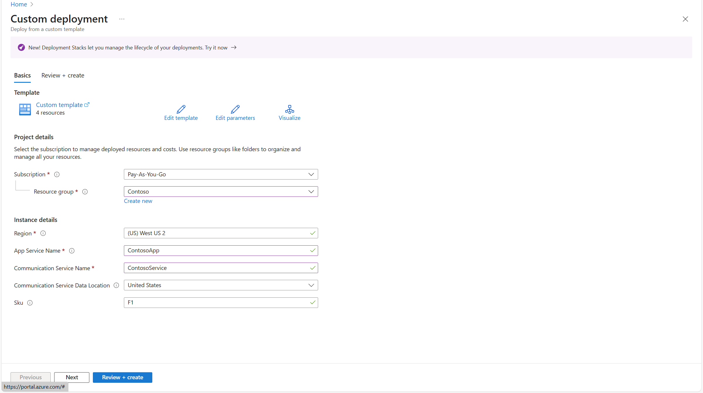
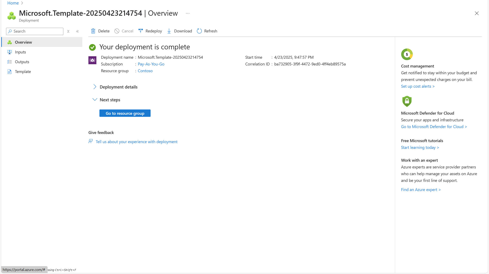
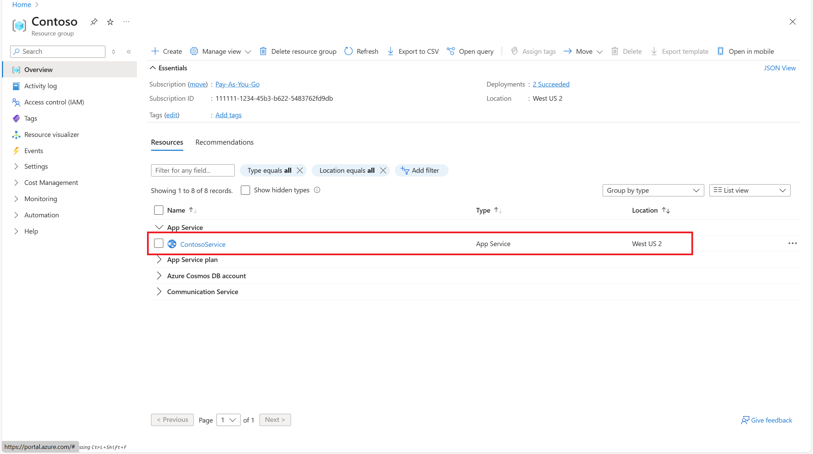
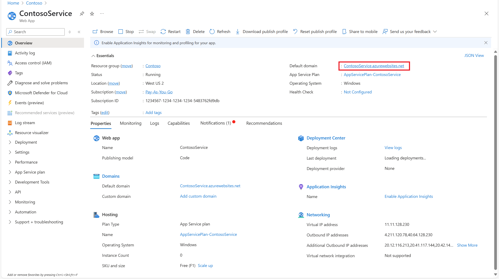

# Sample Builder

The Azure Communication Services Sample Builder is a no-code tool designed to help teams rapidly launch virtual appointment experiences—without needing to write custom code. Whether you're running a healthcare clinic, financial consultation, or support center, the sample builder lets you prototype, customize, and deploy. These samples can integrate directly with Microsoft Teams and Bookings. 

👉 **Launch the Sample Builder**: [Go to the Sample Builder](https://ms.portal.azure.com/#view/Microsoft_Azure_VirtualVisitsBuilder/SampleBuilder.ReactView)

This tutorial introduces key concepts for building virtual appointment applications. After completing this tutorial and using the Sample Builder, you will:

- Understand common use cases for virtual appointments
- Explore Microsoft technologies that support these scenarios
- Deploy a working sample application that integrates Microsoft 365 and Azure

Learn more foundational concepts in the virtual appointments [overview](../../concepts/interop/virtual-visits/overview.md).

### Capabilities
The Sample Builder can help:
-  **Deploy a working virtual visit experience in minute**s—minimal code required
-  **View cutting edge new AI capabilites**— try out new AI powered features 
-  **Customize the consumer experience** with by altering prebuilt user interface, post-call surveys, and more
-  **Integrate with Microsoft Bookings** to support scheduling workflows
-  **Launch Microsoft Teams meetings** using Azure Communication Services and enable guest access via the web app

### How it works
This sample is built on top of Azure Communication Services UI components and composites, providing a robust, accessible, and consistent user interface out of the box. It serves as both a deployment tool and a reference architecture for best practices in communication-driven experiences.

The Sample Builder creates a hybrid virtual visit solution by integrating:
- Microsoft 365 services such as Bookings and Microsoft Teams (for scheduling and provider-side meetings)
- Azure services such as Azure Communication Services, App Service, and optional Azure Monitor (for web experience, analytics, and real-time communication)

The following diagram shows the user steps for a virtual appointment (using Microsoft Booking):

Virtual Appointment Flow (Using Microsoft Bookings):

1. Consumer schedules the appointment using Microsoft 365 Bookings
2. Consumer receives reminders via SMS and email
3. Provider joins via Microsoft Teams
4. Consumer uses a link from the reminder to launch the Contoso app and join the Teams meeting
5. Both users interact via video, voice, and chat

This architecture ensures that providers can join virtual appointments using Microsoft Teams. In the same call, consumers can access a fully branded, browser-based experience—no Teams account required.

### What you get
Upon deployment, the Sample Builder provides:
-  A fully deployed Azure web app
-  Microsoft Teams meeting integration
-  Custom UI implementation powered by Azure Communication Services composites
-  (Optional) Microsoft Bookings integration page
-  (Optional) Azure Monitor-based analytics
-  Downloadable full source code for further development and customization

After deployment, you can immediately test the deployed sample by visiting these urls:
-  `https://your-app-url>/visit` to simulate a consumer joining the appointment
-  `https://<your-app-url>/book` to access the embedded booking interface

The following tutorial goes into more depth on how you can set this up.
 

## Tutorial: Build a virtual appointment sample
In this section, we're going to use a Sample Builder tool to deploy a Microsoft 365 + Azure hybrid virtual appointments application to an Azure subscription. This application is a desktop and mobile-friendly browser experience, with code that you can use to explore and make the final product. 

### Step 0: Configure Microsoft 365 Bookings (Optional)

The Sample builder provides an option to configure the sample using Microsoft 365 Bookings. This functionality allows the bookings app to power the consumer scheduling experience and create meetings for providers.  

**If you don't want to use bookings, feel free to skip this step**.  This step is optional when creating a sample as you can select Rooms instead.

If you do want to use Bookings, create a Bookings calendar and get the Booking page URL from https://outlook.office.com/bookings/calendar.

Make sure online meeting is enabled for the calendar by going to https://outlook.office.com/bookings/services.

And then, make sure "Add online meeting" is enabled.

 
 

### Step 1: Create a sample in the builder

#### Prerequisites
To use the Sample Builder, you need:
- An active Azure subscription
- Admin permissions to deploy resources in Azure
- Access to Microsoft Bookings (if you plan to enable scheduling integration)

**Launch the Sample Builder**: 👉 [Sample Builder](https://ms.portal.azure.com/#view/Microsoft_Azure_VirtualVisitsBuilder/SampleBuilder.ReactView) 

You can also  navigate to the page within the Azure Communication Services resource in the Azure portal. If you’re planning to integrate with Microsoft Bookings, skip ahead to Using with Microsoft Bookings to learn how the app connects with scheduling workflows. Return to this step upon setup.

**Follow the step-by-step wizard.** 

1. Choose an industry scenario (Template)
2. Choose a scheduling method (Bookings or Rooms)
3. Customize the theme, colors, banners, and add any logos
4. Select and customize the Post-Call experience
5. Preview your configuration live, including your brand colors and features available

As you progress through the wizard, select through different setting to see what functionality is available. Different setups provide different features, experiences, and options. 

### Step 2: Deploy
At the end of the Sample Builder wizard, you're met with three options. You can deploy to Azure, download the code as a zip, or clone to GitHub. The sample builder code is publicly available on [GitHub](https://github.com/Azure-Samples/communication-services-virtual-visits-js).

The easiest method to get a working sample is to **Deploy to Azure**. Deployment launches an Azure Resource Manager (ARM) template that deploys the themed application you configured.

After walking through the ARM template, you can **Go to resource group**.

### Step 3: Test
The Sample Builder creates three resources in the selected Azure subscriptions. The **App Service** is the consumer front end, powered by Azure Communication Services.

Opening the App Service's URL and navigating to `https://<YOUR URL>/VISIT` allows you to try out the consumer experience and join a Teams meeting. `https://<YOUR URL>/BOOK` embeds the Booking experience for consumer schedule.

### Step 4: Set deployed app URL in Bookings 

If using Bookings, enter the application URL followed by "/visit" in the "Deployed App URL" field at https://outlook.office.com/bookings/businessinformation. Otherwise, ignore this step.

## Further Actions
Congrats! You deployed a custom sample. As you try it out, consider the following

### Launching patterns
Consumers often want to join their virtual appointment directly from the reminders sent by Bookings. To support this functionality, Bookings allows to you specify a URL prefix that is included in those reminders. For example, if your prefix is `https://<YOUR URL>/visit`, the reminders directs users to `https://<YOUR URL>/visit?MEETINGURL=<MEETING URL>`.

### Integrate into your existing app
The app service generated by the Sample Builder is a standalone experience optimized for desktop and mobile browsers. If you already have an existing website or mobile app, you can adapt the provided code to fit into your current codebase.

For more flexibility and customization, consider using:
- **UI SDKs** – [Prebuilt, production-ready web and mobile UI components](../../concepts/ui-library/ui-library-overview.md) that allow you to match your existing look and feel. The sample builder is built on top of our customizable composite. Read here to learn more
- **Core SDKs** – Access the underlying [Calling](../../quickstarts/voice-video-calling/get-started-teams-interop.md) and [Chat](../../quickstarts/chat/meeting-interop.md) services directly to build fully custom experiences.

### Identity & security
The sample app issues ACS access tokens without user authentication. In production, implement secure user auth. [Azure Communication Services user access tokens](../../quickstarts/identity/access-tokens.md)

## Next steps
- [Overview of virtual appointments](../../concepts/interop/virtual-visits/overview.md)
- [Learn about Teams controls](../../concepts/interop/guest/teams-administration.md).
- [Govern user experience in Teams meetings](../../concepts/interop/virtual-visits/govern-meeting-experience.md)
- [Plan user experience in Teams meetings](../../concepts/interop/virtual-visits/plan-user-experience.md)
