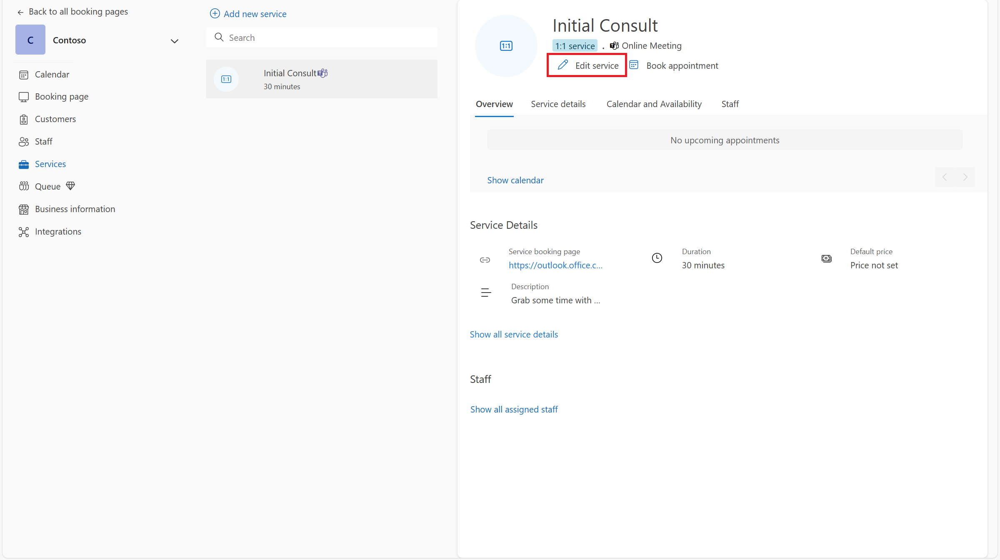

# Sample Builder

The Azure Communication Services Sample Builder is a no-code tool designed to help teams rapidly launch virtual appointment experiences—without needing to write custom code. Whether you're running a healthcare clinic, financial consultation, or support center, it lets you prototype, customize, and deploy real-time customer interactions that can integrate directly with Microsoft Teams and Bookings. 

👉 **Launch the Sample Builder**: [Go to the Sample Builder](https://ms.portal.azure.com/#view/Microsoft_Azure_VirtualVisitsBuilder/SampleBuilder.ReactView)

This tutorial describes concepts for virtual appointment applications. After completing this tutorial and using associated Sample Builder, you will understand common use cases that a virtual appointments application delivers, the Microsoft technologies that can help you build those uses cases, and have built a sample application integrating Microsoft 365 and Azure that you can use to demo and explore further. You can learn more concepts about virtual appointments in the [overview](../../concepts/interop/virtual-visits/overview.md).

### Capabilities
The Sample Builder can help:
-  **Deploy a working virtual visit experience in minute**s—minimal code required
-  **Try new features early**—test UI capabilities that haven’t fully entered the Azure Communications Services UI library
-  **Customize the consumer experience** with a prebuilt user interface, optional pre-call survey, post-call survey, waiting room, and more
-  **Integrate with Microsoft Bookings** to support scheduling workflows
-  **Launch Microsoft Teams meetings** using Azure Communication Services and enable guest access via the web app

### How It Works
This sample is built on top of Azure Communication Services UI components and composites, providing a robust, accessible, and consistent user interface out of the box. It serves as both a deployment tool and a reference architecture for best practices in communication-driven experiences.
The Sample Builder creates a hybrid virtual visit solution by integrating:
- Microsoft 365 services such as Bookings and Microsoft Teams (for scheduling and provider-side meetings)
- Azure services such as Azure Communication Services, App Service, and optional Azure Monitor (for web experience, analytics, and real-time communication)

The following diagram shows the user steps for a virtual appointment (using Microsoft Booking):

For this Virtual Appointments scenario using Microsoft Bookings, this chart showcases:
1. Consumer schedules the appointment using Microsoft 365 Bookings.
2. Consumer gets an appointment reminder through SMS and Email.
3. Provider joins the appointment using Microsoft Teams.
4. Consumer uses a link from the Bookings reminders to launch the Contoso consumer app and join the underlying Teams meeting.
5. The users communicate with each other using voice, video, and text chat in a meeting.

This architecture ensures that providers can join virtual appointments using Microsoft Teams and that Consumers can access a fully branded, browser-based experience—no Teams account required.

### What You Get
Once the tutorial and Sample Builder have been completed, the Sample Builder will provide:
-  A fully deployed Azure web app
-  Microsoft Teams meeting integration
-  Custom UI implementation powered by Azure Communication Services composites
-  (Optional) Microsoft Bookings integration page
-  (Optional) Azure Monitor-based analytics
-  Downloadable full source code for further development and customization

After deployment, you can immediately test the deployed sample by visiting these urls:
-  `https://your-app-url>/visit` to simulate a consumer joining the appointment
-  `https://<your-app-url>/book` to access the embedded booking interface

The following tutorial will go into more depth on how you can set this up.
 

# Tutorial: Building a Virtual Appointment Sample
In this section, we're going to use a Sample Builder tool to deploy a Microsoft 365 + Azure hybrid virtual appointments application to an Azure subscription. This application is a desktop and mobile-friendly browser experience, with code that you can use to explore and make the final product. 

## Step 0: Configure Microsoft 365 Bookings (Optional)

The Sample builder provides an option to configure the sample using M365 Bookings. This allows the bookings app to power the consumer scheduling experience and create meetings for providers.  

**If you don't want to use bookings, feel free to skip this step**. This is optional when creating a sample as you can select Rooms instead.

If you do want to use Bookings, create a Bookings calendar and get the Booking page URL from https://outlook.office.com/bookings/calendar.

Make sure online meeting is enabled for the calendar by going to https://outlook.office.com/bookings/services.

And then, make sure "Add online meeting" is enabled.

 
 

## Step 1: Creating a Sample in the Builder

### Prerequisites
To use the Sample Builder, you’ll need:
- An active Azure subscription
- Admin permissions to deploy resources in Azure
- Access to Microsoft Bookings (if you plan to enable scheduling integration)

**Launch the Sample Builder**: 👉 [Sample Builder](https://ms.portal.azure.com/#view/Microsoft_Azure_VirtualVisitsBuilder/SampleBuilder.ReactView) 

You can also  navigate to the page within the Azure Communication Services resource in the Azure Portal. If you’re planning to integrate with Microsoft Bookings, skip ahead to Using with Microsoft Bookings to learn how the app connects with scheduling workflows. Return to this step upon setup.

**Follow the step-by-step wizard.** 

1. Choose an industry scenario (Template)
2. Choose a scheduling method (Bookings or Rooms)
3. Customize the theme, colors, banners and add any logos
4. Select and customize the Post-Call experience
5. Preview your configuration live, including your brand colors and features available

As you progress through the wizard, click through different setting to see what functionality is available. Different setups will provide different features, experiences, and options. 

## Step 2: Deploy
At the end of the Sample Builder wizard, you are met with 3 options. You can deploy to Azure, download the code as a zip, or clone to Github. The sample builder code is publicly available on [GitHub](https://github.com/Azure-Samples/communication-services-virtual-visits-js).

The easiest method to get a working sample is to **Deploy to Azure**. Deployment launches an Azure Resource Manager (ARM) template that deploys the themed application you configured.

After walking through the ARM template, you can **Go to resource group**.

## Step 3: Test
The Sample Builder creates three resources in the selected Azure subscriptions. The **App Service** is the consumer front end, powered by Azure Communication Services.

Opening the App Service's URL and navigating to `https://<YOUR URL>/VISIT` allows you to try out the consumer experience and join a Teams meeting. `https://<YOUR URL>/BOOK` embeds the Booking experience for consumer schedule.

## Step 4: Set deployed app URL in Bookings 

If using Bookings, enter the application URL followed by "/visit" in the "Deployed App URL" field at https://outlook.office.com/bookings/businessinformation. Otherwise, ignore this step.

# Going to production
Congrats! You have deplyed the a customer sample! The Sample Builder gives you the basics of a Microsoft 365 and Azure virtual appointment: consumer scheduling via Bookings, consumer joining via a custom app, and the provider joining via Teams. However, several things to consider as you take this scenario to production.

### Launching patterns
Consumers want to jump directly to the virtual appointment from the scheduling reminders they receive from Bookings. In Bookings, you can provide a URL prefix that is used in reminders. If your prefix is `https://<YOUR URL>/VISIT`, Bookings will point users to `https://<YOUR URL>/VISIT?MEETINGURL=<MEETING URL>.`

### Integrate into your existing app
The app service generated by the Sample Builder is a stand-alone artifact designed for desktop and mobile browsers. However, you may already have a website or mobile application and need to migrate these experiences to the existing codebase. The code generated by the Sample Builder should help, but you can also use the following:
-  **UI SDKs –** [Production Ready Web and Mobile](../../concepts/ui-library/ui-library-overview.md) components to build graphical applications.
-  **Core SDKs –** The underlying [Call](../../quickstarts/voice-video-calling/get-started-teams-interop.md) and [Chat](../../quickstarts/chat/meeting-interop.md) services can be accessed, and you can build any kind of user experience.

### Identity & security
The Sample Builder's consumer experience doesn't authenticate the end user but provides [Azure Communication Services user access tokens](../../quickstarts/identity/access-tokens.md) to any random visitor. In most scenarios you want to implement an authentication scheme.

# Next steps
- [Overview of virtual appointments](../../concepts/interop/virtual-visits/overview.md)
- [Learn about Teams controls](../../concepts/interop/guest/teams-administration.md).
- [Govern user experience in Teams meetings](../../concepts/interop/virtual-visits/govern-meeting-experience.md)
- [Plan user experience in Teams meetings](../../concepts/interop/virtual-visits/plan-user-experience.md)
