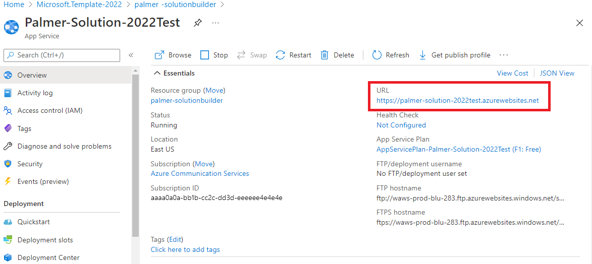

# Sample builder

This tutorial describes concepts for virtual appointment applications. After completing this tutorial and the associated [Sample Builder](https://aka.ms/acs-sample-builder), you will understand common use cases that a virtual appointments application delivers, the Microsoft technologies that can help you build those uses cases, and have built a sample application integrating Microsoft 365 and Azure that you can use to demo and explore further. You can learn more concepts about Virtual appointments in the [overview](../../concepts/interop/virtual-visits/overview.md).

This tutorial focuses on Microsoft 365 and Azure hybrid solutions. These hybrid configurations are popular because they combine employee familiarity with Microsoft 365 with the ability to customize the consumer experience. They're also a good launching point for understanding more complex and customized architectures. The following diagram shows the user steps for a virtual appointment:

1. Consumer schedules the appointment using Microsoft 365 Bookings.
2. Consumer gets an appointment reminder through SMS and Email.
3. Provider joins the appointment using Microsoft Teams.
4. Consumer uses a link from the Bookings reminders to launch the Contoso consumer app and join the underlying Teams meeting.
5. The users communicate with each other using voice, video, and text chat in a meeting.

## Building a virtual appointment sample
In this section, we're going to use a Sample Builder tool to deploy a Microsoft 365 + Azure hybrid virtual appointments application to an Azure subscription. This application is a desktop and mobile-friendly browser experience, with code that you can use to explore and make the final product. 

### Step 1: Configure bookings

This sample uses the Microsoft 365 Bookings app to power the consumer scheduling experience and create meetings for providers. Thus the first step is creating a Bookings calendar and getting the Booking page URL from https://outlook.office.com/bookings/calendar.

Make sure online meeting is enabled for the calendar by going to https://outlook.office.com/bookings/services.

And then, make sure "Add online meeting" is enabled.

### Step 2: Sample Builder
Use the Sample Builder to customize the consumer experience. You can reach the Sampler Builder using this [link](https://aka.ms/acs-sample-builder) or navigating to the page within the Azure Communication Services resource in the Azure portal. Step through the Sample Builder wizard:
1. Select the Industry template.
1. Configure the call experience (Chat or Screen Sharing availability).
1. Change themes and text to match your application style and get valuable feedback through post-call survey options.

You can preview your configuration live from the page in both Desktop and Mobile browser form factors.

### Step 3: Deploy
At the end of the Sample Builder wizard, you can **Deploy to Azure** or download the code as a zip. The sample builder code is publicly available on [GitHub](https://github.com/Azure-Samples/communication-services-virtual-visits-js).

The deployment launches an Azure Resource Manager (ARM) template that deploys the themed application you configured.

After walking through the ARM template, you can **Go to resource group**.

### Step 4: Test
The Sample Builder creates three resources in the selected Azure subscriptions. The **App Service** is the consumer front end, powered by Azure Communication Services.

Opening the App Service's URL and navigating to `https://<YOUR URL>/VISIT` allows you to try out the consumer experience and join a Teams meeting. `https://<YOUR URL>/BOOK` embeds the Booking experience for consumer schedule.

### Step 5: Set deployed app URL in Bookings 

Enter the application URL followed by "/visit" in the "Deployed App URL" field at https://outlook.office.com/bookings/businessinformation.

## Going to production
The Sample Builder gives you the basics of a Microsoft 365 and Azure virtual appointment: consumer scheduling via Bookings, consumer joining via a custom app, and the provider joining via Teams. However, several things to consider as you take this scenario to production.

### Launching patterns
Consumers want to jump directly to the virtual appointment from the scheduling reminders they receive from Bookings. In Bookings, you can provide a URL prefix that is used in reminders. If your prefix is `https://<YOUR URL>/VISIT`, Bookings will point users to `https://<YOUR URL>/VISIT?MEETINGURL=<MEETING URL>.`

### Integrate into your existing app
The app service generated by the Sample Builder is a stand-alone artifact designed for desktop and mobile browsers. However, you may already have a website or mobile application and need to migrate these experiences to the existing codebase. The code generated by the Sample Builder should help, but you can also use the following:
-  **UI SDKs –** [Production Ready Web and Mobile](../../concepts/ui-library/ui-library-overview.md) components to build graphical applications.
-  **Core SDKs –** The underlying [Call](../../quickstarts/voice-video-calling/get-started-teams-interop.md) and [Chat](../../quickstarts/chat/meeting-interop.md) services can be accessed, and you can build any kind of user experience.

### Identity & security
The Sample Builder's consumer experience doesn't authenticate the end user but provides [Azure Communication Services user access tokens](../../quickstarts/identity/access-tokens.md) to any random visitor. In most scenarios you want to implement an authentication scheme.

## Next steps
- [Overview of virtual appointments](../../concepts/interop/virtual-visits/overview.md)
- [Learn about Teams controls](../../concepts/interop/guest/teams-administration.md).
- [Govern user experience in Teams meetings](../../concepts/interop/virtual-visits/govern-meeting-experience.md)
- [Plan user experience in Teams meetings](../../concepts/interop/virtual-visits/plan-user-experience.md)
