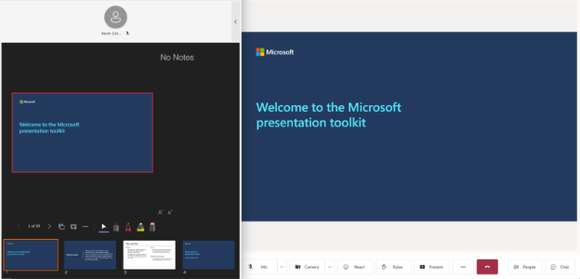
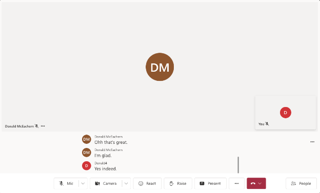
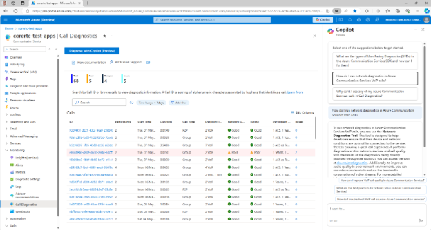
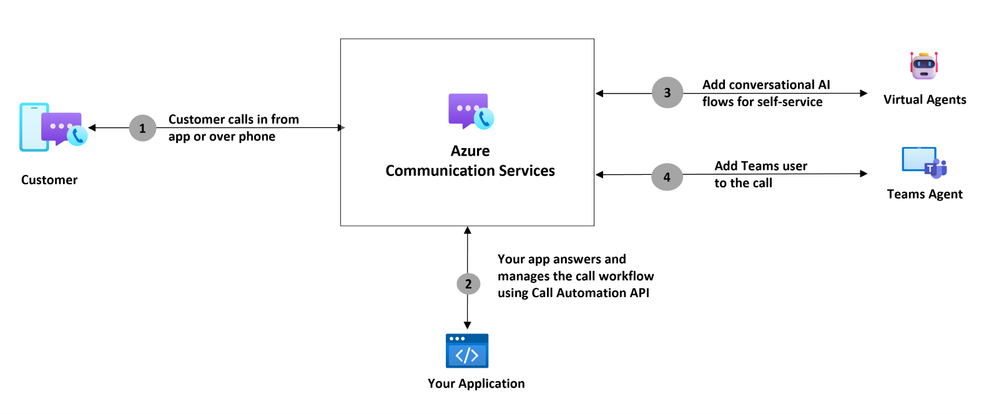
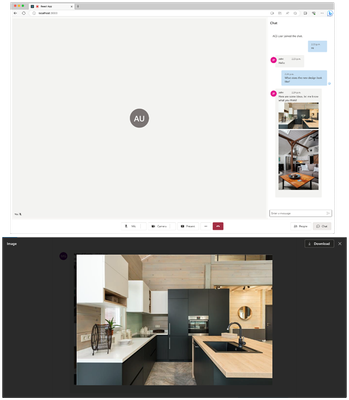
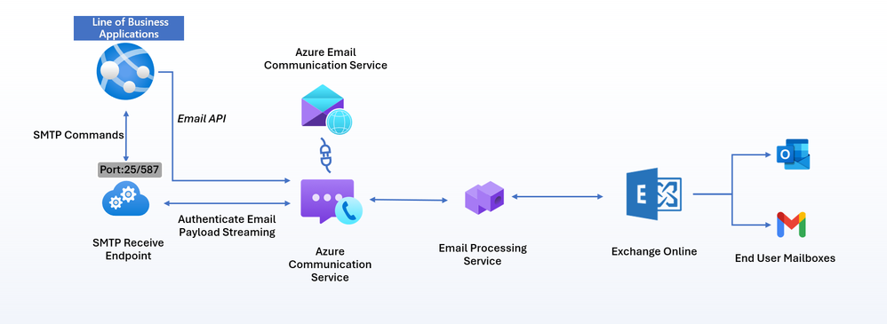
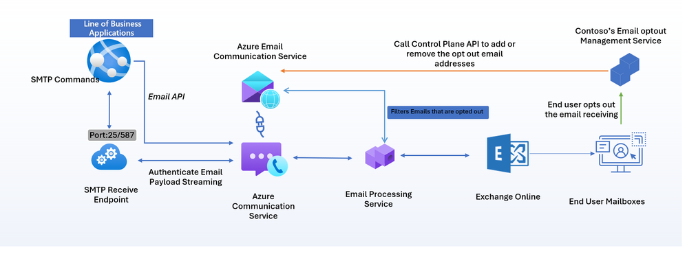
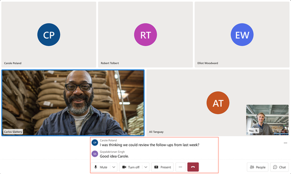

# What's new in Azure Communication Services

We created this page to keep you updated on new features, blog posts, and other useful information related to Azure Communication Services. 

[!INCLUDE [Survey Request](./includes/survey-request.md)]

## May 2024

### Data Retention with Chat threads

Developers can now create chat threads with a retention policy between 30 and 90 days. This feature is in public preview.

This policy is optional – developers can choose to create a chat thread with infinite retention (as always) or set a retention policy between 30 and 90 days. If the thread needs to be kept for longer than 90 days, you can extend the time using the update chat thread property API.  The policy is geared for data management in organizations that need to move data into their archives for historical purposes or delete the data within a given period.

Existing chat threads aren't affected by the policy.

For more information, see:
- [Chat concepts](./concepts/chat/concepts.md#chat-data)
- [Create Chat Thread - REST API](/rest/api/communication/chat/chat/create-chat-thread#noneretentionpolicy)
- [Update Chat Thread Properties - REST API](/rest/api/communication/chat/chat-thread/update-chat-thread-properties#noneretentionpolicy)

### PowerPoint Live

Now in general availability, PPT Live gives both the presenter and audience an inclusive and engaging experience, combining the best parts of presenting in PowerPoint with the connection and collaboration of a Microsoft Teams meeting.

Meeting participants can now view PowerPoint Live sessions initiated by a Teams client using the Azure Communication Services Web UI Library. Participants can follow along with a presentation and view presenter annotations. Developers can use this function via our composites including `CallComposite` and `CallWithChatComposite`, and through components such as `VideoGallery`.

For more information, see [Introducing PowerPoint Live in Microsoft Teams](https://techcommunity.microsoft.com/t5/microsoft-365-blog/introducing-powerpoint-live-in-microsoft-teams/ba-p/2140980) and [Present from PowerPoint Live in Microsoft Teams](https://support.microsoft.com/en-us/office/present-from-powerpoint-live-in-microsoft-teams-28b20e74-7165-499c-9bd4-0ad975d448ad).

### Live Reactions

During live calls, participants can react with emojis: like, love, applause, laugh, and surprise.

Now generally available, the updated UI library composites and components now include call reactions. The UI Library supports the following list of live call reactions: :thumbs_up: like reaction, :heart: heart reaction, :clapping_hands: applause reaction, :face_with_tears_of_joy: laughter reaction, :open_mouth: surprise reaction.

Call reactions are associated with the participant sending it and are visible to all types of participants (in-tenant, guest, federated, anonymous). Call reactions are supported in all types of calls such as Rooms, groups, and meetings (scheduled, private, channel) of all sizes (small, large, extra-large).

Adding this feature encourages greater engagement within calls, as people can now react in real time without needing to speak or interrupt.

- The ability to have live call reactions added to `CallComposite` and `CallwithChatComposite` on web.
- Call reactions added at the component level.

For more information, see [Reactions](./how-tos/calling-sdk/reactions.md).

### Closed Captions

Promote accessibility by displaying text of the audio in video calls. Already available for app-to-Teams calls, this general availability release adds support for closed captions in all app-to-app calls.

For more information, see [Closed Captions overview](./concepts/voice-video-calling/closed-captions.md).

You can also learn more about [Azure Communication Services interoperability with Teams](./concepts/teams-interop.md).

### Copilot for Call Diagnostics
  
AI can help app developers across every step of the development lifecycle: designing, building, and operating. Developers with [Microsoft Copilot for Azure (public preview)](/azure/copilot/overview) can use Copilot within Call Diagnostics to understand and resolve many calling issues. For example, developers can ask Copilot questions, such as:

- How do I run network diagnostics in Azure Communication Services VoIP calls?
- How can I optimize my calls for poor network conditions?
- How do I fix common causes of poor media streams in Azure Communication calls?
- How can I fix the subcode 41048, which caused the video part of my call to fail?

Developers can use Call Diagnostics to understand call quality and reliability across the organization to deliver a great customer calling experience. Many issues can affect the quality of your calls, such as poor internet connectivity, software compatibility issues, and technical difficulties with devices.

Getting to the root cause of these issues can alleviate potentially frustrating situations for all call participants, whether they're a patient checking in for a doctor’s call, or a student taking a lesson with their teacher. Call Diagnostics enables developers to drill down into the data to identify root problems and find a solution. You can use the built-in visualizations in Azure portal or connect underlying usage and quality data to your own systems.

For more information, see [Call Diagnostics](./concepts/voice-video-calling/call-diagnostics.md).

## April 2024

### Business-to-consumer extensibility with Microsoft Teams for Calling

Now in general availability, developers can take advantage of calling interoperability for Microsoft Teams users in Azure Communication Services Calling workflows.

Developers can use [Call Automation APIs](./concepts/call-automation/call-automation.md) to bring Teams users into business-to-consumer (B2C) calling workflows and interactions, helping you deliver advanced customer service solutions. This interoperability is offered over VoIP to reduce telephony infrastructure overhead. Developers can add Teams users to Azure Communication Services calls using the participant's Entra object ID (OID).

#### Use Cases

- **Teams as an extension of agent desktop**: Connect your CCaaS solution to Teams and enable your agents to handle customer calls on Teams. Having Teams as the single-pane-of-glass solution for both internal and B2C communication increases agent productivity and empowers them to deliver first-class service to customers.

- **Expert Consultation**: Using Teams, businesses can invite subject matter experts into their customer service workflows for expedient issue resolution and improve first call resolution rate.

Azure Communication Services B2C extensibility with Microsoft Teams makes it easy for customers to reach sales and support teams and for businesses to deliver effective customer experiences.

For more information, see [Call Automation workflows interop with Microsoft Teams](./concepts/call-automation/call-automation-teams-interop.md).

### Image Sharing in Microsoft Teams meetings

Microsoft Teams users can now share images with Azure Communication Services users in the context of a Teams meeting. This feature is now generally available. Image sharing enhances collaboration in real time for meetings. Image overlay is also supported for users to look at it in detail.

Image sharing is helpful in many scenarios, such as a business sharing photos showcasing their work or doctors sharing images with patients for after care instructions.

Try out this feature using either our UI Library or the Chat SDK. The SDK is available in C# (.NET), JavaScript, Python, and Java:

- [Enable inline image using UI Library in Teams Meetings](./tutorials/inline-image-tutorial-interop-chat.md)
- [Sample: Image Sharing](https://azure.github.io/communication-ui-library/?path=/docs/composites-call-with-chat-jointeamsmeeting--join-teams-meeting#adding-image-sharing)

### Deep Noise Suppression for Desktop

Deep noise suppression is currently in public preview. Noise suppression improves VoIP and video calls by eliminating background noise, making it easier to talk and listen. For example, if you're taking an Azure Communication Services WebJS call in a coffee shop with considerable noise, turning on noise suppression can significantly improve the calling experience by eliminating the background noise from the shop.

For more information, see [Add audio quality enhancements to your audio calling experience]().

### Calling native SDKs for Android, iOS, and Windows

We updated the Calling native SDKs to improve the customer experience. This release includes:

- Custom background for video calls
- Proxy configuration
- Android TelecomManager
- Unidirectional Data Channel
- Time To Live lifespan for push notifications

#### Custom background for video calls

Custom background for video calls is generally available. This feature enables customers to remove distractions behind them. The custom image backgrounds feature enables customers to upload their own personalized images for use as background.

For example, business owners can use the Calling SDK to show custom backgrounds in place of the actual background. You can, for example, upload an image of a modern and spacious office and set it as its background for video calls. Anyone who joins the call sees the customized background, which looks realistic and natural. You can also use custom branding images as background to show a fresh image to your customers.

For more information, see [QuickStart: Add video effects to your video calls](./quickstarts/voice-video-calling/get-started-video-effects.md).

#### Proxy configuration

Proxy configuration is now generally available. Some environments such as highly regulated industries or those dealing with confidential information require proxies to secure and control network traffic. You can use the Calling SDK to configure the HTTP and media proxies for your Azure Communication Services calls. This way, you can ensure that your communications are compliant with the network policies and regulations. You can use the native SDK methods to set the proxy configuration for your app.

For more information, see [Tutorial: Proxy your calling traffic](./tutorials/proxy-calling-support-tutorial.md?pivots=platform-android).

#### Android TelecomManager

Android TelecomManager manages audio and video calls on Android devices. Use Android TelecomManager to provide a consistent user experience across different Android apps and devices, such as showing incoming and outgoing calls in the system UI, routing audio to the device, and handling call interruptions. Now you can integrate your app with the Android TelecomManager to take advantage of its features for your custom calling scenarios.

For more information, see [Integrate with TelecomManager on Android](./how-tos/calling-sdk/telecommanager-integration.md).

#### Unidirectional Data Channel

The Data Channel API is generally available. Data Channel includes unidirectional communication, which enables real-time messaging during audio and video calls. Using this API, you can integrate data exchange functions into the applications, providing a seamless communication experience for users. The Data Channel API enables users to instantly send and receive messages during an ongoing audio or video call, promoting smooth and efficient communication. In group call scenarios, a participant can send messages to a single participant, a specific set of participants, or all participants within the call. This flexibility enhances communication and collaboration among users during group interactions.

For more information, see [Data Channel](./concepts/voice-video-calling/data-channel.md).

#### Time To Live lifespan for push notifications

The Time To Live (TTL) for push notifications is now generally available. TTL is the duration for which a push notification token is valid. Using a longer duration TTL can help your app reduce the number of new token requests from your users and improve the experience. 

For example, suppose you created an app that enables patients to book virtual medical appointments. The app uses push notifications to display incoming call UI when the app isn't in the foreground. Previously, the app had to request a new push notification token from the user every 24 hours, which could be annoying and disruptive. With the extended TTL feature, you can now configure the push notification token to last for up to six months, depending on your business needs. This way, the app can avoid frequent token requests and provide a smoother calling experience for your customers.

For more information, see [TTL token in Enable push notifications for calls](./how-tos/calling-sdk/push-notifications.md).

### Calling SDK native UI Library updates

This update includes Troubleshooting on the native UI Library for Android and iOS, and Audio only mode in the UI Library.

Using the Azure Communication Services Calling SDK native UI Library, you can now generate encrypted logs for troubleshooting and provide your customers with an optional Audio only mode for joining calls.

#### Troubleshooting on the native UI Library for Android and iOS

Now in general availability, you can encrypt logs when troubleshooting on the Calling SDK native UI Library for Android and iOS. You can easily generate encrypted logs to share with Azure support. While ideally calls just work, or developers self-remediate issues, customers always have Azure support as a last-line-of-defense. And we strive to make those engagements as easy and fast as possible.

For more information, see [Troubleshoot the UI Library](./how-tos/ui-library-sdk/troubleshooting.md).

#### Audio only mode in the UI Library

The Audio only mode in the Calling SDK UI Library is now generally available. It enables participants to join calls using only their audio, without sharing or receiving video. Participants can use this feature to conserve bandwidth and maximize privacy. When activated, the Audio only mode automatically disables the video function for both sending and receiving streams and adjusts the UI to reflect this change by removing video-related controls. 

For more information, see [Enable audio only mode in the UI Library](./how-tos/ui-library-sdk/audio-only-mode.md).

## March 2024

### Calling to Microsoft Teams Call Queues and Auto Attendants

Azure Communication Services Calling to Teams call queues and auto attendants and click-to-call for Teams Phone are now generally available. Organizations can enable customers to easily reach their sales and support members on Microsoft Teams with just a single click. When you add a [click-to-call widget](./tutorials/calling-widget/calling-widget-tutorial.md) onto a website, such as a **Sales** button that points to a sales department, or a **Purchase** button that points to procurement, customers are just one click away from a direct connection into a Teams call queue or auto attendant.

Learn more about joining your calling app to a Teams [call queue](./quickstarts/voice-video-calling/get-started-teams-call-queue.md) or [auto attendant](./quickstarts/voice-video-calling/get-started-teams-auto-attendant.md), and about [building contact center applications](./tutorials/contact-center.md).

### Email Updates

Updates to Azure Communication Services Email service:

- SMTP
- Opt-out management
- PowerShell cmdlets
- CLI extension

#### SMTP

SMTP as a Service for Email is now generally available. Developers can use the SMTP support in Azure Communication Services to easily send emails, improve security features, and have more control over outgoing communications.

The SMTP Relay Service acts as a link between email clients and mail servers and helps deliver emails more effectively. It sets up a specialized relay infrastructure that not only handles higher throughput needs and successful email delivery, but also improves authentication to protect communication. This service also offers businesses a centralized platform that lets them manage outgoing emails for all B2C communications and get insights into email traffic.

With this capability, customers can switch from on-premises SMTP solutions or link their line of business applications to a cloud-based solution platform with Azure Communication Services Email. SMTP as a Service enables:

- Secure and reliable SMTP endpoint with TLS 1.2 encryptions
- Access with Microsoft Entra Application ID to secure authentication for sending emails using SMTP.
- High volume sending support for B2C communications using SMTP and REST APIs.
- The security and compliance to honor and respect data handling and privacy requirements that Azure promises to our customers.

Learn more about [SMTP as a Service](./concepts/email/email-smtp-overview.md).

#### Opt-out Management

Email opt-out management, now in public preview, offers a powerful platform with a centralized managed unsubscribe list and opt-out preferences saved to our data store. This feature helps developers meet guidelines of email providers who often require one-click list-unsubscribe implementation in the emails sent from their platforms. Opt-out Management helps you identify and avoid significant delivery problems. You can maintain compliance by adding suppression list features to help improve reputation and enable customers to easily manage opt-outs.

Get started with [Manage email opt-out capabilities](./concepts/email/email-optout-management.md).

#### PowerShell Cmdlets & CLI extension

##### PowerShell Cmdlets

To enhance the developer experience, Azure Communication Services is introducing more PowerShell cmdlets and Azure CLI extensions for working with Azure Communication Service Email.

With the addition of these new cmdlets developers can now use Azure PowerShell cmdlets for all CRUD operations for Email Service including:

- Create Communication Service Resource (existing)
- Create Email Service Resource (new)
- Create Domain (Azure Managed or Custom Domain) Resource (new)
- Initiate/Cancel Custom Domain verification (new)
- Add a sender username to a domain (new)
- Link a Domain Resource to a Communication Service Resource (existing)

Learn more at [PowerShell cmdlets](/powershell/module/az.communication/).

##### Azure CLI extension for Email Service Resources management

Developers can use Azure CLI extensions for their end-to-end send email flow including:

- Create Communication Service Resource (existing)
- Create Email Service Resource (new)
- Create Domain (Azure Managed or Custom Domain) Resource (new)
- Add a sender username to a domain (new)
- Link a Domain Resource to a Communication Service Resource (existing)
- Send an Email (existing)

Learn more in [Extensions](/cli/azure/communication/email).

## February 2024

### Limited Access User Tokens

New, limited access user tokens are now in general availability. Limited access user tokens enable customers to exercise finer grain control over user capabilities such as to start a new call/chat or participate in an ongoing call/chat.

When a customer creates an Azure Communication Services user identity, the user is granted the capability to participate in chats or calls, using access tokens. For example, a user must have a chat-token to participate in chat threads. Similarly, a VoIP token is required to participate in VoIP call. A user can have multiple tokens simultaneously.

With the limited access tokens, Azure Communication Services supports controlling full access versus limited access within chat and calling. Customers can now control the user’s ability to initiate a new call or chat as opposed to participating in existing calls or chats.

These tokens solve the cold-call or cold-chat issue. For example, without limited access tokens if a user has VoIP token, they can initiate calls and participate in calls. So theoretically, a defendant could call a judge directly or a patient could call a doctor directly. This is undesirable for most businesses. With new limited access tokens, developers are able to give a limited access token to a patient so they can join a call but can't initiate a direct call to anyone.

For more information, see [Identity model](./concepts/identity-model.md).

### Try Phone Calling

Try Phone Calling, now in public preview, is a tool in Azure portal that helps customers confirm the setup of a telephony connection by making a phone call. It applies to both Voice Calling (PSTN) and direct routing. Try Phone Calling enables developers to quickly test Azure Communication Services calling capabilities, without an existing app or code on their end.

Learn more about [Try Phone Calling](./concepts/telephony/try-phone-calling.md).

 
### UI Native Library Updates

Updates to the UI Native Library including moving User facing diagnostics to general availability and releasing 1:1 Calling and an iOS CallKit integration.

### User Facing Diagnostics

User Facing Diagnostics (UFD) is now available in general availability. User Facing Diagnostics enhance the user experience by providing a set of events that can be triggered when some signal of the call is triggered, for example, when some participant is talking but the microphone is muted, or if the device isn't connected to a network. Developers can subscribe to triggers such as weak network signals or muted microphones, ensuring that you're always aware of any factors impacting your calls.

By bringing UFD into the UI Library, we help customers implement events. This provides a more fluid experience. Customers can use UFDs to notify end-users in real time if they face connectivity and quality issues during the call. Issues can include muted microphones, network issues, or other problems. Customers receive a toast notification during the call to indicate quality issues. This also helps by sending telemetry to help you track any event and review the call status.

For more information, see [User Facing Diagnostics](./concepts/voice-video-calling/user-facing-diagnostics.md).

### 1:1 Calling

One-on-one calling for Android and iOS is now available. With this latest public preview release, starting a call is as simple as a tap. Recipients are promptly alerted with a push notification to answer or decline the call. If the iOS native application requires direct calling between two entities, developers can use the 1:1 calling function to make it happen. For example, a client needing to make a call to their financial advisor to make account changes. This feature is currently in public preview version 1.6.0.

For more information, see [Set up one-to-one calling and push notifications in the UI Library](./how-tos/ui-library-sdk/one-to-one-calling.md).

### iOS CallKit Integrations

Azure Communication Services seamlessly integrates CallKit, in public preview, for a native iOS call experience. Now, calls made through the Native UI SDK have the same iOS calling features such as notification, call history, and call on hold. These iOS features blend perfectly with the existing native experience.

UI Library developers can use this integration to avoid spending time on integration. The iOS CallKit provides an out of the box experience, meaning that integrated apps use the same interfaces as regular cellular calls. For end-users, incoming VoIP calls display the familiar iOS call screen, providing a consistent and intuitive experience.

For more information, see [Integrate CallKit into the UI Library](./how-tos/ui-library-sdk/callkit.md).

### PSTN Direct Offers

Azure Communication Services has continued to expand Direct Offers to new geographies. We just launched PSTN Direct Offers in general availability for 42 countries.

The full list of countries where we offer PSTN Direct Offers:

Argentina, Australia, Austria, Belgium, Brazil, Canada, Chile, China, Colombia, Denmark, Finland, France, Germany, Hong Kong, Indonesia, Ireland, Israel, Italy, Japan, Luxembourg, Malaysia, Mexico, Netherlands, New Zealand, Norway, Philippines, Poland, Portugal, Puerto Rico, Saudi Arabia, Singapore, Slovakia, South Africa, South Korea, Spain, Sweden, Switzerland, Taiwan, Thailand, UAE (United Arab Emirates), United Kingdom, and United States

In addition to getting all current offers into general availability, we have introduced over 400 new cross-country offers.

Check all the new countries, phone number types, and capabilities at [Country/regional availability of telephone numbers and subscription eligibility](./concepts/numbers/sub-eligibility-number-capability.md).

## January 2024

### Dial out to a PSTN number

Virtual Rooms support VoIP audio and video calling. Now you can also dial out PSTN numbers and include the PSTN participants in an ongoing call. Virtual Rooms empowers developers to exercise control over PSTN dial out capability in two ways. Developers can not only enable/disable PSTN dial-out capability for specific Virtual Rooms but can also control which users in Virtual Rooms can initiate PSTN dial-out. Only the users with Presenter role can initiate a PSTN Dial-out ensuring secure and structured communication.

For more information, see [Quickstart: Create and manage a room resource](./quickstarts/rooms/get-started-rooms.md).

### Remote mute call participants

Participants can now mute other participants in Virtual Rooms calls. Previously, participants in Virtual Rooms calls could only mute/unmute themselves. There are times when you want to mute other participants due to background noise or if someone’s microphone is left unmuted.

Participants in the Presenter role can mute a participant, multiple participants, or all other participants. Users retain the ability to unmute themselves as needed. For privacy reasons, no one can unmute other participants.

For more information, see [Mute other participants](./how-tos/calling-sdk/manage-calls.md#mute-other-participants).

### Call Recording in Virtual Rooms

Developers can now start, pause, and stop call recording in calls conducted in Virtual Rooms. Call Recording is a service-side capability, and developers start, pause, stop recording using server-side API calls. This feature enables invited participants who might not make the original session to view the recording and stay up-to-date asynchronously.

For more information, see [Manage call recording on the client](./how-tos/calling-sdk/record-calls.md).

### Closed Captions in Virtual Rooms

Closed Captions is the conversion of a voice or video call audio track into written words that appear in real time. Closed captions are also a useful tool for participants who prefer to read the audio text in order to engage more actively in conversations and meetings. Closed captions also help in scenarios where participants might be in noisy environments or have audio equipment problems.

Closed Captions are never saved and are only visible to the user that enabled it.

For more information, see [Closed Captions overview](./concepts/voice-video-calling/closed-captions.md).

## December 2023

### Call Diagnostics

Azure Communication Services Call Diagnostics (CD) is available in Public Preview. Call Diagnostics help developers troubleshoot and improve their voice and video calling applications.

:::image type="content" source="./media/whats-new-images/11-23/call-diagnostics.png" alt-text="A graphic showing icons that represent the ways that call diagnostics helps developers.":::

Call Diagnostics is an Azure Monitor experience that offers specialized telemetry and diagnostic pages in the Azure portal. With Call Diagnostics, you can access and analyze data, visualizations, and insights for each call. Then you can identify and resolve issues that affect the end-user experience.

Call Diagnostics works with other ACS features, such as noise suppression and pre-call troubleshooting, to deliver beautiful, reliable video calling experiences that are easy to develop and operate. Call Diagnostics is now available in Public Preview. Try it today and see how Azure can help you make every call a success.

For more information, see [Call Diagnostics](./concepts/voice-video-calling/call-diagnostics.md).

### WebJS Calling Updates

Several WebJS Calling features moved to general availability: Media Quality Statics, Video Constraints, and Data Channel.

#### Media Quality Statistics

Developers can leverage the Media Quality Statistics API to better understand their video calling quality and reliability experience real time from within the calling SDK. By giving developers the ability to understand from the client side what their end customers are experiencing they can delve deeper into understanding and mitigating any issues that arise for their end users.

 For more information, see [Media Quality Statistics](./concepts/voice-video-calling/media-quality-sdk.md).

#### Video Constraints

Developers can use Video Constraints to better manage the overall quality of calls. For example, if a developer knows that a participant has a poor internet connection, the developer can limit video resolution size on the sender side to use less bandwidth. The result is an improved calling experience for the participant.

Improve your calling experience as described in [Quickstart: Set video constraints in your calling app](./quickstarts/voice-video-calling/get-started-video-constraints.md).

#### Data Channel

The Data Channel API enables real-time messaging during audio and video calls. This function enables developers to manage their own data pipeline and send their own unique messages to remote participants on a call. The data channel enhances communication capabilities by enabling local participants to connect directly to remote participants when the scenario requires.

Get started with [Quickstart: Add Data Channel messaging to your calling app](./quickstarts/voice-video-calling/get-started-data-channel.md).

## Related articles

Enjoy all of these new features. Be sure to check back here periodically for more news and updates on all of the new capabilities we've added to our platform! For a complete list of new features and bug fixes, visit our [releases page](https://github.com/Azure/Communication/releases) on GitHub. For more blog posts, as they're released, visit the [Azure Communication Services blog](https://techcommunity.microsoft.com/t5/azure-communication-services/bg-p/AzureCommunicationServicesBlog)
