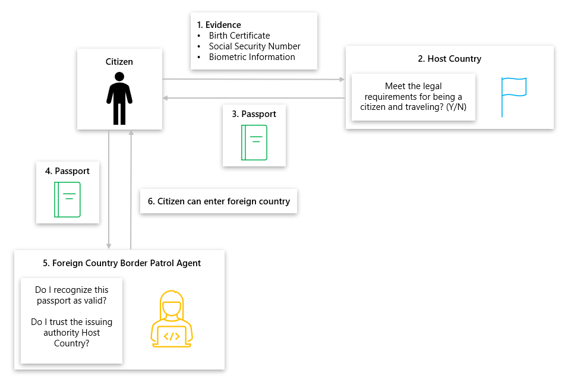
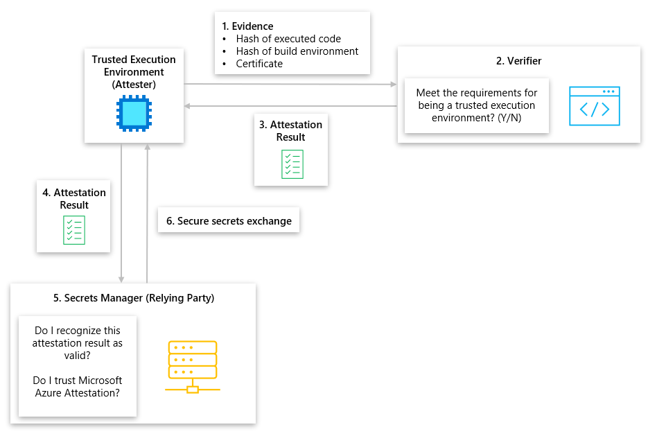
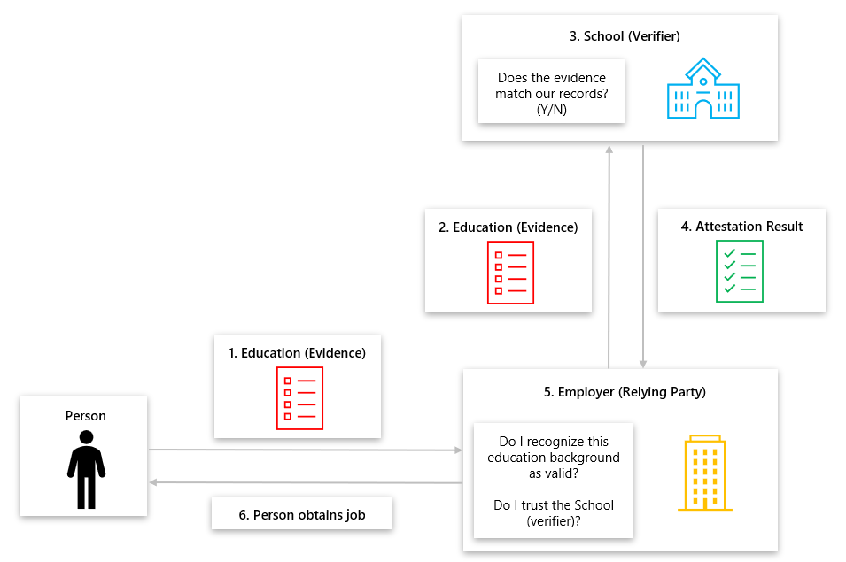
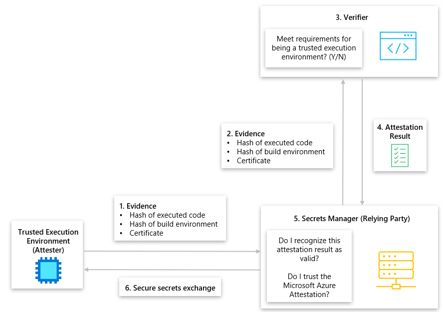

# Attestation
Computing is an essential part of our daily lives, powering everything from our smartphones to critical infrastructure. However, increasing regulatory environments, prevalence of cyberattacks, and growing sophistication of attackers have made it difficult to trust the authenticity and integrity of the computing technologies we depend on. Attestation, a technique to verify the software and hardware components of a system, is a critical process for establishing and ensuring that computing technologies we rely on are trustworthy.

In this document, we are looking at what attestation is, types of attestation Microsoft offers today, and how customers can utilize these types of attestation scenarios in Microsoft solutions. 

## What is Attestation?
In remote attestation, “one peer (the "Attester") produces believable information about itself ("Evidence") to enable a remote peer (the "Relying Party") to decide whether to consider that Attester a trustworthy peer. Remote attestation procedures are facilitated by an additional vital party (the "Verifier").” In simpler terms, attestation is a way of proving that a computer system is trustworthy. To make better sense of what attestation is and how it works in practice, we compare the process of attestation in computing to real-life examples with passports and background checks. The definition and models we use in this document are outlined in the Internet Engineering Task Force’s (IETF) Remote Attestation procedureS (RATs) Architecture document. To learn more, please see [Internet Engineering Task Force: Remote ATtestation procedureS (RATs) Architecture](https://www.ietf.org/rfc/rfc9334.html).

### Passport Model
#### Passport Model - Immigration Desk
1. A Citizen wants a passport to travel to a Foreign Country/Region. The Citizen submits evidence requirements to their Host Country/Region. 
2. Host country/region receives the evidence of policy compliance from the individual and verifies whether the supplied evidence proves that the individual complies with the policies for being issued a passport. 
	- Birth certificate is valid and hasn't been altered.
	- Issuer of the birth certificate is trusted
	- Individual isn't part of a restricted list
3. If the Host Country/Region decides the evidence meets their policies, the Host Country/Region will issue a passport for a Citizen.
4. The Citizen travels to a foreign nation, but first must present their passport to the Foreign Country/Region Border Patrol Agent for evaluation.
5. The Foreign Country/Region Border Patrol Agent checks a series of rules on the passport before trusting it  
	- Passport is authentic and hasn't been altered.
	- Passport was produced by a trusted country/region.
	- Passport isn't expired or revoked.
	- Passport conforms to policy of a Visa or age requirement.
6. The Foreign Country/Region Border Patrol Agent approves of the Passport and the Citizen can enter the Foreign Country/Region.

#### Passport Model - Computing
1. A Trusted Execution Environment (TEE), otherwise known as an Attester, wants to retrieve secrets from a Secrets Manager, also known as a Relying Party. To retrieve secrets from the Secrets Manager, the TEE must prove that it’s trustworthy and genuine to the Secrets Manager. The TEE submits its evidence to a Verifier to prove it’s trustworthy and genuine, that includes the hash of its executed code, hash of its build environment, and its certificate generated by its manufacturer. 
2. The Verifier, an attestation service, evaluates whether the evidence given by the TEE meets the following requirements for being trusted. 
	- Certificate is valid and has not been altered.
	- Issuer of the certificate is trusted
	- TEE evidence isn't part of a restricted list
3. If the Verifier decides the evidence meets the defined policies, the Verifier will create an Attestation Result and give it to the TEE.
4. The TEE wants to exchange secrets with the Secrets Manager, but first must present their Attestation Result to the Secrets Manager for evaluation.
5. The Secrets Manager checks a series of rules on the Attestation Result before trusting it  
	- Attestation Result is authentic and hasn't been altered.
	- Attestation Result was produced by a trusted authority.
	- Attestation Result isn't expired or revoked.
	- Attestation Result conforms to configured administrator policy.
6. The Secrets Manager approves of the Attestation Result and exchanges secrets with the TEE.

### Background Check Model
#### Background Check – School Verification
1. A Person is doing a background check with a potential Employer to obtain a job. The Person submits their education background of the School they attended to the potential Employer. 
2. The Employer retrieves the education background from the person and forwards this to the respective School to be verified.
3. The School evaluates whether the education background given by the Person meets the School records.
4. The School issues an Attestation Result that verifies the Person’s education background matches their records and sends it to the Employer 
5. The Employer, otherwise known as the Relying Party, may check a series of rules on the Attestation Result before trusting it.  
	- Attestation Result is authentic, hasn't been altered, and truly comes from the School.
	- Attestation Result was produced by a trusted School.
6. The Employer approves of the Attestation Result and hires the Person.

#### Background Check – Computing
1. A Trusted Execution Environment (TEE), otherwise known as an Attester, wants to retrieve secrets from a Secrets Manager, also known as a Relying Party. To retrieve secrets from the Secrets Manager, the TEE must prove that it’s trustworthy and genuine. The TEE sends its evidence to the Secrets Manager to prove it’s trustworthy and genuine, that includes the hash of its executed code, hash of its build environment, and its certificate generated by its manufacturer. 
2. The Secrets Manager retrieves the evidence from the TEE and forwards it to the Verifier to be verified.
3. The Verifier service evaluates whether the evidence given by the TEE meets defined policy requirements for being trusted. 
	- Certificate is valid and hasn't been altered.
	- Issuer of the certificate is trusted.
	- TEE evidence isn't part of a restricted list.
4. The Verifier creates an Attestation Result for the TEE and sends it to the Secrets Manager.
5. The Secrets Manager checks a series of rules on the Attestation Result before trusting it.  
	- Attestation Result is authentic and hasn't been altered.
	- Attestation Result was produced by a trusted authority.
	- Attestation Result isn't expired or revoked.
	- Attestation Result conforms to configured administrator policy.
6. The Secrets Manager approves of the Attestation Result and exchanges secrets with the TEE.

## Types of Attestation
Attestation services can be utilized in two distinct ways that each provide its own benefits. 

### Cloud Provider 
At Microsoft, we provide [Microsoft Azure Attestation (MAA)](https://azure.microsoft.com/products/azure-attestation) as customer-facing service and a framework for attesting Trusted Execution Environments (TEEs) like Intel Software Guard Extensions (SGX) enclaves, virtualization-based security (VBS) enclaves, Trusted Platform Modules (TPMs), Trusted Launch and Confidential Virtual Machines. Benefits from using a cloud provider’s attestation service such as Azure Attestation includes,
- Freely available 
- Source code is available for government customers via the Microsoft Code Center Premium Tool 
- Protects data while in use by operating within an Intel SGX enclave.
- Attests multiple TEEs in one single solution.
- Offers a strong Service Level Agreement (SLA)

### Build Your Own
Customers can create their own attestation mechanisms to trust their computing infrastructure from tools provided by cloud and hardware providers. Building your own attestation processes for Microsoft solutions may require the use of [Trusted Hardware Identity Management (THIM)](../security/fundamentals/trusted-hardware-identity-management.md), a solution that handles cache management of certificates for all trusted execution environments (TEE) residing in Azure and provides trusted computing base (TCB) information to enforce a minimum baseline for attestation solutions. Benefits from building and using your own attestation service includes,
- 100% control over the attestation processes to meet regulatory and compliance requirements
- Customization of integrations with other computing technologies 

## Attestation Scenarios at Microsoft
There are many attestation scenarios at Microsoft that enable customers to choose between the Cloud Provider and Build Your own attestation service scenarios. For each section, we look at Azure offerings and the attestation scenarios available. 

### VMs with Application Enclaves
[VMs with Application Enclaves](confidential-computing-enclaves.md) are enabled by Intel SGX, which allows organizations to create enclaves that protect data, and keep data encrypted while the CPU processes the data. Customers can attest Intel SGX enclaves in Azure with MAA and on their own. 
- [Intel SGX Attestation Home Page](attestation.md)
- [Cloud Provider: Intel SGX Sample Code Attestation with MAA](/samples/azure-samples/microsoft-azure-attestation/sample-code-for-intel-sgx-attestation-using-microsoft-azure-attestation/)
- [Build Your Own: Open Enclave Attestation](https://github.com/openenclave/openenclave/blob/master/samples/attestation/README.md) 
	
### Confidential Virtual Machines
[Confidential Virtual Machines](confidential-vm-overview.md) are enabled by AMD SEV-SNP, which allows organizations to have hardware-based isolation between virtual machines, and underlying host management code (including hypervisor). Customers can attest their managed confidential virtual machines in Azure with MAA and on their own. 
- [Confidential VMs Attestation Home Page](https://github.com/Azure/confidential-computing-cvm-guest-attestation/blob/main/cvm-guest-attestation.md#azure-confidential-vms-attestation-guidance--faq) 
- [Cloud Provider: What is guest attestation for confidential VMs?](guest-attestation-confidential-vms.md)
- [Build Your Own: Fetch and verify raw AMD SEV-SNP report on your own](https://github.com/Azure/confidential-computing-cvm-guest-attestation/blob/main/cvm-guest-attestation.md#i-dont-trust-maa-or-the-library-you-are-asking-me-to-install-in-my-vm-but-i-do-trust-the-underlying-hcl-firmware-how-can-i-fetch-and-verify-raw-amd-sev-snp-report-on-my-own)

### Confidential Containers on Azure Container Instances
[Confidential Containers on Azure Container Instances](confidential-containers.md) provide a set of features and capabilities to further secure your standard container workloads to achieve higher data security, data privacy and runtime code integrity goals. Confidential containers run in a hardware backed Trusted Execution Environment (TEE) that provides intrinsic capabilities like data integrity, data confidentiality and code integrity.
- [Cloud Provider: Attestation in Confidential containers on Azure Container Instances](https://aka.ms/caciattestation) 
