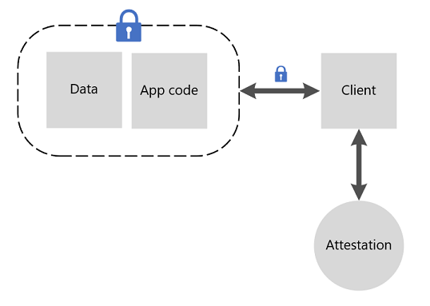

# Attesting SGX Enclaves

Confidential computing on Azure offers Intel SGX-based virtual machines that can isolate a portion of you code or data. When working with these [enclaves](confidential-computing-enclaves.md), you'll want to get verification and validation that your trusted environment is secure. This verification is the process of attestation. 

## Overview 

Attestation allows a relying party to have increased confidence that their software is (1) running in an enclave and (2) that the enclave is up to date and secure. For example, an enclave asks the underlying hardware to generate a credential that includes proof that the enclave exists on the platform. The report can then be given to a second enclave that verifies the report was generated on the same platform.

Attestation must be implemented using a secure attestation service that is compatible with the system software and silicon. Some examples of services you can use are

- [Microsoft Azure Attestation (preview)](https://docs.microsoft.com/azure/attestation/overview) 
or
- [Intel's attestation and provisioning services](https://software.intel.com/sgx/attestation-services)

which are both compatible with Azure confidential computing Intel SGX infrastructure. 

## Next steps
Try the [Microsoft Azure Attestation samples for enclave aware apps](https://docs.microsoft.com/samples/azure-samples/microsoft-azure-attestation/sample-code-for-intel-sgx-attestation-using-microsoft-azure-attestation/).