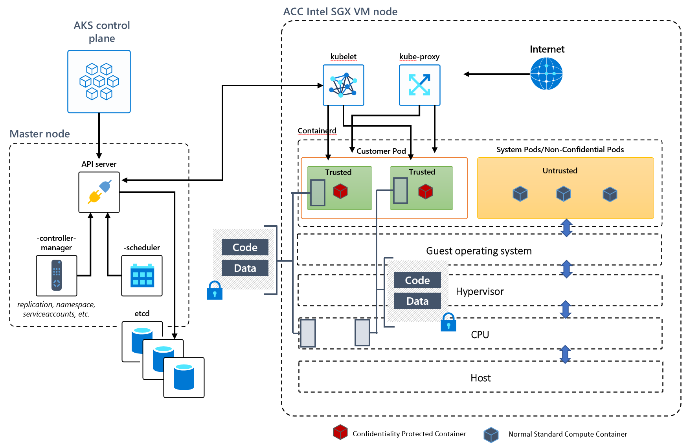

# Choosing container compute offerings for confidential computing

Azure confidential computing offers multiple types of containers with varying tiers of confidentiality. You can use these containers to support data integrity and confidentiality, and code integrity.

Confidential containers also help with code protection through encryption. You can create hardware-based assurances and hardware root of trust. You can also lower your attack surface area with confidential containers.

## Links to container compute offerings

**Confidential VM worker nodes on AKS** supporting full AKS features with node level VM based Trusted Execution Environment (TEE). Also support remote guest attestation. [Get started with CVM worker nodes with a lift and shift workload to CVM node pool.](../aks/use-cvm.md)

**Unmodified containers with serverless offering** [confidential containers on Azure Container Instance (ACI)](./confidential-containers.md#vm-isolated-confidential-containers-on-azure-container-instances-aci) supporting existing Linux containers with remote guest attestation flow.

**Unmodified containers with Intel SGX** support higher programming languages on Intel SGX through the Azure Partner ecosystem of OSS projects. For more information, see the [unmodified containers deployment flow and samples](./confidential-containers.md).

**Enclave-aware containers** use a custom Intel SGX programming model. For more information, see the [the enclave-aware containers deployment flow and samples](./enclave-aware-containers.md). 

<!--  -->

## Learn more

- [Intel SGX Confidential Virtual Machines on Azure](./virtual-machine-solutions-sgx.md)
- [Confidential Containers on Azure](./confidential-containers.md)
